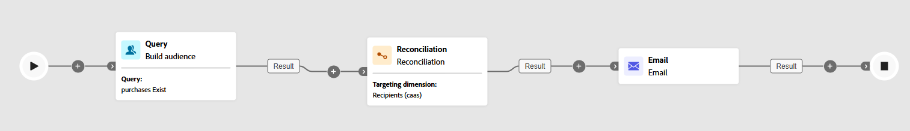

# Avstämning {#reconciliation}

>[!CONTEXTUALHELP]
>id="ajo_orchestration_reconciliation"
>title="Avstämningsaktivitet"
>abstract="Aktiviteten **Avstämning** är en **målaktivitet** som gör att du kan definiera länken mellan Adobe Journey Optimizer och data i en arbetstabell."

>[!CONTEXTUALHELP]
>id="ajo_orchestration_reconciliation_field"
>title="Avstämningsmarkeringsfält"
>abstract="Avstämningsmarkeringsfält"

>[!CONTEXTUALHELP]
>id="ajo_orchestration_reconciliation_condition"
>title="Avstämning skapa villkor"
>abstract="Avstämning skapa villkor"

>[!CONTEXTUALHELP]
>id="ajo_orchestration_reconciliation_complement"
>title="Avstämning genererar komplementtal"
>abstract="Avstämning genererar komplementtal"

Aktiviteten **[!UICONTROL Reconciliation]** är en **[!UICONTROL Targeting]**-aktivitet som gör att du kan definiera länken mellan data i Adobe Journey Optimizer och data i en arbetstabell, till exempel data som lästs in från en extern fil.

Med aktiviteten **[!UICONTROL Enrichment]** kan du lägga till ytterligare data till din Orchestrated-kampanj, till exempel genom att kombinera data från flera källor eller länka till en tillfällig resurs. **[!UICONTROL Reconciliation]**-aktiviteten används däremot för att matcha oidentifierade eller externa data med befintliga resurser i databasen.

**[!UICONTROL Reconciliation]** kräver att de relaterade posterna redan finns i systemet. Om du till exempel importerar en inköpsfillista med produkter, tidsstämplar och kundinformation måste både produkterna och kunderna finnas i databasen för att länken ska kunna skapas.

## Konfigurera avstämningsaktiviteten {#reconciliation-configuration}

>[!CONTEXTUALHELP]
>id="ajo_orchestration_reconciliation_targeting"
>title="Måldimension"
>abstract="Välj den nya måldimensionen. Med en dimension kan du definiera målpopulationen: mottagare, appprenumeranter, operatorer, prenumeranter osv. Som standard är den aktuella måldimensionen markerad."

>[!CONTEXTUALHELP]
>id="ajo_orchestration_reconciliation_rules"
>title="Avstämningsregler"
>abstract="Välj avstämningsregler som ska användas för dedupliceringen. Om du vill använda attribut markerar du alternativet **Enkla attribut** och väljer käll- och målfälten. Om du vill skapa ett eget avstämningsvillkor med hjälp av regelbyggaren väljer du alternativet **Avancerade avstämningsvillkor** ."

>[!CONTEXTUALHELP]
>id="ajo_orchestration_reconciliation_targeting_selection"
>title="Välj måldimension"
>abstract="Välj måldimension för inkommande data som ska förenas med."
>additional-url="https://experienceleague.adobe.com/docs/campaign-web/v8/audiences/gs-audiences-recipients.html#targeting-dimensions" text="Måldimensioner"

>[!CONTEXTUALHELP]
>id="ajo_orchestration_keep_unreconciled_data"
>title="Behåll ej avstämda data"
>abstract="Som standard behålls ej avstämda data i den utgående övergången och är tillgängliga i arbetstabellen för framtida bruk. Om du vill ta bort ej avstämda data inaktiverar du alternativet **Behåll ej avstämda data**."

>[!CONTEXTUALHELP]
>id="ajo_orchestration_reconciliation_attribute"
>title="Avstämningsattribut"
>abstract="Markera attributet som ska användas för att avstämma data och klicka på Bekräfta."

Så här konfigurerar du aktiviteten **[!UICONTROL Reconciliation]**:

1. Lägg till en **[!UICONTROL Reconciliation]**-aktivitet på arbetsytan.

1. Välj en ny målinriktningsdimension för att definiera vilka ni riktar er mot, till exempel mottagare eller prenumeranter.

1. Ange de fält som ska användas för att matcha inkommande data med befintliga profiler.

1. Välj **[!UICONTROL Simple attributes]** om du vill matcha data med grundläggande fält.

1. Ange matchande fält:

   * **[!UICONTROL Source]**: visar inkommande datafält.

   * **[!UICONTROL Destination]**: refererar till fält i den valda måldimensionen.

   En matchning inträffar när båda värdena är lika, till exempel matchning av **[!UICONTROL Email]** för att identifiera profiler.

   

1. Om du vill lägga till fler matchande regler klickar du på **[!UICONTROL Add rule]**. Alla villkor måste vara uppfyllda för att en matchning ska ske.

1. Välj **[!UICONTROL Advanced reconciliation conditions]** om du vill ha mer komplexa villkor. Använd [regelbyggaren](../orchestrated-rule-builder.md) för att definiera anpassad logik.

1. Om du vill filtrera vilka data som ska förenas klickar du på **[!UICONTROL Create filter]** och definierar villkoret i regelbyggaren.

1. Som standard lagras omatchade poster i den utgående övergången och lagras i arbetstabellen. Aktivera alternativet **[!UICONTROL Keep unreconciled data]** om du vill ta bort dessa.

## Exempel {#example-reconciliation}

I det här exemplet används aktiviteten **[!UICONTROL Reconciliation]** i Adobe Journey Optimizer för att säkerställa att e-postmeddelanden endast skickas till kända kunder. Data flödar in via en **[!UICONTROL Read Audience]**-aktivitet som riktar sig till användare med tidigare order. Aktiviteten **[!UICONTROL Reconciliation]** matchar sedan dessa inkommande data med befintliga profiler i databasen som använder e-postfältet.

