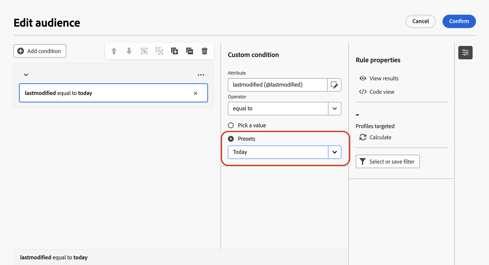
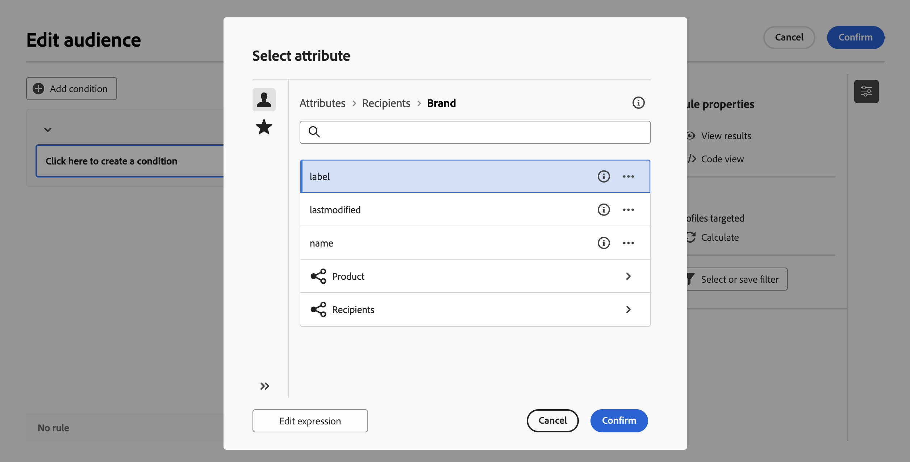
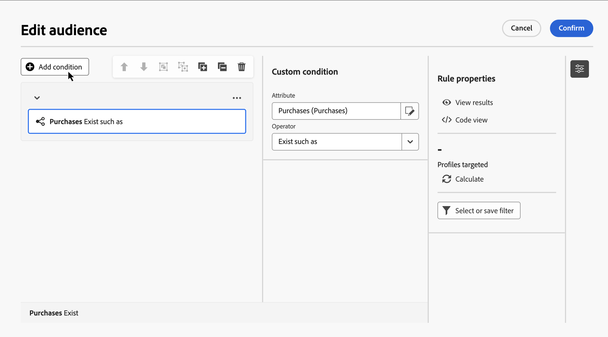
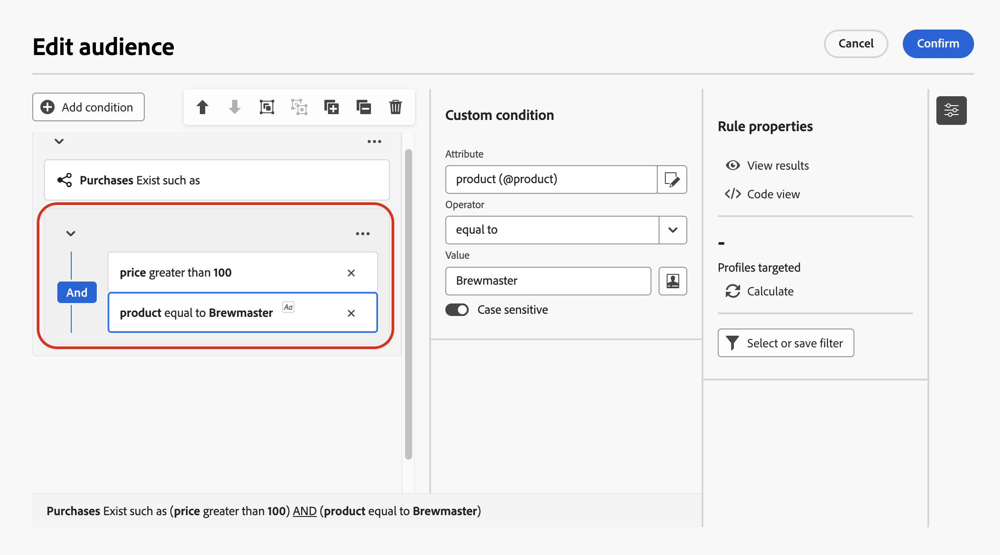
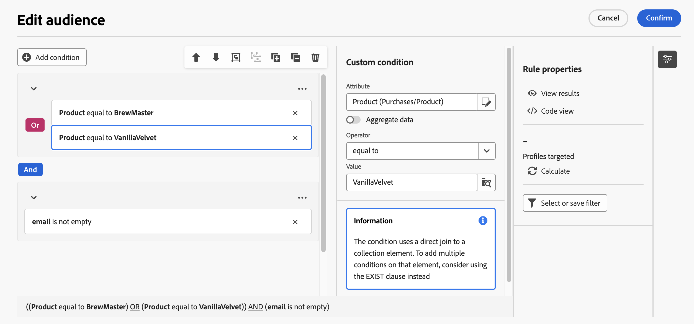

# Bygg din första regel {#build-query}

De viktigaste stegen för att skapa regler för era samordnade kampanjer är följande:

1. **Lägg till villkor** - Skapa anpassade villkor för att filtrera frågan genom att skapa ett eget villkor med attribut från databasen och avancerade uttryck.
1. **Kombinera villkor** - Ordna villkoren på arbetsytan med grupper och logiska operatorer.
1. **Kontrollera och validera regeln** - Kontrollera regelns resultatdata innan du sparar den.

## Lägg till ett villkor {#conditions}

>[!CONTEXTUALHELP]
>id="ajo_orchestration_querymodeler_customcondition"
>title="Anpassat villkor"
>abstract="Anpassade villkor är att filtrera komponenter som gör att du kan filtrera frågan genom att skapa ett eget villkor med attribut från databasen och avancerade uttryck."

Så här lägger du till villkor i frågan:

1. Få åtkomst till regelbyggaren från en **[!UICONTROL Build audience]**-aktivitet.

1. Klicka på knappen **Lägg till villkor** för att skapa ett första villkor för frågan.

   Du kan också starta frågan med ett fördefinierat filter. Om du vill göra det klickar du på knappen **[!UICONTROL Select or save filter]** och väljer **[!UICONTROL Select predefined filter]**. Mer information finns i [Arbeta med fördefinierade filter](predefined-filters.md).

   

1. Identifiera attributet från databasen som ska användas som villkor för ditt villkor. Ikonen &quot;i&quot; bredvid ett attribut innehåller information om var tabellen finns och dess datatyp.

   

   >[!NOTE]
   >
   >Med knappen **Redigera uttryck** kan du använda uttrycksredigeraren för att manuellt definiera ett uttryck med hjälp av fält från databasen och hjälpfunktionerna. [Lär dig hur du redigerar uttryck](../orchestrated/edit-expressions.md)

1. Klicka på  bredvid ett attribut för att komma åt dessa ytterligare alternativ:

   +++ Fördelning av värden

   Genom att distribuera värden kan du identifiera hur värden används i databasen. Det är praktiskt om du vill förstå de tillgängliga värdena, deras antal och procentandelar. Det kan också hjälpa dig att undvika problem som inkonsekvent skiftläge eller stavning när du skapar frågor eller skapar uttryck.

   För attribut med ett stort antal värden visas endast de första tjugo. I sådana fall visas ett **[!UICONTROL Partial load]**-meddelande som indikerar den här begränsningen. Du kan använda avancerade filter för att förfina de visade resultaten och fokusera på specifika värden eller delmängder av data.

   Om du vill skapa ditt villkor snabbare väljer du ett värde och klickar på **[!UICONTROL Select attribute and value]** för att fylla i attributet och värdet i det aktuella villkoret.

   Du kan också kopiera ett värde i Urklipp med bilden  , till exempel för att klistra in den i uttrycksredigeraren.

   

   +++

   +++ Lägg till i Favoriter

   Om du lägger till attribut på Favoriter-menyn får du snabb åtkomst till de attribut du använder mest. Du kan lägga till upp till 20 attribut till favoriter. Favoriter och nyligen använda attribut kopplas till varje användare i en organisation, vilket ger en smidig upplevelse på olika datorer och enheter.

   Använd menyn **[!UICONTROL Favorites and recents]** om du vill få åtkomst till de attribut du har gett rätt. Favoritattribut visas först, följt av nyligen använda attribut, vilket gör det enkelt att hitta de attribut som krävs. Om du vill ta bort ett attribut från favoriter väljer du stjärnikonen igen.

   

   +++

1. Klicka på **[!UICONTROL Confirm]** om du vill lägga till det markerade attributet i villkoret.

1. En egenskapsruta visas där du kan konfigurera det önskade värdet för attributet.

   

1. Välj **[!UICONTROL Operator]** som ska användas i listrutan. Olika operatorer är tillgängliga för användning. Vilka operatorer som är tillgängliga i listrutan beror på attributets datatyp.

   +++Lista över tillgängliga operatorer

   | Operatör | Syfte | Exempel |
   |---|---|---|
   | Lika med | Returnerar ett resultat som är identiskt med de data som anges i den andra värdekolumnen. | Efternamnet (@lastName) som är lika med &#39;Jones&#39; returnerar bara mottagare vars efternamn är Jones. |
   | Inte lika med | Returnerar alla värden som inte är identiska med det angivna värdet. | Språket (@language) är inte lika med &quot;English&quot;. |
   | Större än | Returnerar ett värde som är större än det angivna värdet. | Ålder (@age) större än 50 returnerar alla värden större än 50, till exempel 51, 52. |
   | Mindre än | Returnerar ett värde som är mindre än det angivna värdet. | Skapad (@created) före &quot;DaysAgo(100)&quot; returnerar alla mottagare som skapats för mindre än 100 dagar sedan. |
   | Större än eller lika med | Returnerar alla värden som är lika med eller större än det angivna värdet. | Ålder (@age) större än eller lika med 30 returnerar alla mottagare som är 30 år eller äldre. |
   | Mindre än eller lika med | Returnerar alla värden som är lika med eller lägre än det angivna värdet. | Ålder (@age) mindre än eller lika med 60 returnerar alla mottagare som är 60 år eller yngre. |
   | Ingår i | Returnerar resultat som ingår i de angivna värdena. Dessa värden måste avgränsas med kommatecken. | Födelsedatum (@bornDate) ingår i &#39;12/10/1979,12/10/1984&#39; returnerar de mottagare som är födda mellan dessa datum. |
   | Inte i | Fungerar som operatorn Inkluderad i. Här exkluderas mottagare baserat på de angivna värdena. | Födelsedatum (@BirthDate) ingår inte i &#39;12/10/1979,12/10/1984&#39;. Mottagare födda inom dessa datum returneras inte. |
   | Är tom | Returnerar resultat som matchar ett tomt värde i den andra värdekolumnen. | Mobilen (@mobilePhone) är tom returnerar alla mottagare som inte har något mobilnummer. |
   | Är inte tom | Fungerar i motsatt riktning till operatorn Är tom. Du behöver inte ange data i den andra värdekolumnen. | E-postadressen (@email) är inte tom. |
   | Börjar med | Returnerar resultat som börjar med det angivna värdet. | Kontonr (@account) börjar med 32010. |
   | Börjar inte med | Returnerar resultat som inte börjar med det angivna värdet. | Kontonumret (@account) börjar inte med 20. |
   | Innehåller | Returnerar resultat som innehåller minst det angivna värdet. | E-postdomänen (@domain) innehåller mail och returnerar alla domännamn som innehåller mail, till exempel gmail.com. |
   | Innehåller inte | Returnerar resultat som inte innehåller det angivna värdet. | E-postdomänen (@domain) innehåller inte &#39;vo&#39;. Domännamn som innehåller &quot;vo&quot;, t.ex. &quot;voila.fr&quot;, visas inte i resultatet. |
   | Gilla | På samma sätt som operatorn Innehåller kan du infoga ett %-jokertecken i värdet. | Efternamn (@lastName) som &#39;Jon%s&#39;. Jokertecknet fungerar som&quot;joker&quot; och söker efter namn som&quot;Jones&quot;. |
   | Inte som | På samma sätt som operatorn Innehåller kan du infoga ett %-jokertecken i värdet. | Efternamnet (@lastName) är inte som Smi%h. Mottagare vars efternamn är &quot;Smith&quot; returneras inte. |

   +++

1. Definiera det förväntade värdet i fältet **Värde**. Du kan också använda uttrycksredigeraren för att manuellt definiera ett uttryck med hjälp av fält från databasen och hjälpfunktionerna. Det gör du genom att klicka på  . [Lär dig hur du redigerar uttryck](../orchestrated/edit-expressions.md)

   För datumtypsattribut är fördefinierade värden tillgängliga med alternativet **[!UICONTROL Presets]**.

   +++Se exempel

   

   +++

### Anpassade villkor i länkade tabeller (1-1- och 1-N-länkar){#links}

Med anpassade villkor kan du fråga tabeller som är länkade till den tabell som för närvarande används av din regel. Detta inkluderar tabeller med en 1-1 kardinalitetslänk eller samlingstabeller (1-N länk).

Navigera till den länkade tabellen för en **1-1-länk**, markera önskat attribut och definiera det förväntade värdet.

Du kan också markera en tabelllänk direkt i väljaren **Värde** och bekräfta. I så fall måste värden som är tillgängliga för den valda tabellen markeras med en dedikerad väljare, vilket visas i exemplet nedan.

+++Frågeexempel

Här riktar frågan sig till varumärken vars etikett är&quot;kör&quot;.

1. Navigera inuti tabellen **Varumärke** och markera attributet **Etikett**.

   

1. Definiera det förväntade värdet för attributet.

   

Här följer ett frågeexempel där en tabelllänk har markerats direkt. Tillgängliga värden för den här tabellen måste väljas från en dedikerad väljare.

+++ 

För en **1-N-länk** kan du definiera undervillkor för att förfina din fråga, vilket visas i exemplet nedan.

+++Frågeexempel

Här är frågan riktad till mottagare som har gjort inköp relaterade till Brewmsaster-produkten, för mer än 100$.

1. Markera tabellen **Inköp** och bekräfta.

1. Klicka på **[!UICONTROL Add condition]** för att definiera de delvillkor som ska tillämpas på den markerade tabellen.

   

1. Lägg till undervillkor som passar dina behov.

   

+++ 

### Anpassade villkor med samlade data {#aggregate}

Med anpassade villkor kan du utföra sammanställningsåtgärder. För att göra detta måste du välja ett attribut direkt från en samlingstabell:

1. Navigera i den önskade samlingstabellen och markera attributet som du vill utföra en sammanställningsåtgärd på.

1. I egenskapsrutan växlar du på alternativet **Sammanställd data** och väljer önskad sammanställningsfunktion.

   

## Kombinera villkor med operatorer {#operators}

Varje gång du lägger till ett nytt villkor i regeln länkas det automatiskt till det befintliga villkoret av en **AND** -operator. Detta innebär att resultaten från de två villkoren kombineras.

Om du vill ändra operatorn mellan villkor klickar du på den och väljer önskad operator.

Tillgängliga operatorer:

* **AND (skärning)**: Kombinerar resultat som matchar alla filtreringskomponenter i utgående övergångar.
* **OR (Union)**: Innehåller resultat som matchar minst en av filterkomponenterna i utgående övergångar.
* **EXCEPT (Uteslutning)**: Utesluter resultat som matchar alla filterkomponenter i den utgående övergången.

## Ändra villkor {#manipulate}

Verktygsfältet för regelhanterarens arbetsyta innehåller alternativ för att enkelt ändra villkoren i regeln:

| Ikon för verktygsfält | Beskrivning |
|--- |--- |
|  | Flytta komponenten uppåt en rad. |
|  | Flytta komponenten nedåt en rad. |
|  | Placera två komponenter i en grupp. |
|  | Separera komponenterna i en enskild grupp. |
|  | Expandera alla grupper. |
|  | Komprimera alla grupper. |
|  | Ta bort alla grupper och komponenter. |

Beroende på dina behov kan du behöva skapa mellanliggande grupper av komponenter genom att gruppera komponenterna i en och samma grupp och länka dem tillsammans.

* Om du vill gruppera två befintliga villkor markerar du ett av de två villkoren och klickar på ikonen  eller  för att gruppera det med villkoret ovanför eller nedanför.

* Om du vill gruppera ett befintligt villkor med ett nytt, markerar du villkoret, klickar på  och väljer **[!UICONTROL Add group]**. Markera det nya attributet som ska läggas till i gruppen och bekräfta sedan.

  

I exemplet nedan har vi skapat en mellanliggande grupp för kunder som köpt antingen BrewMaster eller VanillaVelvet.

## Kontrollera och validera frågan

>[!CONTEXTUALHELP]
>id="ajo_orchestration_querymodeler_ruleproperties"
>title="Regelegenskaper"
>abstract="När du har skapat frågan på arbetsytan kan du kontrollera den med rutan **Regelegenskaper** som finns till höger. I den här rutan kan du visa resulterande data, hämta en SQL-kodversion av frågan och kontrollera antalet målposter. Använd knappen **Markera eller spara filter** om du vill spara frågan som ett fördefinierat filter eller ersätta arbetsytans innehåll med ett befintligt filter."

När du har skapat frågan på arbetsytan kan du kontrollera den med rutan **Regelegenskaper** . Tillgängliga åtgärder är:

* **Visa resultat:** Visar data från din fråga.
* **Kodvyn**: Visar en kodbaserad version av frågan i SQL.
* **Beräkna**: Uppdaterar och visar antalet poster som omfattas av din regel.
* **Välj eller spara filter**: Välj ett befintligt fördefinierat filter som ska användas på arbetsytan eller spara frågan som ett fördefinierat filter för framtida återanvändning. Om filtret innehåller parametrar anger du värden innan du använder det. Mer information finns i [Arbeta med fördefinierade filter](predefined-filters.md).

 

När regeln är klar klickar du på knappen **[!UICONTROL Confirm]** i för att spara den.

>[!IMPORTANT]
>
>Om du väljer ett fördefinierat filter i rutan Regelegenskaper ersätts den regel som har byggts in på arbetsytan med det valda filtret.
