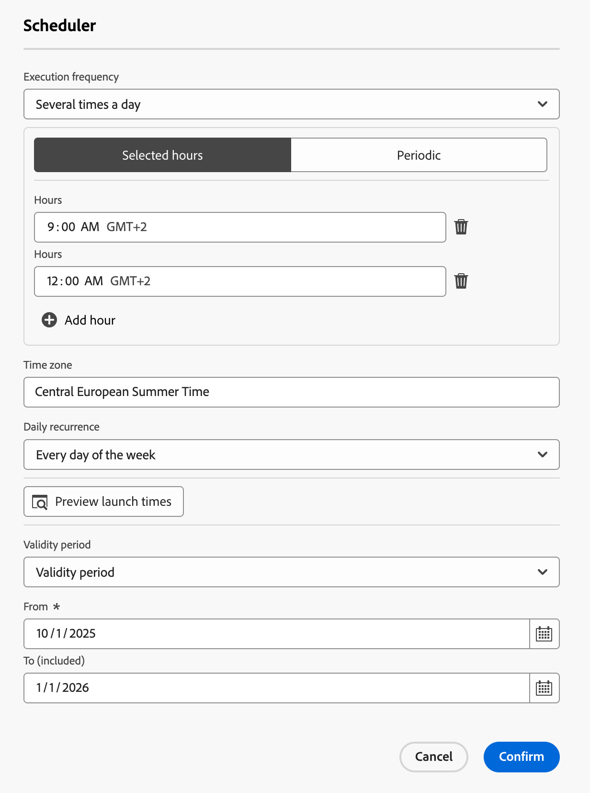

# Skapa och schemalägg en orkestrerad kampanj {#create-first-campaign}

Skapa en orkestrerad kampanj i [!DNL Adobe Journey Optimizer] och konfigurera dess körningsschema för att styra när den startar och hur ofta den körs. Välj om du vill starta kampanjen direkt, vid ett specifikt datum och vid en viss tidpunkt eller om det ska ske regelbundet med flexibla schemaläggningsalternativ som dagliga, veckovisa eller månadsvisa frekvenser.

## Skapa kampanjen {#create}

>[!CONTEXTUALHELP]
>id="ajo_campaign_creation_workflow"
>title="Lista över samordnade kampanjer"
>abstract="Fliken **Orchestration** visar alla orchestrated-kampanjer. Klicka på namnet på en Orchestrated-kampanj för att redigera den. Använd knappen **Skapa orkestrerad kampanj** för att lägga till en ny orkestrerad kampanj."

Så här skapar du en orkestrerad kampanj:

1. Bläddra till menyn **[!UICONTROL Campaigns]** och välj fliken **[!UICONTROL Orchestration]**.

1. Klicka på knappen **[!UICONTROL Create campaign]** och välj kampanjtypen **[!UICONTROL Orchestration - Marketing]**.

   

1. Definiera kampanjegenskaperna.

   1. Ange **[!UICONTROL Name]** och **[!UICONTROL Description]** för kampanjen.

   1. Välj en **[!UICONTROL Merge policy]** för din kampanj.

      I [!DNL Adobe Experience Platform] är varje målgrupp kopplad till en specifik sammanfogningsprincip, som definierar hur profilinformation kombineras för att bilda en sammanfogad profil. När du väljer en sammanfogningsprincip i aktiviteten Läs målgrupp är bara målgrupper som baseras på samma sammanfogningsprincip tillgängliga. Som standard används standardprincipen för sammanfogning, men du kan ändra den om det behövs. Mer information om kopplingsprofiler finns i [Adobe Experience Platform-dokumentationen](https://experienceleague.adobe.com/en/docs/experience-platform/profile/merge-policies/overview){target="_blank"}.

   1. Använd fältet **[!UICONTROL Tags]** för att tilldela enhetliga Adobe Experience Platform-taggar till kampanjen. På så sätt kan ni enkelt klassificera dem och förbättra sökningen från listan Orchestrated-kampanjer. [Lär dig arbeta med taggar](../start/search-filter-categorize.md#tags).

   1. Klicka på **[!UICONTROL Save]**.

   Du kan när som helst komma åt kampanjegenskaperna med hjälp av ikonen  bredvid kampanjens namn.

   

## Schemalägg kampanjen {#schedule}

>[!CONTEXTUALHELP]
>id="ajo_orchestration_scheduler"
>title="Schemaläggare"
>abstract="Som kampanjansvarig kan ni schemalägga kampanjer att startas automatiskt vid specifika tidpunkter, vilket ger exakt timing och korrekta målgruppsdata för marknadsföringskommunikation."

>[!CONTEXTUALHELP]
>id="ajo_orchestration_schedule_validity"
>title="Schemaläggarens giltighet"
>abstract="Du kan definiera en giltighetsperiod för schemaläggaren. Den kan vara permanent (standard) eller giltig till ett visst datum."

>[!CONTEXTUALHELP]
>id="ajo_orchestration_schedule_options"
>title="Alternativ för schemaläggare"
>abstract="Definiera frekvensen för schemaläggaren. Den kan köras vid ett specifikt tillfälle, en eller flera gånger per dag, vecka eller månad."

Som standard startar orkestrerade kampanjer när de aktiveras manuellt och avslutas när deras associerade aktiviteter har körts. Om du föredrar att fördröja genomförandet eller köra kampanjen regelbundet kan du definiera ett schema för kampanjen.

Tänk på följande metodtips när du schemalägger samordnade kampanjer för att säkerställa optimala prestanda och förväntat beteende:

* Schemalägg inte en orkestrerad kampanj som körs mer än var femtonde minut eftersom den kan hämma systemets totala prestanda och skapa block i databasen.
* Om du vill skicka ett enbildsmeddelande i din orchestrated-kampanj kan du ställa in det på att köra **Once**.
* Om du vill skicka ett återkommande meddelande i din Orchestrated-kampanj måste du använda alternativen **Schemaläggning** och ange körningsfrekvens. Den återkommande leveransaktiviteten tillåter inte att du definierar ett schema.

Så här konfigurerar du kampanjschemat:

1. Öppna kampanjen och klicka på knappen **[!UICONTROL As soon as possible]**.

   

1. Välj en körningsfrekvens för kampanjen och konfigurera sedan de tillgängliga alternativen. Inställningarna varierar beroende på vald frekvens:

   +++En gång

   Kör kampanjen en gång vid ett angivet datum och en viss tidpunkt.

   * **[!UICONTROL Date]**: Välj det datum då kampanjen ska köras.
   * **[!UICONTROL Time]**: Välj den tidpunkt då kampanjen ska köras.

   +++

   +++Dagligen

   Kör kampanjen varje dag eller på valda dagar.

   * **[!UICONTROL Daily recurrence]**: Välj hur ofta kampanjen ska köras:
      * **[!UICONTROL Every day]**: Kör kampanjen varje veckodag, inklusive helger.
      * **[!UICONTROL On weekdays]**: Kör kampanjen endast från måndag till fredag.
      * **[!UICONTROL Through a specific period]**: Kör kampanjen dagligen inom ett definierat datumintervall (t.ex. från 1 juli till 15 juli). Kampanjen kommer inte att köras utanför det här intervallet.
      * **[!UICONTROL On selected days of the week]**: Kör kampanjen endast de angivna veckodagarna (t.ex. måndag, onsdag, fredag).

   * **[!UICONTROL Start time]**: Definiera den tid som kampanjen ska köras varje dag.

   +++

   +++Flera gånger om dagen

   Kör kampanjen flera gånger inom samma dag. Du kan välja specifika tider eller ange en periodisk frekvens.

   * **[!UICONTROL Selected hours]**: Välj de tider som kampanjen ska köras och konfigurera den dagliga upprepningen (verkställs varje veckodag eller på vissa dagar).
   * **[!UICONTROL Periodic]**: Välj att köra kampanjen var n minut eller timme. Du kan också definiera tidsintervallet inom dagen när körningar tillåts.

   +++

   +++Vecka

   Kör kampanjen varje vecka, med alternativ för specifika dagar.

   * **[!UICONTROL Frequency]**: Välj hur ofta kampanjen ska köras (t.ex. varje vecka, varannan vecka).
   * **[!UICONTROL Starting from date]**: Välj det datum då upprepningen ska börja.
   * **[!UICONTROL Daily recurrence]**: Välj specifika veckodagar för körning (t.ex. varje måndag och torsdag).
   * **[!UICONTROL Start time]**: Ange den tid som kampanjen ska köras på valda dagar.

   +++

   +++Månatligen

   Kör kampanjen månadsvis, med alternativ för specifika dagar.

   * **[!UICONTROL Monthly recurrence]**: Välj om kampanjen ska köras varje månad eller endast under specifika månader.
   * **[!UICONTROL Daily recurrence]**:
      * **[!UICONTROL Every day]**: Kör kampanjen varje kalenderdag i månaden, inklusive helger.
      * **[!UICONTROL Last day of the month]**: Kör kampanjen endast den sista kalenderdagen i varje månad (t.ex. 31 januari 2018/29).
      * **[!UICONTROL Specific day of the month (e.g., 15th)]**: Kör kampanjen en angiven dag (t.ex. den 15:e varje månad).
      * **[!UICONTROL First/last, or nth day of the week]** (t.ex. första måndagen):      Kör kampanjen en angiven veckodag (t.ex. den 15 i varje vecka).
      * **[!UICONTROL Selected days of the week]**: Kör kampanjen på en angiven dag.

   * **[!UICONTROL Start time]**: Ange den tid som kampanjen ska köras.

   +++

1. Använd inställningen **[!UICONTROL Validity period]** för att definiera ett specifikt start- och slutdatum, vilket begränsar kampanjens körning till ett tidsbegränsat fönster.

1. Klicka på knappen **[!UICONTROL Preview launch times]** om du vill förhandsgranska de exakta kommande körningsdatumen och körningstiderna baserat på den aktuella konfigurationen. Detta hjälper till att validera schemat före aktivering och säkerställer att kampanjen körs som förväntat.

>[!NOTE]
>
>När du schemalägger kampanjer i [!DNL Adobe Journey Optimizer] måste du se till att startdatumet/starttiden är i linje med den önskade första leveransen. Om den initiala schemalagda tiden redan har passerat för återkommande kampanjer kommer kampanjerna att föras över till nästa tillgängliga tidsrymd enligt reglerna för återkommande kampanjer.

I följande exempel är aktiviteten konfigurerad så att den samordnade kampanjen körs två gånger per dag kl. 9 och 12 varje dag i veckan från 1 oktober 2025 till 1 januari 2026.

{width="50%" align="left"}

## Nästa steg {#next}

När kampanjinställningarna och kampanjschemat har konfigurerats är du redo att börja organisera de olika uppgifter som ska utföras. [Lär dig att samordna kampanjaktiviteter](../orchestrated/orchestrate-activities.md)
