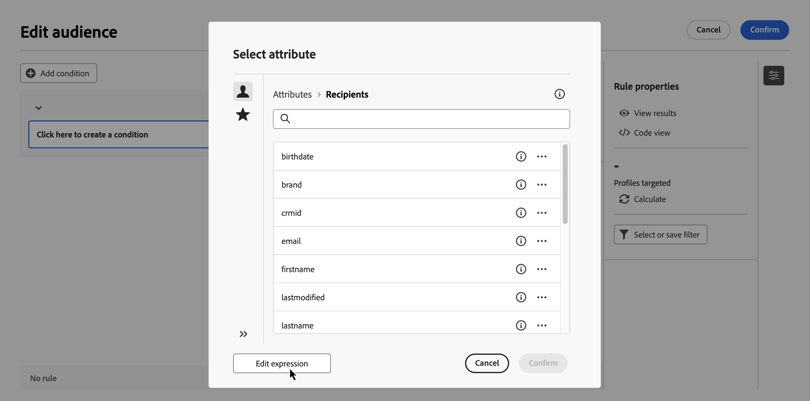

# Redigera uttryck {#edit-expressions}

+++ Innehållsförteckning

| Välkommen till samordnade kampanjer | Starta din första samordnade kampanj | Fråga databasen | Ochestrerade kampanjaktiviteter |
|---|---|---|---|
| [Kom igång med samordnade kampanjer](gs-orchestrated-campaigns.md)  [Konfigurationssteg](configuration-steps.md)  [Få åtkomst till och hantera samordnade kampanjer](access-manage-orchestrated-campaigns.md) | [Viktiga steg för att skapa samordnade kampanjer](gs-campaign-creation.md)  [Skapa och schemalägg kampanjen](create-orchestrated-campaign.md)  [Organisera aktiviteter](orchestrate-activities.md)  [Skicka meddelanden med samordnade kampanjer](send-messages.md)  [Starta och övervaka kampanjen](start-monitor-campaigns.md)  [Rapportera](reporting-campaigns.md) | [Arbeta med regelbyggaren](orchestrated-rule-builder.md)  [Skapa din första fråga](build-query.md)  <b>[Redigera uttryck](edit-expressions.md)</b> | [Kom igång med aktiviteter](activities/about-activities.md)  Aktiviteter: [Och-join](activities/and-join.md) - [Skapa målgrupp](activities/build-audience.md) - [Ändra dimension](activities/change-dimension.md) - [Kombinera](activities/combine.md) - [Ta bort dubbletter](activities/deduplication.md) - [Förbättra](activities/enrichment.md) - [Förena](activities/fork.md) - [Förena&lbrace;1 ](activities/reconciliation.md) - [Dela](activities/split.md) - [Vänta](activities/wait.md) |

{style="table-layout:fixed"}

+++

 

>[!NOTE]
>
>Avsnittet nedan innehåller information om hur du arbetar med uttrycksredigeraren för att skapa regler. Tänk på att den syntax som används för att skapa regler skiljer sig från den som används för att lägga till personalisering.

## Arbeta med uttrycksredigeraren {#edit}

När du redigerar ett uttryck måste du ange villkor manuellt för att skapa en regel. I det här läget kan du använda avancerade funktioner, vilket gör att du kan ändra de värden som används för att utföra specifika frågor, som att ändra datum, strängar, numeriska fält och sortering.

Uttrycksredigeraren är tillgänglig från knappen för regelbyggaren **[!UICONTROL Edit expression]**, som är tillgänglig för fälten **[!UICONTROL Attribute]** och **[!UICONTROL Value]** när ett anpassat villkor konfigureras.

| Åtkomst från fältet **Attribut** | Åtkomst från fältet **Värde** |
| --- | --- |
| {zoomable="yes"}{width="200" align="center" zoomable="yes"} | {zoomable="yes"}{width="200" align="center" zoomable="yes"} |

Uttrycksredigeraren innehåller:

* Ett **indatafält (1)** där uttrycket är definierat.
* En lista över tillgängliga **fält (2)** som kan användas i uttrycket och som motsvarar frågemålets dimension.
* **Hjälpfunktioner (3)**, sorterade efter kategori.

Redigera uttrycket genom att ange ett uttryck direkt i indatafältet. Om du vill lägga till ett fält eller en hjälpfunktion placerar du markören i uttrycket där du vill lägga till det och klickar på plusknappen.

{zoomable="yes"}

## Hjälpfunktioner

Med frågeredigeringsverktyget kan du använda avancerade funktioner för att utföra komplex filtrering beroende på önskade resultat och typer av manipulerade data. Följande funktioner är tillgängliga:

### Sammanställd

Sammanställningsfunktioner utför beräkningar på en uppsättning värden.

<table>
<tbody>
<tr>
<td><strong>Namn</strong></td>
<td><strong>Beskrivning</strong></td>
<td><strong>Syntax</strong></td>
</tr>
<tr>
<td><strong>Genomsnittlig</strong></td>
<td>Returnerar medelvärdet för en taltypskolumn</td>
<td>Avg(&lt;värde&gt;)</td>
</tr>
<tr>
<td><strong>Antal</strong></td>
<td>Räknar värden som inte är null i en kolumn</td>
<td>Count(&lt;värde&gt;)</td>
</tr>
<tr>
<td><strong>CountAll</strong></td>
<td>Räknar returnerade värden (alla fält)</td>
<td>CountAll()</td>
</tr>
<tr>
<td><strong>Motdistinkt</strong></td>
<td>Räknar de distinkta icke-null-värdena för en kolumn</td>
<td>Countdistans(&lt;värde&gt;)</td>
</tr>
<tr>
<td><strong>Max</strong></td>
<td>Returnerar det maximala värdet för en kolumn av typen tal, sträng eller datum</td>
<td>Max(&lt;värde&gt;)</td>
</tr>
<tr>
<td><strong>Min</strong></td>
<td>Returnerar det minsta värdet för en kolumn av typen tal, sträng eller datum</td>
<td>Min(&lt;värde&gt;)</td>
</tr>
<tr>
<td><strong>StdDev</strong></td>
<td>Returnerar standardavvikelsen för ett tal, en sträng eller en datumkolumn</td>
<td>StdDev(&lt;värde&gt;)</td>
</tr>
<tr>
<td><strong>StringAgg</strong></td>
<td>Returnerar sammanfogningen av värdena i en strängtypskolumn, avgränsade med tecknet i det andra argumentet</td>
<td>StringAgg(&lt;Värde&gt;, &lt;String&gt;)</td>
</tr>
<tr>
<td><strong>Summa</strong></td>
<td>Returnerar summan av värdena för en kolumn av typen tal, sträng eller datum</td>
<td>Sum(&lt;värde&gt;)</td>
</tr>
</tbody>
</table>

### Datum

Datumfunktioner hanterar datum- och tidsvärden.

<table>
<tbody>
<tr>
<td><strong>Namn</strong></td>
<td><strong>Beskrivning</strong></td>
<td><strong>Syntax</strong></td>
</tr>
<tr>
<td><strong>AddDays</strong></td>
<td>Lägger till ett antal dagar till ett datum</td>
<td>AddDays(&lt;datum&gt;, &lt;tal&gt;)</td>
</tr>
<tr>
<td><strong>AddHours</strong></td>
<td>Lägger till ett antal timmar till ett datum</td>
<td>AddHours(&lt;datum&gt;, &lt;tal&gt;)</td>
</tr>
<tr>
<td><strong>AddMinutes</strong></td>
<td>Lägger till ett antal minuter till ett datum</td>
<td>AddMinutes(&lt;datum&gt;, &lt;tal&gt;)</td>
</tr>
<tr>
<td><strong>AddMonths</strong></td>
<td>Lägger till ett antal månader till ett datum</td>
<td>AddMonths(&lt;datum&gt;, &lt;tal&gt;)</td>
</tr>
<tr>
<td><strong>AddSeconds</strong></td>
<td>Lägger till ett antal sekunder till ett datum</td>
<td>AddSeconds(&lt;datum&gt;, &lt;tal&gt;)</td>
</tr>
<tr>
<td><strong>AddYears</strong></td>
<td>Lägger till ett antal år till ett datum</td>
<td>AddYears(&lt;datum&gt;, &lt;tal&gt;)</td>
</tr>
<tr>
<td><strong>ConvertNTZ</strong></td>
<td>Konverterar tidsstämpeln NTZ (tidsstämpel utan tidszon) till TZ (tidsstämpel med tidszon) med definierad session-TZ</td>
<td>ConvertNTZ(&lt;datum+tid&gt;)</td>
</tr>
<tr>
<td><strong>DateCmp</strong></td>
<td>Jämför två datum</td>
<td>DateCmp(&lt;datum&gt;, &lt;datum&gt;)</td>
</tr>
<tr>
<td><strong>DateOnly</strong></td>
<td>Returnerar endast datumet (med tiden 00:00)</td>
<td>DateOnly(&lt;datum&gt;)</td>
</tr>
<tr>
<td><strong>Dag</strong></td>
<td>Returnerar talet som representerar dagen på datumet</td>
<td>Day(&lt;datum&gt;)</td>
</tr>
<tr>
<td><strong>DagPåÅr</strong></td>
<td>Returnerar numret på dagen i datumåret</td>
<td>DayOfYear(&lt;datum&gt;)</td>
</tr>
<tr>
<td><strong>DagarFör</strong></td>
<td>Returnerar det datum som motsvarar aktuellt datum minus n dagar</td>
<td>DaysAgo(&lt;tal&gt;)</td>
</tr>
<tr>
<td><strong>DaysAgoInt</strong></td>
<td>Returnerar det datum (heltal åååmmdd) som motsvarar det aktuella datumet minus n dagar</td>
<td>DaysAgoInt(&lt;tal&gt;)</td>
</tr>
<tr>
<td><strong>DaysDiff</strong></td>
<td>Returnerar antalet dagar mellan två datum</td>
<td>DaysDiff(&lt;slutdatum&gt;, &lt;startdatum&gt;)</td>
</tr>
<tr>
<td><strong>DagarGammal</strong></td>
<td>Returnerar åldern i dagar för ett datum</td>
<td>DaysOld(&lt;datum&gt;)</td>
</tr>
<tr>
<td><strong>GetDate</strong></td>
<td>Returnerar serverns aktuella systemdatum</td>
<td>GetDate()</td>
</tr>
<tr>
<td><strong>Timme</strong></td>
<td>Returnerar timmen för datumet</td>
<td>Timme(&lt;datum&gt;)</td>
</tr>
<tr>
<td><strong>HoursDiff</strong></td>
<td>Returnerar antalet timmar mellan två datum</td>
<td>HoursDiff(&lt;slutdatum&gt;, &lt;startdatum&gt;)</td>
</tr>
<tr>
<td><strong>Minut</strong></td>
<td>Returnerar minuterna av datumet</td>
<td>Minut(&lt;datum&gt;)</td>
</tr>
<tr>
<td><strong>MinutesDiff</strong></td>
<td>Returnerar antalet minuter mellan två datum</td>
<td>MinutesDiff(&lt;slutdatum&gt;, &lt;startdatum&gt;)</td>
</tr>
<tr>
<td><strong>Månad</strong></td>
<td>Returnerar talet som representerar månaden för datumet</td>
<td>Månad(&lt;datum&gt;)</td>
</tr>
<tr>
<td><strong>MånaderFör</strong></td>
<td>Returnerar det datum som motsvarar aktuellt datum minus n månader</td>
<td>MonthsAgo(&lt;tal&gt;)</td>
</tr>
<tr>
<td><strong>MånaderDiff</strong></td>
<td>Returnerar antalet månader mellan två datum</td>
<td>MonthsDiff(&lt;slutdatum&gt;, &lt;startdatum&gt;)</td>
</tr>
<tr>
<td><strong>MånaderGammal</strong></td>
<td>Returnerar åldern i månader för ett datum</td>
<td>MonthsOld(&lt;datum&gt;)</td>
</tr>
<tr>
<td><strong>Äldsta</strong></td>
<td>Returnerar det äldsta datumet i ett intervall</td>
<td>Äldst(&lt;datum, datum&gt;)</td>
</tr>
<tr>
<td><strong>Andra</strong></td>
<td>Returnerar sekunder för datumet</td>
<td>Second(&lt;date&gt;)</td>
</tr>
<tr>
<td><strong>SecondsDiff</strong></td>
<td>Returnerar antalet sekunder mellan två datum</td>
<td>SecondsDiff(&lt;slutdatum&gt;, &lt;startdatum&gt;)</td>
</tr>
<tr>
<td><strong>SubDays</strong></td>
<td>Subtraherar ett antal dagar från ett datum</td>
<td>SubDays(&lt;datum&gt;, &lt;tal&gt;)</td>
</tr>
<tr>
<td><strong>SubHours</strong></td>
<td>Subtraherar ett antal timmar från ett datum</td>
<td>SubHours(&lt;datum&gt;, &lt;tal&gt;)</td>
</tr>
<tr>
<td><strong>SubMinutes</strong></td>
<td>Subtraherar ett antal minuter från ett datum</td>
<td>SubMinutes(&lt;datum&gt;, &lt;tal&gt;)</td>
</tr>
<tr>
<td><strong>SubMonths</strong></td>
<td>Subtraherar ett antal månader från ett datum</td>
<td>SubMonths(&lt;datum&gt;, &lt;tal&gt;)</td>
</tr>
<tr>
<td><strong>Undersekunder</strong></td>
<td>Tar bort ett antal sekunder från ett datum</td>
<td>SubSeconds(&lt;datum&gt;, &lt;tal&gt;)</td>
</tr>
<tr>
<td><strong>Underår</strong></td>
<td>Subtraherar ett antal år från ett datum</td>
<td>SubYears(&lt;datum&gt;, &lt;tal&gt;)</td>
</tr>
<tr>
<td><strong>TillDatum</strong></td>
<td>Konverterar ett datum + tid som ett datum</td>
<td>ToDate(&lt;datum + tid&gt;)</td>
</tr>
<tr>
<td><strong>ToDateTime</strong></td>
<td>Konverterar en sträng till ett datum + tid</td>
<td>ToDateTime(&lt;sträng&gt;)</td>
</tr>
<tr>
<td><strong>ToTimestamp</strong></td>
<td>Konverterar en sträng till en tidsstämpel</td>
<td>ToTimestamp(&lt;sträng&gt;)</td>
</tr>
<tr>
<td><strong>ToTimeZone</strong></td>
<td>Konverterar ett datum + tid till en tidszon</td>
<td>ToTimeZone(&lt;datum&gt;, &lt;tidszon&gt;)</td>
</tr>
<tr>
<td><strong>TruncDate</strong></td>
<td>Avrundar ett datum + tid till närmaste sekund</td>
<td>TruncDate(@lastModified, &lt;antal sekunder&gt;)</td>
</tr>
<tr>
<td><strong>TruncDateTZ</strong></td>
<td>Avrundar ett datum + tid till en viss precision, uttryckt i sekunder</td>
<td>TruncDateTZ(&lt;datum&gt;, &lt;antal sekunder&gt;, &lt;tidszon&gt;)</td>
</tr>
<tr>
<td><strong>TruncQuarter</strong></td>
<td>Avrundar ett datum till kvartal</td>
<td>TruncQuarter(&lt;datum&gt;)</td>
</tr>
<tr>
<td><strong>TruncTime</strong></td>
<td>Avrundar tidsdelen upp till närmaste sekund</td>
<td>TruncTime(&lt;datum&gt;, &lt;antal sekunder&gt;)</td>
</tr>
<tr>
<td><strong>TruncWeek</strong></td>
<td>Avrundar ett datum till veckan</td>
<td>TruncWeek(&lt;datum&gt;)</td>
</tr>
<tr>
<td><strong>TruncYear</strong></td>
<td>Avrundar ett datum + tid till 1 januari året</td>
<td>TruncYear(&lt;datum&gt;)</td>
</tr>
<tr>
<td><strong>WeekDay</strong></td>
<td>Returnerar ett tal som representerar dagen i veckan på datumet (0=måndag, 6=söndag)</td>
<td>WeekDay(&lt;datum&gt;)</td>
</tr>
<tr>
<td><strong>År</strong></td>
<td>Returnerar talet som representerar datumåret</td>
<td>År(&lt;datum&gt;)</td>
</tr>
<tr>
<td><strong>ÅrOchMånad</strong></td>
<td>Returnerar talet som representerar året och månaden på datumet</td>
<td>YearAndMonth(&lt;datum&gt;)</td>
</tr>
<tr>
<td><strong>ÅrFörÅR</strong></td>
<td>Returnerar antalet år mellan ett givet datum och det aktuella datumet</td>
<td>YearsAgo(&lt;datum&gt;)</td>
</tr>
<tr>
<td><strong>YearsDiff</strong></td>
<td>Returnerar antalet år mellan två datum</td>
<td>YearsDiff(&lt;slutdatum&gt;, &lt;startdatum&gt;)</td>
</tr>
<tr>
<td><strong>ÅrGamla</strong></td>
<td>Returnerar åldern i år för ett datum</td>
<td>YearsOld(&lt;datum&gt;)</td>
</tr>
</tbody>
</table>

>[!NOTE]
>
>Observera att funktionen **DateOnly** tar hänsyn till serverns tidszon, inte till operatorns.

### Geomarknadsföring

Geomarknadsföringsfunktionerna används för att ändra geografiska värden.

<table> 
 <tbody> 
  <tr> 
   <td> <strong>Namn</strong>  </td> 
   <td> <strong>Beskrivning</strong>  </td> 
   <td> <strong>Syntax</strong>  </td> 
  </tr> 
  <tr> 
   <td> <strong>Avstånd</strong>  </td> 
   <td> Returnerar avståndet mellan två punkter som definieras av deras longitud och latitud, uttryckt i grader.  </td> 
   <td> Distance(&lt;longitud A&gt;, &lt;latitud A&gt;, &lt;longitud B&gt;, &lt;latitud B&gt;)  </td>  
  </tr> 
 </tbody> 
</table>

### Numeriskt

De numeriska funktionerna används för att konvertera text till tal.

<table> 
 <tbody> 
  <tr> 
   <td> <strong>Namn</strong>  </td> 
   <td> <strong>Beskrivning</strong>  </td> 
   <td> <strong>Syntax</strong>  </td> 
  </tr> 
  <tr> 
   <td> <strong>Abs</strong>  </td> 
   <td> Returnerar det absoluta värdet av ett tal  </td> 
   <td> Abs(&lt;tal&gt;)  </td>  
  </tr> 
  <tr> 
   <td> <strong>Ceil</strong>  </td> 
   <td> Returnerar det lägsta heltalet som är större än eller lika med ett tal  </td> 
   <td> Ceil(&lt;tal&gt;)  </td>  
  </tr> 
  <tr> 
   <td> <strong>Floor</strong>  </td> 
   <td> Returnerar det största heltalet större än eller lika med ett tal   </td> 
   <td> Floor(&lt;tal&gt;)  </td>  
  </tr> 
  <tr> 
   <td> <strong>Greatest</strong>  </td> 
   <td> Returnerar det största av två tal  </td> 
   <td> Greatest(&lt;tal 1&gt;, &lt;tal 2&gt;)  </td>  
  </tr> 
  <tr> 
   <td> <strong>Least</strong>  </td> 
   <td> Returnerar det minsta av två tal  </td> 
   <td> Minst(&lt;tal 1&gt;, &lt;tal 2&gt;)  </td>  
  </tr> 
  <tr> 
   <td> <strong>Mod</strong>  </td> 
   <td> Returnerar resten av heltalsdivisionen av n1 med n2  </td> 
   <td> Mod(&lt;tal 1&gt;, &lt;tal 2&gt;)  </td>  
  </tr> 
  <tr> 
   <td> <strong>Procent</strong>  </td> 
   <td> Returnerar förhållandet mellan två tal uttryckta i procent  </td> 
   <td> Procent(&lt;tal 1&gt;, &lt;tal 2&gt;)  </td>  
  </tr> 
  <tr> 
   <td> <strong>Random</strong>  </td> 
   <td> Returnerar det slumpmässiga värdet  </td> 
   <td> Random()  </td> 
  </tr> 
  <tr> 
   <td> <strong>Round</strong>  </td> 
   <td> Avrundar ett tal till n decimaler  </td> 
   <td> Round(&lt;tal&gt;, &lt;antal decimaler&gt;)  </td>  
  </tr> 
  <tr> 
   <td> <strong>Sign</strong>  </td> 
   <td> Returnerar talets tecken  </td> 
   <td> Sign(&lt;tal&gt;)  </td>  
  </tr> 
  <tr> 
   <td> <strong>ToDouble</strong>  </td> 
   <td> Konverterar ett heltal till ett flyttal  </td> 
   <td> ToDouble(&lt;tal&gt;)  </td>  
  </tr> 
  <tr> 
   <td> <strong>ToInt64</strong>  </td> 
   <td> Konverterar ett flyttal till ett 64-bitars heltal  </td> 
   <td> ToInt64(&lt;tal&gt;)  </td>  
  </tr> 
  <tr> 
   <td> <strong>ToInteger</strong>  </td> 
   <td> Konverterar ett flyttal till ett heltal  </td> 
   <td> ToInteger(&lt;tal&gt;)  </td>  
  </tr> 
  <tr> 
   <td> <strong>Trunc</strong>  </td> 
   <td> Trunkerar n1 till n2 decimaler  </td> 
   <td> Trunc(&lt;n1&gt;, &lt;n2&gt;)  </td>  
  </tr> 
 </tbody> 
</table>

### Övriga

Tabellen innehåller de återstående funktionerna som är tillgängliga.

<table> 
 <tbody> 
  <tr> 
   <td> <strong>Namn</strong>  </td> 
   <td> <strong>Beskrivning</strong>  </td> 
   <td> <strong>Syntax</strong>  </td> 
  </tr> 
  <tr> 
   <td> <strong>AESEncrypt</strong>  </td> 
   <td> Krypteringssträng angiven i argument   </td> 
   <td> AESEncrypt(&lt;värde&gt;)  </td> 
  </tr>
  <tr> 
   <td> <strong>Case</strong>  </td> 
   <td> Returnerar värdet 1 om villkoret är sant. Annars returneras värdet 2.  </td> 
   <td> Case(When(&lt;villkor&gt;, &lt;värde 1&gt;), Else(&lt;värde 2&gt;))  </td> 
  </tr> 
  <tr> 
   <td> <strong>ClearBit</strong>  </td> 
   <td> Tar bort flaggan i värdet  </td> 
   <td> ClearBit(&lt;identifierare&gt;, &lt;flagga&gt;)  </td>  
  </tr> 
  <tr> 
   <td> <strong>Coalesce</strong>  </td> 
   <td> Returnerar värde 2 om värde 1 är noll eller null, annars returneras värde 1  </td> 
   <td> Coalesce(&lt;värde 1&gt;, &lt;värde 2&gt;)  </td>  
  </tr> 
  <tr> 
   <td> <strong>Decode</strong>  </td> 
   <td> Returnerar värde 3 om värde 1 = värde 2. Om inte returnerar värde 4.  </td> 
   <td> Decode(&lt;värde 1&gt;, &lt;värde 2&gt;, &lt;värde 3&gt;, &lt;värde 4&gt;)  </td>  
  </tr>

<tr> 
   <td> <strong>Else</strong>  </td> 
   <td> Returnerar värde 1 (kan endast användas som en parameter för case-funktionen)  </td> 
   <td> Else(&lt;värde 1&gt;, &lt;värde 2&gt;)  </td>  
  </tr> 
  <tr> 
   <td> <strong>GetEmailDomain</strong>  </td> 
   <td> Extraherar domänen från en e-postadress  </td> 
   <td> GetEmailDomain(&lt;värde&gt;)  </td>  
  </tr> 
  <tr> 
   <td> <strong>GetMirrorURL</strong>  </td> 
   <td> Hämtar URL:en för spegelsidservern  </td> 
   <td> GetMirrorURL(&lt;värde&gt;)  </td>  
  </tr> 
  <tr> 
   <td> <strong>Iif</strong>  </td> 
   <td> Returnerar värdet 1 om uttrycket är true. Om inte returneras värdet 2  </td> 
   <td> Iif(&lt;villkor&gt;, &lt;värde 1&gt;, &lt;värde 2&gt;)  </td>  
  </tr> 
  <tr> 
   <td> <strong>IsBitSet</strong>  </td> 
   <td> Anger om flaggan är i värdet  </td> 
   <td> IsBitSet(&lt;identifierare&gt;, &lt;flagga&gt;)  </td>  
  </tr> 
  <tr> 
   <td> <strong>IsEmptyString</strong>  </td> 
   <td> Returnerar värdet 2 om strängen 1 är tom, annars returneras värdet 3  </td> 
   <td> IsEmptyString(&lt;värde 1&gt;, &lt;värde 2&gt;, &lt;värde 3&gt;)  </td>  
  </tr> 
  <tr> 
   <td> <strong>NewUID</strong>  </td> 
   <td> Returnerar ett unikt ID   </td> 
   <td> NewUID()  </td>  
  </tr> 
  <tr> 
   <td> <strong>NoNull</strong>  </td> 
   <td> Returnerar den tomma strängen om argumentet är NULL  </td> 
   <td> NoNull(&lt;värde&gt;)  </td>   
  </tr> 
  <tr> 
   <td> <strong>RowId</strong>  </td> 
   <td> Returnerar radnumret  </td> 
   <td> RowId  </td> 
  </tr> 
  <tr> 
   <td> <strong>SetBit</strong>  </td> 
   <td> Tvingar flaggan i värdet  </td> 
   <td> SetBit(&lt;identifierare&gt;, &lt;flagga&gt;)  </td>  
  </tr> 
  <tr> 
   <td> <strong>ToBoolean</strong>  </td> 
   <td> Konverterar ett tal till ett booleskt värde  </td> 
   <td> ToBoolean(&lt;tal&gt;)  </td>   
  </tr> 
  <tr> 
   <td> <strong>When</strong>  </td> 
   <td> Returnerar värdet 1 om uttrycket är true. Annars returnerar den värde 2 (kan bara användas som en parameter för fallfunktionen)  </td> 
   <td> When(&lt;tillstånd&gt;, &lt;värde 1&gt;)  </td>  
  </tr> 
 </tbody> 
</table>

### Sträng

Strängfunktionerna används för att ändra en uppsättning strängar.

<table> 
 <tbody> 
  <tr> 
   <td> <strong>Namn</strong>  </td> 
   <td> <strong>Beskrivning</strong>  </td> 
   <td> <strong>Syntax</strong>  </td> 
  </tr> 
  <tr> 
   <td> <strong>AllNonNull2</strong>  </td> 
   <td> Anger om alla parametrar inte är null och inte tomma  </td> 
   <td> AllNonNull2(&lt;sträng&gt;, &lt;sträng&gt;) </td> 
  </tr> 
  <tr> 
   <td> <strong>AllNonNull3</strong>  </td> 
   <td> Anger om alla parametrar inte är null och inte tomma  </td> 
   <td> AllNonNull3(&lt;sträng&gt;, &lt;sträng&gt;, &lt;sträng&gt;) </td> 
  </tr> 
  <tr> 
   <td> <strong>Ascii</strong>  </td> 
   <td> Returnerar ASCII-värdet för det första tecknet i strängen.  </td> 
   <td> Ascii(&lt;sträng&gt;) </td> 
  </tr> 
  <tr> 
   <td> <strong>Char</strong>  </td> 
   <td> Returnerar tecknet som motsvarar ASCII-koden "n"  </td> 
   <td> Char(&lt;tal&gt;) </td>  
  </tr> 
  <tr> 
   <td> <strong>Charindex</strong>  </td> 
   <td> Returnerar positionen för sträng 2 i sträng 1.  </td> 
   <td> Charindex(&lt;sträng&gt;, &lt;sträng&gt;) </td> 
  </tr> 
  <tr> 
   <td> <strong>dataLength</strong>  </td> 
   <td> Returnerar storleken i byte för strängen   </td> 
   <td> dataLength(&lt;sträng&gt;) </td> 
  </tr> 
  <tr> 
   <td> <strong>GetLine</strong>  </td> 
   <td> Returnerar den n:e raden (från 1 till n) i strängen  </td> 
   <td> GetLine(&lt;sträng&gt;) </td> 
  </tr> 
  <tr> 
   <td> <strong>IfEquals</strong>  </td> 
   <td> Returnerar den tredje parametern om de två första parametrarna är lika. Om inte returneras den sista parametern   </td> 
   <td> IfEquals(&lt;sträng&gt;, &lt;sträng&gt;, &lt;sträng&gt;, &lt;sträng&gt;) </td> 
  </tr> 
  <tr> 
   <td> <strong>IsMemoNull</strong>  </td> 
   <td> Anger om PM:et som skickas som en parameter är null  </td> 
   <td> IsMemoNull(&lt;PM&gt;) </td> 
  </tr> 
  <tr> 
   <td> <strong>JuxtWords</strong>  </td> 
   <td> Sammanfogar de strängar som skickas som parametrar. Lägger till blanksteg mellan strängarna om det behövs.  </td> 
   <td> JuxtWords(&lt;sträng&gt;, &lt;sträng&gt;) </td> 
  </tr> 
  <tr> 
   <td> <strong>JuxtWords3</strong>  </td> 
   <td> Sammanfogar de strängar som skickas som parametrar. Lägger till blanksteg mellan strängarna om det behövs   </td> 
   <td> JuxtWords3(&lt;sträng&gt;, &lt;sträng&gt;, &lt;sträng&gt;) </td>  
  </tr> 
  <tr> 
   <td> <strong>Left</strong>  </td> 
   <td> Returnerar de första n tecknen i strängen  </td> 
   <td> Left(&lt;sträng&gt;, &lt;tal&gt;) </td> 
  </tr> 
  <tr> 
   <td> <strong>Length</strong>  </td> 
   <td> Returnerar längden på strängen   </td> 
   <td> Length(&lt;sträng&gt;) </td> 
  </tr> 
  <tr> 
   <td> <strong>Rad</strong>  </td> 
   <td> Extrahera rad n från sträng   </td> 
   <td> Line(&lt;sträng&gt;,&lt;tal&gt;) </td> 
  </tr>
  <tr> 
   <td> <strong>Lower</strong>  </td> 
   <td> Returnerar strängen i gemener  </td> 
   <td> Lower(&lt;sträng&gt;) </td> 
  </tr> 
  <tr> 
   <td> <strong>LPad</strong>  </td> 
   <td> Returnerar den slutförda strängen till vänster  </td> 
   <td> LPad (&lt;String&gt;, &lt;Number&gt;, &lt;Char&gt;) </td> 
  </tr> 
  <tr> 
   <td> <strong>Ltrim</strong>  </td> 
   <td> Tar bort blanksteg till vänster om strängen  </td> 
   <td> Ltrim(&lt;sträng&gt;) </td> 
  </tr> 
  <tr> 
   <td> <strong>Md5Digest</strong>  </td> 
   <td> Returnerar en hexadecimal representation av MD5-nyckeln för en sträng  </td> 
   <td> Md5Digest(&lt;sträng&gt;) </td> 
  </tr> 
  <tr> 
   <td> <strong>PMContains</strong>  </td> 
   <td> Anger om PM:et innehåller den sträng som skickas som en parameter  </td> 
   <td> MemoContains(&lt;PM&gt;, &lt;sträng&gt;) </td> 
  </tr> 
  <tr> 
   <td> <strong>NodeValue</strong>  </td> 
   <td> Extraherar värdet för ett XML-fält från dess XPath och fältdata   </td> 
   <td> NodeValue (&lt;String&gt;, &lt;String&gt;) </td> 
  </tr> 
  <tr> 
   <td> <strong>Replace</strong>  </td> 
   <td> Ersätter alla förekomster av ett angivet strängvärde med ett annat strängvärde.  </td> 
   <td> Replace(&lt;String&gt;,&lt;String&gt;,&lt;String&gt;) </td> 
  </tr> 
  <tr> 
   <td> <strong>Right</strong>  </td> 
   <td> Returnerar de sista n tecknen i strängen  </td> 
   <td> Right(&lt;sträng&gt;)  </td> 
  </tr> 
  <tr> 
   <td> <strong>RPad</strong>  </td> 
   <td> Returnerar den slutförda strängen till höger  </td> 
   <td> RPad(&lt;sträng&gt;, &lt;tal&gt;, &lt;tecken&gt;) </td> 
  </tr> 
  <tr> 
   <td> <strong>Rtrim</strong>  </td> 
   <td> Tar bort blanksteg till höger om strängen  </td> 
   <td> Rtrim(&lt;sträng&gt;)  </td> 
  </tr> 
  <tr> 
   <td> <strong>Sha256Digest</strong>  </td> 
   <td> Hexadecimal representation av SHA256-nyckeln för en sträng.  </td> 
   <td> Sha256Digest (&lt;String&gt;)  </td> 
  </tr> 
  <tr> 
   <td> <strong>Sha512Digest</strong>  </td> 
   <td> Hexadecimal representation av SHA512-nyckeln för en sträng.  </td> 
   <td> Sha512Digest (&lt;String&gt;)  </td> 
  </tr> 
  <tr> 
   <td> <strong>Smart</strong>  </td> 
   <td> Returnerar strängen med den första bokstaven i varje ord med versaler  </td> 
   <td> Smart(&lt;sträng&gt;)  </td> 
  </tr> 
  <tr> 
   <td> <strong>Substring</strong>  </td> 
   <td> Extraherar delsträngen från tecken n1 i strängen och med längden n2  </td> 
   <td> Substring(&lt;sträng&gt;, &lt;offset&gt;, &lt;längd&gt;)  </td>  
  </tr> 
  <tr> 
   <td> <strong>ToString</strong>  </td> 
   <td> Konverterar talet till en sträng  </td> 
   <td> ToString(&lt;tal&gt;, &lt;tal&gt;)  </td>  
  </tr> 
  <tr> 
   <td> <strong>Upper</strong>  </td> 
   <td> Returnerar strängen med versaler  </td> 
   <td> Upper(&lt;sträng&gt;)  </td>  
  </tr> 
  <tr> 
   <td> <strong>VirtualLink</strong>  </td> 
   <td> Returnerar sekundärnyckeln för en länk som skickas som en parameter om de andra två parametrarna är lika  </td> 
   <td> VirtualLink(&lt;tal&gt;, &lt;tal&gt;, &lt;tal&gt;)  </td>  
  </tr> 
  <tr> 
   <td> <strong>VirtualLinkStr</strong>  </td> 
   <td> Returnerar sekundärnyckeln (text) för en länk som skickas som en parameter om de andra två parametrarna är lika  </td> 
   <td> VirtualLinkStr(&lt;sträng&gt;, &lt;tal&gt;, &lt;tal&gt;)  </td>  
  </tr> 
 </tbody> 
</table>

### Fönster

<table> 
 <tbody> 
  <tr> 
   <td> <strong>Namn</strong>  </td> 
   <td> <strong>Beskrivning</strong>  </td> 
   <td> <strong>Syntax</strong>  </td> 
  </tr> 
  <tr> 
   <td> <strong>_Över__</strong>  </td> 
   <td> Kör SQL-funktionsanropet som anges som första parameter, över partition eller Order By i fälten som anges som andra parameter   </td> 
   <td> _Over_ (&lt;Value&gt;, &lt;Value&gt;)  </td>  
  </tr> 
  <tr> 
   <td> <strong>Desc</strong>  </td> 
   <td> Tillämpar en fallande sortering  </td> 
   <td> Desc(&lt;värde 1&gt;)  </td>  
  </tr> 
  <tr> 
   <td> <strong>OrderBy</strong>  </td> 
   <td> Sorterar resultatet i partitionen  </td> 
   <td> OrderBy(&lt;värde 1&gt;)  </td>  
  </tr> 
  <tr> 
   <td> <strong>PartitionBy</strong>  </td> 
   <td> Partitionerar resultatet av en fråga i en tabell  </td> 
   <td> PartitionBy(&lt;värde 1&gt;)  </td>  
  </tr> 
  <tr> 
   <td> <strong>RowNum</strong>  </td> 
   <td> Genererar ett radnummer baserat på tabellpartitionen och en sorteringssekvens.  </td> 
   <td> RowNum(PartitionBy(&lt;värde 1&gt;), OrderBy(&lt;värde 1&gt;))  </td> 
  </tr> 
 </tbody> 
</table>
