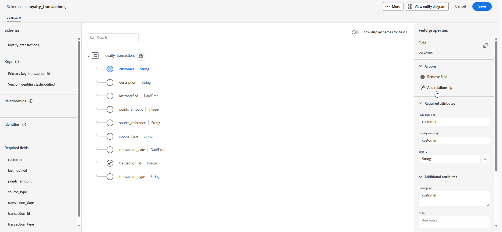

# Skapa modellbaserade scheman med en DDL-fil {#file-upload-schema}

Definiera den modellbaserade datamodell som krävs för orkestrerade kampanjer genom att skapa scheman som **lojalitetsmedlemskap**, **Loyalty-transaktioner** och **Loyalty-belöningar**. Varje schema måste innehålla en primärnyckel, ett versionsattribut och lämpliga relationer till referensentiteter som **Mottagare** eller **Varumärken**.

Scheman kan skapas manuellt via gränssnittet eller importeras i grupp med hjälp av en DDL-fil.

I det här avsnittet finns stegvisa anvisningar om hur du skapar ett modellbaserat schema i Adobe Experience Platform genom att överföra en DDL-fil (Data Definition Language). Med hjälp av en DDL-fil kan du definiera datamodellens struktur i förväg, inklusive tabeller, attribut, nycklar och relationer.

1. [Överför en DDL-fil](#ddl-upload) för att skapa modellbaserade scheman och definiera deras struktur.

1. [Definiera relationer](#relationships) mellan tabeller i datamodellen.

1. [Länka scheman](#link-schema) om du vill koppla modellbaserade data till befintliga profilentiteter som mottagare eller varumärken.

1. [Infoga data](ingest-data.md) i datauppsättningen från källor som stöds.

➡️ [Läs mer om modellbaserade scheman i Adobe Experience Platform-dokumentationen](https://experienceleague.adobe.com/en/docs/experience-platform/xdm/schema/relational)

## Överföra en DDL-fil{#ddl-upload}

Genom att överföra en DDL-fil kan du definiera datamodellens struktur i förväg, inklusive tabeller, attribut, nycklar och relationer.

Överföringar av Excel-baserade schemabilder stöds. Hämta [tillhandahållen mall](assets/template.zip) för att enkelt förbereda dina schemadefinitioner.

+++Följande funktioner stöds när du skapar modellbaserade scheman i Adobe Experience Platform

* **ENUM**\
  ENUM-fält stöds i både DDL-baserade och manuella schemagenereringar, vilket gör att du kan definiera attribut med en fast uppsättning tillåtna värden.
Här är ett exempel:

  ```
  CREATE TABLE orders (
  order_id     INT NOT NULL,
  product_id   INT NOT NULL,
  order_date   DATE NOT NULL,
  customer_id  INT NOT NULL,
  quantity     INT NOT NULL,
  order_status enum ('PENDING', 'SHIPPED', 'DELIVERED', 'CANCELLED'),
  PRIMARY KEY (order_id, product_id)
  );
  ```

* **Schemaetikett för datastyrning**\
  Etikettering stöds på schemafältnivå för att tillämpa datastyrningsprinciper som åtkomstkontroll och användningsbegränsningar. Mer information finns i [Adobe Experience Platform-dokumentationen](https://experienceleague.adobe.com/docs/experience-platform/xdm/home.html?lang=sv).

+++

1. Logga in på Adobe Experience Platform.

1. Navigera till menyn **Datahantering** > **Schema** .

1. Klicka på **Skapa schema**.

1. Välj **[!UICONTROL Model-based]** som **schematyp**.

   

1. Välj **[!UICONTROL Upload DDL file]** om du vill definiera ett entitetsrelationsdiagram och skapa scheman.

   Tabellstrukturen måste innehålla:
   * Minst en primärnyckel.
   * En versionsidentifierare, till exempel ett `lastmodified`-fält av typen `datetime` eller `number`.
   * För CDC-inmatning (Change Data Capture) är det en specialkolumn med namnet `_change_request_type` av typen `String` som anger typen av dataändring (till exempel infoga, uppdatera, ta bort) och möjliggör inkrementell bearbetning.
   * DDL-filen får inte definiera fler än 200 tabeller.


   >[!IMPORTANT]
   >
   > Alla scheman som används som mål måste innehålla minst ett identitetsfält av typen `String` med ett associerat **identitetsnamnområde**.\
   >Detta garanterar kompatibilitet med Adobe Journey Optimizer verktyg för målinriktning och identitetsupplösning.

1. Dra och släpp din DDL-fil och klicka på **[!UICONTROL Next]**.

   Observera att den största tillåtna storleken för en DDL-fil är 10 MB.

1. Skriv in din/ditt **[!UICONTROL Schema name]**.

1. Konfigurera varje schema och dess kolumner och se till att en primärnyckel och en versionsbeskrivning anges.

   Ett attribut, till exempel `lastmodified`, måste anges som versionsbeskrivare (typ `datetime`, `long` eller `int`) för att datauppsättningarna ska uppdateras med de senaste data. Användare kan ändra versionsbeskrivningen, som blir obligatorisk när den har angetts. Ett attribut kan inte vara både en primärnyckel (PK) och en versionsbeskrivning.

   

1. Markera ett attribut som `identity` och mappa det till ett definierat identitetsnamnområde.

1. Byt namn på, ta bort eller lägg till en beskrivning till varje tabell.

1. Klicka på **[!UICONTROL Done]** när du är klar.

Nu kan du verifiera tabell- och fältdefinitionerna på arbetsytan. [Läs mer i avsnittet nedan](#entities)

## Definiera relationer {#relationships}

Du kan ange relationer direkt i DDL-filen när du skapar ditt schema. Om du föredrar att definiera relationer utanför filen kan du göra det i gränssnittet genom att följa stegen nedan.

1. Få åtkomst till arbetsytans vy av din datamodell och välj de två tabeller som du vill länka

1. Klicka på knappen  bredvid Source Join och dra sedan pilen mot målhörnet för att upprätta anslutningen.

   >[!NOTE]
   >
   >Sammansatta nycklar stöds om de definieras i DDL-filen.

   

1. Fyll i det angivna formuläret för att definiera länken och klicka på **Använd** när du har konfigurerat den.

   

   **Kardinalitet**:

   * **1-N**: En förekomst av källtabellen kan ha flera motsvarande förekomster av måltabellen, men en förekomst av måltabellen kan ha högst en motsvarande förekomst av källtabellen.

   * **N-1**: en förekomst av måltabellen kan ha flera motsvarande förekomster av källtabellen, men en förekomst av källtabellen kan ha högst en motsvarande förekomst av måltabellen.

   * **1-1**: En förekomst av källtabellen kan ha högst en motsvarande förekomst av måltabellen.

1. Alla länkar som definieras i datamodellen representeras som pilar i arbetsytevyn. Klicka på en pil mellan två tabeller för att visa detaljer, göra ändringar eller ta bort länken efter behov.

   

1. Använd verktygsfältet för att anpassa och justera arbetsytan.

   

   * **Zooma in**: Förstora arbetsytan så att du tydligare kan se information om datamodellen.

   * **Zooma ut**: Minska arbetsytans storlek för en bredare vy av datamodellen.

   * **Anpassa vy**: Justera zoomningen så att den passar alla scheman i det synliga området.

   * **Filter**: Välj vilket schema som ska visas på arbetsytan.

   * **Tvinga automatisk layout**: Ordna scheman automatiskt för bättre ordning.

   * **Visningsschema**: Växla en minimumöverlappning för att enklare kunna navigera i stora eller komplexa schemalayouter.

   * **Expandera alla/komprimera alla**: Expandera eller komprimera snabbt alla schemanoder för att visa eller dölja deras attribut.

   * **Hämta**: Hämta ER-diagrammet som en png-fil.

1. Klicka på **Spara** när du är klar. Den här åtgärden skapar scheman och associerade datauppsättningar och aktiverar datauppsättningen för användning i Orchestrated Campaigns.

1. Klicka på **[!UICONTROL Open Jobs]** för att övervaka förloppet för skapandet. Den här processen kan ta några minuter, beroende på hur många tabeller som har definierats i DDL-filen.

   Du kan även komma åt dina DDL-importjobb genom att öppna fönstret **[!UICONTROL Upload DDL file]** och välja **[!UICONTROL View all DDL import jobs]**.

   

## Länka scheman {#link-schema}

>[!IMPORTANT]
>
> Det är bara relationer som uttryckligen definieras i DDL-filen som identifieras av systemet. Alla entitetsrelationer som finns utanför DDL-filen ignoreras och bearbetas inte.

Upprätta en relation mellan schemat **lojalitetstransaktioner** och schemat **Mottagare** för att associera varje transaktion med rätt kundpost.

1. Navigera till **[!UICONTROL Schemas]** och öppna dina tidigare skapade **lojalitetstransaktioner**.

1. Klicka på **[!UICONTROL Add Relationship]** från kunden **[!UICONTROL Field properties]**.

   

1. Välj **[!UICONTROL Many-to-One]** som relation **[!UICONTROL Type]**.

1. Länka till det befintliga **mottagarschemat**.

   

1. Ange **[!UICONTROL Relationship name from current schema]** och **[!UICONTROL Relationship name from reference schema]**.

1. Klicka på **[!UICONTROL Apply]** om du vill spara ändringarna.

Fortsätt genom att skapa en relation mellan schemat **loyalty rewards** och schemat **Brands** för att associera varje belöningspost med rätt varumärke.


