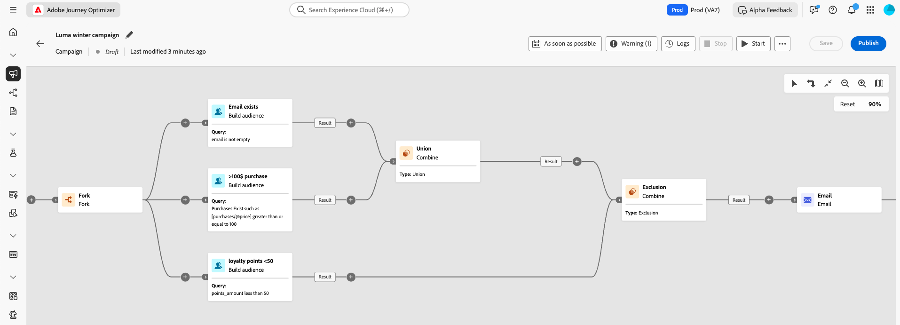

# Kom igång med samordnade kampanjer {#orchestrated-camp}

>[!CONTEXTUALHELP]
>id="campaigns_overview_orchestrated"
>title="campaign_overview_orchestrated"
>abstract="<b>Kampanjsamordning</b> Dela, kombinera, berika och hantera relationsdatauppsättningar för att definiera er målgrupp   <b>Utnyttja data för flera enheter</b> Lär dig hur orkestrerade kampanjer kan utnyttja relationsdatauppsättningar för att förbättra data för segmentering och personalisering  <b>Ad-hoc-segmentering och exakt antal</b> Bygg ditt segment steg för steg med exakt antal  <b>Tillgängliga kanaler</b> E-post, SMS, push-meddelanden"

Kampanjsamordning i [!DNL Adobe Journey Optimizer] driver avancerade, varumärkesinitierade marknadsföringskampanjer över alla kanaler, vilket hjälper er att öka engagemanget, intäkterna och kundlojaliteten i stor skala.

>[!IMPORTANT]
>
>För att få åtkomst till kampanjsamordning måste din licens innehålla antingen paketet **Journey Optimizer - Campaigns &amp; Journeys** eller paketet **Journey Optimizer - Campaigns**. Kontakta din Adobe-representant för att bekräfta din licens och uppdatera vid behov.

Flerkanalsmarknadsföring är avgörande, men samordnade kampanjer gör den sömlös. Med ett visuellt dra-och-släpp-gränssnitt kan ni utforma och automatisera komplexa marknadsföringsarbetsflöden, från segmentering till meddelandeleverans, i flera kanaler. Allt sker i en intuitiv miljö som är byggd för snabbhet, kontroll och effektivitet.

{zoomable="yes"}

➡️ [Upptäck orkestrerade kampanjer i video](#video-oc)

## Kärnfunktioner

Kampanjsamordning bygger på fyra huvudpelare:

<table style="table-layout:auto">
<tr style="border: 0;">
<td></a></td><td><b>On-Demand-målgrupper</b> Frågar direkt mellan datauppsättningar för att skapa målgruppssegment med valfri kombination av datatyper och dimensioner.</td></tr>
<tr style="border: 0;">
<td></a></td><td><b>Segmentering och sändning av flera enheter</b> Gå steget längre än personbaserade kampanjer - använd entiteter som produktkataloger, butiksplatser eller tjänstdata för att måla med precision.  
Stöd för sändning på flera nivåer, där ett meddelande skickas per profil och per associerad sekundär enhet. Dessa sekundära enheter kan vara kontaktadresser, bokningar, prenumerationer, kontrakt eller andra länkade data. Detta gör till exempel att kampanjer kan skickas till alla kända adresser för en profil eller för varje bokning som är kopplad till den profilen.</td></tr>
<tr style="border: 0;">
<td></a></td><td><b>Synlighet och precision före sändning</b> Få exakt segmenteringsantal och fullständigt kampanjomfång före lansering för att säkerställa precision och förtroende.</td></tr>
<tr style="border: 0;">
<td></a></td><td><b>Flerstegskampanjer</b> Utforma kampanjer i flera steg, från dagliga meddelanden till komplexa kampanjer som säsongskampanjer eller större produktlanseringar.</td></tr>
</table>

>[!NOTE]
>
>Mer information om vilka kanaler som stöds finns i tabellen i det här avsnittet: [Kanaler i resor och kampanjer](../channels/gs-channels.md#channels).
>
>Vilka kanaler som är tillgängliga varierar beroende på licensmodell och tillägg.

## Samordnade kampanjer och resor

Även om visualiseringen av orkestrerade kampanjer liknar resor, löser den olika syften och användningsområden:

* **Resor** - 1 till 1 arbetsyta där varje profil förflyttar sig genom de olika stegen i sin egen takt. Tillståndet för varje kund upprätthålls i sitt sammanhang för att aktivera realtidsåtgärder.

* **Samordnade kampanjer** - Till skillnad från resor används grupparbetsyta för att beräkna segment. Alla profiler bearbetas samtidigt.

Båda arbetsytorna är optimerade för respektive användningsfall: Resursytan publicerar resor som tenderar att vara aktiva under en längre period, medan Campaign Canvas är utformat för iterativa och inkrementella körningar av en gruppkampanj.

## Vad finns i en orkestrerad kampanj? {#gs-ms-campaign-inside}

Den Orchestrerade kampanjarbetsytan är en representation av vad som ska hända. Det beskriver de olika åtgärder som ska utföras och hur de är sammankopplade.

Alla samordnade kampanjer innehåller:

* **Aktiviteter**: En aktivitet är en aktivitet som ska utföras. De [olika aktiviteterna](activities/about-activities.md) representeras av ikoner på arbetsytan. Varje aktivitet har specifika egenskaper och andra egenskaper som är gemensamma för alla aktiviteter.

  På en Orchestrated-kampanjarbetsyta kan en viss aktivitet producera flera uppgifter, särskilt när det finns en slinga eller återkommande åtgärder.

* **Övergångar**: Övergångar länkar en källaktivitet till en målaktivitet och definierar deras sekvens.

* **Arbetstabeller**: Arbetstabellen innehåller all information som följer med övergången. Varje orkestrerad kampanj använder flera arbetstabeller. De data som förmedlas i dessa tabeller kan användas under hela den Orchestrated-kampanjens livscykel.

## Introduktionsvideo {#video-oc}

Lär dig viktiga koncept och funktioner som är tillgängliga med orkestrerade kampanjer.

>[!VIDEO](https://video.tv.adobe.com/v/3471538/?learn=on&enablevpops)

## Låt oss dyka djupare

Nu när ni har en förståelse för vad flerkanalskampanjer är, är det dags att gå djupare in i dessa dokumentationsavsnitt för att börja arbeta med funktionen.

<table><tr style="border: 0; text-align: center;">
<td>

<a href="gs-campaign-creation.md"><strong>Konfigurationssteg</strong></a>

</td>
<td>

<a href="create-orchestrated-campaign.md"><strong>Skapa en orkestrerad kampanj</strong>

</td>
<td>

<a href="activities/about-activities.md"><strong>Arbeta med aktiviteter</strong></a>

</td>
</tr></table>
