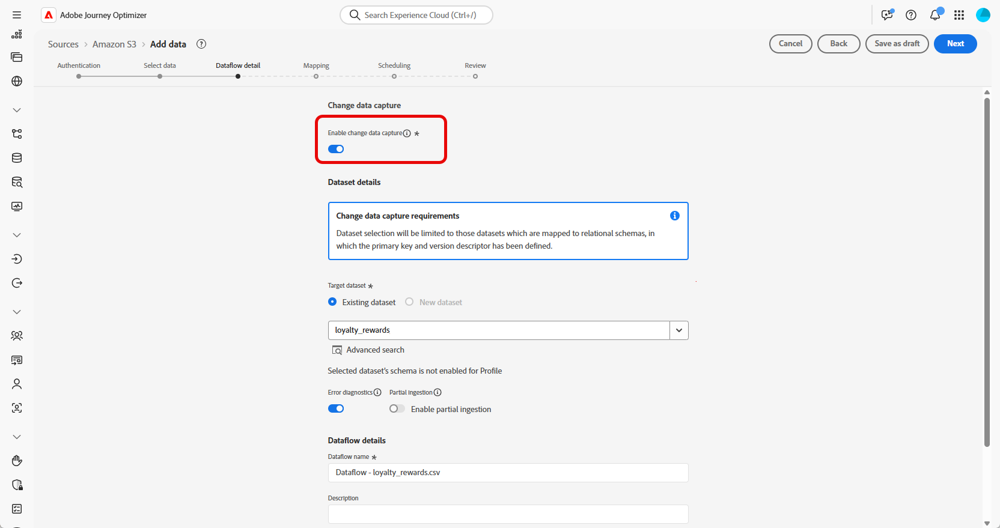
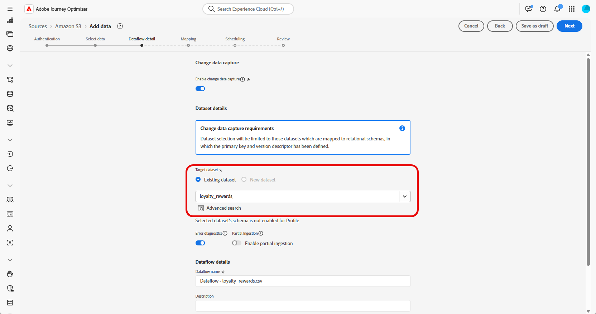

# Ingrediera data {#ingest-data}

>[!IMPORTANT]
>
>Om du vill ändra datakällan för en datauppsättning måste du först ta bort det befintliga dataflödet innan du skapar ett nytt som refererar till samma datauppsättning och den nya källan.
>
>Adobe Experience Platform tillämpar en strikt personlig relation mellan dataflöden och datauppsättningar. På så sätt kan du upprätthålla synkroniseringen mellan källan och datauppsättningen för korrekt inkrementellt intag.

Med Adobe Experience Platform kan data hämtas från externa källor samtidigt som du kan strukturera, etikettera och förbättra inkommande data med hjälp av Experience Platform tjänster. Du kan importera data från en mängd olika källor, till exempel Adobe-program, molnbaserade lager, databaser och många andra.

En datauppsättning är en lagrings- och hanteringskonstruktion för en datamängd, vanligtvis en tabell, som innehåller ett schema (kolumner) och fält (rader). Data som har importerats till Experience Platform lagras i datasjön som datauppsättningar.

## Källor som stöds för samordnade kampanjer {#supported}

Följande källor stöds för användning med Orchestrated-kampanjer:

<table>
  <thead>
    <tr>
      <th>Typ</th>
      <th>Källa</th>
    </tr>
  </thead>
  <tbody>
    <tr>
      <td rowspan="3">molnlagring</td>
      <td><a href="https://experienceleague.adobe.com/en/docs/experience-platform/sources/ui-tutorials/create/cloud-storage/s3">Amazon S3</a></td>
    </tr>
    <tr>
      <td><a href="https://experienceleague.adobe.com/en/docs/experience-platform/sources/ui-tutorials/create/cloud-storage/google-cloud-storage">Google Cloud-lagring</a></td>
    </tr>
    <tr>
      <td><a href="https://experienceleague.adobe.com/en/docs/experience-platform/sources/ui-tutorials/create/cloud-storage/sftp">SFTP</a></td>
    </tr>
      <td rowspan="4">Datalager i molnet</td>
      <td><a href="https://experienceleague.adobe.com/en/docs/experience-platform/sources/ui-tutorials/create/databases/snowflake">Snowflake</a></td>
    </tr>
    <tr>
      <td><a href="https://experienceleague.adobe.com/en/docs/experience-platform/sources/ui-tutorials/create/databases/bigquery">Google BigQuery</a></td>
    </tr>
    <tr>
      <td><a href="https://experienceleague.adobe.com/en/docs/experience-platform/sources/ui-tutorials/create/cloud-storage/data-landing-zone">Datallandningszon<a></td>
    </tr>
    <tr>
      <td><a href="https://experienceleague.adobe.com/en/docs/experience-platform/sources/ui-tutorials/create/databases/databricks">Azure-databaser</a></td>
    </tr>
    <tr>
      <td rowspan="3">Filbaserade överföringar</td>
      <td><a href="https://experienceleague.adobe.com/en/docs/experience-platform/sources/ui-tutorials/create/local-system/local-file-upload">Lokal filöverföring<a></td>
    </tr>

</tbody>
</table>

## Riktlinjer för modellbaserad datahygien för scheman {#cdc}

För datauppsättningar som är aktiverade med **[!UICONTROL Change data capture]** speglas alla dataändringar automatiskt, inklusive borttagningar, från källsystemet till Adobe Experience Platform.

Eftersom Adobe Journey Optimizer Campaigns kräver att alla onboardbaserade datauppsättningar ska aktiveras med **[!UICONTROL Change data capture]** är det kundens ansvar att hantera borttagningar vid källan. Alla poster som tas bort från källsystemet tas automatiskt bort från motsvarande datauppsättning i Adobe Experience Platform.

Om du vill ta bort poster via filbaserad inmatning ska kundens datafil markera posten med ett `D`-värde i fältet `Change Request Type`. Detta anger att posten ska tas bort i Adobe Experience Platform, vilket motsvarar källsystemet.

Om kunden bara vill ta bort poster från Adobe Experience Platform utan att originalkälldata påverkas, finns följande alternativ:

* **Proxy eller sanerad tabell för replikering av registrering av ändringsdata**

  Kunden kan skapa en proxy- eller sanitized-källtabell som styr vilka poster som replikeras till Adobe Experience Platform. Borttagningar kan sedan hanteras selektivt från den här mellanliggande tabellen.

* **Borttagning via Data Distiller**

  Om den är licensierad kan **Data Distiller** användas för borttagningsåtgärder direkt i Adobe Experience Platform, oberoende av källsystemet.

  [Läs mer om Data Distiller](https://experienceleague.adobe.com/en/docs/experience-platform/query/data-distiller/overview)

## Konfigurera ett dataflöde

I det här exemplet visas hur du konfigurerar ett dataflöde som importerar strukturerade data till Adobe Experience Platform. Det konfigurerade dataflödet stöder automatiskt, schemalagt inmatning och möjliggör uppdateringar i realtid.

1. Öppna menyn **[!UICONTROL Connections]** på menyn **[!UICONTROL Sources]**.

1. Välj källa beroende på vilka [källor som stöds för samordnade kampanjer](#supported).

   

1. Anslut ditt konto för molnlagring eller Google Cloud-lagring om du väljer molnbaserade källor.

   

1. Välj de data som ska importeras till Adobe Experience Platform.

   

1. På sidan **[!UICONTROL Dataset details]** markerar du **[!UICONTROL Enable Change data capture]** om du bara vill visa datauppsättningar som är mappade till modellbaserade scheman och innehåller både en primärnyckel och en versionsbeskrivning.

[Läs mer om riktlinjer för modellbaserad datahygien för scheman](#cdc)

   >[!IMPORTANT]
   >
   > För **filbaserade källor endast** måste varje rad i datafilen innehålla en `_change_request_type`-kolumn med värdena `U` (upsert) eller `D` (delete). Utan den här kolumnen kan systemet inte identifiera data som stöd för ändringsspårning, och växlingsknappen för orchestrated Campaign visas inte, vilket förhindrar att datauppsättningen väljs för målinriktning.

   

1. Markera den datauppsättning som du skapade tidigare och klicka på **[!UICONTROL Next]**.

   

1. Om du bara använder en filbaserad källa överför du dina lokala filer från fönstret **[!UICONTROL Select data]** och förhandsgranskar deras struktur och innehåll.

   Observera att den största storlek som stöds är 100 MB.

1. I fönstret **[!UICONTROL Mapping]** kontrollerar du att varje källfilsattribut är korrekt mappat med motsvarande fält i målschemat. [Läs mer om måldimensioner](target-dimension.md).

   Klicka på **[!UICONTROL Next]** när du är klar.

   

1. Konfigurera dataflödet **[!UICONTROL Schedule]** baserat på önskad frekvens.

1. Klicka på **[!UICONTROL Finish]** för att skapa dataflödet. Den körs automatiskt enligt angivet schema.

1. Välj **[!UICONTROL Connections]** på menyn **[!UICONTROL Sources]** och gå till fliken **[!UICONTROL Data Flows]** för att spåra flödeskörning, granska inkapslade poster och felsöka eventuella fel.

   

