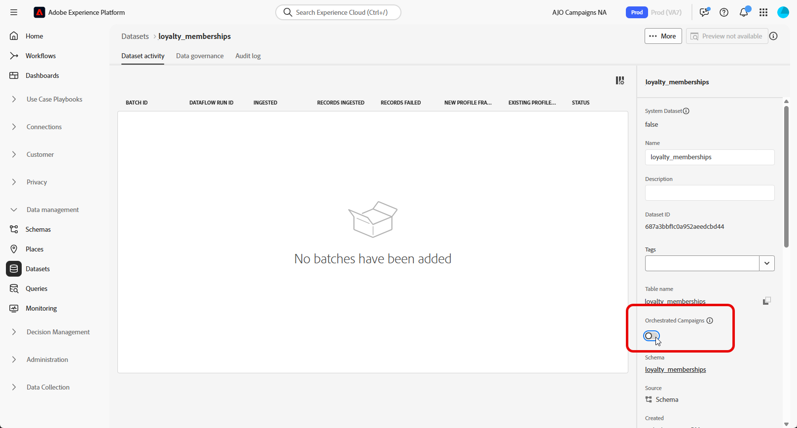

# Konfigurera ett manuellt relationsschema {#manual-schema}

Relationsscheman kan skapas direkt via användargränssnittet, vilket möjliggör detaljerad konfiguration av attribut, primärnycklar, versionsfält och relationer.

I följande exempel definieras schemat **Förmånsmedlemskap** manuellt för att illustrera den struktur som krävs för Orchestrated-kampanjer.

1. [Skapa ett relationsschema manuellt](#schema) med Adobe Experience Platform-gränssnittet.

1. [Lägg till attribut](#schema-attributes) som kund-ID, medlemsnivå och statusfält.

1. [Länka ditt schema](#link-schema) till inbyggda scheman, till exempel Mottagare för kampanjanpassning.

1. [Skapa en datamängd](#dataset) baserat på ditt schema och aktivera den för användning i Orchestrated-kampanjer.

1. [Infoga data](ingest-data.md) i datauppsättningen från källor som stöds.

➡️ [Läs mer om manuella relationsscheman i Adobe Experience Platform-dokumentationen](https://experienceleague.adobe.com/sv/docs/experience-platform/xdm/ui/resources/schemas#create-manually)

## Skapa ditt schema {#schema}

Börja med att skapa ett nytt relationsschema manuellt i Adobe Experience Platform. Med den här processen kan du definiera schemastrukturen från grunden, inklusive dess namn och beteende.

1. Logga in på Adobe Experience Platform.

1. Navigera till menyn **[!UICONTROL Data Management]** > **[!UICONTROL Schema]**.

1. Klicka på **[!UICONTROL Create Schema]**.

1. Välj **[!UICONTROL Relational]** som **schematyp**.

   {zoomable="yes"}

1. Välj **[!UICONTROL Create manually]** om du vill skapa schema genom att lägga till fält manuellt.

1. Ange din **[!UICONTROL Schema display name]**.

   {zoomable="yes"}

1. Klicka på **Slutför** om du vill fortsätta skapa schemat.

Nu kan du börja lägga till attribut i schemat för att definiera dess struktur.

## Lägg till attribut i schemat {#schema-attributes}

Sedan lägger du till attribut för att definiera strukturen för ditt schema. Dessa fält representerar de viktigaste datapunkter som används i samordnade kampanjer, till exempel kundidentifierare, medlemsinformation och aktivitetsdatum. Genom att definiera dem korrekt kan du säkerställa tillförlitlig personalisering, segmentering och spårning.

Alla scheman som används för mål måste innehålla minst ett identitetsfält av typen `String` med ett associerat identitetsnamnområde. Detta garanterar kompatibilitet med Adobe Journey Optimizer verktyg för målinriktning och identitetsupplösning.

+++Följande funktioner stöds när du skapar relationsscheman i Adobe Experience Platform

* **ENUM**\
  ENUM-fält stöds i både DDL-baserade och manuella schemagenereringar, vilket gör att du kan definiera attribut med en fast uppsättning tillåtna värden.

* **Schemaetikett för datastyrning**\
  Etikettering stöds på schemafältnivå för att tillämpa datastyrningsprinciper som åtkomstkontroll och användningsbegränsningar. Mer information finns i [Adobe Experience Platform-dokumentationen](https://experienceleague.adobe.com/docs/experience-platform/xdm/home.html?lang=sv).

* **Sammansatt nyckel**\
  Sammansatta primärnycklar stöds i relationsschemadefinitioner, vilket gör det möjligt att använda flera fält tillsammans för att unikt identifiera poster.

+++

1. Klicka på  bredvid ditt **schemanamn** på arbetsytan för att börja lägga till attribut.

   {zoomable="yes"}

1. Ange attributet **[!UICONTROL Field name]**, **[!UICONTROL Display name]** och **[!UICONTROL Type]**.

   I det här exemplet har vi lagt till attributen som beskrivs i tabellen nedan i schemat **Bonusmedlemskap**.

   +++ Exempel på attribut

   | Attributnamn | Datatyp | Ytterligare attribut |
   |-|-|-|
   | kund | STRÄNG | Primär nyckel |
   | medlemskapsnivå | STRÄNG | Obligatoriskt |
   | points_balance | INTEGER | Obligatoriskt |
   | enrollment_date | DATUM | Obligatoriskt |
   | last_status_change | DATUM | Obligatoriskt |
   | förfallodatum | DATUM | – |
   | is_active | BOOLEAN | Obligatoriskt |
   | senast ändrad | DATETIME | Obligatoriskt |

   +++ 

1. Tilldela lämpliga fält som **[!UICONTROL Primary Key]** och **[!UICONTROL Version Descriptor]**.

   När du skapar ett manuellt schema ska du se till att följande viktiga fält finns med:

   * Minst en primärnyckel
   * En versionsidentifierare, till exempel ett `lastmodified`-fält av typen `datetime` eller `number`.
   * För CDC-inmatning (Change Data Capture) är det en specialkolumn med namnet `_change_request_type` av typen `String` som anger typen av dataändring (till exempel infoga, uppdatera, ta bort) och möjliggör inkrementell bearbetning. Observera att `_change_request_type` inte ska ingå i tabellschemat, utan bara läggas till i datafilen vid inmatning.

   {zoomable="yes"}

1. Klicka på **[!UICONTROL Save]**.

När du har skapat och sparat attribut kan du länka schemat till andra relationsscheman genom att definiera relationer.

➡️ [Läs mer om relationsscheman i Adobe Experience Platform-dokumentationen](https://experienceleague.adobe.com/sv/docs/experience-platform/xdm/schema/relational#how-relational-schemas-differ-from-standard-xdm-schemas)

## Länka scheman {#link-schema}

Genom att skapa en relation mellan två scheman kan ni förbättra orkestrerade kampanjer med data utöver det primära profilschemat.

1. Välj det attribut som du vill använda som länk från ditt nyligen skapade schema och klicka på **[!UICONTROL Add relationship]**.

   {zoomable="yes"}

1. Välj **[!UICONTROL Reference schema]** och **[!UICONTROL Reference field]** som relationen ska upprättas med.

   I det här exemplet är attributet `customer` länkat till schemat `recipients`.

   {zoomable="yes"}

1. Ange ett relationsnamn från aktuellt schema och från referensschema.

1. Klicka på **[!UICONTROL Apply]** när du har konfigurerats.

## Skapa en datauppsättning för schemat {#dataset}

När du har definierat ditt schema kan du nu skapa en datauppsättning som baseras på det. Datauppsättningen lagrar dina inkapslade data och måste aktiveras för att Orchestrated Campaigns ska vara tillgängliga.

1. Navigera till menyn **[!UICONTROL Data Management]** > **[!UICONTROL Datasets]** och klicka på **[!UICONTROL Create dataset]**.

   {zoomable="yes"}

1. Välj **[!UICONTROL Create dataset from schema]**.

1. Välj det schema du skapat tidigare, här **Bonusmedlemskap**, och klicka på **[!UICONTROL Next]**.

   {zoomable="yes"}

1. Ange **[!UICONTROL Name]** för din **[!UICONTROL Dataset]** och klicka på **[!UICONTROL Finish]**.

Nu måste ni aktivera datauppsättningen för samordnade kampanjer.

## Aktivera datauppsättning för orkestrerade kampanjer {#enable}

>[!CONTEXTUALHELP]
>id="ajo_oc_enable_dataset_for_oc"
>title="Samordnade kampanjer"
>abstract="När du har skapat datauppsättningen måste du explicit aktivera den för Orchestrated Campaigns. Detta steg garanterar att datauppsättningen är tillgänglig för realtidssamordning och personalisering inom Adobe Journey Optimizer."

När du har skapat datauppsättningen måste du explicit aktivera den för Orchestrated Campaigns. Detta steg garanterar att datauppsättningen är tillgänglig för realtidssamordning och personalisering inom Adobe Journey Optimizer.

Se [Adobe Developer-dokumentation](https://developer.adobe.com/journey-optimizer-apis/references/orchestrated-campaign-dataset/#tag/DatasetEnablement) om du vill validera eller aktivera Orchestrated Campaign Extension på datauppsättningen.

1. Leta reda på datauppsättningen i listan **[!UICONTROL Datasets]**.

1. Aktivera alternativet **[!UICONTROL Datasets]** Orchestrated Campaigns **från inställningarna för** för att markera den datauppsättning som är tillgänglig för användning i dina Orchestrated Campaigns.

   {zoomable="yes"}

1. Vänta några minuter tills aktiveringsprocessen har slutförts. Observera att datainmatning och kampanjanvändning endast är möjligt när den här inställningen är helt aktiverad.

Nu kan du börja inhämta data i ditt schema med valfri källa.

➡️ [Lär dig hur du importerar data](ingest-data.md)
