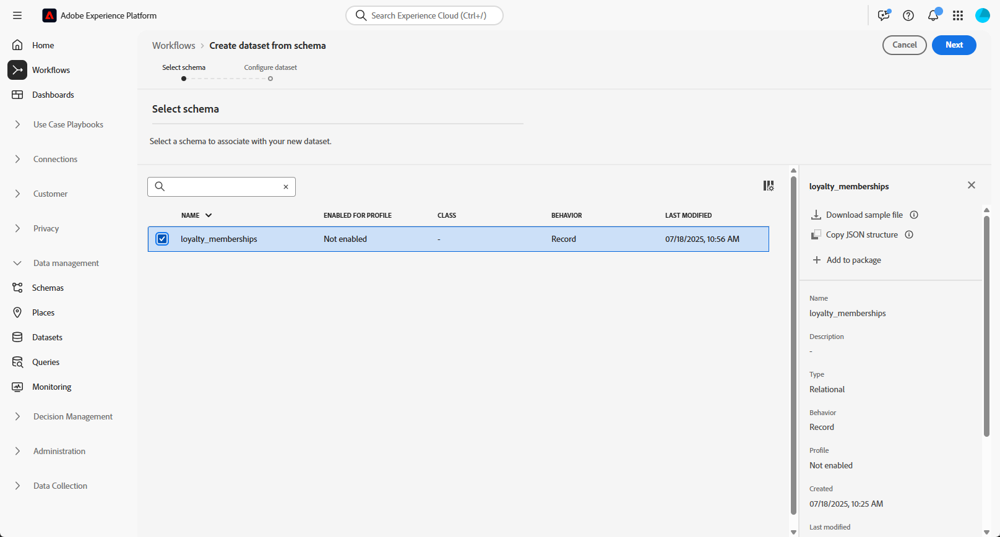

# Konfigurera ett manuellt relationsschema {#manual-schema}

+++ Innehållsförteckning

| Välkommen till samordnade kampanjer | Starta din första samordnade kampanj | Fråga databasen | Ochestrerade kampanjaktiviteter |
|---|---|---|---|
| [Kom igång med samordnade kampanjer](gs-orchestrated-campaigns.md)  Skapa och hantera relationsscheman och datauppsättningar: <ul><li>[Kom igång med scheman och datauppsättningar](gs-schemas.md)</li><li>[Manuellt schema](manual-schema.md)</li><li>[Filöverföringsschema](file-upload-schema.md)</li><li>[Ingest data](ingest-data.md)</li></ul>[Få åtkomst till och hantera samordnade kampanjer](access-manage-orchestrated-campaigns.md)  [Viktiga steg för att skapa en strukturerad kampanj](gs-campaign-creation.md) | [Skapa och schemalägg kampanjen](create-orchestrated-campaign.md)  [Organisera aktiviteter](orchestrate-activities.md)  [Starta och övervaka kampanjen](start-monitor-campaigns.md)  [Rapportera](reporting-campaigns.md) | [Arbeta med regelbyggaren](orchestrated-rule-builder.md)  [Bygg din första fråga](build-query.md)  [Redigera uttryck](edit-expressions.md)  [Återmarknadsföring](retarget.md) | [Kom igång med aktiviteter](activities/about-activities.md)  Aktiviteter: [And-join](activities/and-join.md) - [Bygg målgrupp](activities/build-audience.md) - [Ändra dimension](activities/change-dimension.md) - [Kanalaktiviteter](activities/channels.md) - [Kombinera](activities/combine.md) - [Deduplicering](activities/deduplication.md) - [Enrichment](activities/enrichment.md) - [Fork](activities/fork.md)  - [Avstämning](activities/reconciliation.md) - [Spara målgrupp](activities/save-audience.md) - [Dela](activities/split.md) - [Vänta](activities/wait.md) |

{style="table-layout:fixed"}

+++

 

>[!BEGINSHADEBOX]

 

Innehållet på den här sidan är inte slutgiltigt och kan komma att ändras.

>[!ENDSHADEBOX]

Relationsscheman kan skapas direkt via användargränssnittet, vilket möjliggör detaljerad konfiguration av attribut, primärnycklar, versionsfält och relationer.

I följande exempel definieras schemat **Förmånsmedlemskap** manuellt för att illustrera den struktur som krävs för samordnade kampanjer.

1. [Skapa ett relationsschema manuellt](#schema) med Adobe Experience Platform-gränssnittet.

1. [Lägg till attribut](#schema-attributes) som kund-ID, medlemsnivå och statusfält.

1. [Länka ditt schema](#link-schema) till inbyggda scheman, till exempel Mottagare för kampanjanpassning.

1. [Skapa en datamängd](#dataset) baserat på ditt schema och aktivera den för användning i samordnade kampanjer.

1. [Infoga data](ingest-data.md) i datauppsättningen från källor som stöds.

## Skapa ditt schema {#schema}

Börja med att skapa ett nytt relationsschema manuellt i Adobe Experience Platform. Med den här processen kan du definiera schemastrukturen från grunden, inklusive dess namn och beteende.

1. Logga in på Adobe Experience Platform.

1. Navigera till menyn **[!UICONTROL Data Management]** > **[!UICONTROL Schema]**.

1. Klicka på **[!UICONTROL Create Schema]**.

1. Välj **[!UICONTROL Relational]** som **schematyp**.

   {zoomable="yes"}

1. Välj **[!UICONTROL Create manually]** om du vill skapa schema genom att lägga till fält manuellt.

1. Ange din **[!UICONTROL Schema display name]**.

1. Välj **[!UICONTROL Record]** som **[!UICONTROL Schema behavior]**.

   {zoomable="yes"}

1. Klicka på **Slutför** om du vill fortsätta skapa schemat.

Nu kan du börja lägga till attribut i schemat för att definiera dess struktur.

## Lägg till attribut i schemat {#schema-attributes}

Sedan lägger du till attribut för att definiera strukturen för ditt schema. Dessa fält representerar de nyckeldatapunkter som används i samordnade kampanjer, t.ex. kundidentifierare, medlemsinformation och aktivitetsdatum. Genom att definiera dem korrekt kan du säkerställa tillförlitlig personalisering, segmentering och spårning.

1. Klicka på  bredvid ditt **schemanamn** på arbetsytan för att börja lägga till attribut.

   {zoomable="yes"}

1. Ange attributet **[!UICONTROL Field name]**, **[!UICONTROL Display name]** och **[!UICONTROL Type]**.

   I det här exemplet har vi lagt till attributen som beskrivs i tabellen nedan i schemat **Bonusmedlemskap**.

+++ Exempel på attribut

   | Attributnamn | Datatyp | Ytterligare attribut |
   |-|-|-|
   | kund | STRÄNG | Primär nyckel |
   | medlemskapsnivå | STRÄNG | Obligatoriskt |
   | points_balance | INTEGER | Obligatoriskt |
   | enrollment_date | DATUM | Obligatoriskt |
   | last_status_change | DATUM | Obligatoriskt |
   | förfallodatum | DATUM | – |
   | is_active | BOOLEAN | Obligatoriskt |
   | senast ändrad | DATETIME | Obligatoriskt |

+++

1. Tilldela lämpliga fält som **[!UICONTROL Primary Key]** och **[!UICONTROL Version Descriptor]**.

   **[!UICONTROL Primary Key]** ser till att varje post identifieras unikt, medan **[!UICONTROL Version Descriptor]** hämtar uppdateringar över tiden, vilket aktiverar registrering av ändringsdata och stöd för dataregling.

   {zoomable="yes"}

1. Klicka på **[!UICONTROL Save]**.

När attributen har skapats måste du länka ditt nyligen skapade schema till ett inbyggt schema.

## Länka scheman {#link-schema}

Skapa en relation mellan två scheman så att ni kan berika era samordnade kampanjer med data som lagras utanför det primära profilschemat.

1. Välj det attribut som du vill använda som länk från ditt nyligen skapade schema och klicka på **[!UICONTROL Add relationship]**.

   {zoomable="yes"}

1. Välj **[!UICONTROL Reference schema]** och **[!UICONTROL Reference field]** som relationen ska upprättas med.

   I det här exemplet är attributet `customer` länkat till schemat `recipients`.

   {zoomable="yes"}

1. Ange ett relationsnamn från aktuellt schema och från referensschema.

1. Klicka på **[!UICONTROL Apply]** när du har konfigurerats.

När relationen är etablerad måste du skapa en datauppsättning baserad på ditt schema.

## Skapa en datauppsättning för schemat {#dataset}

När du har definierat ditt schema är nästa steg att skapa en datauppsättning som baseras på det. Den här datauppsättningen lagrar dina inkapslade data och måste aktiveras för att Orchestrated Campaigns ska kunna göra den tillgänglig i Adobe Journey Optimizer. Om du aktiverar det här alternativet identifieras datauppsättningen för användning i arbetsflöden för realtidssamordning och personalisering.

1. Navigera till menyn **[!UICONTROL Data Management]** > **[!UICONTROL Datasets]** och klicka på **[!UICONTROL Create dataset]**.

   {zoomable="yes"}

1. Välj **[!UICONTROL Create dataset from schema]**.

1. Välj det schema du skapat tidigare, här **Bonusmedlemskap**, och klicka på **[!UICONTROL Next]**.

   {zoomable="yes"}

1. Ange **[!UICONTROL Name]** för din **[!UICONTROL Dataset]** och klicka på **[!UICONTROL Finish]**.

1. Aktivera alternativet **Orchestrated Campaigns** för att göra datauppsättningen tillgänglig för användning i dina AJO-kampanjer.

   Aktiveringen kan ta några minuter. Intag av data är bara möjligt efter att alternativet har aktiverats helt.

   {zoomable="yes"}

Nu kan du börja inhämta data i ditt schema med valfri källa.

➡️ [Lär dig hur du importerar data](ingest-data.md)
