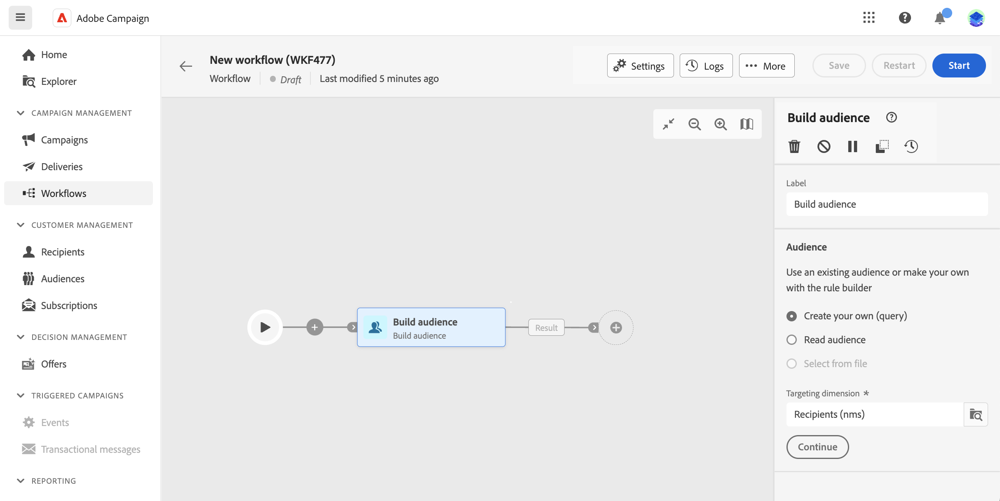

# Samordna samordnade kampanjaktiviteter {#orchestrate}

+++ Innehållsförteckning

| Välkommen till samordnade kampanjer | Starta din första samordnade kampanj | Fråga databasen | Ochestrerade kampanjaktiviteter |
|---|---|---|---|
| [Kom igång med samordnade kampanjer](gs-orchestrated-campaigns.md)  [Konfigurationssteg](configuration-steps.md)  [Viktiga steg för att skapa samordnade kampanjer](gs-campaign-creation.md) | [Skapa en orkestrerad kampanj](create-orchestrated-campaign.md)  [Organisera aktiviteter](orchestrate-activities.md)  [Skicka meddelanden med orkestrerade kampanjer](send-messages.md)  [Starta och övervaka kampanjen](start-monitor-campaigns.md)  [Rapportera](reporting-campaigns.md) | [Arbeta med Query Modeler](orchestrated-query-modeler.md)  [Skapa din första fråga](build-query.md)  [Redigera uttryck](edit-expressions.md) | [Kom igång med aktiviteter](activities/about-activities.md)  Aktiviteter: [Och-join](activities/and-join.md) - [Skapa målgrupp](activities/build-audience.md) - [Ändra dimension](activities/change-dimension.md) - [Kombinera](activities/combine.md) - [Ta bort dubbletter](activities/deduplication.md) - [Förbättra](activities/enrichment.md) - [Förena](activities/fork.md) - [Förena&lbrace;1 ](activities/reconciliation.md) - [Dela](activities/split.md) - [Vänta](activities/wait.md) |

{style="table-layout:fixed"}

+++

 

När du har [skapat en orkestrerad kampanj](gs-campaign-creation.md), oavsett om det är från den orkestrerade kampanjmenyn eller i en kampanj, kan du börja orkestrera de olika uppgifter som ska utföras. För att göra detta finns en visuell arbetsyta som gör att du kan skapa ett orkestrerat kampanjdiagram. I det här diagrammet kan du lägga till olika aktiviteter och koppla dem i en sekventiell ordning.

## Lägg till aktiviteter {#add}

I det här skedet av konfigurationen visas diagrammet med en startikon som representerar början av den orkestrerade kampanjen. Om du vill lägga till din första aktivitet klickar du på knappen **+** som är ansluten till startikonen.

En lista över aktiviteter som kan läggas till i diagrammet visas. Vilka aktiviteter som är tillgängliga beror på din position i det samordnade kampanjdiagrammet. När du till exempel lägger till din första aktivitet kan du starta din samordnade kampanj genom att rikta in en målgrupp, dela den orkestrerade kampanjsökvägen eller ange en **Vänta** -aktivitet för att fördröja den orkestrerade kampanjkörningen. Efter en **Bygg målgrupp** kan du å andra sidan förfina ditt mål med målinriktningsaktiviteter, skicka en leverans till din målgrupp med kanalaktiviteter eller organisera den samordnade kampanjprocessen med flödeskontrollaktiviteter.

{zoomable="yes"}

När en aktivitet har lagts till i diagrammet visas en höger ruta där du kan konfigurera den nyligen tillagda aktiviteten med specifika inställningar. Detaljerad information om hur du konfigurerar varje aktivitet finns i [det här avsnittet](activities/about-activities.md).

{zoomable="yes"}

Upprepa den här processen om du vill lägga till så många aktiviteter som du vill, beroende på vilka uppgifter du vill att din samordnade kampanj ska utföra. Observera att du även kan infoga en ny aktivitet mellan två aktiviteter. Det gör du genom att klicka på knappen **+** för övergången mellan aktiviteterna, markera önskad aktivitet och konfigurera den i den högra rutan.

Om du vill ta bort en aktivitet markerar du den på arbetsytan och klickar på ikonen **Ta bort** i aktivitetsegenskaperna.

>[!TIP]
>
>Du kan anpassa namnet på övergångarna mellan varje aktivitet. Det gör du genom att markera övergången och ändra dess etikett i den högra rutan.

## Verktygsfältet {#toolbar}

Verktygsfältet i det övre högra hörnet av arbetsytan innehåller alternativ för att enkelt ändra aktiviteterna och navigera på arbetsytan:

* **Flervalsläge**: Markera flera aktiviteter om du vill ta bort alla samtidigt eller kopiera och klistra in dem. Se [det här avsnittet](#copy).
* **Rotera**: Växla arbetsytan lodrätt.
* **Anpassa till skärmen**: Anpassa arbetsytans zoomnivå till skärmen.
* **Zooma ut** / **Zooma in**: Zooma ut eller in på arbetsytan.
* **Visningsschema**: Öppnar en ögonblicksbild av arbetsytan som visar att du finns.

{zoomable="yes"}{width="50%"}

## Hantera aktiviteter {#manage}

När du lägger till aktiviteter är åtgärdsknappar tillgängliga i egenskapsrutan, vilket gör att du kan utföra flera åtgärder.

{zoomable="yes"}

Du kan:

* **Ta bort** aktiviteten från arbetsytan.
* **Inaktivera/aktivera** aktiviteten. När den samordnade kampanjen körs, utförs inte inaktiverade aktiviteter och följande aktiviteter på samma sökväg och den samordnade kampanjen stoppas.
* **Pausa/återuppta** aktiviteten. När den orkestrerade kampanjen körs pausas den vid den pausade aktiviteten. Motsvarande uppgift och alla som följer den i samma sökväg körs inte.
* **Kopiera** aktiviteten. Se [det här avsnittet](#copy).
* **Flytta** en aktivitet och alla dess underordnade noder till en annan övergång. Se [det här avsnittet](#move)
* Få åtkomst till aktivitetens **körningsalternativ**.
* Åtkomst till aktivitetens **loggar och uppgifter**.

Flera **målaktiviteter**, till exempel **Kombinera** eller **Ta bort dubbletter**, gör att du kan bearbeta den återstående populationen och inkludera den i en ytterligare utgående övergång. Om du till exempel använder en **delad** -aktivitet består komplementet av den population som inte matchar någon av de tidigare definierade delmängderna. Aktivera alternativet **Generera komplement** om du vill använda den här funktionen.

## Flytta eller kopiera aktiviteter {#move-copy}

### Kopiera och klistra in aktiviteter {#copy}

Du kan kopiera samordnade kampanjaktiviteter och klistra in dem i valfritt arbetsflöde. Målkampanjen kan finnas på en annan webbläsarflik.

Du kan kopiera aktiviteter på två sätt:

* kopiera en aktivitet med åtgärdsknappen.

  {zoomable="yes"}{width="70%"}

* kopiera flera aktiviteter med verktygsfältsknappen.

  {zoomable="yes"}{width="70%"}

Om du vill klistra in de kopierade aktiviteterna klickar du på knappen **+** för en övergång och väljer Klistra in X-aktivitet.

{zoomable="yes"}{width="50%"}

### Flytta aktiviteter och deras underordnade noder {#move}

Med Journey Optimizer kan du flytta en aktivitet, tillsammans med hela innehållet i dess underordnade noder (inklusive alla övergångar och aktiviteter i den) till slutet av en annan övergång inom samma samordnade kampanj.

Den här processen kopplar från aktiviteten och allt i den utgående övergången från den ursprungliga platsen, vilket flyttar den till den nya målövergången.

Så här flyttar du en aktivitet:

1. Markera aktiviteten som du vill flytta.
1. Klicka på knappen **Flytta** i aktivitetens egenskapspanel.
1. Markera övergången där du vill placera aktiviteten och dess utgående övergång och bekräfta sedan.

## Körningsalternativ {#execution}

Med alla aktiviteter kan du hantera deras körningsalternativ. Markera en aktivitet och klicka på knappen **Körningsalternativ** . På så sätt kan du definiera aktivitetens körningsläge och beteende vid fel.

{zoomable="yes"}{width="70%"}

### Egenskaper

I fältet **Körning** kan du definiera vilken åtgärd som ska utföras när aktiviteten startas.

I fältet **Maximal körningstid** kan du ange en varaktighet som t.ex. &quot;30s&quot; eller &quot;1h&quot;. Om aktiviteten inte är klar efter att den angivna tiden har gått ut utlöses en varning. Detta påverkar inte hur den samordnade kampanjen fungerar.

I fältet **Tidszon** kan du välja aktivitetens tidszon. Med Adobe Journey Optimizer kan du hantera tidsskillnader mellan flera länder i samma instans. Inställningen som används konfigureras när instansen skapas.

**I fältet Tillhörighet** kan du tvinga en orkestrerad kampanj eller en orkestrerad kampanjaktivitet att köras på en viss dator. För att kunna göra detta måste du ange en eller flera tillhörigheter för den orkestrerade kampanjen eller aktiviteten i fråga.

I fältet **Beteende** kan du definiera proceduren som ska följas om asynkrona uppgifter används.

### Felhantering

I fältet **I händelse av fel** kan du ange vilken åtgärd som ska utföras om aktiviteten stöter på ett fel.

### Initieringsskript

Med **initieringsskriptet** kan du initiera variabler eller ändra aktivitetsegenskaper. Klicka på knappen **Redigera kod** och skriv det kodfragment som ska köras. Skriptet anropas när aktiviteten körs.

## Exempel {#example}

Här är ett exempel på en iscensatt kampanj som utformats för att skicka ett e-postmeddelande till alla kunder (andra än VIP-kunder) med ett e-postmeddelande som är intresserade av kaffemaskiner.

{zoomable="yes"}{zoomable="yes"}

För att uppnå detta har följande aktiviteter lagts till:

* En **[!UICONTROL Fork]**-aktivitet som delar upp den orkestrerade kampanjen i tre sökvägar (en för varje kundgrupp),
* **[!UICONTROL Build audience]** aktiviteter för att rikta sig till de tre uppsättningarna kunder:

   * Kunder med e-post
   * Kunder som tillhör den befintliga målgruppen&quot;Interasted in Coffee Machine(s)&quot;,
   * Kunder som tillhör den befintliga målgruppen&quot;VIP eller belöning&quot;.

* En **[!UICONTROL Combine]**-aktivitet som grupperar kunder med ett e-postmeddelande och de som är intresserade av kaffemaskiner,
* En **[!UICONTROL Combine]**-aktivitet som utesluter VIP-kunder,
* En **[!UICONTROL Email delivery]**-aktivitet som skickar ett e-postmeddelande till de resulterande kunderna.

När du har slutfört den orkestrerade kampanjen lägger du till aktiviteten **[!UICONTROL End]** i slutet av diagrammet. Med den här aktiviteten kan du markera slutet av ett arbetsflöde visuellt och inte ha någon funktionell inverkan.

När du har utformat det orkestrerade kampanjdiagrammet kan du köra den orkestrerade kampanjen och spåra förloppet för dess olika uppgifter. [Lär dig hur du startar en orkestrerad kampanj och övervakar dess körning](start-monitor-campaigns.md)
