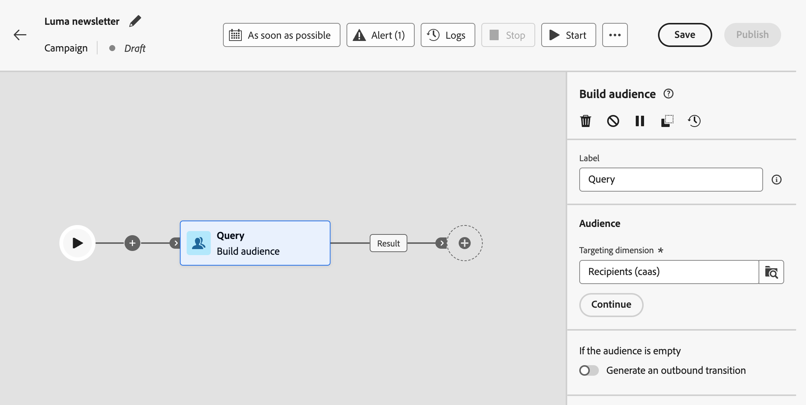
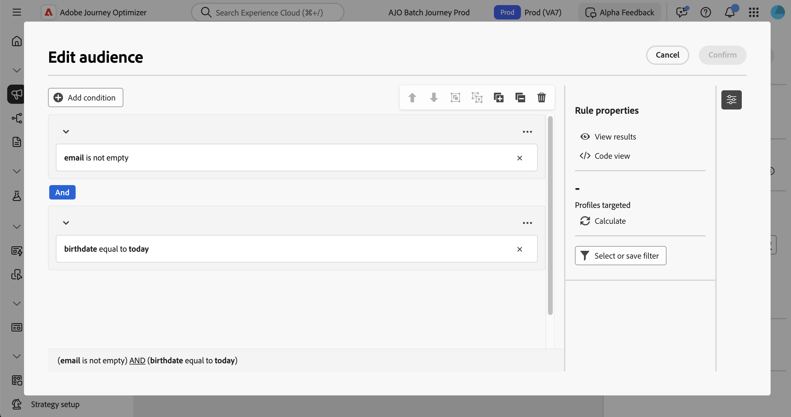

# Arbeta med regelbyggaren {#orchestrated-rule-builder}

+++ Innehållsförteckning

| Välkommen till samordnade kampanjer | Starta din första samordnade kampanj | Fråga databasen | Ochestrerade kampanjaktiviteter |
|---|---|---|---|
| [Kom igång med samordnade kampanjer](gs-orchestrated-campaigns.md)  Skapa och hantera relationsscheman och datauppsättningar:  <ul><li>[Kom igång med scheman och datauppsättningar](gs-schemas.md)</li><li>[Manuellt schema](manual-schema.md)</li><li>[Filöverföringsschema](file-upload-schema.md)</li><li>[Ingest data](ingest-data.md)</li></ul>[Få åtkomst till och hantera samordnade kampanjer](access-manage-orchestrated-campaigns.md)  [Viktiga steg för att skapa en orkestrerad kampanj](gs-campaign-creation.md) | [Skapa och schemalägg kampanjen](create-orchestrated-campaign.md)  [Organisera aktiviteter](orchestrate-activities.md)  [Starta och övervaka kampanjen](start-monitor-campaigns.md)  [Rapportera](reporting-campaigns.md) | <b>[Arbeta med regelbyggaren](orchestrated-rule-builder.md)</b>  [Bygg din första fråga](build-query.md)  [Redigera uttryck](edit-expressions.md)  [Återmarknadsföring](retarget.md) | [Kom igång med aktiviteter](activities/about-activities.md)  Aktiviteter: [And-join](activities/and-join.md) - [Bygg målgrupp](activities/build-audience.md) - [Ändra dimension](activities/change-dimension.md) - [Kanalaktiviteter](activities/channels.md) - [Kombinera](activities/combine.md) - [Deduplicering](activities/deduplication.md) - [Enrichment](activities/enrichment.md) - [Fork](activities/fork.md)  - [Avstämning](activities/reconciliation.md) - [Spara målgrupp](activities/save-audience.md) - [Dela](activities/split.md) - [Vänta](activities/wait.md) |

{style="table-layout:fixed"}

+++

 

>[!BEGINSHADEBOX]

 

Innehållet på den här sidan är inte slutgiltigt och kan komma att ändras.

>[!ENDSHADEBOX]

Samordnade kampanjer har en regelbyggare som förenklar processen att filtrera databasen baserat på olika kriterier. Regelbyggaren hanterar mycket komplexa och långa frågor effektivt och erbjuder större flexibilitet och precision.

Det har också stöd för fördefinierade filter under förhållanden, vilket gör att du enkelt kan förfina frågor samtidigt som du använder avancerade uttryck och operatorer för omfattande målgruppsanpassning och segmenteringsstrategier.

## Åtkomst till regelbyggaren

Regelbyggaren är tillgänglig i alla sammanhang där du behöver definiera regler för att filtrera data.

| Användning | Exempel |
|  ---  |  ---  |
| **Bygg målgrupper**: Ange den målgrupp du vill rikta in dig på i dina samordnade kampanjer med en **[!UICONTROL Build audience]** -aktivitet och skapa enkelt nya målgrupper som är anpassade efter dina behov. [Lär dig skapa målgrupper](../orchestrated/activities/build-audience.md) | {width="200" align="center" zoomable="yes"} |
| **Skapa villkor på kampanjarbetsytan**: Använd regler på kampanjarbetsytan med en **[!UICONTROL Split]**-aktivitet för att anpassa dig efter dina specifika krav. [Lär dig använda en delad aktivitet](../orchestrated/activities/split.md) | {width="200" align="center" zoomable="yes"} |
| **Skapa avancerade filter**: Skapa regler för att filtrera data som visas i listor som kampanjloggar eller måldimensioner. | {width="200" align="center" zoomable="yes"} |

## Gränssnitt för regelbyggaren {#interface}

Regelbyggaren innehåller en central arbetsyta där du skapar frågan och en egenskapsruta som innehåller information om regeln.

* På den **centrala arbetsytan** kan du lägga till och kombinera de olika komponenterna för att skapa regeln. [Lär dig skapa en regel](../orchestrated/build-query.md)

* Panelen **[!UICONTROL Rule properties]** innehåller information om din regel. Det gör att du kan utföra olika åtgärder för att kontrollera regeln och se till att den passar dina behov.

  Den här rutan visas när du skapar en fråga för att skapa en målgrupp. [Lär dig hur du kontrollerar och validerar din fråga](build-query.md#check-and-validate-your-query)
