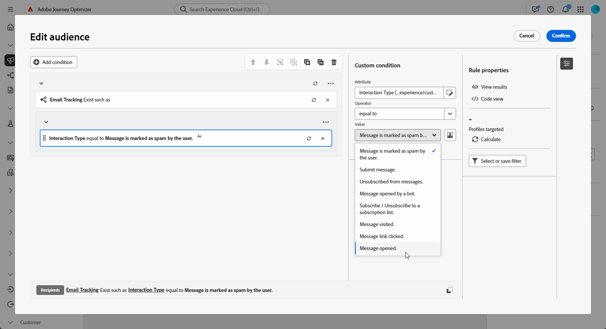

# Skapa återmarknadsföringsfrågor {#retarget}

Med återmarknadsföring kan ni följa upp med mottagare baserat på hur de svarade på en tidigare Orchestrated-kampanj. Du kan till exempel skicka ett andra e-postmeddelande till mottagare som har tagit emot men inte klickat på det första.

**[!UICONTROL Orchestrated Campaign]** har två huvudattribut för detta:

* **[!UICONTROL Message Feedback]**: hämtar leveransrelaterade händelser, t.ex. skickade, öppnade, studsade osv.
* **[!UICONTROL Email Tracking]**: hämtar användaråtgärder, t.ex. klickar och öppnar.

{zoomable="yes"}

## Skapa en feedbackbaserad återmarknadsföringsregel {#feedback-retarget}

Med den feedbackbaserade återmarknadsföringsregeln kan du återrikta mottagare baserat på meddelandeleveranshändelser som hämtats i attributet **[!UICONTROL Message Feedback]**. Dessa händelser innehåller utfall som meddelanden som skickas, öppnas, studsas eller markeras som skräppost.

Med hjälp av dessa data kan du definiera regler för att identifiera mottagare som har tagit emot ett tidigare meddelande som möjliggör uppföljningskommunikation baserat på specifika leveransstatus.

1. Skapa en ny **[!UICONTROL Orchestrated Campaign]**.

1. Lägg till en **[!UICONTROL Build Audience]**-aktivitet och ange måldimensionen till **[!UICONTROL Recipient (caas)]**.

1. Klicka på **[!UICONTROL Rule Builder]** i **[!UICONTROL Add Condition]** och välj **[!UICONTROL Message Feedback]** i **[!UICONTROL Attributes Picker]**. Klicka på **[!UICONTROL Confirm]** om du vill skapa ett **meddelande som Feedback finns, till exempel** villkor.

   {zoomable="yes"}

1. Välj attributet **[!UICONTROL Feedback Status]** för att ange meddelandeleveranshändelser som mål.

   +++ Detaljerad stegvis

   1. Lägg till ett annat villkor som är länkat till attributet **[!UICONTROL Message feedback]**.

   1. Sök efter attributet **[!UICONTROL Feedback Status]** och klicka på **[!UICONTROL Confirm]**.

      {zoomable="yes"}

   1. På menyn **[!UICONTROL Custom condition]** väljer du vilken leveransstatus som ska spåras i listrutan **[!UICONTROL Value]**.

      {zoomable="yes"}

   +++

1. Välj attributet **[!UICONTROL Orchestrated Campaign Name]** om du vill ha en specifik Orchestrated-kampanj som mål.

   +++ Detaljerad stegvis

   1. Lägg till ytterligare ett villkor som är länkat till attributet **[!UICONTROL Message feedback]**, sök efter **[!UICONTROL entity]** och navigera till:

      `_experience > CustomerJourneyManagement > Entities > AJO Orchestrated Campaign entity`.

   1. Välj **[!UICONTROL Orchestrated Campaign Name]**.

      {zoomable="yes"}

   1. Ange kampanjnamnet i fältet **[!UICONTROL Custom condition]** på menyn **[!UICONTROL Value]**.

   +++

1. Välj attributet **[!UICONTROL Orchestrated Campaign Action Name]** om du vill ange ett specifikt meddelande eller en viss aktivitet som mål i en Orchestrated-kampanj.

   +++ Detaljerad stegvis

   1. Lägg till ytterligare ett villkor som är länkat till attributet **[!UICONTROL Message feedback]**, sök efter **[!UICONTROL entity]** och navigera till:

      `_experience > CustomerJourneyManagement > Entities > AJO Orchestrated Campaign entity`.

   1. Välj **[!UICONTROL Orchestrated Campaign Action Name]**.

      {zoomable="yes"}

   1. Ange kampanjåtgärdens namn i fältet **[!UICONTROL Custom condition]** på menyn **[!UICONTROL Value]**.

      Du hittar åtgärdsnamn genom att klicka på  bredvid aktivitetens etikettfält.

   +++

1. Du kan också filtrera efter **[!UICONTROL Campaign ID]** (UUID), som finns i Campaign-egenskaperna.

Du har nu konfigurerat en återmarknadsföringsregel baserad på feedback för att identifiera mottagare baserat på leveransstatus för ett tidigare meddelande som skickat, öppnat, studsat eller markerat som skräppost. Med den här målgruppen definierad kan du antingen lägga till ett uppföljningsmeddelande eller förfina din målgruppsanpassning ytterligare genom att [konfigurera en spårningsbaserad återmarknadsföringsregel](#tracking-based), som använder användarinteraktionsdata.

{zoomable="yes"}

## Skapa en spårningsbaserad regel för återmarknadsföring {#tracking-based}

Spårningsbaserad regel för återmarknadsföring riktar sig till mottagare baserat på deras interaktioner med ett meddelande, med data från attributet **[!UICONTROL Email Tracking]**. Den fångar upp användaråtgärder som e-postöppningar och länkar.

Använd entiteten **[!UICONTROL Email Tracking]** om du vill omdirigera mottagare baserat på meddelandeinteraktioner (t.ex. öppna eller klicka) enligt följande:

1. Skapa en ny **[!UICONTROL Orchestrated Campaign]**.

1. Lägg till en **[!UICONTROL Build Audience]**-aktivitet och ange måldimensionen till **[!UICONTROL Recipient (caas)]** för att fokusera på tidigare mottagare av orkestrerade kampanjer.

1. Klicka på **[!UICONTROL Rule Builder]** i **[!UICONTROL Add Condition]** och välj **[!UICONTROL Email Tracking]** i **[!UICONTROL Attributes Picker]**.

   Klicka på **[!UICONTROL Confirm]** om du vill skapa ett **e-postspårning finns, till exempel** villkor.

   {zoomable="yes"}

1. Om du vill att mottagarna ska interagera med ett meddelande lägger du till ett annat villkor som är länkat till attributet **[!UICONTROL Email tracking]** och söker efter attributet **[!UICONTROL Interaction Type]**.

   {zoomable="yes"}

1. Använd **[!UICONTROL Included in]** som operator i de anpassade villkorsalternativen och välj ett eller flera värden beroende på ditt användningsfall, t.ex. **[!UICONTROL Message Opened]** eller **[!UICONTROL Message Link Clicked]**.

   {zoomable="yes"}

Du har nu konfigurerat en spårningsbaserad återmarknadsföringsregel för målmottagare baserat på deras interaktion med ett tidigare meddelande, som e-postöppning eller länkklick, med data från attributet **[!UICONTROL Email Tracking]**. När den här målgruppen är definierad kan du antingen lägga till en uppföljningsåtgärd eller ytterligare förfina din målgruppsanpassning genom att kombinera den med en [feedbackbaserad återmarknadsföringsregel](#feedback-retarget) för att inkludera meddelanderesultat som skickad, studsad eller markerad som skräppost.

{zoomable="yes"}
