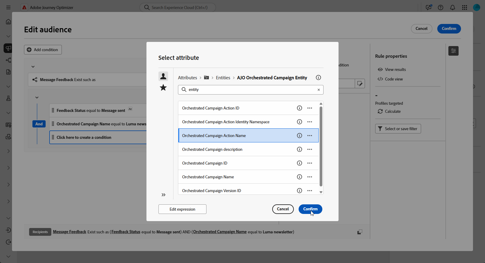

# Skapa återmarknadsföringsfrågor {#retarget}

+++ Innehållsförteckning

| Välkommen till samordnade kampanjer | Starta din första samordnade kampanj | Fråga databasen | Ochestrerade kampanjaktiviteter |
|---|---|---|---|
| [Kom igång med samordnade kampanjer](gs-orchestrated-campaigns.md)  [Konfigurationssteg](configuration-steps.md)  [Få åtkomst till och hantera samordnade kampanjer](access-manage-orchestrated-campaigns.md)  [Viktiga steg för att skapa en strukturerad kampanj](gs-campaign-creation.md) | [Skapa och schemalägg kampanjen](create-orchestrated-campaign.md)  [Organisera aktiviteter](orchestrate-activities.md)  [Starta och övervaka kampanjen](start-monitor-campaigns.md)  [Rapportera](reporting-campaigns.md) | [Arbeta med regelbyggaren](orchestrated-rule-builder.md)  [Bygg din första fråga](build-query.md)  [Redigera uttryck](edit-expressions.md)  <b>[Återmarknadsföring](retarget.md)</b> | [Kom igång med aktiviteter](activities/about-activities.md)  Aktiviteter: [And-join](activities/and-join.md) - [Bygg målgrupp](activities/build-audience.md) - [Ändra dimension](activities/change-dimension.md) - [Kanalaktiviteter](activities/channels.md) - [Kombinera](activities/combine.md) - [Deduplicering](activities/deduplication.md) - [Enrichment](activities/enrichment.md) - [Fork](activities/fork.md)  - [Avstämning](activities/reconciliation.md) - [Spara målgrupp](activities/save-audience.md) - [Dela](activities/split.md) - [Vänta](activities/wait.md) |

{style="table-layout:fixed"}

+++

 

>[!BEGINSHADEBOX]

Dokumentation pågår

>[!ENDSHADEBOX]

Med återmarknadsföring kan ni följa upp med mottagare baserat på hur de svarade på en tidigare iscensatt kampanj. Du kan till exempel skicka ett andra e-postmeddelande till profiler som har tagit emot men inte klickat på den första.

**[!UICONTROL Orchestrated Campaign]** innehåller två huvuddatakällor för detta:

* **[!UICONTROL Message Feedback]**: hämtar leveransrelaterade händelser, t.ex. skickade, öppnade, studsade osv.
* **[!UICONTROL Email Tracking]**: hämtar användaråtgärder, t.ex. klickar och öppnar.

## Skapa en feedbackbaserad återmarknadsföringsregel {#feedback-retarget}

Med feedbackbaserad återmarknadsföringsregel kan du återrikta mottagare baserat på meddelandeleveranshändelser som hämtats i datauppsättningen **Meddelandefeedback**. Dessa händelser innehåller utfall som meddelanden som skickas, öppnas, studsas eller markeras som skräppost.

Med hjälp av dessa data kan du definiera regler för att identifiera mottagare som har tagit emot ett tidigare meddelande som möjliggör uppföljningskommunikation baserat på specifika leveransstatus.

1. Skapa en ny **[!UICONTROL Orchestrated Campaign]**.

1. Lägg till en **[!UICONTROL Build Audience]**-aktivitet och ange måldimensionen till **[!UICONTROL Recipient (caas)]**.

1. Klicka på **[!UICONTROL Rule Builder]** i **[!UICONTROL Add Condition]** och välj **[!UICONTROL Message Feedback]** i **[!UICONTROL Attributes Picker]**. Klicka på **[!UICONTROL Confirm]** om du vill skapa ett **meddelande som Feedback finns, till exempel** villkor.

   

1. Välj attributet **[!UICONTROL Feedback Status]** för att ange meddelandeleveranshändelser som mål.

+++ Detaljerad stegvis

   1. Lägg till ett annat villkor som är länkat till attributet **[!UICONTROL Message feedback]**.

   1. Sök efter attributet **[!UICONTROL Feedback Status]** och klicka på **[!UICONTROL Confirm]**.

      

   1. På menyn **[!UICONTROL Custom condition]** väljer du vilken leveransstatus som ska spåras i listrutan **[!UICONTROL Value]**.

      

+++

1. Välj attribut **[!UICONTROL Orchestrated Campaign Name]** om du vill ha en specifik orkestrerad kampanj som mål.

+++ Detaljerad stegvis

   1. Lägg till ytterligare ett villkor som är länkat till attributet **[!UICONTROL Message feedback]**, sök efter **[!UICONTROL entity]** och navigera till:

      `_experience > CustomerJourneyManagement > Entities > AJO Orchestrated Campaign entity`.

   1. Välj **[!UICONTROL Orchestrated Campaign Name]**.

      

   1. Ange kampanjnamnet i fältet **[!UICONTROL Custom condition]** på menyn **[!UICONTROL Value]**.

+++

1. Välj attribut **[!UICONTROL Orchestrated Campaign Action Name]** om du vill rikta ett visst meddelande eller en viss aktivitet inom en orkestrerad kampanj.

+++ Detaljerad stegvis

   1. Lägg till ytterligare ett villkor som är länkat till attributet **[!UICONTROL Message feedback]**, sök efter **[!UICONTROL entity]** och navigera till:

      `_experience > CustomerJourneyManagement > Entities > AJO Orchestrated Campaign entity`.

   1. Välj **[!UICONTROL Orchestrated Campaign Action Name]**.

      

   1. Ange kampanjåtgärdens namn i fältet **[!UICONTROL Custom condition]** på menyn **[!UICONTROL Value]**.

      Du hittar åtgärdsnamn genom att klicka på  bredvid en aktivitet på arbetsytan.

   ++

1. Du kan även filtrera efter **[!UICONTROL Campaign ID]** (UUID), som finns i Campaign-egenskaperna.

## Skapa en spårningsbaserad återmarknadsföringsregel

Spårningsbaserad återmarknadsföringsregel målar mottagare baserat på deras interaktioner med ett meddelande, med data från datauppsättningen **[!UICONTROL Email Tracking]**. Den fångar upp användaråtgärder som e-postöppningar och länkar.

Använd entiteten **[!UICONTROL Email Tracking]** om du vill omdirigera mottagare baserat på meddelandeinteraktioner (t.ex. öppna eller klicka) enligt följande:

1. Skapa en ny **[!UICONTROL Orchestrated Campaign]**.

1. Lägg till en **[!UICONTROL Build Audience]**-aktivitet och ange måldimensionen till **[!UICONTROL Recipient (caas)]** för att fokusera på tidigare orienterade kampanjmottagare.

1. Klicka på **[!UICONTROL Rule Builder]** i **[!UICONTROL Add Condition]** och välj **[!UICONTROL Email Tracking]** i **[!UICONTROL Attributes Picker]**.

   Klicka på **[!UICONTROL Confirm]** om du vill skapa ett **e-postspårning finns, till exempel** villkor.

   

1. Om du vill att målprofilerna ska interagera med ett meddelande lägger du till ett annat villkor som är länkat till attributet **[!UICONTROL Email tracking]** och söker efter attributet **[!UICONTROL Interaction Type]**.

   

1. Använd **[!UICONTROL Included in]** som operator i de anpassade villkorsalternativen och välj ett eller flera värden beroende på ditt användningsfall, t.ex. **[!UICONTROL Message Opened]** eller **[!UICONTROL Message Link Clicked]**.

   

1. Om du vill associera spårningsdata till en viss kampanj lägger du till ett nytt **[!UICONTROL Message feedback]**-villkor och följer stegen som beskrivs [i det här avsnittet](#feedback-retarget).
