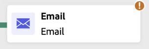

# Starta och övervaka era samordnade kampanjer {#start-monitor}

>[!CONTEXTUALHELP]
>id="ajo_campaign_publication"
>title="Publicera orkestrerad kampanj"
>abstract="Du måste publicera kampanjen för att kunna starta den. Kontrollera att alla fel är rensade före publiceringen."

När ni har skapat er samordnade kampanj och utformat de uppgifter som ska utföras på arbetsytan kan ni publicera den och övervaka hur den körs. Du kan också köra kampanjen i testläge för att kontrollera dess körning och resultatet av de olika aktiviteterna.

## Testa kampanjen innan den publiceras {#test}

Med [!DNL Journey Optimizer] kan du testa Orchestrated-kampanjer innan du publicerar. När en kampanj skapas försätts den i läget **Utkast** som standard. I det här läget kan du köra kampanjen manuellt för att testa flödet.

>[!IMPORTANT]
>
>Alla aktiviteter på arbetsytan körs utom **[!UICONTROL Save audience]** aktiviteter och kanalaktiviteter. Det påverkar inte era data eller er målgrupp.

Om du vill testa en orkestrerad kampanj öppnar du kampanjen och väljer **[!UICONTROL Start]**.

{zoomable="yes"}

Varje aktivitet i kampanjen utförs sekventiellt tills arbetsytans slut nås. Under testet kan du styra kampanjkörningen med åtgärdsfältet på arbetsytan. Därifrån kan man

* **Stoppa** körningen när som helst.
* **Starta** körningen igen.
* **Starta om** körningen om du vill återställa och köra arbetsflödet igen i en enda åtgärd. Detta är särskilt användbart när du snabbt vill testa om kampanjflödet efter att ha gjort ändringar.
* **Återuppta** körningen om den tidigare pausats.

Ikonen **[!UICONTROL Alerts]** / **[!UICONTROL Warning]** i verktygsfältet på arbetsytan meddelar dig om problem, inklusive varningar som kan visas aktivt före körning och fel som inträffar under eller efter körningen.

{zoomable="yes"}

Du kan också snabbt identifiera misslyckade aktiviteter med hjälp av de [visuella statusindikatorerna](#activities) som visas direkt i varje aktivitet. Om du vill ha detaljerad felsökning öppnar du loggarna för [kampanjen](#logs-tasks), som innehåller detaljerad information om felet och dess sammanhang.

Om du har lagt till kanalaktiviteter på arbetsytan kan du förhandsgranska och testa innehållet i dina meddelanden med knappen **[!UICONTROL Simulate Content]**. [Lär dig arbeta med kanalaktiviteter](activities/channels.md)

När kampanjen har validerats kan den publiceras.

## Publicera kampanjen {#publish}

När kampanjen är testad och klar klickar du på **[!UICONTROL Publish]** för att göra den offentlig.

{zoomable="yes"}

>[!NOTE]
>
>Om knappen **[!UICONTROL Publish]** är inaktiverad (nedtonad) öppnar du loggarna från åtgärdsfältet och kontrollerar felmeddelandena. Alla fel måste åtgärdas innan du kan publicera en kampanj.

Det visuella flödet startar om och verkliga profiler börjar flöda genom resan i realtid.

Om publiceringsåtgärden misslyckas (t.ex. på grund av att meddelandeinnehåll saknas) får du ett varningsmeddelande och måste åtgärda problemet innan du försöker igen. När publiceringen är klar börjar kampanjen köras (omedelbart eller enligt schema), går från statusen **Utkast** till **Live** och blir&quot;Skrivskyddad&quot;.

## Återställa en kampanj till utkast {#back-to-draft}

Med funktionen **[!UICONTROL Back to draft]** kan du avpublicera och återställa en orkestrerad kampanj till utkaststatus i särskilda situationer. Detta är utformat som en återställningsmekanism som åtgärdar problem innan meddelanden skickas, samtidigt som integriteten i kampanjens livscykel bibehålls.

Det här alternativet är tillgängligt i två scenarier:

* **Schemalagda kampanjer som väntar på körning**: När en kampanj är schemalagd att köras vid en viss tidpunkt och den tidpunkten inte har uppnåtts kan du använda tillbaka till utkastet för att granska och ändra kampanjen innan den börjar köras. Om kampanjen är återkommande (till exempel en daglig schemalagd kampanj) och minst en körning redan har utförts, är alternativet inte längre tillgängligt. I så fall bör du [duplicera kampanjen](../campaigns/manage-campaigns.md#duplicate-a-campaign) i stället.

* **Live-kampanjer med körningsfel**: När en kampanj har påträffat ett fel under körningen och är pausad och inga kampanjkörningar har slutförts ännu kan du använda utkast för att åtgärda felet och publicera kampanjen igen.

Om du vill växla tillbaka en kampanj till utkaststatus öppnar du den orkestrerade kampanjen och klickar på knappen **[!UICONTROL Back to draft]** i verktygsfältet för kampanjarbetsytan.

Kampanjen är opublicerad och arbetsflödet stoppas. Kampanjen återgår till statusen **Utkast**. Du kan nu åtgärda de identifierade problemen, [testa kampanjen](#test) och [publicera den](#publish) igen när det är klart.

## Bekräfta att meddelandet skickas {#confirm-sending}

Som standard pausas meddelandeleveransen för icke-återkommande orkestrerade kampanjer tills du uttryckligen godkänner sändningen. Bekräfta sändningsbegäran från kanalaktivitetens egenskapspanel när kampanjen har publicerats. Kanalaktiviteten är väntande tills den har bekräftats och inget meddelande skickas.

Innan publiceringen kan du inaktivera sändning av bekräftelse från egenskapsfönstret för kanalaktivitet. Mer information finns i [Bekräfta att meddelandet skickas](activities/channels.md#confirm-message-sending).

## Övervaka kampanjkörning {#monitor}

### Visuell flödesövervakning {#flow}

Under körning (i test- eller live-läge) visar det visuella flödet hur profiler rör sig genom resan i realtid. Antalet profiler som övergår mellan uppgifter visas.

{zoomable="yes"}

Data som transporteras från en aktivitet till en annan genom övergångar lagras i en temporär arbetstabell. Dessa data kan visas för varje övergång. Så här inspekterar du data som passerat mellan aktiviteter:

1. Välj en övergång.
1. Klicka på **[!UICONTROL Preview schema]** i egenskapspanelen för att visa arbetstabellschemat. Välj **[!UICONTROL Preview results]** om du vill visa data som har transporterats.

   {zoomable="yes"}

### Indikatorer för utförande av verksamhet {#activities}

Visuella statusindikatorer hjälper dig att förstå hur varje aktivitet fungerar:

| Visuell indikator | Beskrivning |
|-----|------------|
| {zoomable="yes"}{width="70%"} | Aktiviteten körs för närvarande. |
| {zoomable="yes"}{width="70%"} | Aktiviteten kräver din uppmärksamhet. Detta kan inbegripa att bekräfta leveransen eller vidta nödvändiga åtgärder. |
| {zoomable="yes"}{width="70%"} | Aktiviteten har påträffat ett fel. Du löser problemet genom att öppna loggarna för orkestrerade kampanjer för mer information. |
| {zoomable="yes"}{width="70%"} | Aktiviteten har körts. |

### Loggar och uppgifter {#logs-tasks}

>[!CONTEXTUALHELP]
>id="ajo_campaign_logs"
>title="Loggar och uppgifter"
>abstract="Skärmen **Loggar och uppgifter** innehåller en historik över körningen av den orkestrerade kampanjen, där alla användaråtgärder registreras och fel påträffas."

Övervakning av loggar och uppgifter är ett viktigt steg för att analysera era samordnade kampanjer och se till att de körs som de ska. Loggar och uppgifter är tillgängliga från knappen **[!UICONTROL Logs]** som är tillgänglig i både test- och Live-läge i verktygsfältet på arbetsytan.

{zoomable="yes"}

Skärmen **[!UICONTROL Logs and tasks]** innehåller en fullständig historik över kampanjkörningen, där alla användaråtgärder och påträffade fel registreras.

{zoomable="yes"}

Det finns två typer av information:

* Fliken **[!UICONTROL Log]** innehåller den kronologiska historiken för alla åtgärder och fel.
* Fliken **[!UICONTROL Tasks]** innehåller information om aktiviteternas stegvisa körningssekvens.

På båda flikarna kan du välja vilka kolumner som ska visas och i vilken ordning de ska visas, tillämpa filter och använda sökfältet för att snabbt hitta önskad information.

## Nästa steg {#next}

När ni har startat den Orchestrerade kampanjarbetsytan kan ni använda Journey Optimizer rapporteringsfunktioner för att få insikter som att förstå målgruppernas beteende och mäta resultatet för varje steg i kundresan. [Läs mer om rapportering av samordnade kampanjer](../orchestrated/reporting-campaigns.md)
