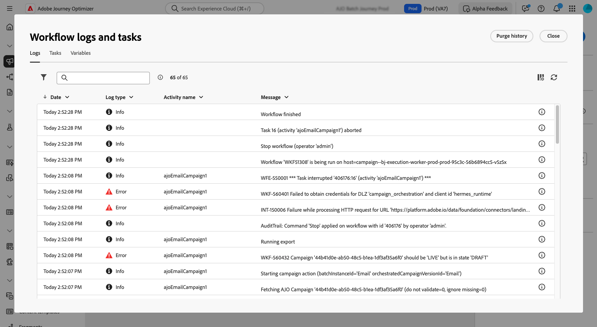

# Starta och övervaka era samordnade kampanjer {#start-monitor}

>[!CONTEXTUALHELP]
>id="ajo_campaign_publication"
>title="Publicera orkestrerad kampanj"
>abstract="Du måste publicera kampanjen för att kunna starta den. Kontrollera att alla varningar är rensade före publiceringen."

+++ Innehållsförteckning

| Välkommen till samordnade kampanjer | Starta din första samordnade kampanj | Fråga databasen | Ochestrerade kampanjaktiviteter |
|---|---|---|---|
| [Kom igång med samordnade kampanjer](gs-orchestrated-campaigns.md)  [Konfigurationssteg](configuration-steps.md) &lt;br/[Få åtkomst till och hantera samordnade kampanjer](access-manage-orchestrated-campaigns.md) | [Viktiga steg för att skapa samordnade kampanjer](gs-campaign-creation.md)  [Skapa och schemalägg kampanjen](create-orchestrated-campaign.md)  [Organisera aktiviteter](orchestrate-activities.md)  [Skicka meddelanden med samordnade kampanjer](send-messages.md)  <b>[Starta och övervaka kampanjen](start-monitor-campaigns.md)</b>  [Rapportera](reporting-campaigns.md) | [Arbeta med regelbyggaren](orchestrated-rule-builder.md)  [Skapa din första fråga](build-query.md)  [Redigera uttryck](edit-expressions.md) | [Kom igång med aktiviteter](activities/about-activities.md)  Aktiviteter: [Och-join](activities/and-join.md) - [Skapa målgrupp](activities/build-audience.md) - [Ändra dimension](activities/change-dimension.md) - [Kombinera](activities/combine.md) - [Ta bort dubbletter](activities/deduplication.md) - [Förbättra](activities/enrichment.md) - [Förena](activities/fork.md) - [Förena&lbrace;1 ](activities/reconciliation.md) - [Dela](activities/split.md) - [Vänta](activities/wait.md) |

{style="table-layout:fixed"}

+++

 

När du har skapat dina arbetsytor och utformat arbetsytan kan du publicera den och övervaka hur den körs.

## Starta en orkestrerad kampanj {#start}

Om du vill starta en strukturerad kampanj går du till fliken **[!UICONTROL Orchestration]** på menyn **[!UICONTROL Campaigns]** och väljer den kampanj som ska startas. Klicka sedan på knappen **[!UICONTROL Play]** i det övre högra hörnet av arbetsytan.

När den orkestrerade kampanjen körs, utförs varje aktivitet på arbetsytan i sekventiell ordning tills slutet på den orkestrerade kampanjen nås.

Du kan spåra förloppet för målprofiler i realtid med ett visuellt flöde. På så sätt kan du snabbt identifiera status för varje aktivitet och antalet profiler som övergår mellan dem.

{zoomable="yes"}

I samordnade kampanjer lagras data som transporteras från en aktivitet till en annan via övergångar i en tillfällig arbetstabell. Dessa data kan visas för varje övergång. Det gör du genom att markera en övergång och öppna dess egenskaper till höger på skärmen.

* Klicka på **[!UICONTROL Preview schema]** för att visa arbetstabellens schema.
* Klicka på **[!UICONTROL Preview results]** om du vill visa de data som har transporterats i den valda övergången.

{zoomable="yes"}

## Övervaka kampanjkörningen

### Körning av övervakningsaktivitet {#activities}

Med visuella indikatorer i det övre högra hörnet av varje aktivitetsruta kan du kontrollera deras körning:

| Visuell indikator | Beskrivning |
|-----|------------|
| {zoomable="yes"}{width="70%"} | Aktiviteten körs för närvarande. |
| {zoomable="yes"}{width="70%"} | Aktiviteten kräver din uppmärksamhet. Detta kan inbegripa att bekräfta leveransen eller vidta nödvändiga åtgärder. |
| {zoomable="yes"}{width="70%"} | Aktiviteten har påträffat ett fel. Du löser problemet genom att öppna de samordnade kampanjloggarna för mer information. |
| {zoomable="yes"}{width="70%"} | Aktiviteten har körts. |

### Övervaka loggar och uppgifter {#logs-tasks}

>[!CONTEXTUALHELP]
>id="ajo_campaign_logs"
>title="Loggar och uppgifter"
>abstract="Skärmen **Loggar och uppgifter** innehåller en historik över den samordnade kampanjkörningen, där alla användaråtgärder registreras och fel påträffas."

Övervakning av loggar och uppgifter är ett viktigt steg för att analysera samordnade kampanjer och se till att de körs som de ska. De är tillgängliga från ikonen **[!UICONTROL Logs]** som är tillgänglig i åtgärdsverktygsfältet och i egenskapsrutan för varje aktivitet.

Menyn **[!UICONTROL Logs and tasks]** innehåller en historik över den orkestrerade kampanjkörningen, där alla användaråtgärder och påträffade fel registreras.

{zoomable="yes"}

Det finns två typer av information:

* Fliken **[!UICONTROL Log]** innehåller körningshistoriken för alla orkestrerade kampanjaktiviteter. Den indexerar de åtgärder som utförts och körningsfel i kronologisk ordning.
* Fliken **[!UICONTROL Tasks]** innehåller information om körningssekvensen för aktiviteterna.

På båda flikarna kan du välja vilka kolumner som ska visas och i vilken ordning de ska visas, tillämpa filter och använda sökfältet för att snabbt hitta önskad information.

## Samordnade kommandon för kampanjkörning {#execution-commands}

Åtgärdsfältet i det övre högra hörnet innehåller kommandon som gör att du kan hantera den samordnade kampanjkörningen. Du kan:

* **[!UICONTROL Start]** / **[!UICONTROL Resume]** körningen av   iscensatt kampanj, som sedan får statusen Pågår. Om den samordnade kampanjen pausades återupptas den, annars startas den och de inledande aktiviteterna aktiveras sedan.

* **[!UICONTROL Pause]** körningen av den orkestrerade kampanjen, som sedan får statusen Pausad. Inga nya aktiviteter kommer att aktiveras förrän de återupptas, men pågående åtgärder avbryts inte.

* **[!UICONTROL Stop]** är en iscensatt kampanj som körs och som sedan får statusen Slutförd. De pågående åtgärderna avbryts om möjligt. Du kan inte återuppta den orkestrerade kampanjen från samma plats som den stoppades.
