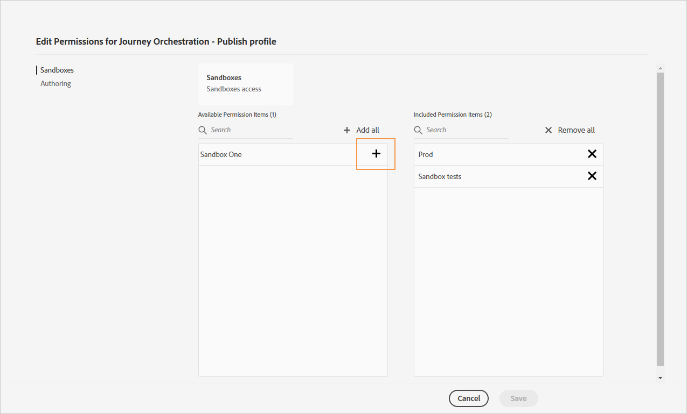

# Hantera behörigheter {#manage-permissions}

## Åtkomst till Journey Optimizer {#access-CJM}

Med [!DNL Journey Optimizer] kan du tilldela en uppsättning behörigheter till dina användare för att definiera vilken del av gränssnittet de ska kunna komma åt.

De kan hanteras av administratörer som har åtkomst till Admin Console. [Läs mer om Adobe Admin Console](https://helpx.adobe.com/enterprise/managing/user-guide.html).

För att få åtkomst till [!DNL Journey Optimizer] måste användaren vara:

* En del av en **[!UICONTROL product profile]** i [!DNL Journey Optimizer] som är kopplad till [!DNL Journey Optimizer]-behörigheter.

* En del av en **[!UICONTROL product profile]** i [!DNL Adobe Experience Platform]. Det finns inget obligatoriskt tillstånd att inneha. Användaren ska ha **[!UICONTROL profile management]**-behörighet för att skapa och redigera plattformssegment från gränssnittet i [!DNL Journey Optimizer]. [Läs mer om åtkomstkontroll](https://experienceleague.adobe.com/docs/experience-platform/access-control/home.html?lang=en#adobe-admin-console).

I Admin Console kan du tilldela användarna en av följande färdiga produktprofiler:

* **[!UICONTROL Limited Access User]**: användare med skrivskyddad åtkomst till resor och rapporter. Den här produktprofilen innehåller följande behörigheter:
   * Läsa resor
   * Läsa rapporter

* **[!UICONTROL Administrators]**: användare med tillgång till administrationsmenyerna med möjlighet att hantera resor, händelser och rapporter. Den här produktprofilen innehåller följande behörigheter:
   * Hantera resor
   * Publicera resor
   * Hantera händelser, datakällor och åtgärder
   * Hantera rapporter

* **[!UICONTROL Standard User]**: användare med grundläggande åtkomst, till exempel resehantering. Den här produktprofilen innehåller följande behörigheter:
   * Hantera resor
   * Publicera resor
   * Hantera rapporter
   * Läs händelser, datakällor och åtgärder

Du kan också skapa egna produktprofiler om de färdiga profilerna inte räcker för att hantera användarna.
Användare måste alltid vara länkade till en produktprofil för att du ska kunna tilldela dem specifika inbyggda behörigheter såsom:

* **[!UICONTROL Read journeys]**
* **[!UICONTROL Read reports]**
* **[!UICONTROL Manage events, data sources and actions]**
* **[!UICONTROL Read events, data sources and actions]**
* **[!UICONTROL Manage journeys]**
* **[!UICONTROL Publish journeys]**
* **[!UICONTROL Manage reports]**

>[!NOTE]
>
> Behörighetshanteringen omfattar inte meddelanden: alla användare kan skapa och ändra meddelanden.

### Skapa en produktprofil {#create-product-profile}

Med [!DNL Journey Optimizer] kan du skapa anpassade produktprofiler och tilldela en uppsättning behörigheter och sandlådor till dina användare. Med produktprofiler kan du auktorisera eller neka åtkomst till vissa funktioner eller objekt i gränssnittet.

Se [dokumentationen om Adobe Experience Platform](https://experienceleague.adobe.com/docs/experience-platform/sandbox/ui/user-guide.html) för mer information om hur du skapar och hanterar sandlådor.

Så här skapar du en produktprofil och tilldelar en uppsättning behörigheter och sandlådor:

1. Välj **[!UICONTROL Journey Orchestration]** i Admin Console. Klicka på **[!UICONTROL New Profile]** på fliken **[!UICONTROL Product profile]**.

   

1. Lägg till ett **[!UICONTROL Profile Name]** och en **[!UICONTROL Description]** för din nya produktprofil. Avmarkera **[!UICONTROL Same as Profile Name]** och ange ett **[!UICONTROL Display name]** om du vill att din profils **[!UICONTROL Display name]** ska vara annorlunda.

1. I kategorin **[!UICONTROL User Notifications]** väljer du om användare ska meddelas via e-post när de läggs till i eller tas bort från den här produktprofilen.

1. Klicka på **[!UICONTROL Done]** när du är klar. Den nya produktprofilen har skapats.

   

1. Välj den nya produktprofilen för att börja hantera behörigheter. Lägg till användare i produktprofilen på fliken **[!UICONTROL Users]**. [Lär dig hur du tilldelar produktprofiler](permissions.md#assigning-product-profile).

1. Utför samma steg som beskrivs ovan för att lägga till **[!UICONTROL Admin]** i din produktprofil.

1. På fliken **[!UICONTROL Permissions]** väljer du en av de två kategorierna **[!UICONTROL Sandbox]** eller **[!UICONTROL Authoring]** för att öppna sidan **[!UICONTROL Edit Permissions]** och lägga till eller ta bort behörigheter för produktprofilen.

   

1. I behörighetskategorin **[!UICONTROL Sandboxes]** kan du välja vilka sandlådor som ska tilldelas produktprofilen. Klicka på plusikonen (+) i **[!UICONTROL Available Permissions Items]** för att tilldela sandlådor till profilen. [Läs mer om sandlådor](https://experienceleague.adobe.com/docs/experience-platform/sandbox/home.html).

   

1. Klicka vid behov på X-ikonen under **[!UICONTROL Included Permission Items]** bredvid respektive behörighet till din produktprofil.

   

1. Gå till behörighetskategorin **[!UICONTROL Authoring]** och utför samma steg som ovan för att lägga till behörigheter i din produktprofil.

   

1. Klicka på **[!UICONTROL Save]** när du är klar.

Din produktprofil har nu skapats och konfigurerats. Användare som är länkade till den här profilen kan nu ansluta till [!DNL Journey Optimizer].

### Tilldela en produktprofil {#assigning-product-profile}

Produktprofiler tilldelas till en uppsättning användare som delar samma behörigheter inom organisationen.
I det här avsnittet finns en lista med alla färdiga produkt profiler med respektive tilldelade behörigheter.

Så här tilldelar du en produktprofil för en användare för att få åtkomst till resor:

1. Välj **[!UICONTROL Journey Orchestration]** i Admin Console.

   

1. Välj den produktprofil som den nya användaren ska länkas till.

   

1. Klicka på **[!UICONTROL Add user]**.

   Du kan också lägga till den nya användaren i en användargrupp för att finjustera den delade uppsättningen behörigheter. [Läs mer om användargrupper](https://helpx.adobe.com/se/enterprise/using/user-groups.html).

   

1. Ange den nya användarens e-postadress och klicka sedan på **[!UICONTROL Save]**.

   

Användaren får sedan ett e-postmeddelande som omdirigerar denne till din instans i .

## Använda sandlådor {#sandboxes}

Med [!DNL Journey Optimizer] kan du partitionera instansen i separerade virtuella miljöer som kallas för sandlådor.
Sandlådor tilldelas via produktprofiler i Admin Console. [Lär dig hur du tilldelar sandlådor](permissions.md#create-product-profile).

[!DNL Journey Optimizer] speglar Adobe Experience Platform-sandlådor som har skapats för en viss organisation.
Sandlådorna i Adobe Experience Platform kan skapas eller återställas från din instans i Adobe Experience Platform. [Läs mer i användarhandboken](https://experienceleague.adobe.com/docs/experience-platform/sandbox/ui/user-guide.html) för Sandbox.

Du hittar kontrollen för att välja sandlåda längst upp till vänster på skärmen. Klicka på den för närvarande aktiva sandlådan i väljaren för att växla från en sandlåda till en annan och välj sedan en annan sandlåda på rullgardinsmenyn.

## Åtkomst till innehåll {#content-access}

Om du vill konfigurera innehållets tillgänglighet måste du tilldela en delad mapp till var och en av sandlådorna. Du kan skapa och konfigurera din delade mapp på fliken **[!UICONTROL Storage]** som visas i [!DNL Admin Console] för administratörer. Om du har åtkomst till [!DNL Admin Console] som systemadministratör kan du skapa delade mappar och lägga till delegater med olika åtkomstnivå till dina delade mappar.

Observera att om ditt innehåll ska kunna synkroniseras med rätt sandlåda måste du följa samma syntax som sandlådan, t.ex. om din sandlåda kallas för utveckling ska din delade mapp ha samma namn.

[Lär dig hur du hanterar delade mappar](https://helpx.adobe.com/enterprise/admin-guide.html/enterprise/using/manage-adobe-storage.ug.html).

## Assets Essentials permissions {#assets-permissions}

Adobe Experience Manager Assets Essentials erbjuder en enda central lagringsplats med resurser som du kan använda för att fylla i dina meddelanden.
Varje resurs sparas i mappar eller undermappar. Du kan välja att dela dina mappar och vilken åtkomstnivå som ska tilldelas.

1. Gå igenom mapparna på fliken **[!UICONTROL Assets]** för att hitta den du behöver dela.

1. Markera mappen eller resursen och klicka på **[!UICONTROL Share]**.

   

1. Ange e-postadressen till den person som du vill dela åtkomst till din mapp med.

1. Välj mellan olika åtkomstnivåer:

   * **[!UICONTROL Can view]**
   * **[!UICONTROL Can edit]**
   * **[!UICONTROL Has ownership (can share, edit, and delete)]**

   

1. Lägg till ett meddelande till din inbjudan om det behövs.

1. Klicka på **[!UICONTROL Invite]**.

   
