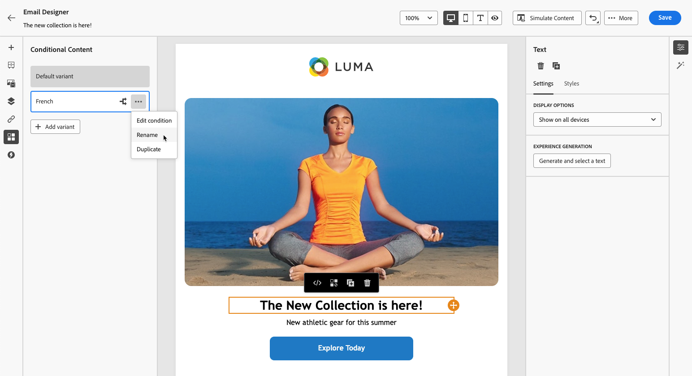

# Skapa dynamiskt innehåll {#dynamic-content}

Med Adobe Journey Optimizer kan du använda villkorliga regler som skapats i biblioteket för att lägga till dynamiskt innehåll i dina meddelanden.

Dynamiskt innehåll kan skapas i alla fält där du kan lägga till personalisering med Expression Editor. Detta inkluderar ämnesrad, länkar, push-meddelanden och textrepresentationer. [Läs mer om personaliseringssammanhang](personalization-contexts.md)

Dessutom kan du använda villkorliga regler i e-postdesignern för att skapa flera varianter av en innehållskomponent.

## Lägg in dynamiskt innehåll i uttryck {#perso-expressions}

Stegen för att lägga till dynamiskt innehåll i uttryck är följande:

1. Navigera till fältet där du vill lägga till dynamiskt innehåll och öppna sedan uttrycksredigeraren.

1. Välj **[!UICONTROL Conditions]** för att visa listan med tillgängliga villkorliga regler. Klicka på plusknappen bredvid en regel för att lägga till den i det aktuella uttrycket.

   Du kan också skapa en ny regel genom att välja **[!UICONTROL Create new]**. [Lär dig hur du skapar villkor](create-conditions.md)

   

1. Lägg till mellan `{%if}` och `{%/if}` taggar innehållet som du vill visa om den villkorliga regeln uppfylls. Du kan lägga till så många regler som behövs för att skapa flera varianter av ett uttryck.

   I exemplet nedan har två varianter skapats för ett SMS-innehåll, beroende på vilket språk mottagaren föredrar.

   

1. När innehållet är klart kan du förhandsgranska de olika varianterna med **[!UICONTROL Simulate content]** -knappen. [Lär dig hur du testar och förhandsvisar meddelanden](../content-management/preview-test.md)

   

## Lägg in dynamiskt innehåll i e-postmeddelanden {#emails}

>[!CONTEXTUALHELP]
>id="ac_conditional_content"
>title="Villkorligt innehåll"
>abstract="Använd villkorsregler för att skapa flera varianter av en innehållskomponent. Om inget av villkoren uppfylls när meddelandet skickas visas innehållet från standardvarianten."

>[!CONTEXTUALHELP]
>id="ac_conditional_content_select"
>title="Villkorligt innehåll"
>abstract="Använd en villkorsstyrd regel som sparats i biblioteket eller skapa en ny."

Stegen för att skapa varianter av en innehållskomponent i e-postdesignern är följande:

1. I [E-postdesigner](../email/content-from-scratch.md), markera en innehållskomponent och klicka sedan på **[!UICONTROL Enable conditional content]**.

   

1. The **[!UICONTROL Conditional Content]** visas till vänster. I den här rutan kan du skapa flera varianter av den markerade innehållskomponenten med villkor.

   Konfigurera din första variant genom att välja **[!UICONTROL Select condition]** -knappen.

   

1. Villkorsbiblioteket visas. Markera den villkorliga regeln som ska kopplas till varianten och klicka sedan på **[!UICONTROL Select]**. I det här exemplet vill vi anpassa komponenttexten beroende på vilket språk mottagaren föredrar.

   

   Du kan också skapa en ny regel genom att klicka på **[!UICONTROL Create new]**. [Lär dig hur du skapar villkor](create-conditions.md)

1. Den villkorliga regeln är kopplad till varianten. Byt namn på varianten genom att välja **[!UICONTROL Rename]** från ikonen Fler åtgärder.

   

1. Konfigurera hur komponenten ska visas om regeln uppfylls när meddelandet skickas. I det här exemplet vill vi visa texten på franska om det är mottagarens favoritspråk.

   

1. Lägg till så många varianter som behövs för innehållskomponenten. Du kan när som helst växla mellan de olika varianterna för att kontrollera hur innehållskomponenten visas beroende på villkorsreglerna.

   >[!NOTE]
   >Om inga regler som definieras i varianterna uppfylls när meddelandet skickas, kommer innehållskomponenten att visa innehållet som definierats i **[!UICONTROL Default variant]**.
   >
   >Villkorligt innehåll utvärderas mot kopplade regler i den ordning som varianterna visas. Standardvarianten visas alltid om inga andra villkor uppfylls.

1. Om du vill ta bort en variant klickar du på ikonen Fler åtgärder bredvid önskad variant och väljer **[!UICONTROL Delete]**.

   
