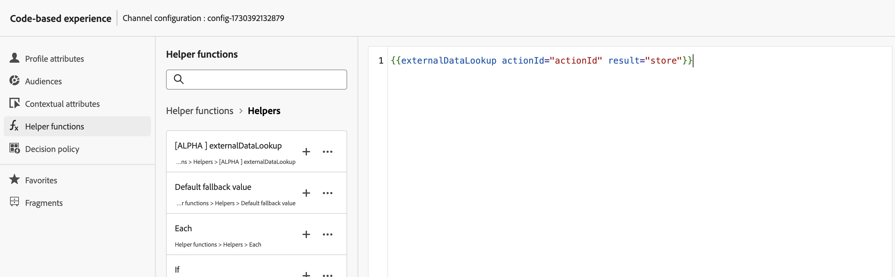

# Hjälp för sökning efter externa data

Hjälpprogrammet `externalDataLookup` i anpassningsredigeraren [!DNL Journey Optimizer] kan användas för att dynamiskt hämta data från en extern slutpunkt för användning när innehåll genereras för inkommande kanaler som t.ex. kodbaserade körnings-, webb- och appmeddelandekanaler.

>[!AVAILABILITY]
>
>Den här funktionen är endast tillgänglig för en uppsättning organisationer (begränsad tillgänglighet).

Om du vill använda hjälpen måste du först definiera en åtgärd på menyn **[!UICONTROL Administration]** > **[!UICONTROL Configurations]**. En åtgärd är där du konfigurerar information om en extern slutpunkt, t.ex. URL, GET vs. POST-metod, rubrikparametrar, frågeparametrar, POST body-JSON-schema och JSON-svarsschema.

När åtgärden har definierats kan den användas både och:

* Under resorna, i en anpassad åtgärd för att hämta innehåll,
* På resor och inkommande kampanjer, i en externalDataLookup-hjälp för att hämta data i en inkommande åtgärd.

## Gardrutor och begränsningar

Se även Anpassade åtgärder i [!DNL Journey Optimizer] Inkommande kanalkampanjer och Journeys#GuardrailandGuidelines.

* **Standardtimeout** - Som standard använder [!DNL Journey Optimizer] en timeout på 300 ms när en extern slutpunkt anropas. Kontakta din Adobe-representant om du vill öka tidsgränsen för en slutpunkt.
* **Bläddra bland svarsscheman och uttrycksvalidering** - I anpassningsredigeraren kan du inte bläddra i schemat för slutpunktssvaret när uttryck infogas. [!DNL Journey Optimizer] validerar inte referenser till JSON-attribut från svaret som används i uttryck.
* **Datatyper som stöds för parametrar** - De datatyper som stöds för variabelparametrar för nyttolast som ska ersättas med hjälp av externalDataLookup är `String`, `Integer`, `Decimal`, `Boolean`, `listString`, `listInt`, `listInteger`, `listDecimal`.
* **Uppdatera automatiskt för uppdaterade åtgärder** - Ändringar i en åtgärdskonfiguration återspeglas inte i motsvarande externalDataLookup-anrop i livekampanjer och resor. För att en ändring ska återspeglas måste du kopiera eller ändra alla live-kampanjer eller resor som använder åtgärden i en externalDataLookup-hjälpreda.
* **Variabelersättning** - För närvarande stöds inte användning av variabler i hjälpparametrarna för externalDataLookup.
* **Dynamisk sökväg** - För tillfället stöds inte dynamisk URL-sökväg.
* **Multi-pass rendering** - Multi-pass rendering stöds.
* **Autentisering** - För tillfället stöds inte autentiseringsalternativen i åtgärdskonfigurationen av hjälpen externalDataLookup. Under tiden kan du ange dem som rubrikfält i åtgärdskonfigurationen för API-nyckelbaserad autentisering eller andra klartextautentiseringsnycklar.

## Konfigurera en åtgärd och använda hjälpen

Så här definierar du en åtgärd och använder hjälpen för personalisering:

1. Skapa en åtgärd för att konfigurera slutpunkten för sökningen. Detta behöver bara göras en gång för varje slutpunkt och bör göras av en teknisk användare. [Lär dig hur du konfigurerar en anpassad åtgärd](../action/about-custom-action-configuration.md)

   Observera åtgärds-ID:t och kopiera det.

   

1. Skapa en inkommande kampanj eller reseåtgärd. I det här exemplet visar vi hur du använder hjälpen externalDataLookup i en kodbaserad Experience JSON-åtgärd, men den kan användas i ett personaliseringsfält i alla inkommande kanaler.

1. Redigera innehållet i åtgärden, gå till Hjälpfunktioner i personaliseringsredigeraren och navigera till **[!UICONTROL Helper functions]** > **[!UICONTROL Helpers]**.

1. Klicka på knappen `+` om du vill infoga hjälp för externalDataLookup. Hjälputtrycket infogas i redigeraren, med platshållarvärden för `actionId` och `result`.

   

   Ersätt platshållarvärdena enligt följande:

   * `actionId`: Klistra in ett åtgärds-ID som kopierades tidigare.
   * `result`: Ange det namn du vill använda. Du kommer att använda den här resultatvariabeln för att komma åt det hämtade innehållet.

1. Lägg till variabelparametervärden som ska skickas som en del av slutpunktsanropet. Här kan du till exempel skicka en språkparameter och en max items-parameter.

   

1. Använd variabeln result för att få åtkomst till hämtade data och infoga dem i innehållet för den inkommande åtgärden. Här kan du till exempel returnera en JSON-array med objekt som hämtats från slutpunkten.

   

## Så fungerar det

### Körning vid körning

När en inkommande åtgärd innehåller en hjälp för externalDataLookup anropas slutpunkten dynamiskt när personaliseringsbegäran [!DNL Journey Optimizer] tas emot och bearbetas av AEP Edge Network.

Det innebär att den externa slutpunkten måste kunna hantera minst lika mycket samtidig belastning och genomströmning som klienten skickar för den angivna ytan till AEP Edge Network.

### Syntax

`{{externalDataLookup actionId="d130c8e2-9a2d-45d5-bcb6-bc39865b4a56" result="result" optional-parameters...}}`

### Parametrar skickas

När den externa slutpunkten anropas skickas alla konstanta huvudvärden, frågeparametrar och det nyttolastvärde som definierats i åtgärden med de värden som anges i åtgärdskonfigurationen.

För variabelrubrikvärden, fråge-/sökvägsparametrar eller begär nyttolastvärden kan du skicka värden dynamiskt med parametrar till hjälp för externalDataLookup.

Parameternamn:

* Huvudparametrar: `header.<parameter-name>`
* Frågeparametrar: `query.<parameter-name>`
* Nyttolastparametrar: `payload.<parameter-name>`
* Sökvägsparametrar: `dynamic_path.<parameter-name>`

Exempel:

```
{{externalDataLookup actionId="..." result="result" header.myHeaderParameter="value1" query.myQueryParameter="value2" payload.myPayloadParameter="value3"}}`
```

Parametervärden kan vara fasta värden eller så kan de anpassas genom att referera till profilfält eller andra sammanhangsberoende attribut, t.ex.:

```
{{externalDataLookup actionId="..." result="result" query.myQueryParameter=profile.myProfileValue}}
```

Nyttolastparametrar kan anges med punktnotation för att referera till kapslade JSON-attribut, t.ex.:

```
{{externalDataLookup actionId="..." result="result" payload.context.channel="web"}}
```

### Åtkomst till resultatet

Om du vill få åtkomst till data som hämtats från ett externt sökanrop för slutpunkter, kan du referera till fält som definierats i svarsnyttolasten i åtgärdsdefinitionen med hjälp av personaliseringsuttryck och hjälpfunktioner.

Om nyttolasten för svaret i åtgärden till exempel ser ut så här:

```
{
    "videos": [
        {
            "id": "integer",
            "title": "string",
            "description": "string",
            "thumbnail_url": "string",
            "video_page_url": "string",
            "url": "string",
            "video_type": "string",
            "start_timestamp": "dateOnly",
            "created_on": "dateOnly",
            ...
        }
    ]
}
```

Sedan kan du till exempel hämta och komma åt beskrivningen av den första videon i en kodbaserad Experience HTML-åtgärd som den här:

```
{{externalDataLookup actionId="d130c8e2-9a2d-45d5-bcb6-bc39865b4a56" result="result"}}
 
First video description: <b>result.videos[0].description</b>
```

Du kan till exempel hämta och repetera objekt för att returnera en objektarray i en kodbaserad Experience JSON-åtgärd som den här:

```
{{externalDataLookup actionId="d130c8e2-9a2d-45d5-bcb6-bc39865b4a56" result="result"}}
 
[
{{#each result.videos as |item|}}
    {                                                  
        "title": "{{item.title}}",
        "url": "{{item.video_page_url}}",
        "thumbnail_url": "{{item.thumbnail_url}}",
        "start_timestamp": "{{item.start_timestamp}}"
    },
{{/each}}
]
```

## Felsökning

### Timeout och felhantering

[!DNL Journey Optimizer] använder en strikt tidsgräns när den externa slutpunkten anropas för att behålla prestandaegenskaper med låg fördröjning och hög genomströmning för Adobe Experience Platform Edge Network.

Om slutpunkten timeout eller om det finns något annat slags fel som når slutpunkten, kommer variabeln result att vara tom. Alla referenser till attribut i resultatvariabeln i det här fallet kommer också att vara tomma. Om du bara visar attributet i innehållet visas det som tomt. Om du försöker göra en slinga genom ett arrayattribut i resultatet returneras inga objekt.

Om du vill hantera timeout eller fel bättre genom att visa reservinnehåll kan du kontrollera om resultatet av sökningen är tomt och visa reservinnehåll i så fall.

Du kan till exempel visa ett reservvärde för ett enda attribut som detta:

```
First video description: 
```

eller så kan du villkorligt återge ett helt innehållsblock på följande sätt:

```
{{externalDataLookup actionId="d130c8e2-9a2d-45d5-bcb6-bc39865b4a56" result="result"}}
 

   ... do something with result ...

    ... return fallback content ...

```

### Felsökning

I Edge Delivery-vyn i Adobe Experience Platform Assurance finns information om timeout och fel för externa datasökning som kan vara till hjälp vid felsökning. Om du inte ser förväntade resultat för en extern DataLookup-hjälp i en inkommande åtgärd kan du starta en Assurance-session, initiera ett [!DNL Journey Optimizer]-anrop från en webb- eller mobilimplementering och använda Edge Delivery-vyn för att kontrollera timeout- eller felinformation.

Exempel:

I Edge Delivery Section of ensure trace som en del av körningsinformationen har ett nytt customActions-block lagts till med begäran- och svarsinformation som liknar den nedan. Felavsnittet bör vara till hjälp vid felsökning om det uppstod några problem när en anpassad åtgärd utfördes


## Vanliga frågor {#faq-external-data}

Nedan finns vanliga frågor och svar om hjälpen för sökning av externa data.

Behöver du mer information? Använd alternativen för feedback längst ned på den här sidan för att ställa din fråga eller kontakta [Adobe Journey Optimizer Community](https://experienceleaguecommunities.adobe.com/t5/adobe-journey-optimizer/ct-p/journey-optimizer?profile.language=sv){target="_blank"}.

+++ Hur skickar man ett sammanhangsberoende attribut från begäran som parameter till en extern datasökning?

Använd Sammanhangsbaserade attribut > Datastream > Event-menyn för att bläddra i det Experience Event-schema som du använder och infoga det relevanta attributet som ett parametervärde som det här:

```
{{externalDataLookup actionId="..." result="result" query.myQueryParameter=context.datastream.event.<schemaId>.my.xdm.attribute}}
```

+++

+++ Gör [!DNL Journey Optimizer] någon cachelagring av externa slutpunktssvar?

Inte just nu. Den här funktionen kommer att stödjas i framtiden.

+++
