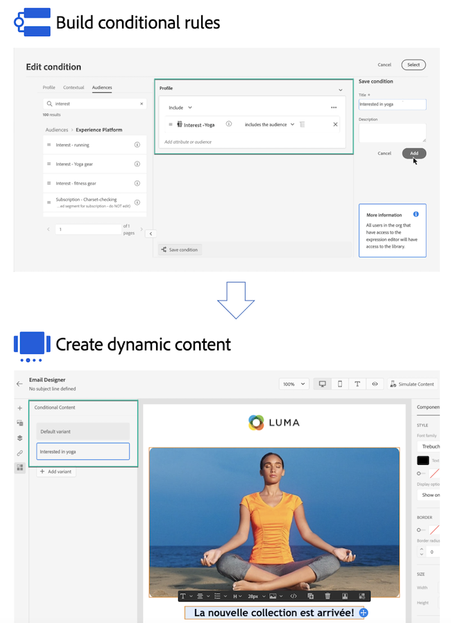

# Kom igång med dynamiskt innehåll {#start-dynamic-content}

>[!CONTEXTUALHELP]
>id="ajo_conditions_list"
>title="Villkor"
>abstract="Med villkorliga regler kan du visa flera innehållsvarianter i dina meddelanden baserat på profilattribut, sammanhangsberoende händelser eller målgrupper."

Med dynamiskt innehåll kan du anpassa innehållet i dina meddelanden baserat på **villkorsregler** som kan bestå av profilattribut, sammanhangsbaserade händelser eller målgrupper. Villkorliga regler skapas med en visuell regelbyggare i personaliseringsredigeraren, där du kan lagra dem för ytterligare återanvändning under alla resor och kampanjer.

Villkorliga regler kan utnyttjas i e-post-Designer och personaliseringsredigeraren för att **skapa dynamiskt innehåll** som anpassar sig till profilerna som är angivna i dina meddelanden.

* [Lär dig hur du arbetar med villkorliga regler](create-conditions.md)
* [Lär dig hur du skapar dynamiskt innehåll](dynamic-content.md)

## Instruktionsvideo {#video}

Lär dig hur du skapar dynamiskt innehåll med villkorsregelbyggaren.

>[!VIDEO](https://video.tv.adobe.com/v/3409815?quality=12)
