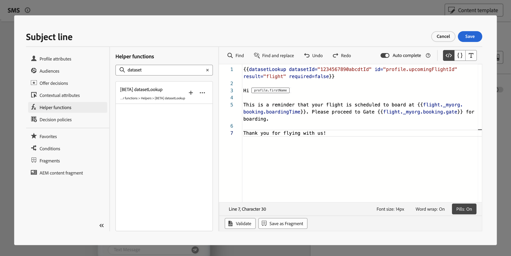

# Använd Adobe Experience Platform-data för personalisering{#aep-data}

>[!AVAILABILITY]
>
>Den här funktionen är för närvarande tillgänglig för alla kunder som en betaversion.
>
>För att kunna använda den här funktionen måste du först godkänna betavillkor för din organisation som visas när du lägger till de nya hjälpfunktionerna&quot;datasetLookup&quot; i personaliseringsredigeraren.

Med Journey Optimizer kan du utnyttja data från Adobe Experience Platform i personaliseringsredigeraren för att [anpassa ditt innehåll](../personalization/personalize.md). För att göra detta måste datauppsättningar som behövs för sökpersonalisering först aktiveras via ett API-anrop enligt beskrivningen nedan. När du är klar kan du använda deras data för att anpassa ditt innehåll till [!DNL Journey Optimizer].

## Beta begränsningar och riktlinjer {#guidelines}

Läs följande begränsningar och riktlinjer innan du börjar:

### Aktivera datauppsättningar {#enablement}

* **Datauppsättningsstorleken** är begränsad till 5 GB för produktionsdatamängder och 1 GB för dev sandbox-datamängder
* **Högst 50 datauppsättningar kan aktiveras** för sökning per organisation när som helst.
* **Antalet poster** är begränsat till 5 miljoner i produktionsdatamängder och 1 MB i dev sandbox-datamängder.
* **Dataanvändningsetiketter och -tvång** används inte för närvarande för datauppsättningar som har aktiverats för sökning.
* **Datauppsättningar som är aktiverade för sökning och används för personalisering är inte skyddade från borttagning**. Det är upp till dig att hålla reda på vilka datauppsättningar som används för personalisering för att säkerställa att de inte tas bort eller tas bort.

### Personalization använder [!DNL Adobe Experience Platform]-data {#perso}

* **Kanaler som stöds**: För närvarande är den här funktionen bara tillgänglig för e-post, SMS och direktreklam.
* **Dataanvändningsetiketter och -tvång** används inte för närvarande för datauppsättningar som har aktiverats för sökning.
* **Fragment**: Det går inte att placera datauppslagspersonalisering inom uttryck eller visuella fragment just nu.

## Aktivera en datauppsättning för datasökning {#enable}

För att kunna utnyttja data från datauppsättningen för personalisering måste du använda ett API-anrop för att hämta dess status och aktivera sökningstjänsten.

### Förhandskrav {#prerequisites-enable}

* Följ anvisningarna i [den här dokumentationen](https://developer.adobe.com/journey-optimizer-apis/references/authentication/) för att konfigurera miljön för att skicka API-kommandon.
* Utvecklarprojektet måste ha Adobe Journey Optimizer- och Adobe Experience Platform-API:erna tillagda i projektet.

  

* Du måste ha behörighet att hantera datauppsättningar som en del av din roll.
* Schemat som datauppsättningen baseras på måste innehålla en **primär identitet** som kan fungera som söknyckeln.

### API-anropsstruktur {#call}

```
curl -s -XPATCH "https://platform.adobe.io/data/core/entity/lookup/dataSets/${DATASET_ID}/${ACTION}" \ -H "Authorization: Bearer ${ACCESS_TOKEN}" \ -H "x-api-key: ${API_KEY}" \ -H "x-gw-ims-org-id: ${IMS_ORG}" \ -H "x-sandbox-name: ${SANDBOX_NAME}"
```

Var:

* **URL** är `https://platform.adobe.io/data/core/entity/lookup/dataSets/${DATASET_ID}/${ACTION}`
* **Datauppsättnings-ID** är den datauppsättning som du vill aktivera.
* **Åtgärd** har aktiverats eller inaktiverats.
* **Åtkomsttoken** kan hämtas från utvecklarkonsolen.
* **API-nyckeln** kan hämtas från utvecklarkonsolen.
* **IMS-organisation** är din Adobe-organisation.
* **Sandlådenamn** är namnet på sandlådan som datauppsättningen finns i (d.v.s. prod, dev.s.).

>[!NOTE]
>
>Om du får ett felmeddelande nedan när du försöker aktivera datauppsättningar kan du försöka ta bort Adobe Journey Optimizer API:er från ditt utvecklarkonsolprojekt och sedan lägga till dem igen.
>
>```
>
>"error_code": "403003", 
>"message": "Api Key is invalid"
>
>```

## Utnyttja en datauppsättning för personalisering {#leverage}

När en datauppsättning har aktiverats för sökpersonalisering med ett API-anrop kan du använda dess data för att anpassa ditt innehåll till [!DNL Journey Optimizer].

1. Öppna personaliseringsredigeraren, som är tillgänglig i alla sammanhang där du kan definiera personalisering, till exempel meddelanden. [Lär dig arbeta med personaliseringsredigeraren](../personalization/personalization-build-expressions.md)

1. Navigera till hjälpfunktionslistan och lägg till hjälpfunktionen **datasetLookup** i kodfönstret.

   

1. Den här funktionen har en fördefinierad syntax som gör att du kan anropa fält från Adobe Experience Platform datamängder. Syntaxen är följande:

   ```
   {{datasetLookup datasetId="datasetId" id="key" result="store" required=false}}
   ```

   * **datasetId** är ID:t för den datauppsättning som du arbetar med.
   * **id** är ID:t för källkolumnen som ska kopplas till den primära identiteten för sökdatauppsättningen.

     >[!NOTE]
     >
     >Det värde som anges för det här fältet kan vara antingen ett fält-ID (*profile.packages.packageSKU*), ett fält som skickas i en resthändelse (*context.travel.events.event_ID.productSKU*) eller ett statiskt värde (*sku07653*). I vilket fall som helst använder systemet värdet och sökningen i datauppsättningen för att kontrollera om den matchar en nyckel.
     >
     >Om du använder ett strängvärde för tangenten ska texten stå inom citattecken. Exempel: `{{datasetLookup datasetId="datasetId" id="SKU1234" result="store" required=false}}`. Om du använder ett attributvärde som en dynamisk nyckel tar du bort citattecknen. Exempel: `{{datasetLookup datasetId="datasetId" id=category.product.SKU result="SKU" required=false}}`

   * **result** är ett godtyckligt namn som du måste ange för att kunna referera till alla fältvärden som du kommer att hämta från datauppsättningen. Det här värdet används i koden för att anropa varje fält.

   * **required=false**: Om det krävs anges till TRUE kommer meddelandet endast att levereras om en matchande nyckel hittas. Om värdet är false krävs ingen matchande nyckel och meddelandet kan fortfarande levereras. Observera att om värdet är false bör du ta hänsyn till reservvärden eller standardvärden i meddelandeinnehållet.

   +++Var hämtar du ett datauppsättnings-ID?

   Datauppsättnings-ID kan hämtas i Adobe Experience Platform användargränssnitt. Lär dig hur du arbetar med datauppsättningar i [Adobe Experience Platform-dokumentationen](https://experienceleague.adobe.com/en/docs/experience-platform/catalog/datasets/user-guide#view-datasets){target="_blank"}.

   

   +++

1. Anpassa syntaxen efter dina behov. I det här exemplet vill vi hämta data om passagerarnas flygningar. Syntaxen är följande:

   ```
   {{datasetLookup datasetId="1234567890abcdtId" id=profile.upcomingFlightId result="flight"}}
   ```

   * Vi arbetar i datauppsättningen med ID:t &quot;1234567890abcdtId&quot;,
   * Fältet som vi vill använda för att skapa en koppling med uppslagsuppsättningen är *profile.upcomingFlightId*,
   * Vi vill inkludera alla fältvärden under &quot;flight&quot;-referensen.

1. När syntaxen som ska anropas i Adobe Experience Platform-datauppsättningen har konfigurerats kan du ange vilka fält du vill hämta. Syntaxen är följande:

   ```
   {{result.fieldId}}
   ```

   >[!NOTE]
   >
   >När du refererar till ett datamängdsfält måste du se till att du matchar den fullständiga fältsökvägen enligt definitionen i schemat.

   * **result** är det värde som du har tilldelat parametern **result** i hjälpfunktionen **MultiEntity**. I det här exemplet &quot;flight&quot;.
   * **fieldID** är ID:t för det fält som du vill hämta. Detta ID visas i användargränssnittet för [!DNL Adobe Experience Platform] när du bläddrar i postschemat som är relaterat till din datauppsättning:

     +++Var ska ett fält-ID hämtas?

     Fält-ID:n kan hämtas när en datauppsättning förhandsgranskas i Adobe Experience Platform användargränssnitt. Lär dig hur du förhandsgranskar datauppsättningar i [Adobe Experience Platform-dokumentationen](https://experienceleague.adobe.com/en/docs/experience-platform/catalog/datasets/user-guide#preview){target="_blank"}.

     

     +++

   I det här exemplet vill vi använda information om passagerarnas tid och port för ombordstigning. Därför lägger vi till följande två rader:

   * `{{flight._myorg.booking.boardingTime}}`
   * `{{flight._myorg.booking.gate}}`

1. Nu när koden är klar kan du slutföra innehållet som vanligt och testa det med knappen **Simulera innehåll** för att kontrollera personaliseringen. [Lär dig hur du förhandsgranskar och testar innehåll](../content-management/preview-test.md)


   
