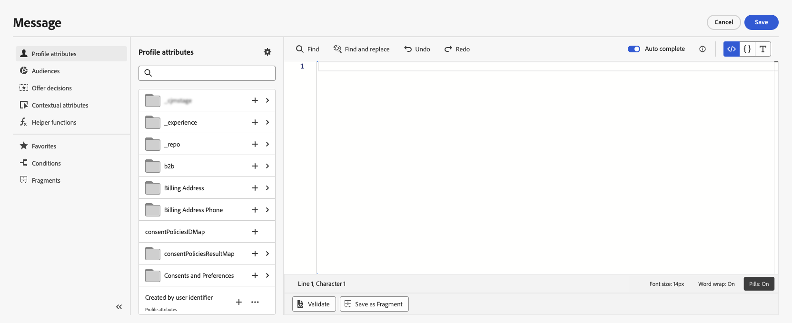
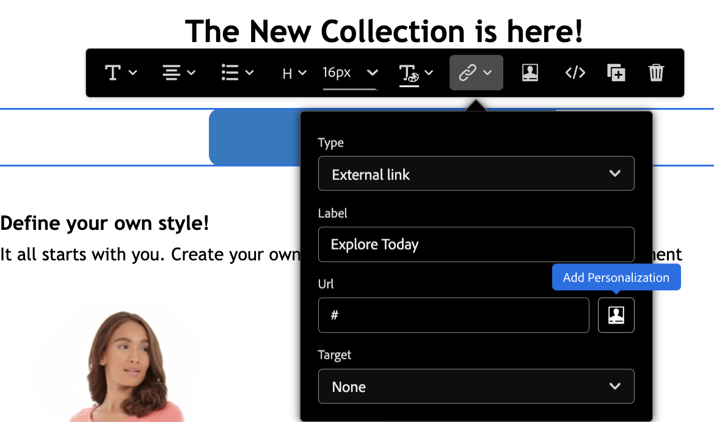
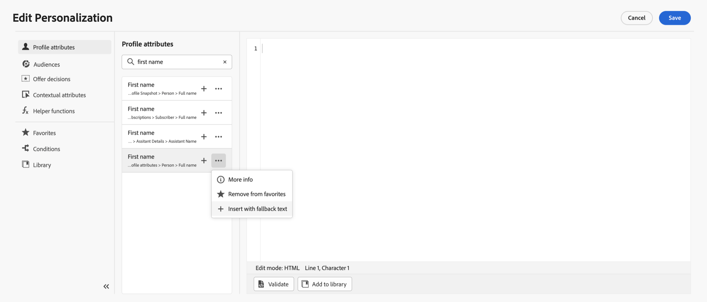
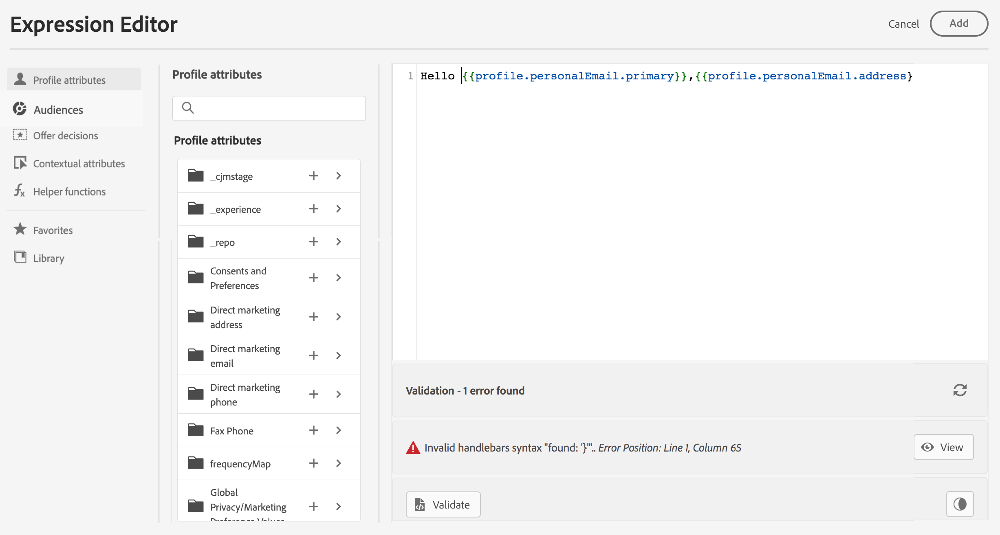

# Lägg till personalisering {#build-personalization-expressions}

>[!CONTEXTUALHELP]
>id="ajo_perso_editor"
>title="Om personaliseringsredigeraren"
>abstract="Med personaliseringsredigeraren kan du välja, ordna, anpassa och validera alla data för att skapa en anpassad personalisering för ditt innehåll."

Anpassningsredigeraren är navet i personaliseringen i [!DNL Journey Optimizer]. Det finns i alla sammanhang där du behöver definiera personalisering som e-post, push och erbjudanden.

I personaliseringsredigeringsgränssnittet kan du välja, ordna, anpassa och validera alla data för att skapa en anpassad personalisering för ditt innehåll.



## Var kan jag lägga till personalisering? {#where}

Du kan lägga till personalisering i **[!DNL Journey Optimizer]** i alla fält med ikonen  . Expandera avsnitten nedan om du vill ha mer information.

+++Meddelanden

I meddelanden kan personalisering läggas till på olika platser i dina meddelanden, till exempel i fältet **[!UICONTROL Subject line]**.


Den kan också läggas till i andra avsnitt av ditt innehåll. För [push-meddelanden](../push/push-gs.md) kan till exempel personalisering läggas till i fälten **Rubrik**, **Brödtext**, **Anpassat ljud**, **Badges** och **Anpassade data** .

+++

+++E-postdesigner

När du redigerar e-postinnehåll i [e-post-Designer](../email/get-started-email-design.md) kan du lägga till anpassning i textblock och i URL-adresser med hjälp av ikonen i det sammanhangsberoende verktygsfältet.


+++

+++Erbjudanden

Du kan lägga till personalisering när du använder textinnehåll i **erbjudandenas**-representationer. [Lär dig skapa personaliserade erbjudanden](../offers/offer-library/creating-personalized-offers.md)

+++

+++URL:er

I Journey Optimizer kan du också anpassa **URL:er** i ditt meddelande.  Personaliserade URL:er tar mottagarna till specifika sidor på en webbplats eller till en personlig mikrowebbplats, beroende på profilattributen. URL-personalisering är tillgängligt för följande typer av länkar: **Extern länk**, **Avprenumerationslänk** och **Avanmäl dig**.

Exempel på personaliserade URL:er:

* `https://www.adobe.com/users/{{profile.person.name.lastName}}`
* `https://www.adobe.com/users?uid={{profile.person.name.firstName}}`
* `https://www.adobe.com/usera?uid={{context.journey.technicalProperties.journeyUID}}`
* `https://www.adobe.com/users?uid={{profile.person.crmid}}&token={{context.token}}`

{width="50%"}

>[!NOTE]
>
>När du redigerar en personlig URL i personaliseringsredigeraren inaktiveras hjälpfunktioner och målgruppsmedlemskap av säkerhetsskäl.
>
>Blanksteg stöds inte i personaliseringstoken som används i URL:er.

Med begränsad tillgänglighet för en uppsättning kunder stöder Journey Optimizer även fullständig URL-personalisering. Exempel:

```
<a href="{{profile.social.link}}" />
<a href="{{profile.social.baseUrl}}/profile" />
<a href="https://{{profile.social.baseUrl}}/profile" />
```

>[!WARNING]
>
>Listan över godkända domäner måste skickas till Adobe i förväg.

+++

+++E-postkonfiguration

När du skapar en konfiguration för e-postkanal kan du definiera anpassade värden för underdomäner, rubriker och parametrar för URL-spårning. [Läs mer](../email/surface-personalization.md)

+++

## Personalization-källor {#sources}

I navigeringsrutan kan du välja källa för personalisering. Tillgängliga källor är:

* **[!UICONTROL Profile attributes]** : visar alla referenser som är kopplade till profilschemat som beskrivs i [dokumentationen för Adobe Experience Platform datamodell (XDM)](https://experienceleague.adobe.com/docs/experience-platform/xdm/home.html?lang=sv){target="_blank"}.
* **[!UICONTROL Target attributes]** : Den här mappen är specifik för Orchestrated-kampanjer. Den innehåller attribut som beräknas direkt i kampanjarbetsytan. [Lär dig hur du lägger till personalisering i orkestrerade kampanjer](../orchestrated/activities/channels.md#add-personalization)
* **[!UICONTROL Audiences]**: visar alla målgrupper som skapats i Adobe Experience Platform Segmenteringstjänst. Mer information om segmentering finns [här](https://experienceleague.adobe.com/docs/experience-platform/segmentation/home.html?lang=sv-SE){target="_blank"}.
* **[!UICONTROL Offer decisions]** : visar alla erbjudanden som är kopplade till en viss placering. Välj placering och infoga sedan erbjudandena i innehållet. En fullständig dokumentation om hur du hanterar erbjudanden finns i [det här avsnittet](../offers/get-started/starting-offer-decisioning.md).
* **[!UICONTROL Contextual attributes]** : När en kanalåtgärdsaktivitet (E-post, push, SMS) används i en resa eller kampanj är kontextattribut som relaterar till händelser och egenskaper tillgängliga för personalisering. Ett exempel på hur personalisering utnyttjar sammanhangsbaserade attribut visas i [det här avsnittet](personalization-use-case.md).

>[!NOTE]
>
>Om ni riktar in er på en målgrupp med anrikningsattribut som genereras med ett arbetsflöde för komposition kan ni utnyttja dessa anrikningsattribut för att personalisera ert budskap. [Lär dig använda attribut för målgruppsberikning](../audience/about-audiences.md#enrichment)

## Lägg till personalisering {#add}

>[!CONTEXTUALHELP]
>id="ajo_perso_editor_autocomplete"
>title="Automatiskt slutförd"
>abstract="Om du växlar till det här alternativet kan systemet automatiskt föreslå och slutföra kod medan du skriver. Den här funktionen är endast tillgänglig för HTML- och textformat och har stöd för attribut för profil och kontext. Om det är inaktiverat via växlingsknappen kommer redigeraren att tillhandahålla HTML-kod som fylls i automatiskt i stället."

På den centrala arbetsytan skapar du din personaliseringssyntax. Om du vill anpassa meddelandet med ett attribut går du till den vänstra navigeringsrutan och klickar på knappen `+` för att lägga till det i uttrycket.


Med ellipsmenyn bredvid ikonen `+` kan du få mer information om varje attribut och lägga till de attribut som du använder mest i favoriter. Attribut som läggs till i favoriter är tillgängliga på menyn **[!UICONTROL Favorites]** i navigeringsrutan.

>[!NOTE]
>
>Som standard visas endast ifyllda attribut i attributrutan. Om du vill visa alla attribut markerar du knappen  ovanför sökfältet och avaktiverar alternativet **[!UICONTROL Show only populated attributes]**.

Dessutom kan du definiera standardreservtext som visas om ett profilattribut av strängtyp är tomt. Det gör du genom att klicka på ellipsknappen bredvid attributet och välja **[!UICONTROL Insert with fallback text]**. Skriv den text som ska visas som standard om attributets värde är tomt för en profil och klicka sedan på **[!UICONTROL Add]**.



I följande exempel kan du välja de profiler som har sin födelsedag i dag och sedan slutföra anpassningen genom att infoga ett specifikt erbjudande som motsvarar den här dagen.


## Alternativ för redigering av uttryck {#options}

Den centrala arbetsytan innehåller olika verktyg som hjälper dig att skriva ditt personaliseringsuttryck.


Tillgängliga alternativ är:

1. **[!UICONTROL Find]** / **[!UICONTROL Find and replace]**: Sök igenom ditt uttryck och ersätt automatiskt delar av koden.
1. **[!UICONTROL Undo]** / **[!UICONTROL Redo]**: Ångra/Gör om den senaste åtgärden.
1. **[!UICONTROL Auto complete]**: Föreslår och slutför kod automatiskt medan du skriver. Den här funktionen är endast tillgänglig för HTML- och textformat och har stöd för attribut för profil och kontext. Om det är inaktiverat via växlingsknappen kommer redigeraren att tillhandahålla HTML-kod som fylls i automatiskt i stället.

   {width="70%" align="center" zoomable="yes"}

1. **[!UICONTROL HTML]** / **[!UICONTROL JSON]** / **[!UICONTROL Text]**: Identifiera kodformatet. På så sätt kan systemet anpassa funktionen för validering och automatisk komplettering baserat på det valda språket.
1. **[!UICONTROL Validate]**: Kontrollera syntaxen för uttrycket. Läs mer i [det här avsnittet](../personalization/personalization-build-expressions.md).
1. **[!UICONTROL Save as fragment]**: Spara uttrycket som ett uttrycksfragment. Läs mer i [det här avsnittet](../content-management/save-fragments.md#save-as-expression-fragment)
1. **[!UICONTROL Font size]**: Justerar teckenstorleken för innehållet i redigeraren för bättre läsbarhet.
1. **[!UICONTROL Word wrap]**: Aktiverar eller inaktiverar automatisk radbrytning så att långa uttryck kan visas på en enda rad eller kapslas i redigeraren. Alternativen är:
   * **Av** (standard) - Ingen automatisk radbrytning. Långa linjer sträcker sig utanför redigeringsvyn och kräver vågrät rullning.
   * **På** - Radbryter linjer vid redigerarens bredd.
   * **Radbryt kolumn** - Radbryter när ett radtecken når 80 tecken.
   * **Avrundad** - Radbryter antingen vid redigerarens bredd eller vid 80 tecken, beroende på vilket som är minst.
1. **[!UICONTROL Pills]**: Visa attribut som kompakta &quot;tabletter&quot; för att förbättra läsbarheten genom att dölja långa attributsökvägar. Klicka på ett attribut för att visa dess fullständiga sökväg.

   >[!NOTE]
   >
   >Piller kommer gradvis att byggas ut i alla miljöer under de kommande 30 dagarna.
   >
   >Det här alternativet är bara tillgängligt för profilattribut, sammanhangsberoende attribut och dynamiska medier.

I navigeringsrutan finns det ytterligare funktioner som hjälper dig att skapa ditt personaliseringsuttryck.


* **[!UICONTROL Helper functions]** - Hjälpfunktioner gör att du kan utföra dataåtgärder, till exempel beräkningar, dataformatering eller konverteringar, villkor och ändra dem i personaliseringssammanhang. [Läs mer om tillgängliga hjälpfunktioner](functions/functions.md)

* **[!UICONTROL Favorites]** - Attribut som du har lagt till i favoriter visas i listan. På så sätt kan du snabbt komma åt de objekt du använder mest. Om du vill lägga till ett attribut i dina favoriter klickar du på ellipsmenyn och väljer **[!UICONTROL Add to favorites]**.

* **[!UICONTROL Conditions]** - Utnyttja villkorliga regler som skapats i biblioteket för att lägga till dynamiskt innehåll i dina meddelanden. På så sätt kan du skapa flera varianter av meddelandet baserat på villkor. [Lär dig skapa dynamiskt innehåll](../personalization/get-started-dynamic-content.md)

* **[!UICONTROL Fragments]** - Utnyttja uttrycksfragment som har skapats eller sparats i den aktuella sandlådan. Ett fragment är en återanvändbar komponent som kan refereras till mellan [!DNL Journey Optimizer] kampanjer och resor. Med den här funktionen kan man skapa flera anpassade innehållsblock som kan användas av marknadsföringsanvändare för att snabbt sammanställa innehåll i en förbättrad designprocess. [Lär dig hur du använder uttrycksfragment för personalisering](../personalization/use-expression-fragments.md)

När personaliseringsuttrycket är klart måste det valideras av personaliseringsredigeraren. Läs mer i [det här avsnittet](../personalization/personalization-build-expressions.md).

## Valideringsmekanismer {#validation-mechanisms}

Valideringen av uttrycket körs automatiskt när du klickar på knappen **Lägg till** för att stänga redigeringsfönstret. Du kan också använda knappen **Validera** för att kontrollera din personaliseringssyntax.



Expandera avsnittet nedan för att se vanliga fel som kan uppstå vid validering av personalisering.

+++Vanliga fel

* **Sökvägen &quot;XYZ&quot; hittades inte**

När du försöker referera till ett fält som inte är definierat i schemat.

I det här fallet har **firstName1** inte definierats som attribut i profilschemat:

```
{{profile.person.name.firstName1}}
```

* **Typmatchningsfel för variabeln XYZ. Förväntad array. Hittade sträng.**

När du försöker iterera över en sträng i stället för en array.

I det här fallet är **product** inte en matris:

```
{{each profile.person.name.firstName as |product|}}
 {{product.productName}}
{{/each}}
```

* **Felaktig syntax för verktygsfält.`'[XYZ}}'`** hittades

När ogiltig syntax för verktygsfält används.

Handlebars-uttryck omges av **{{expression}}**

```
   {{[profile.person.name.firstName}}
```

* **Ogiltig segmentdefinition**

```
No segment definition found for 988afe9f0-d4ae-42c8-a0be-8d90e66e151
```

+++

Specifika fel kan uppstå för erbjudanden. Expandera avsnittet nedan om du vill ha mer information:

+++ Specifika fel relaterade till erbjudanden

Felen som rör integrering av erbjudanden i ett e-postmeddelande eller push-meddelande har följande mönster:

```
Offer.<offerType>.[PlacementID].[ActivityID].<offer-attribute>
```

Valideringen utförs under innehållsvalideringen i personaliseringsredigeraren.

<table> 
 <thead> 
  <tr> 
   <th> Feltitel <br /> </th> 
   <th> Validering/upplösning <br /> </th> 
  </tr> 
 </thead> 
 <tbody> 
  <tr> 
   <td>Resurs med ID placementID och typen OfferPlacement hittades inte <br/>
Resurs med id activityID och typen OfferActivity hittades inte<br/></td> 
   <td>Kontrollera om ActivityID och/eller PlacementID är tillgängliga</td> 
  </tr> 
   <tr> 
   <td>Resursen kunde inte verifieras.</td> 
   <td>componentType i Placement ska matcha offerType-erbjudandet</td> 
  </tr> 
   <tr> 
   <td>Den offentliga URL:en finns inte i offerId.</td> 
   <td>Image Offers (all Personalized and fallback associated with the Decision and placement pair) should have public URL populated (deliveryURL should not be empty).</td> 
  </tr> 
  <tr> 
   <td>Beslutet innehåller attribut som inte är profiler.</td> 
   <td>Användning av modell för erbjudanden bör endast innehålla profilattributen.</td> 
  </tr> 
  <tr> 
   <td>Ett fel uppstod när beslutsanvändningen hämtades.</td> 
   <td>Detta fel kan uppstå när API:t försöker hämta erbjudandemodellen.</td> 
  </tr>
  <tr> 
   <td>Erbjudandeattributet offer-attribute är ogiltigt.</td> 
   <td>Kontrollera om erbjudandeattributet som refereras i erbjudandeofferten är giltigt. Följande attribut är giltiga: <br/>
Bild: deliveryURL, linkURL <br/>
Text: content <br/>
HTML: innehåll<br/></td> 
  </tr> 
 </tbody> 
</table>

+++
