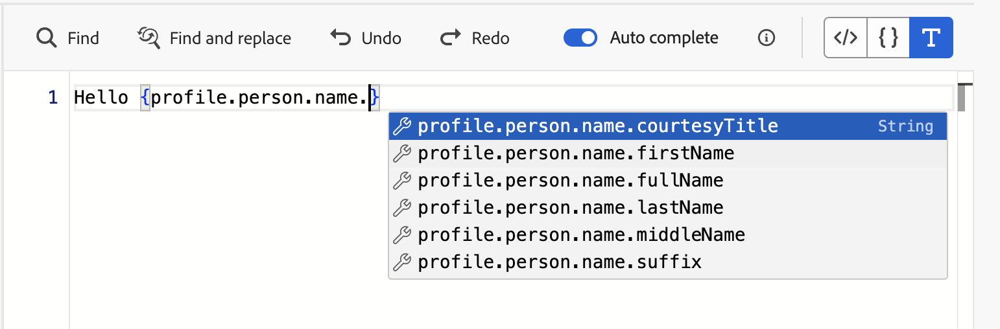

# Kom igång med personaliseringsredigeraren {#build-personalization-expressions}

>[!CONTEXTUALHELP]
>id="ajo_perso_editor"
>title="Om personaliseringsredigeraren"
>abstract="Med personaliseringsredigeraren kan du välja, ordna, anpassa och validera alla data för att skapa en anpassad personalisering för ditt innehåll."

Anpassningsredigeraren är navet i personaliseringen i [!DNL Journey Optimizer]. Det finns i alla sammanhang där du behöver definiera personalisering som e-post, push och erbjudanden.

I personaliseringsredigeringsgränssnittet väljer, ordnar, anpassar och validerar du alla data för att skapa en anpassad personalisering för ditt innehåll.

## Personalization-källor {#sources}

I den vänstra delen av skärmen visas en domänväljare där du kan välja källa för personalisering. Tillgängliga källor är:

* **[!UICONTROL Profile attributes]** : visar alla referenser som är kopplade till profilschemat som beskrivs i [dokumentationen för Adobe Experience Platform datamodell (XDM)](https://experienceleague.adobe.com/docs/experience-platform/xdm/home.html?lang=sv){target="_blank"}.
* **[!UICONTROL Audiences]**: visar alla målgrupper som skapats i Adobe Experience Platform Segmenteringstjänst. Mer information om segmentering finns [här](https://experienceleague.adobe.com/docs/experience-platform/segmentation/home.html){target="_blank"}.
* **[!UICONTROL Offer decisions]** : visar alla erbjudanden som är kopplade till en viss placering. Välj placering och infoga sedan erbjudandena i innehållet. En fullständig dokumentation om hur du hanterar erbjudanden finns i [det här avsnittet](../offers/get-started/starting-offer-decisioning.md).
* **[!UICONTROL Contextual attributes]** : När en kanalåtgärdsaktivitet (E-post, push, SMS) används i en resa eller kampanj är kontextattribut som relaterar till händelser och egenskaper tillgängliga för personalisering. Ett exempel på hur personalisering utnyttjar sammanhangsberoende attribut visas i [det här avsnittet](personalization-use-case.md).

>[!NOTE]
>
>Om ni riktar in er på en målgrupp med anrikningsattribut som genereras med ett arbetsflöde för komposition kan ni utnyttja dessa anrikningsattribut för att personalisera ert budskap. [Lär dig använda attribut för målgruppsberikning](../audience/about-audiences.md#enrichment)

## Lägg till personalisering {#add}

>[!CONTEXTUALHELP]
>id="ajo_perso_editor_autocomplete"
>title="Automatiskt slutförd"
>abstract="Om du växlar till det här alternativet kan systemet automatiskt föreslå och slutföra kod medan du skriver. Den här funktionen är endast tillgänglig för HTML- och textformat och har stöd för attribut för profil och kontext. Om det är inaktiverat via växlingsknappen kommer redigeraren att tillhandahålla HTML-kod som fylls i automatiskt i stället."

På den centrala arbetsytan skapar du din personaliseringssyntax. Om du vill anpassa meddelandet med ett attribut går du till den vänstra navigeringsrutan och klickar på knappen `+` för att lägga till det i uttrycket.

Med ellipsmenyn bredvid ikonen `+` kan du få mer information om varje attribut och lägga till de attribut som du använder mest i favoriter. Attribut som läggs till i favoriter är tillgängliga från menyn **[!UICONTROL Favorites]** i den vänstra navigeringsrutan.

Dessutom kan du definiera standardreservtext som visas om ett profilattribut av strängtyp är tomt. Det gör du genom att klicka på ellipsknappen bredvid attributet och välja **[!UICONTROL Insert with fallback text]**. Skriv den text som ska visas som standard om attributets värde är tomt för en profil och klicka sedan på **[!UICONTROL Add]**.

I följande exempel kan du välja de profiler som har sin födelsedag i dag och sedan slutföra anpassningen genom att infoga ett specifikt erbjudande som motsvarar den här dagen.

## Verktyg för redigering av uttryck

Den centrala arbetsytan innehåller olika verktyg som hjälper dig att skriva ditt personaliseringsuttryck.

Tillgängliga alternativ är:

1. **[!UICONTROL Find]** / **[!UICONTROL Find and replace]**: Sök igenom ditt uttryck och ersätt automatiskt delar av koden.
1. **[!UICONTROL Undo]** / **[!UICONTROL Redo]**: Ångra/Gör om den senaste åtgärden.
1. **[!UICONTROL Auto complete]**: Föreslår och slutför kod automatiskt medan du skriver. Den här funktionen är endast tillgänglig för HTML- och textformat och har stöd för attribut för profil och kontext. Om det är inaktiverat via växlingsknappen kommer redigeraren att tillhandahålla HTML-kod som fylls i automatiskt i stället.

   {width="70%" align="center" zoomable="yes"}

1. **[!UICONTROL HTML]** / **[!UICONTROL JSON]** / **[!UICONTROL Text]**: Identifiera kodformatet. På så sätt kan systemet anpassa funktionen för validering och automatisk komplettering baserat på det valda språket.
1. **[!UICONTROL Validate]**: Kontrollera syntaxen för uttrycket. Läs mer i [det här avsnittet](personalization-validation.md).
1. **[!UICONTROL Save as fragment]**: Spara uttrycket som ett uttrycksfragment. Läs mer i [det här avsnittet](../content-management/save-fragments.md#save-as-expression-fragment)
1. **[!UICONTROL Font size]**: Justerar teckenstorleken för innehållet i redigeraren för bättre läsbarhet.
1. **[!UICONTROL Word wrap]**: Aktiverar eller inaktiverar automatisk radbrytning så att långa uttryck kan visas på en enda rad eller kapslas i redigeraren. Alternativen är:
   * **Av** (standard) - Ingen automatisk radbrytning. Långa linjer sträcker sig utanför redigeringsvyn och kräver vågrät rullning.
   * **På** - Radbryter linjer vid redigerarens bredd.
   * **Radbryt kolumn** - Radbryter när ett radtecken når 80 tecken.
   * **Avrundad** - Radbryter antingen vid redigerarens bredd eller vid 80 tecken, beroende på vilket som är minst.

I navigeringsrutan finns det ytterligare funktioner som hjälper dig att skapa ditt personaliseringsuttryck.

* **[!UICONTROL Helper functions]** - Hjälpfunktioner gör att du kan utföra dataåtgärder, till exempel beräkningar, dataformatering eller konverteringar, villkor och ändra dem i personaliseringssammanhang. [Läs mer om tillgängliga hjälpfunktioner](functions/functions.md)

* **[!UICONTROL Favorites]** - Attribut som du har lagt till i favoriter visas i listan. På så sätt kan du snabbt komma åt de objekt du använder mest. Om du vill lägga till ett attribut i dina favoriter klickar du på ellipsmenyn och väljer **[!UICONTROL Add to favorites]**.

* **[!UICONTROL Conditions]** - Utnyttja villkorliga regler som skapats i biblioteket för att lägga till dynamiskt innehåll i dina meddelanden. På så sätt kan du skapa flera varianter av meddelandet baserat på villkor. [Lär dig skapa dynamiskt innehåll](../personalization/get-started-dynamic-content.md)

* **[!UICONTROL Fragments]** - Utnyttja uttrycksfragment som har skapats eller sparats i den aktuella sandlådan. Ett fragment är en återanvändbar komponent som kan refereras till mellan [!DNL Journey Optimizer] kampanjer och resor. Med den här funktionen kan man skapa flera anpassade innehållsblock som kan användas av marknadsföringsanvändare för att snabbt sammanställa innehåll i en förbättrad designprocess. [Lär dig hur du använder uttrycksfragment för personalisering](../personalization/use-expression-fragments.md)

När personaliseringsuttrycket är klart måste det valideras av personaliseringsredigeraren. Läs mer i [det här avsnittet](personalization-validation.md).
