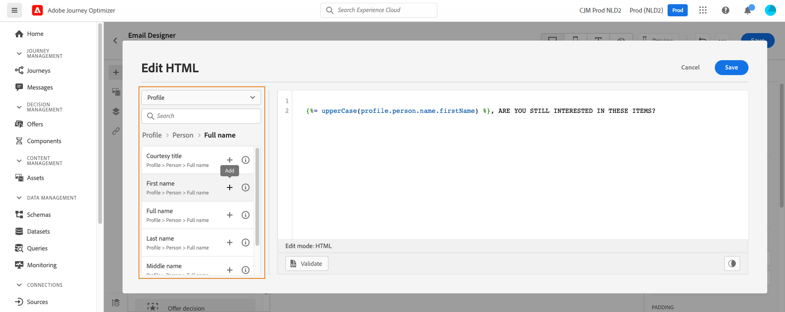
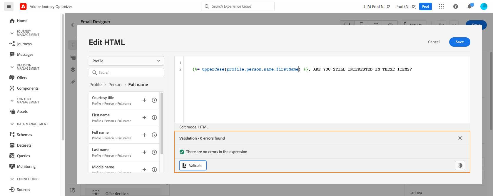
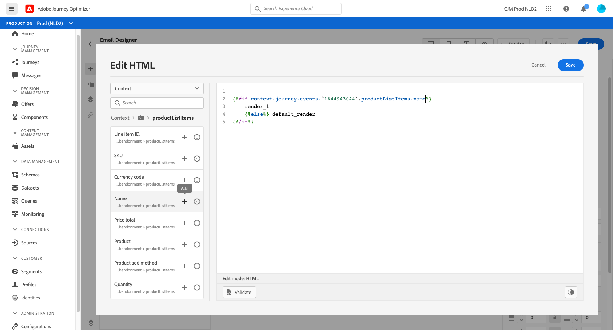

# Personalisering: e-post om att kunden överger en varukorg {#personalization-use-case-helper-functions}

I det här exemplet anpassar du brödtexten i ett e-postmeddelande. Det här meddelandet riktar sig till kunder som har lämnat artiklar i kundvagnen men inte slutfört köpet.

Du använder följande typer av hjälpfunktioner:

* Strängfunktionen `upperCase`, som infogar kundens förnamn med versaler. [Läs mer](functions/string.md#upper).
* `each`-hjälpen för att lista objekten i kundvagnen. [Läs mer](functions/helpers.md#each).
* Hjälpprogrammet `if` för att infoga en produktspecifik anteckning om den relaterade produkten finns i kundvagnen. [Läs mer](functions/helpers.md#if-function).

<!-- **Context**: personalization based on contextual data from the journey -->

Innan du börjar bör du kontrollera hur du konfigurerar dessa element:
* Ett e-postmeddelande. [Läs mer](../create-message.md)
* Innehållet i ett e-postmeddelande. [Läs mer](../create-email-content.md).
* En enastående händelse. [Läs mer](../event/about-events.md).
* En resa som börjar med ett evenemang. [Läs mer](../building-journeys/using-the-journey-designer.md).

Följ de här stegen:
1. [Skapa ett e-postmeddelande](#configure-email).
2. [Ange kundens förnamn med versaler](#uppercase-function).
3. [Skapa det första evenemanget och resan](#create-context).
4. [Lägg kundvagnens innehåll i e-postmeddelandet](#each-helper).
5. [Infoga en produktspecifik anteckning](#if-helper).
6. [Testa och publicera resan](#test-and-publish).

## Steg 1: Skapa e-postmeddelandet{#configure-email}

1. Skapa eller ändra ett e-postmeddelande och klicka sedan på **[!UICONTROL Email Designer]**.
   

2. Dra och släpp tre strukturkomponenter från den vänstra paletten på e-postdesignerns hemsida till meddelandets brödtext.

3. Dra och släpp en HTML-innehållskomponent på varje ny strukturkomponent.

   

## Steg 2: Infoga kundens förnamn med versaler {#uppercase-function}

1. På startsidan för e-postdesignern klickar du på HTML-komponenten där du vill lägga till kundens förnamn.
2. Klicka på **[!UICONTROL Show the source code]** i det sammanhangsberoende verktygsfältet.

   

3. Lägg till strängfunktionen `upperCase` i fönstret **[!UICONTROL Edit HTML]**:
   1. Välj **[!UICONTROL Helper functions]** i listan.
   2. Använd sökfältet för att hitta &quot;versaler&quot;.
   3. Lägg till funktionen `upperCase` från sökresultaten. Det gör du genom att klicka på plustecknet (+) bredvid `: string`.

      Uttrycksredigeraren visar följande uttryck:

      ```handlebars
      
      ```

      

4. Ta bort strängplatshållaren från uttrycket.
5. Lägg till token för förnamn:
   1. Välj **[!UICONTROL Profile]** i listan.
   2. Välj **[!UICONTROL Profile]** > **[!UICONTROL Person]** > **[!UICONTROL Full name]**.
   3. Lägg till **[!UICONTROL First name]**-token i uttrycket.

      Uttrycksredigeraren visar följande uttryck:

      ```handlebars
      
      ```

      

      Läs mer om datatypen [personnamn](https://experienceleague.adobe.com/docs/experience-platform/xdm/data-types/person-name.html).

6. Klicka på **[!UICONTROL Validate]** och sedan på **[!UICONTROL Save]**.

   
7. Spara meddelandet.

## Steg 3: Skapa den första händelsen och den relaterade resan {#create-context}

Kundvagnens innehåll är sammanhangsberoende information från resan. Därför måste du lägga till en första händelse och e-postmeddelandet till en resa innan du kan lägga till kundspecifik information i e-postmeddelandet.

1. Skapa en händelse vars schema innehåller arrayen `productListItems`.
2. Definiera alla fält från den här arrayen som nyttolastfält för den här händelsen.

   Läs mer om datatypen [för produktlisteobjektet](https://experienceleague.adobe.com/docs/experience-platform/xdm/data-types/product-list-item.html).

3. Skapa en resa som börjar med det här evenemanget.
4. Lägg till meddelandet på resan.
5. Avsluta resan med en slutaktivitet.

   Eftersom du ännu inte har publicerat meddelandet kan du varken testa eller publicera resan.

   

6. Klicka på **[!UICONTROL OK]**.

   Ett meddelande informerar dig om att resekontexten har skickats till meddelandet.

   

## Steg 4: Infoga listan med artiklar från vagnen {#each-helper}

1. Öppna meddelandet igen.

   

2. På startsidan för e-postdesignern klickar du på HTML-komponenten där du vill visa kundvagnens innehåll.
3. Klicka på **[!UICONTROL Show the source code]** i det sammanhangsberoende verktygsfältet.

   

4. Lägg till `each`-hjälpen i fönstret **[!UICONTROL Edit HTML]**:
   1. Välj **[!UICONTROL Helper functions]** i listan.
   2. Använd sökfältet för att hitta &quot;each&quot;.
   3. Lägg till `each`-hjälpen från sökresultaten.

      Uttrycksredigeraren visar följande uttryck:

      ```handlebars
      {{#each someArray as |variable|}} {{/each}}
      ```

      

5. Lägg till `productListItems`-arrayen i uttrycket:

   1. Ta bort platshållaren &quot;someArray&quot; från uttrycket.
   2. Välj **[!UICONTROL Context]** i listan.

      Alternativet **[!UICONTROL Context]** är bara tillgängligt efter att resekontexten har skickats till meddelandet.

   3. Välj **[!UICONTROL Journey Orchestration]** > **[!UICONTROL Events]** > ***[!UICONTROL event_name]*** och expandera sedan noden **[!UICONTROL productListItems]**.

      I det här exemplet representerar *event_name* namnet på händelsen.

   4. Lägg till **[!UICONTROL Product]**-token i uttrycket.

      Uttrycksredigeraren visar följande uttryck:

      ```handlebars
      {{#each context.journey.events.event_ID.productListItems.product as |variable|}} {{/each}}
      ```
      I det här exemplet representerar *event_ID* ID:t för din händelse.

      

   5. Ändra uttrycket:
      1. Ta bort strängen &quot;.product&quot;.
      2. Ersätt platshållaren &quot;variable&quot; med &quot;product&quot;.

      I det här exemplet visas det ändrade uttrycket:

      ```handlebars
      {{#each context.journey.events.event_ID.productListItems as |product|}}
      ```
6. Klistra in koden mellan den inledande `{{#each}}`-taggen och den avslutande `{/each}}`-taggen:

   ```html
   <table>
      <tbody>
         <tr>
            <td><b>#name</b></td>
            <td><b>#quantity</b></td>
            <td><b>$#priceTotal</b></td>
         </tr>
      </tbody>
   </table>
   ```

7. Lägg till personaliseringstoken för artikelnamn, kvantitet och pris:

   1. Ta bort platshållaren &quot;#name&quot; från HTML-tabellen.
   2. Lägg till token **[!UICONTROL Name]** från föregående sökresultat till uttrycket.

   Upprepa dessa steg två gånger:
   * Ersätt platshållaren &quot;#quantity&quot; med token **[!UICONTROL Quantity]**.
   * Ersätt platshållaren &quot;#priceTotal&quot; med token **[!UICONTROL Total price]**.

   I det här exemplet visas det ändrade uttrycket:

   ```handlebars
   {{#each context.journey.events.event_ID.productListItems as |product|}}
      <table>
         <tbody>
            <tr>
               <td><b>{{context.journey.events.event_ID.productListItems.name}}</b></td>
               <td><b>{{context.journey.events.event_ID.productListItems.quantity}}</b></td>
               <td><b>${{context.journey.events.event_ID.productListItems.priceTotal}}</b></td>
            </tr>
         </tbody>
      </table>
   {{/each}}
   ```
8. Klicka på **[!UICONTROL Validate]** och sedan på **[!UICONTROL Save]**.
   

## Steg 5: Infoga en produktspecifik anteckning {#if-helper}

1. På hemsidan för e-postdesignern klickar du på den HTML-komponent där du vill infoga anteckningen.
2. Klicka på **[!UICONTROL Show the source code]** i det sammanhangsberoende verktygsfältet.

   

3. Lägg till `if`-hjälpen i fönstret **[!UICONTROL Edit HTML]**:
   1. Välj **[!UICONTROL Helper functions]** i listan.
   2. Använd sökfältet för att hitta &quot;if&quot;.
   3. Lägg till `if`-hjälpen från sökresultaten.

      Uttrycksredigeraren visar följande uttryck:

      ```handlebars
       render_1
          render_2
          default_render
      
      ```
      

4. Ta bort det här villkoret från uttrycket:

   ```handlebars
    render_2
   ```

   I det här exemplet visas det ändrade uttrycket:

   ```handlebars
    render_1
       default_render
   
   ```

5. Lägg till produktnamnstoken i villkoret:
   1. Ta bort platshållaren &quot;condition1&quot; från uttrycket.
   2. Välj **[!UICONTROL Context]** i listan.
   3. Välj **[!UICONTROL Journey Orchestration]** > **[!UICONTROL Events]** > ***[!UICONTROL event_name]*** och expandera sedan noden **[!UICONTROL productListItems]**.

      I det här exemplet representerar *event_name* namnet på händelsen.

   4. Lägg till **[!UICONTROL Name]**-token i uttrycket.

      Uttrycksredigeraren visar följande uttryck:

      ```handlebars
      
         render_1
          default_render
      
      ```
      

6. Ändra uttrycket:
   1. I uttrycksredigeraren anger du produktnamnet efter `name`-token.

      Använd den här syntaxen, där *product_name* representerar namnet på din produkt:

      ```javascript
      = "product_name"
      ```

      I det här exemplet är produktnamnet&quot;Juno Jacket&quot;:

      ```handlebars
      
         render_1
          default_render
      
      ```

   2. Ersätt platshållaren &quot;render_1&quot; med texten i anteckningen.

      Exempel:

      ```handlebars
      
         Due to longer than usual lead times on the Juno Jacket, please expect item to ship two weeks after purchase.
          default_render
      
      ```
   3. Ta bort platshållaren &quot;default_render&quot; från uttrycket.
7. Klicka på **[!UICONTROL Validate]** och sedan på **[!UICONTROL Save]**.

   

8. Spara och publicera meddelandet.

## Steg 6: Testa och publicera resan {#test-and-publish}

1. Öppna resan. Uppdatera sidan om resan redan är öppen.
2. Aktivera växeln **[!UICONTROL Test]** och klicka sedan på **[!UICONTROL Trigger an event]**.

   Du kan bara aktivera testläget efter att du har publicerat meddelandet.

   

3. I fönstret **[!UICONTROL Event configuration]** anger du indatavärdena och klickar sedan på **[!UICONTROL Send]**.

   Testläget fungerar bara med testprofiler.

   

   E-postadressen skickas till testprofilens adress.

   I det här exemplet innehåller e-postmeddelandet en anteckning om Juno Jacket eftersom den här produkten finns i varukorgen:

   

4. Kontrollera att det inte finns något fel och publicera sedan resan.


## Relaterade ämnen

### Handtag, funktioner

[Hjälpmedel](functions/helpers.md)

[Strängfunktioner](functions/string.md)

### Användningsfall

[Personalisering med profilinformation, kontext och erbjudande](personalization-use-case.md)

[Personalisering med beslutsbaserat erbjudande](../offers/offers-e2e.md)

## Videokurs{#helper-functions-video}

>[!VIDEO](https://video.tv.adobe.com/v/334244?quality=12)