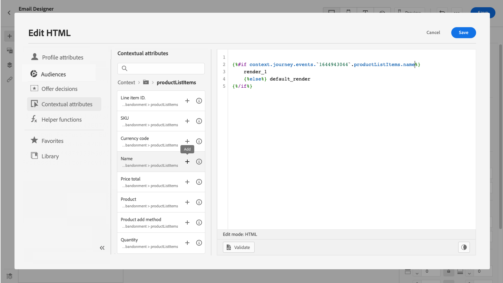

# Personalization-exempel: e-post om att kunden överger en varukorg {#personalization-use-case-helper-functions}

I det här exemplet anpassar du brödtexten i ett e-postmeddelande. Det här meddelandet riktar sig till kunder som har lämnat artiklar i kundvagnen men inte slutfört köpet.

Du använder följande typer av hjälpfunktioner:

* Strängfunktionen `upperCase` som infogar kundens förnamn med versaler. [Läs mer](functions/string.md#upper).
* Hjälpprogrammet `each` som visar vilka objekt som finns i kundvagnen. [Läs mer](functions/helpers.md#each).
* Hjälp `if` om du vill infoga en produktspecifik anteckning om den relaterade produkten finns i kundvagnen. [Läs mer](functions/helpers.md#if-function).
<!-- **Context**: personalization based on contextual data from the journey -->

➡️ [Lär dig använda hjälpfunktioner i den här videon](#video)

Innan du börjar bör du kontrollera hur du konfigurerar de här elementen:

* En enastående händelse. [Läs mer](../event/about-events.md).
* En resa som börjar med ett evenemang. [Läs mer](../building-journeys/using-the-journey-designer.md).
* Ett e-postmeddelande under din resa. [Läs mer](../email/create-email.md)
* Innehållet i ett e-postmeddelande. [Läs mer](../email/content-from-scratch.md).

Följ de här stegen:

1. [Skapa den inledande händelsen och resan](#create-context).
1. [Skapa ett e-postmeddelande](#configure-email).
1. [Infoga kundens förnamn med versaler](#uppercase-function).
1. [Lägg till kundvagnsinnehållet i e-postmeddelandet](#each-helper).
1. [Infoga en produktspecifik anteckning](#if-helper).
1. [Testa och publicera resan](#test-and-publish).

## Steg 1: Skapa den inledande händelsen och den relaterade resan {#create-context}

Kundvagnens innehåll är sammanhangsberoende information från resan. Därför måste du lägga till en första händelse och e-postmeddelandet till en resa innan du kan lägga till kundspecifik information i e-postmeddelandet.

1. Skapa en händelse vars schema innehåller arrayen `productListItems`.
1. Definiera alla fält från den här arrayen som nyttolastfält för den här händelsen.

   Läs mer om datatypen för produktlisteobjektet i [Adobe Experience Platform-dokumentationen](https://experienceleague.adobe.com/docs/experience-platform/xdm/data-types/product-list-item.html?lang=sv-SE){target="_blank"}.

1. Skapa en resa som börjar med det här evenemanget.
1. Lägg till en **e-postaktivitet** på resan.

   

## Steg 2: Skapa e-postmeddelandet {#configure-email}

1. Klicka på **i aktiviteten** E-post **[!UICONTROL Edit content]** och sedan på **[!UICONTROL Email Designer]**.

   

1. Dra och släpp tre strukturkomponenter på meddelandets brödtext från den vänstra paletten på e-post-Designer hemsida.

1. Dra och släpp en HTML-innehållskomponent på varje ny strukturelement.

   

## Steg 3: Ange kundens förnamn med versaler {#uppercase-function}

1. Klicka på den HTML-komponent där du vill lägga till kundens förnamn på startsidan för e-post till Designer.
1. Klicka på **[!UICONTROL Show the source code]** i det sammanhangsberoende verktygsfältet.

   

1. Lägg till strängfunktionen **[!UICONTROL Edit HTML]** i fönstret `upperCase`:
   1. Välj **[!UICONTROL Helper functions]** på den vänstra menyn.
   1. Använd sökfältet för att hitta &quot;versal case&quot;.
   1. Lägg till funktionen `upperCase` från sökresultaten. Det gör du genom att klicka på plustecknet (+) bredvid `: string`.

      Uttrycksredigeraren visar följande uttryck:

      ```handlebars
      
      ```

      

1. Ta bort platshållaren för strängen från uttrycket.
1. Lägg till token för förnamn:
   1. Välj **[!UICONTROL Profile attributes]** på den vänstra menyn.
   1. Välj **[!UICONTROL Person]** > **[!UICONTROL Full name]**.
   1. Lägg till **[!UICONTROL First name]**-token i uttrycket.

      Uttrycksredigeraren visar följande uttryck:

      ```handlebars
      
      ```

      

      Läs mer om datatypen för personnamn i [Adobe Experience Platform-dokumentationen](https://experienceleague.adobe.com/docs/experience-platform/xdm/data-types/person-name.html?lang=sv-SE){target="_blank"}.

1. Klicka på **[!UICONTROL Validate]** och sedan på **[!UICONTROL Save]**.

   

1. Spara meddelandet.

## Steg 4: Infoga listan med artiklar från vagnen {#each-helper}

I det här steget visas hur du itererar över händelsedata. Mer omfattande exempel på hur du itererar över olika datakällor (händelser, anpassade åtgärdssvar och andra sammanhangsberoende data) finns i [Iterera över kontextdata med handtag](iterate-contextual-data.md).

1. Öppna meddelandeinnehållet igen.

1. På hemsidan för Email Designer klickar du på den HTML-komponent där du vill visa kundvagnens innehåll.
1. Klicka på **[!UICONTROL Show the source code]** i det sammanhangsberoende verktygsfältet.

   

1. Lägg till hjälpen för **[!UICONTROL Edit HTML]** i fönstret `each`:
   1. Välj **[!UICONTROL Helper functions]** på den vänstra menyn.
   1. Använd sökfältet för att hitta &quot;each&quot;.
   1. Lägg till hjälpen för `each` från sökresultaten.

      Uttrycksredigeraren visar följande uttryck:

      ```handlebars
      {{#each someArray as |variable|}} {{/each}}
      ```

      

1. Lägg till `productListItems`-arrayen i uttrycket:

   1. Ta bort platshållaren &quot;someArray&quot; från uttrycket.
   1. Välj **[!UICONTROL Contextual attributes]** på den vänstra menyn.

      **[!UICONTROL Contextual attributes]** är bara tillgängliga efter att resekontexten har skickats till meddelandet.

   1. Välj **[!UICONTROL Journey Optimizer]** > **[!UICONTROL Events]** > ***[!UICONTROL event_name]*** och expandera sedan noden **[!UICONTROL productListItems]**.

      I det här exemplet representerar *event_name* namnet på din händelse.

   1. Lägg till **[!UICONTROL Product]**-token i uttrycket.

      Uttrycksredigeraren visar följande uttryck:

      ```handlebars
      {{#each context.journey.events.event_ID.productListItems.product as |variable|}} {{/each}}
      ```

      I det här exemplet representerar *event_ID* händelsens ID.

      

   1. Ändra uttrycket:
      1. Ta bort strängen &quot;.product&quot;.
      1. Ersätt platshållaren &quot;variable&quot; med &quot;product&quot;.

      I det här exemplet visas det ändrade uttrycket:

      ```handlebars
      {{#each context.journey.events.event_ID.productListItems as |product|}}
      ```

1. Klistra in koden mellan den inledande `{{#each}}`-taggen och den avslutande `{{/each}}`-taggen:

   ```html
   <table>
      <tbody>
         <tr>
            <td><b>#name</b></td>
            <td><b>#quantity</b></td>
            <td><b>$#priceTotal</b></td>
         </tr>
      </tbody>
   </table>
   ```

1. Lägg till personaliseringstoken för artikelnamn, kvantitet och pris:

   1. Ta bort platshållaren &quot;#name&quot; från HTML-tabellen.
   1. Lägg till **[!UICONTROL Name]**-token i uttrycket från föregående sökresultat.

   Upprepa dessa steg två gånger:

   * Ersätt platshållaren #quantity med token **[!UICONTROL Quantity]**.
   * Ersätt platshållaren #priceTotal med token **[!UICONTROL Total price]**.

   I det här exemplet visas det ändrade uttrycket:

   ```handlebars
   {{#each context.journey.events.event_ID.productListItems as |product|}}
      <table>
         <tbody>
            <tr>
            <td><b>{{product.name}}</b></td>
            <td><b>{{product.quantity}}</b></td>
            <td><b>${{product.priceTotal}}</b></td>
            </tr>
         </tbody>
      </table>
   {{/each}}
   ```

1. Klicka på **[!UICONTROL Validate]** och sedan på **[!UICONTROL Save]**.

   

## Steg 5: Infoga en produktspecifik anteckning {#if-helper}

1. Klicka på den HTML-komponent där du vill infoga anteckningen på startsidan för e-postprogrammet för Designer.
1. Klicka på **[!UICONTROL Show the source code]** i det sammanhangsberoende verktygsfältet.

   

1. Lägg till hjälpen för **[!UICONTROL Edit HTML]** i fönstret `if`:
   1. Välj **[!UICONTROL Helper functions]** på den vänstra menyn.
   1. Använd sökfältet för att hitta &quot;if&quot;.
   1. Lägg till hjälpen för `if` från sökresultaten.

      Uttrycksredigeraren visar följande uttryck:

      ```handlebars
       render_1
          render_2
          default_render
      
      ```

      

1. Ta bort det här villkoret från uttrycket:

   ```handlebars
    render_2
   ```

   I det här exemplet visas det ändrade uttrycket:

   ```handlebars
    render_1
       default_render
   
   ```

1. Lägg till produktnamnstoken i villkoret:
   1. Ta bort platshållaren &quot;condition1&quot; från uttrycket.
   1. Välj **[!UICONTROL Contextual attributes]** på den vänstra menyn.
   1. Välj **[!UICONTROL Journey Orchestration]** > **[!UICONTROL Events]** > ***[!UICONTROL event_name]*** och expandera sedan noden **[!UICONTROL productListItems]**.

      I det här exemplet representerar *event_name* namnet på din händelse.

   1. Lägg till **[!UICONTROL Name]**-token i uttrycket.

      Uttrycksredigeraren visar följande uttryck:

      ```handlebars
      
         render_1
          default_render
      
      ```

      

1. Ändra uttrycket:
   1. Ange produktnamnet efter `name`-token i uttrycksredigeraren.

      Använd den här syntaxen, där *product_name* representerar namnet på din produkt:

      ```javascript
      = "product_name"
      ```

      I det här exemplet är produktnamnet&quot;Juno Jacket&quot;:

      ```handlebars
      
         render_1
          default_render
      
      ```

   1. Ersätt platshållaren &quot;render_1&quot; med texten i anteckningen.

      Exempel:

      ```handlebars
      
         Due to longer than usual lead times on the Juno Jacket, please expect item to ship two weeks after purchase.
          default_render
      
      ```

   1. Ta bort platshållaren &quot;default_render&quot; från uttrycket.
1. Klicka på **[!UICONTROL Validate]** och sedan på **[!UICONTROL Save]**.

   

1. Spara meddelandet.

## Steg 6: Testa och publicera resan {#test-and-publish}

1. Aktivera växlingsknappen **[!UICONTROL Test]** och klicka sedan på **[!UICONTROL Trigger an event]**.

   

1. I fönstret **[!UICONTROL Event configuration]** anger du indatavärdena och klickar sedan på **[!UICONTROL Send]**.

   Testläget fungerar bara med testprofiler.

   

   E-postadressen skickas till testprofilens adress.

   I det här exemplet innehåller e-postmeddelandet en anteckning om Juno Jacket eftersom den här produkten finns i varukorgen:

   

1. Kontrollera att det inte finns något fel och publicera sedan resan.


## Relaterade ämnen {#related-topics}

### Handtag, funktioner {#handlebars}

* [Hjälpmedel](functions/helpers.md)

* [Strängfunktioner](functions/string.md)

### Användningsfall {#use-case}

* [Personalization med profilinformation, kontext och erbjudande](personalization-use-case.md)

* [Personalization med beslutsbaserat erbjudande](../offers/offers-e2e.md)

## Instruktionsvideo {#video}

Lär dig hur du använder hjälpfunktioner.

>[!VIDEO](https://video.tv.adobe.com/v/334244?quality=12)
