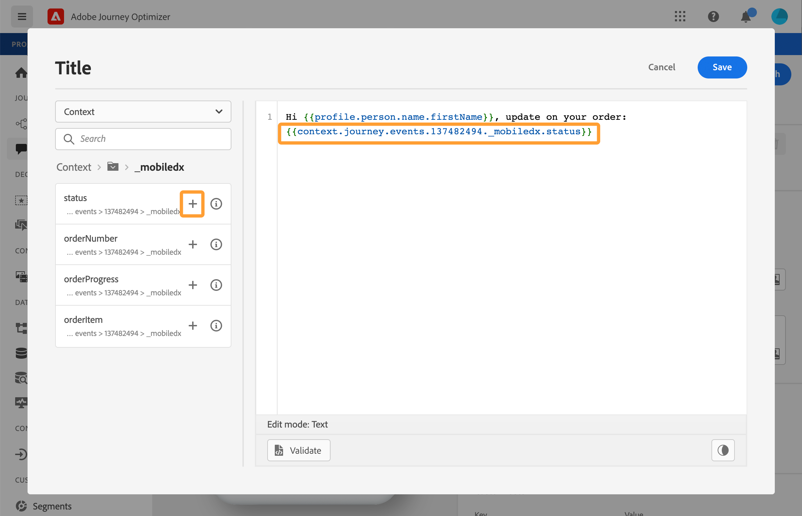
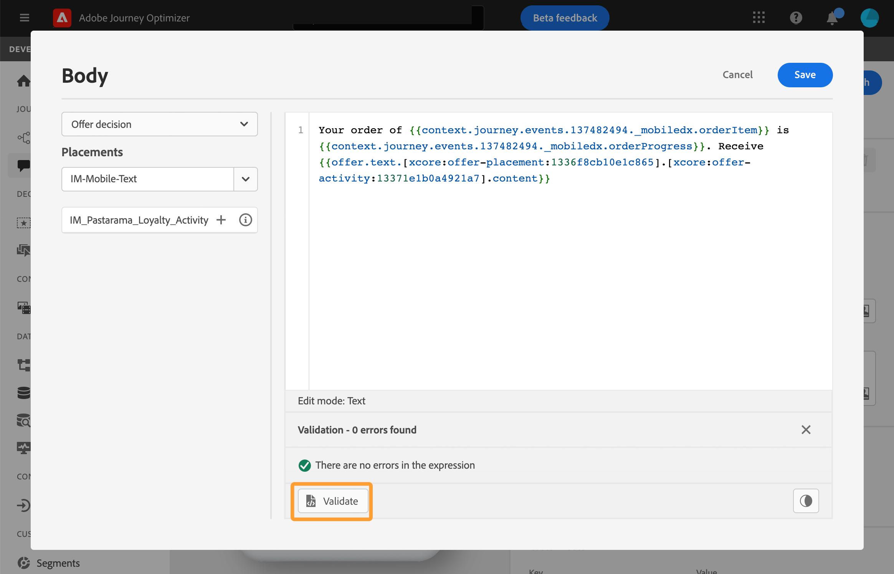

# Personalization användningsfall: orderstatusmeddelande {#personalization-use-case}

I det här fallet får du se hur du kan använda flera typer av personalisering i ett enda push-meddelande. Tre typer av personalisering kommer att användas:

* **Profil**: meddelandeanpassning baserad på ett profilfält
* **Erbjudandebeslut**: personalisering baserad på variabler för beslutshantering
* **Kontext**: personalisering baserad på kontextdata från resan

Målet med det här exemplet är att skicka en händelse till [!DNL Journey Optimizer] varje gång en kundorder uppdateras. Därefter skickas ett push-meddelande till kunden med information om beställningen och ett personligt erbjudande.

I det här fallet krävs följande krav:

* konfigurera en orderhändelse som innehåller ordernummer, status och artikelnamn. Se det här [avsnittet](../event/about-events.md).
* skapa ett beslut, se det här [avsnittet](../offers/offer-activities/create-offer-activities.md).

➡️ [Upptäck ett liknande användningsfall i video](#video)

## Steg 1 - Skapa resan {#create-journey}

1. Klicka på menyn **[!UICONTROL Journeys]** och skapa en ny resa.

   

1. Lägg till din anmälningshändelse och en **push**-åtgärdsaktivitet.

   

1. Konfigurera och utforma push-meddelanden. Se det här [avsnittet](../push/create-push.md).

## Steg 2 - Lägg till personalisering i profil {#add-perso}

1. Klicka på **Redigera innehåll** i aktiviteten **Tryck**.

1. Klicka på fältet **Titel**.

   

1. Ange ämnet och lägg till profilanpassning. Använd sökfältet för att hitta profilens förnamnsfält. Placera markören där du vill infoga anpassningsfältet i ämnestexten och klicka på ikonen **+** . Klicka på **Spara**.

   

## Steg 3 - Lägg till personalisering på kontextuella data {#add-perso-contextual-data}

1. Klicka på **Redigera innehåll** i aktiviteten **Skjut** och klicka på fältet **Titel**.

   

1. Välj menyn **Sammanhangsberoende attribut**. Sammanhangsberoende attribut är bara tillgängliga om en resa har skickat kontextuella data till meddelandet. Klicka på **Journey Orchestration**. Följande sammanhangsberoende information visas:

   * **Händelser**: Den här kategorin grupperar alla fält från händelser som placerats före kanalåtgärdsaktiviteten i resan.
   * **Resegenskaper**: De tekniska fälten för resan för en viss profil, till exempel rese-ID:t eller de specifika fel som påträffats. Läs mer i [Journey Orchestration-dokumentation](../building-journeys/expression/journey-properties.md).

   

1. Expandera objektet **Händelser** och sök efter det ordernummerfält som är relaterat till din händelse. Du kan också använda sökrutan. Klicka på ikonen **+** för att infoga anpassningsfältet i ämnestexten. Klicka på **Spara**.

   

1. Klicka nu på fältet **Brödtext**.

   

1. Skriv meddelandet och infoga orderobjektets namn och orderförloppet på menyn **[!UICONTROL Contextual attributes]**.

   

1. Välj **Erbjud beslut** på den vänstra menyn om du vill infoga en beslutsvariabel. Markera placeringen och klicka på ikonen **+** bredvid beslutet för att lägga till den i brödtexten.

   

1. Klicka på validera för att kontrollera att det inte finns några fel och klicka sedan på **Spara**.

   

## Steg 4 - Testa och publicera resan {#test-publish}

1. Klicka på knappen **Testa** och sedan på **Utlös en händelse**.

   

1. Ange de olika värden som ska godkännas i testet. Testläget fungerar bara med testprofiler. Profilidentifieraren måste motsvara en testprofil. Klicka på **Skicka**.

   

   Push-meddelandet skickas och visas på testprofilens mobiltelefon.

   

1. Kontrollera att det inte finns något fel och publicera resan.

## Instruktionsvideo {#video}

I videon nedan visas ett liknande användningsexempel som utnyttjar sammanhangsberoende data från en resa för att personalisera ett e-postmeddelande.

>[!VIDEO](https://video.tv.adobe.com/v/3428534?captions=swe&quality=12)
