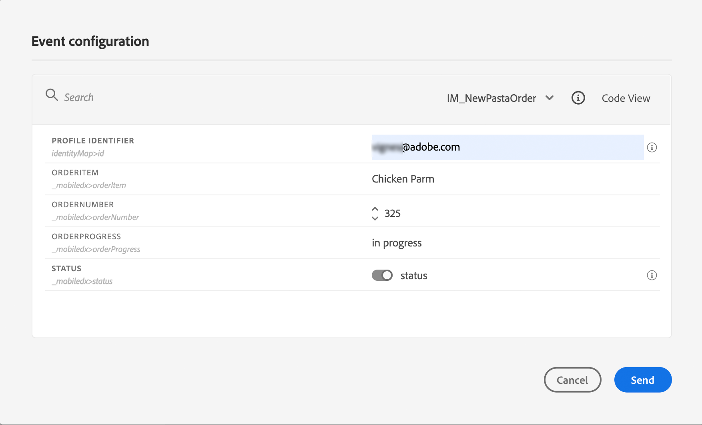

# Personalisering: orderstatusmeddelande {#personalization-use-case}

In this use case, you will see how to use multiple types of personalization in a single push notification message. Tre typer av personalisering kommer att användas:

* **Profil**: meddelandepersonalisering baserad på ett profilfält
* **Offer decision**: personalization based on offer decisioning variables
* **Kontext**: personalisering baserad på sammanhangsbaserade data från resan

Målet med det här exemplet är att skicka en händelse till [!DNL Journey Optimizer] varje gång en kundorder uppdateras. Därefter skickas ett push-meddelande till kunden med information om beställningen och ett personligt erbjudande.

I detta fall krävs följande krav:

* create and design a push notification message, without publishing it. Se detta [section](../messages/create-message.md).
* konfigurera en orderhändelse som innehåller ordernummer, status och artikelnamn. Se detta [section](../event/about-events.md).
* skapa ett beslut (tidigare kallat&quot;erbjudandeaktivitet&quot;), se denna [section](../offers/offer-activities/create-offer-activities.md).

## Steg 1 - Lägg till personalisering i profil {#add-perso}

1. Klicka på **[!UICONTROL Message]** och markera meddelandet.

   

1. Klicka på **Titel** fält.

   

1. Type in the subject and add profile personalization. Använd sökfältet för att hitta profilens förnamnsfält. Placera markören där du vill infoga anpassningsfältet i ämnestexten och klicka på **+** ikon. Click **Save**.

   

   >[!NOTE]
   >
   >Leave the message in draft. Publicera den inte än.

## Step 2 - Create the journey {#create-journey}

1. Klicka på **[!UICONTROL Journeys]** och skapa en ny resa.

   

1. Add your entry event, a **Message** and an **End** activity.

   

1. I **Meddelande** väljer du det meddelande som skapades tidigare. Click **Ok**.

   

   A message is displayed to inform you that the entry event data and journey properties have been passed to the message.

   

   >[!NOTE]
   >
   >Meddelandet visas med en varningsikon. Det beror på att meddelandet inte har publicerats än.

## Step 3 - Add personalization on contextual data {#add-perso-contextual-data}

1. From the **Message** activity, click the **Open the message** icon. The message opens in a new tab.

   

1. Click the **Title** field.

   

1. Select the **Context** category. Det här objektet är bara tillgängligt om en resa har passerat kontextdata till meddelandet. Click **Journey Orchestration**. Följande sammanhangsberoende information visas:

   * **Händelser**: den här kategorin grupperar alla fält från händelser som placerats före **Meddelande** verksamhet under resan.
   * **Reseegenskaper**: de tekniska fält som rör resan för en viss profil, t.ex. rese-ID eller de specifika fel som påträffats. Läs mer i [Journey Orchestration dokumentation](../building-journeys/expression/journey-properties.md).

   

1. Expandera **Händelser** och leta efter ordernummerfältet som hör till din händelse. Du kan också använda sökrutan. Klicka på **+** om du vill infoga anpassningsfältet i ämnestexten. Click **Save**.

   

1. Klicka nu på **Brödtext** fält.

   

1. Skriv meddelandet och infoga från **Kontext** kategori, orderartikelns namn och orderförloppet.

   

1. From the drop-down, select **Offer decision** to insert an offer decisioning variable. Välj placering och klicka på **+** -ikonen bredvid beslutet (tidigare kallat&quot;erbjudandeaktivitet&quot;) för att lägga till den i brödtexten.

   

1. Klicka på validera för att kontrollera att det inte finns några fel och klicka sedan på **Spara**.

   

1. Publicera meddelandet nu.

   

## Steg 4 - Testa och publicera resan {#test-publish}

1. Öppna resan igen. Om resan redan är öppen ser du till att du uppdaterar sidan. Nu när meddelandet har publicerats ser du att det inte finns något fel under resan. Klicka på **Testa** och sedan klicka **Utlös en händelse**.

   

1. Ange de olika värden som ska godkännas i testet. Test mode only works with test profiles. Profilidentifieraren måste motsvara en testprofil. Klicka **Skicka**.

   

   Push-meddelandet skickas och visas på testprofilens mobiltelefon.

   

1. Kontrollera att det inte finns något fel och publicera resan.
