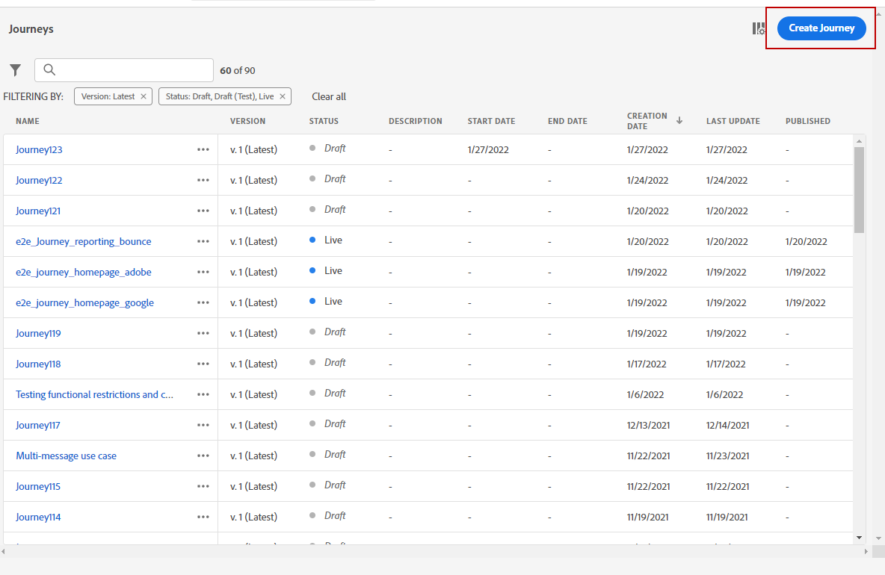
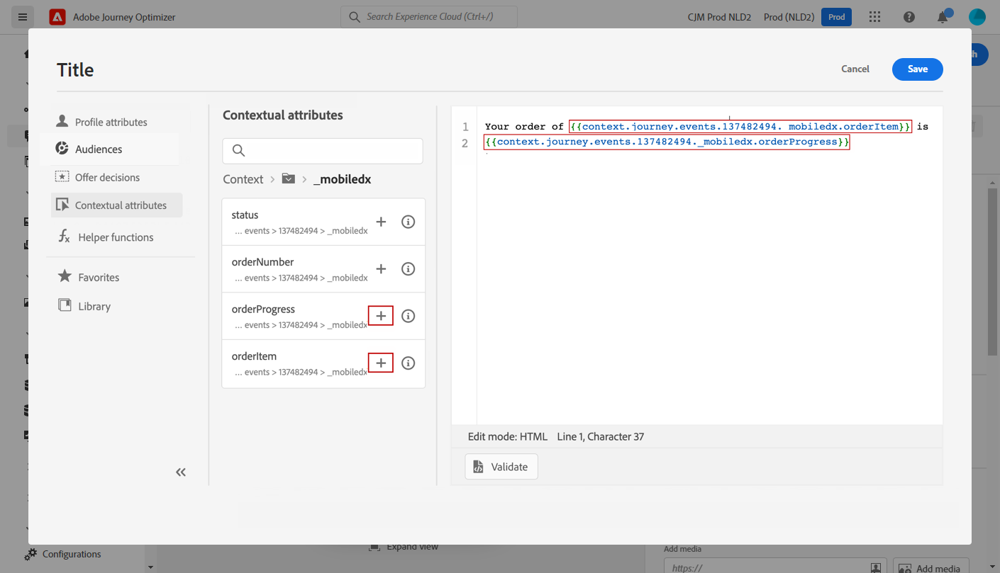

# Personalisering: orderstatusmeddelande {#personalization-use-case}

I det här fallet får du se hur du använder flera typer av personalisering i ett enda push-meddelande. Tre typer av personalisering kommer att användas:

* **Profil**: meddelandepersonalisering baserad på ett profilfält
* **Beslut om erbjudandet**: personalisering baserad på offer decisioning
* **Kontext**: personalisering baserad på sammanhangsbaserade data från resan

Målet med det här exemplet är att skicka en händelse till [!DNL Journey Optimizer] varje gång en kundorder uppdateras. Därefter skickas ett push-meddelande till kunden med information om beställningen och ett personligt erbjudande.

I detta fall krävs följande krav:

* skapa och utforma ett push-meddelande, utan att publicera det. Se detta [section](../messages/get-started-content.md).
* konfigurera en orderhändelse som innehåller ordernummer, status och artikelnamn. Se detta [section](../event/about-events.md).
* skapa ett beslut, se [section](../offers/offer-activities/create-offer-activities.md).

## Steg 1 - Lägg till personalisering i profil {#add-perso}

1. Klicka på **[!UICONTROL Message]** och markera meddelandet.

   

1. Klicka på **Titel** fält.

   

1. Skriv in ämnet och lägg till profilanpassning. Använd sökfältet för att hitta profilens förnamnsfält. Placera markören där du vill infoga anpassningsfältet i ämnestexten och klicka på **+** ikon. Klicka **Spara**.

   

   >[!NOTE]
   >
   >Lämna meddelandet i utkast. Publicera den inte än.

## Steg 2 - Skapa resan {#create-journey}

1. Klicka på **[!UICONTROL Journeys]** och skapa en ny resa.

   

1. Lägg till ditt tävlingsbidrag och en **Meddelande** aktivitet.

   

1. I **Meddelande** väljer du det meddelande som skapades tidigare. Klicka **OK**.

   

   Ett meddelande visas som informerar dig om att informationen om tävlingshändelsen och reseegenskaperna har skickats till meddelandet.

   

   >[!NOTE]
   >
   >Meddelandet visas med en varningsikon. Det beror på att meddelandet inte har publicerats än.

## Steg 3 - Lägg till personalisering på kontextuella data {#add-perso-contextual-data}

1. Från **Meddelande** aktivitet, klicka på **Öppna meddelandet** ikon. Meddelandet öppnas på en ny flik.

   

1. Klicka på **Titel** fält.

   

1. Välj **Sammanhangsberoende attribut** -menyn. Sammanhangsberoende attribut är bara tillgängliga om en resa har skickat kontextuella data till meddelandet. Klicka **Journey Orchestration**. Följande sammanhangsberoende information visas:

   * **Händelser**: den här kategorin grupperar alla fält från händelser som placerats före **Meddelande** verksamhet under resan.
   * **Reseegenskaper**: de tekniska fält som rör resan för en viss profil, t.ex. rese-ID eller de specifika fel som påträffats. Läs mer i [Journey Orchestration dokumentation](../building-journeys/expression/journey-properties.md).

   

1. Expandera **Händelser** och leta efter ordernummerfältet som hör till din händelse. Du kan också använda sökrutan. Klicka på **+** om du vill infoga anpassningsfältet i ämnestexten. Klicka **Spara**.

   

1. Klicka nu på **Brödtext** fält.

   

1. Skriv meddelandet och infoga från **[!UICONTROL Contextual attributes]** -menyn, namnet på orderobjektet och orderförloppet.

   

1. Välj **Erbjudandebeslut** om du vill infoga en offer decisioning-variabel. Välj placering och klicka på **+** -ikonen bredvid beslutet om att lägga till den i brödtexten.

   

1. Klicka på validera för att kontrollera att det inte finns några fel och klicka sedan på **Spara**.

   

1. Publicera meddelandet nu.

   

## Steg 4 - Testa och publicera resan {#test-publish}

1. Öppna resan igen. Om resan redan är öppen ser du till att du uppdaterar sidan. Nu när meddelandet har publicerats ser du att det inte finns något fel under resan. Klicka på **Testa** och sedan klicka **Utlös en händelse**.

   

1. Ange de olika värden som ska godkännas i testet. Testläget fungerar bara med testprofiler. Profilidentifieraren måste motsvara en testprofil. Klicka **Skicka**.

   

   Push-meddelandet skickas och visas på testprofilens mobiltelefon.

   

1. Kontrollera att det inte finns något fel och publicera resan.
