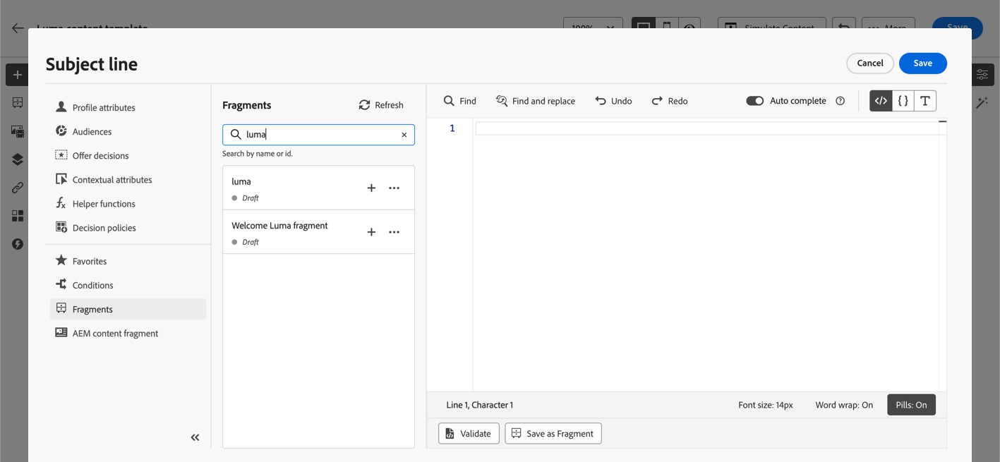
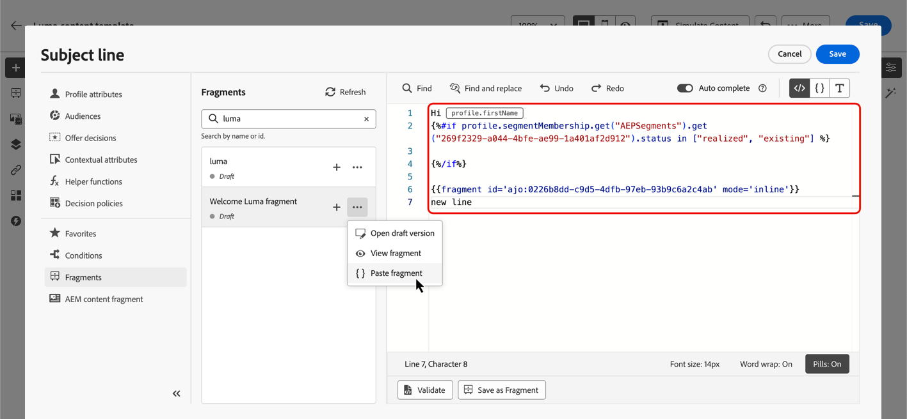

# Utnyttja uttrycksfragment {#use-expression-fragments}

När du använder **anpassningsredigeraren** kan du utnyttja alla uttrycksfragment som har skapats eller sparats i den aktuella sandlådan.

Ett fragment är en återanvändbar komponent som kan refereras till mellan [!DNL Journey Optimizer] kampanjer och resor. Med den här funktionen kan man skapa flera anpassade innehållsblock som kan användas av marknadsföringsanvändare för att snabbt sammanställa innehåll i en förbättrad designprocess. [Läs mer om fragment](../content-management/fragments.md)

➡️ [Lär dig hur du hanterar, redigerar och använder fragment i den här videon](../content-management/fragments.md#video-fragments)

## Använda ett uttrycksfragment {#use-expression-fragment}

Följ stegen nedan om du vill lägga till uttrycksfragment i ditt innehåll.

>[!NOTE]
>
>Du kan lägga till upp till 30 fragment i en viss leverans. Fragment kan bara kapslas upp till 1 nivå.

1. Öppna [anpassningsredigeraren](personalization-build-expressions.md) och välj knappen **[!UICONTROL Fragments]** i den vänstra rutan.

   I listan visas alla uttrycksfragment som har skapats eller sparats som fragment i den aktuella sandlådan. [Lär dig skapa fragment](../content-management/create-fragments.md)
De sorteras efter skapandedatum: nyligen tillagda uttrycksfragment visas först i listan.

   

   Du kan även uppdatera den här listan.

   >[!NOTE]
   >
   >Om vissa fragment har ändrats eller lagts till medan du redigerar innehållet, uppdateras listan med de senaste ändringarna.

1. Klicka på ikonen + bredvid ett uttrycksfragment för att infoga motsvarande fragment-ID i redigeraren.

   

   >[!CAUTION]
   >
   >Du kan lägga till valfritt **utkast**- eller **Live**-fragment till ditt innehåll. Du kan dock inte aktivera din resa eller kampanj om ett fragment med statusen **Utkast** används i det. Vid en resa eller kampanjpublicering kommer utkastsfragment att visa ett fel och du måste godkänna dem för att kunna publicera.

1. När fragment-ID har lagts till synkroniseras ändringarna om du öppnar motsvarande uttrycksfragment och [redigerar det](../content-management/manage-fragments.md#edit-fragments) från gränssnittet. De sprids automatiskt till alla utkast- eller direktresor/kampanjer som innehåller detta fragment-ID.

1. Klicka på knappen **[!UICONTROL More actions]** bredvid ett fragment. Välj **[!UICONTROL View fragment]** på snabbmenyn som öppnas om du vill ha mer information om det fragmentet. **[!UICONTROL Fragment ID]** visas också och kan kopieras härifrån.

   

1. Du kan öppna uttrycksfragmentet i ett annat fönster om du vill redigera dess innehåll och egenskaper, antingen med alternativet **[!UICONTROL Open fragment]** på snabbmenyn eller i rutan **[!UICONTROL Fragment info]**. [Lär dig hur du redigerar ett fragment](../content-management/manage-fragments.md#edit-fragments)

   

1. Du kan sedan anpassa och validera ditt innehåll som vanligt med hjälp av alla anpassnings- och redigeringsfunktioner i [personaliseringsredigeraren](personalization-build-expressions.md).

1. I vissa fall behöver du bara beräkna variabler, så du kanske vill dölja innehållet i uttrycksfragmentet. Om du vill göra det använder du attributet `render` och ställer in det på `false`. Exempel:

   ```
   Hi {{profile.person.name.firstName|fragment id='ajo:fragmentId/variantId' mode ='inline' render=false}}
   ```

>[!NOTE]
>
>Om du skapar ett uttrycksfragment som innehåller flera radbrytningar och använder det i [SMS](../sms/create-sms.md#sms-content) - eller [push](../push/design-push.md) -innehåll, bevaras radbrytningarna. Testa därför ditt [SMS](../sms/send-sms.md)- eller [push](../push/send-push.md)-meddelande innan du skickar det.

## Använd implicita variabler {#implicit-variables}

De implicita variablerna förbättrar befintliga fragmentfunktioner för att förbättra effektiviteten vid återanvändning av innehåll och skriptanvändning. Fragment kan använda indatavariabler och skapa utdatavariabler som kan användas i kampanj- och reseinnehåll.

Den här funktionen kan till exempel användas för att initiera spårningsparametrar för dina e-postmeddelanden, baserat på den aktuella kampanjen eller resan, och använda dessa parametrar i de anpassade länkar som läggs till i e-postinnehållet.

Följande användningsområden är möjliga:

1. **Använd indatavariabler i ett fragment.**

   När ett fragment används i ett kampanj-/reseåtgärdsinnehåll kan det utnyttja variabler som deklarerats utanför fragmentet. Nedan visas ett exempel:

   

   Ovanför `utm_content`-variabeln har deklarerats i kampanjinnehållet. När fragmentet **Hero-blocket** används visas en länk till vilken `utm_content`-parametervärdet ska läggas till. Slutresultatet är: `https://luma.enablementadobe.com?utm_campaign= Product_launch&utm_content= start_shopping`.

1. **Använd en utdatavariabel från ett fragment.**

   Variabler som beräknas eller definieras inuti ett fragment är tillgängliga för användning i innehållet. I följande exempel deklarerar ett fragment **F1** en uppsättning variabler:

   

   I ett e-postinnehåll kan du ha följande personalisering:

   

   Fragmentet F1 initierar följande variabler: `utm_campaign` och `utm_content`. Länken i meddelandeinnehållet får sedan dessa parametrar tillagda. Slutresultatet är: `https://luma.enablementadobe.com?utm_campaign= Product_launch&utm_content= start_shopping`.

>[!NOTE]
>
>Under körning expanderar systemet det som är inuti fragment och tolkar sedan personaliseringskoden uppifrån och ned. Med detta i åtanke kan man uppnå mer komplexa användningsfall. Du kan till exempel ha ett fragment F1 som skickar variabler till ett annat fragment F2 som sitter nedanför. Du kan också ha ett visuellt fragment F1 som skickar variabler till ett kapslat uttrycksfragment F2.


## Anpassa redigerbara fält {#customize-fields}

Om vissa delar av ett uttrycksfragment har gjorts redigerbara med hjälp av variabler, kan du åsidosätta deras standardvärden med en viss syntax. [Lär dig hur du anpassar fragment](../content-management/customizable-fragments.md)

Följ de här stegen för att anpassa fälten:

1. Infoga fragmentet i koden från menyn **[!UICONTROL Fragments]**.

1. Använd `<fieldId>="<value>"`-koden i slutet av syntaxen för att åsidosätta variabelns standardvärde.

   I exemplet nedan åsidosätter vi värdet för en variabel vars ID är &quot;sport&quot; med &quot;yoga&quot;-värdet. Då visas&quot;yoga&quot; i fragmentinnehållet överallt där variabeln&quot;sport&quot; refereras.

   

Ett exempel som visar hur du lägger till redigerbara fält i ett uttrycksfragment och åsidosätter deras värden när du skapar ett e-postmeddelande finns i [det här avsnittet](../content-management/customizable-fragments.md#example).

## Bryt arv {#break-inheritance}

När du lägger till ett fragment-ID i personaliseringsredigeraren synkroniseras ändringarna som gjorts i det ursprungliga uttrycksfragmentet.

Du kan även klistra in innehållet i ett uttrycksfragment i redigeraren. Välj **[!UICONTROL Paste fragment]** på snabbmenyn för att infoga innehållet.



I så fall bryts arvet från det ursprungliga fragmentet. Fragmentets innehåll kopieras till redigeraren och ändringarna synkroniseras inte längre.

Det blir ett fristående element som inte längre är länkat till det ursprungliga fragmentet. Du kan redigera det som vilket annat element som helst i koden.

