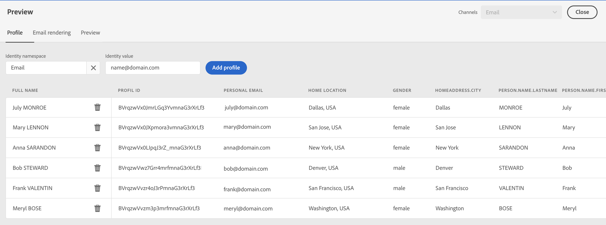

# Förhandsgranska och testa dina meddelanden{#preview-and-proof}

När meddelandeinnehållet har definierats kan du använda testprofiler för att förhandsgranska och testa det. If you inserted [personalized content](personalization/personalize.md), you will be able to check how this content is displayed in the message, leveraging test profile data.

Om du vill identifiera eventuella fel i e-postinnehåll eller personaliseringsinställningar skickar du korrektur för att testa profiler. Ett korrektur ska skickas varje gång en ändring görs för att validera det senaste innehållet.

>[!CAUTION]
>
>Du måste ha testprofiler tillgängliga för att kunna förhandsgranska meddelanden och skicka korrektur.
>
>Learn how to create test profiles in [this page](building-journeys/creating-test-profiles.md).

Om du vill testa ditt meddelandeinnehåll måste du:

* [välj testprofiler](#select-test-profiles)
* [kontrollera meddelandets förhandsgranskning](#preview-your-messages)

You will then be able to [send proofs](#send-proofs) to your test profiles.

Dessutom kan du **Litmus** konto till [!DNL Journey Optimizer] för att omedelbart förhandsgranska **e-poståtergivning** i vanliga e-postklienter. Sedan kan ni se till att e-postinnehållet ser bra ut och fungerar som det ska i alla inkorgar. Lär dig hur du låser upp Litmus-e-postförhandsvisningar i [det här avsnittet](#email-rendering)

>[!CAUTION]
>
>När du förhandsgranskar ett meddelande eller skickar korrektur visas endast profilpersonaliseringsdata. Personalisering som bygger på kontextdata, t.ex. händelseinformation, kan bara testas i samband med en resa. Lär dig hur du testar personalisering i [det här användningsfallet](personalization/personalization-use-case.md).

➡️ [Lär dig hur du förhandsgranskar, korrekturläser och publicerar e-postmeddelanden i den här videon](#video-preview)

## Välj testprofiler{#select-test-profiles}

>[!CONTEXTUALHELP]
>id="ac_preview_testprofiles"
>title="Preview and test your messages"
>abstract="När meddelandeinnehållet har definierats kan du använda testprofiler för att förhandsgranska och testa det."
>additional-url="https://experienceleague.adobe.com/docs/journey-optimizer/using/create-messages/create-message/preview.html?lang=en#email-rendering" text="E-poståtergivning"
>additional-url="https://experienceleague.adobe.com/docs/journey-optimizer/using/create-messages/create-message/preview.html?lang=en#preview-your-messages" text="Förhandsgranskning"

Use [Test profiles](building-journeys/creating-test-profiles.md) to target additional recipients who do not match the defined targeting criteria.

To select test profiles, follow the steps below:

1. I meddelandegränssnittet eller i e-postdesignern klickar du på **[!UICONTROL Show preview]** för att komma åt valet av testprofil.

   

1. Markera namnutrymmet som ska användas för att identifiera testprofiler genom att klicka på **[!UICONTROL Identity namespace]** markeringsikon.

   

   Läs mer om Adobe Experience Platform identitetsnamnutrymmen [i det här avsnittet](get-started-identity.md){target=&quot;_blank&quot;}.

   I exemplet nedan använder vi **E-post** namnutrymme.

1. Använd sökfältet för att hitta namnutrymmet, markera det och klicka på **[!UICONTROL Select]**

   

1. Ange värdet för att identifiera testprofilen och klicka på **[!UICONTROL Find test profile]**.

   

1. Om du har lagt till personalisering i ditt meddelande lägger du till andra profiler så att du kan testa olika varianter av meddelandet beroende på profildata. När du har lagt till profiler visas de under urvalsfälten.

   

   Baserat på elementen för meddelandeanpassning visar den här listan data för varje testprofil i de relaterade kolumnerna.

## Förhandsgranska meddelanden{#preview-your-messages}

En gång [testprofiler](#select-test-profiles) om du har valt det här alternativet kan du förhandsgranska meddelanden och kontrollera innehåll.

1. Klicka på **[!UICONTROL Preview]** för att testa meddelandet.

1. Välj en testprofil. You can check the values available in the columns. Använd höger-/vänsterpilarna för att bläddra bland data.

   

1. Klicka på **[!UICONTROL Select data]** -ikonen ovanför listan för att lägga till eller ta bort kolumner.

   

   I slutet av listan visas personaliseringsfält som är specifika för det aktuella meddelandet. I det här exemplet är profilens ort, förnamn och efternamn. Select those fields and make sure these values are populated in your test profiles.

1. I meddelandeförhandsgranskningen ersätts anpassade element med de valda testprofildata.

   För det här meddelandet är till exempel både e-postinnehåll och e-postämne personliga:

   

1. Välj andra testprofiler om du vill förhandsgranska e-poståtergivningen för varje variant av meddelandet.

For a push notification preview:

1. Växla till **[!UICONTROL Push]** från **[!UICONTROL Channels]** nedrullningsbar lista längst upp till höger i **[!UICONTROL Preview]** skärm.

   

1. Använd samma steg som beskrivs ovan för att välja en testprofil och välj typ av enhet för att förhandsgranska innehåll: **[!UICONTROL iOS]** eller **[!UICONTROL Android]**.

   

1. I push-förhandsgranskningen används testprofildata i meddelandeinnehållet.

   För det här push-meddelandet är till exempel både rubrik och brödtext personliga:

   

## Send proofs{#send-proofs}

Ett korrektur är ett specifikt meddelande som gör att du kan testa ett meddelande innan det skickas till huvudmålgruppen. Mottagarna av beviset ansvarar för att godkänna meddelandet: återgivning, innehåll, personaliseringsinställningar, konfiguration.

En gång [testprofiler](#select-test-profiles) om du har valt det här alternativet kan du skicka korrektur.

1. I **[!UICONTROL Preview]** klickar du på **[!UICONTROL Send proof]** -knappen.

   

1. From the **[!UICONTROL Send proof]** window, type in your recipient&#39;s email and click **[!UICONTROL Add]** to send the proof to yourself or members of your organizations.

   Note that you can add up to ten recipients for your proof delivery.

   

1. Välj sedan **Testprofiler** som kommer att användas för att anpassa meddelandeinnehållet.

   Varje mottagare får lika många meddelanden som antalet valda testprofiler. For example, if you added five recipient emails and selected ten test profiles, then you will send fifty proof messages, and each recipient will receive ten of them.

1. Du kan vid behov lägga till ett prefix till korrekturens ämnesrad. Endast alfanumeriska tecken och specialtecken, t.ex. . - _ ( ) [ ], tillåts som prefix till ämnesraden.

1. Klicka på **[!UICONTROL Send proof]**.

   

1. Tillbaka i  **[!UICONTROL Preview]** klickar du på  **[!UICONTROL View proofs]** för att kontrollera status.

   

Vi rekommenderar att du skickar korrektur efter varje ändring av meddelandeinnehållet.

>[!NOTE]
>
>I det korrektur som skickas till testprofilerna är länken till spegelsidan inte aktiv. Den aktiveras endast i de slutliga meddelandena.

## E-poståtergivning{#email-rendering}

You can leverage your **Litmus** account into [!DNL Journey Optimizer] to instantly preview your **email rendering** in popular email clients.

To access Email rendering capabilities, you need to:

* Har ett Litmus-konto
* [Välj testprofiler](#select-test-profiles)

Then, follow the steps below:

1. In the Email Designer, click the **[!UICONTROL Preview]** button and select the **[!UICONTROL Email rendering]** tab.

1. Click **Connect your Litmus account** on the upper right section.

   

1. Ange dina inloggningsuppgifter och logga in.

   

1. Klicka på **Kör test** om du vill generera förhandsgranskningar via e-post.

1. Check your email content in popular desktop, mobile and web-based clients.

   

>[!CAUTION]
>
>När du ansluter **Litmus** konto med [!DNL Journey Optimizer]godkänner du att testmeddelanden skickas till Litmus: När de väl har skickats hanteras dessa e-postmeddelanden inte längre av Adobe. Följaktligen gäller Litmus-principen för datalagring i dessa e-postmeddelanden, inklusive personaliseringsdata som kan inkluderas i dessa testmeddelanden.

## Instruktionsvideo{#video-preview}

Lär dig hur du testar e-poståtergivning i olika inkorgar, hur du förhandsgranskar anpassade e-postmeddelanden mot testprofiler, skickar korrektur och publicerar e-postmeddelanden.

>[!VIDEO](https://video.tv.adobe.com/v/334239?quality=12)
