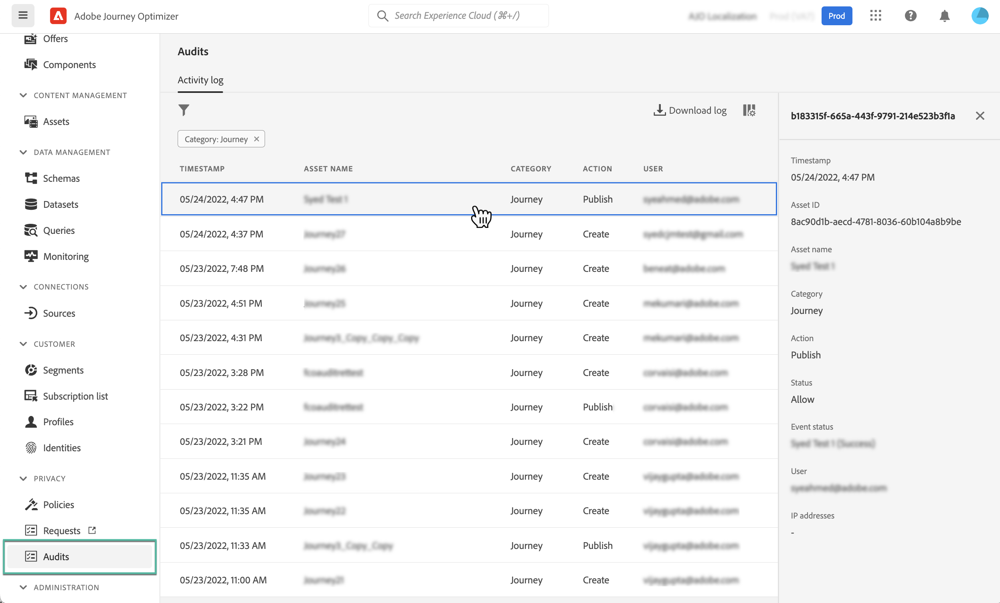

# Granskningsåtgärder för Journey Optimizer-resurser {#track-changes}

## Om granskningsloggar {#audit-logs}

>[!IMPORTANT]
>
>Om du vill visa och exportera granskningsloggen måste du ha behörighet **[!DNL View User Activity Log]**. [Läs mer](../administration/ootb-product-profiles.md)

Med Journey Optimizer kan du identifiera vilka åtgärder som användare i systemet utför på olika tjänster och funktioner som resor, meddelanden, landningssidor osv.

Detta gör att ni kan öka synligheten för aktiviteter som utförs i systemet, felsöka problem och hjälpa ert företag att följa regler och policyer för företagsdatahantering.

Varje åtgärd registreras med metadata i &quot;granskningsloggar&quot; som är tillgängliga i Adobe Experience Platform. Mer information om granskningsloggar, inklusive hur du visar och hanterar dem i användargränssnittet eller API, finns i [Adobe Experience Platform-dokumentationen](https://experienceleague.adobe.com/docs/experience-platform/landing/governance-privacy-security/audit-logs/overview.html?lang=sv-SE).

## Händelsetyper som hämtats av granskningsloggar {#events}

Följande tabell visar vilka åtgärder som Journey Optimizer-resurser registreras på i granskningsloggarna. Den fullständiga listan över åtgärder som har hämtats i granskningsloggarna finns i [Adobe Experience Platform-dokumentationen](https://experienceleague.adobe.com/docs/experience-platform/landing/governance-privacy-security/audit-logs/overview.html?lang=sv-SE#category).

>[!NOTE]
>
>Granskningsloggar som är relaterade till **beslutshantering** visas bara från CSV-filen som kan hämtas med knappen **[!UICONTROL Download log]**.

| Resurs | Åtgärd |
|-----------|------------------|
| AJO-kampanj | Skapa/ta bort/uppdatera/aktivera/stoppa |
| Allmänna inställningar för AJO-kanaler | Skapa/ta bort/uppdatera |
| AJO IP-pool | Skapa/ta bort/uppdatera |
| AJO landningssida | Skapa/ta bort/uppdatera/publicera/avpublicera |
| HTML-mall för AJO landningssida | Skapa/ta bort/uppdatera |
| AJO förinställning för landningssida | Skapa/ta bort/uppdatera |
| Underdomän för AJO landningssida | Skapa/ta bort/uppdatera |
| AJO-meddelandeförinställning | Skapa/ta bort/uppdatera |
| AJO PTR-post | Skapa/ta bort/uppdatera |
| AJO sparad uttrycksmall | Skapa/ta bort/uppdatera |
| AJO SMS API-autentiseringsuppgifter | Skapa/ta bort/uppdatera |
| AJO subdomän | Skapa/ta bort/uppdatera |
| AJO Suppression List | Skapa/ta bort/hämta CSV |
| Fältgrupper | Skapa/ta bort/uppdatera |
| Resa | Skapa/ta bort/uppdatera/stoppa/publicera |
| Anpassad reseåtgärd | Skapa/ta bort/uppdatera |
| Resurs, datakälla | Skapa/ta bort/uppdatera |
| Resehändelse | Skapa/ta bort/uppdatera |
| Regel för meddelandefrekvens | Skapa/ta bort/uppdatera |
| Rankningsstrategi | Skapa/ta bort/uppdatera |
