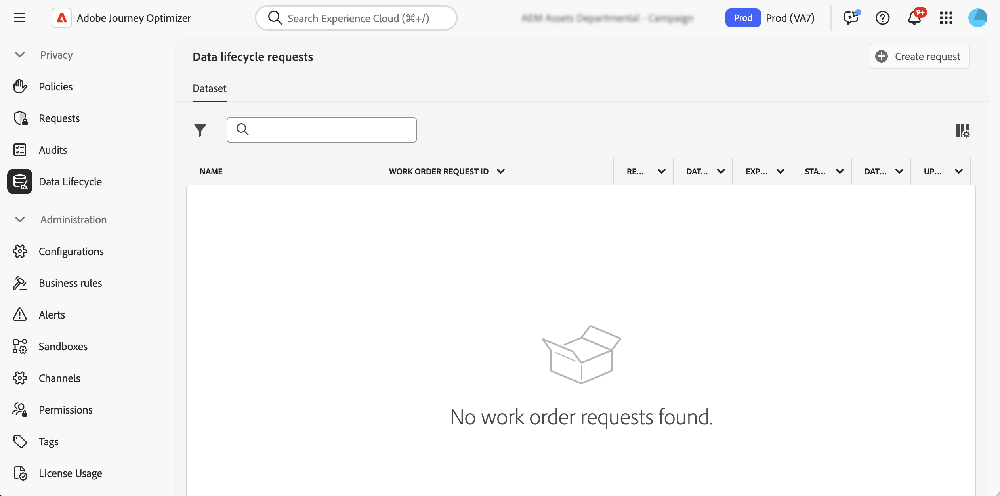

# Utför livscykelåtgärder för data {#data-hygiene}

>[!AVAILABILITY]
>
>Datalängden är för närvarande bara tillgänglig för organisationer som har köpt tilläggserbjudandena **Hälsovårdssköld** och **Sekretess och säkerhetssköld**.

När data hela tiden importeras till Adobe Experience Platform blir det viktigt att dina data används på rätt sätt, uppdateras vid behov och raderas enligt organisationsprofiler.

Dessa uppgifter kan utföras med hjälp av menyn **[!UICONTROL Data Lifecycle]**, som gör att du kan konfigurera och schemalägga datalivscykelåtgärder och på så sätt se till att posterna underhålls på rätt sätt.

## Rekommendationer {#data-hygiene-recommendations}

När du utför datahygien-åtgärder (som att ta bort identiteter eller datauppsättningar) ska du vara medveten om att historiska leveranshändelser som är kopplade till borttagna identiteter inte längre visas i vanliga rapporter eller datalagerfrågor. Detta kan leda till avvikelser mellan antalet e-postmeddelanden som rapporterats som **Levererat** och antalet e-postmeddelanden **Mottagna** i mottagarens inkorgar, särskilt för äldre resor.

Innan du utför storskaliga borttagningar ska du validera och exportera alla nödvändiga data för leverans eller rapportering. Om avstämning behövs efter datahygien, koordinera med Adobe support för att få tillgång till arkiverade loggar eller använd händelsedatauppsättningsfrågor för meddelandefeedback för senaste data.

## Läs mer {#data-hygiene-learn-more}

Mer information om Privacy Service och hur du utför livscykelåtgärder för data finns i Adobe Experience Platform dokumentation:

* [Privacy Service - översikt](https://experienceleague.adobe.com/docs/experience-platform/privacy/home.html?lang=sv)
* [Datalifecykel i Adobe Experience Platform](https://experienceleague.adobe.com/docs/experience-platform/hygiene/home.html)
