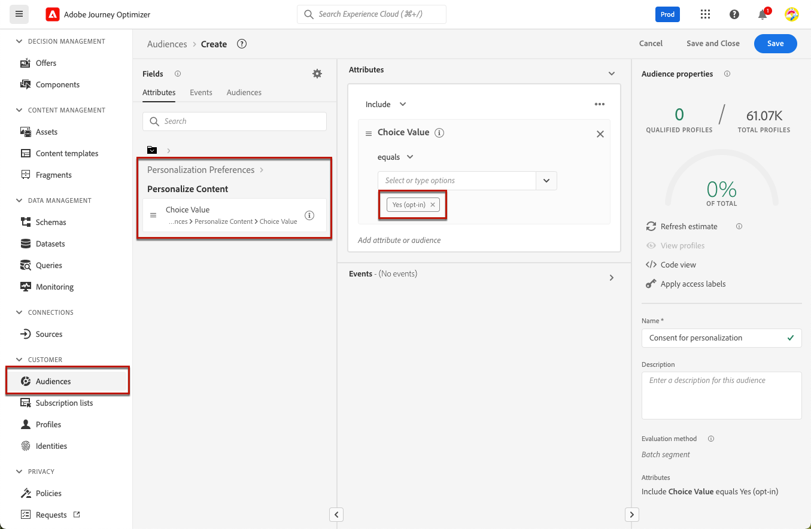
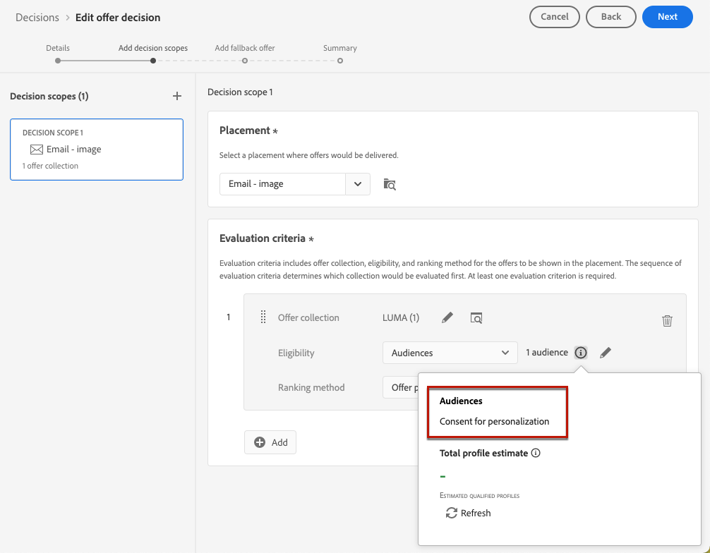
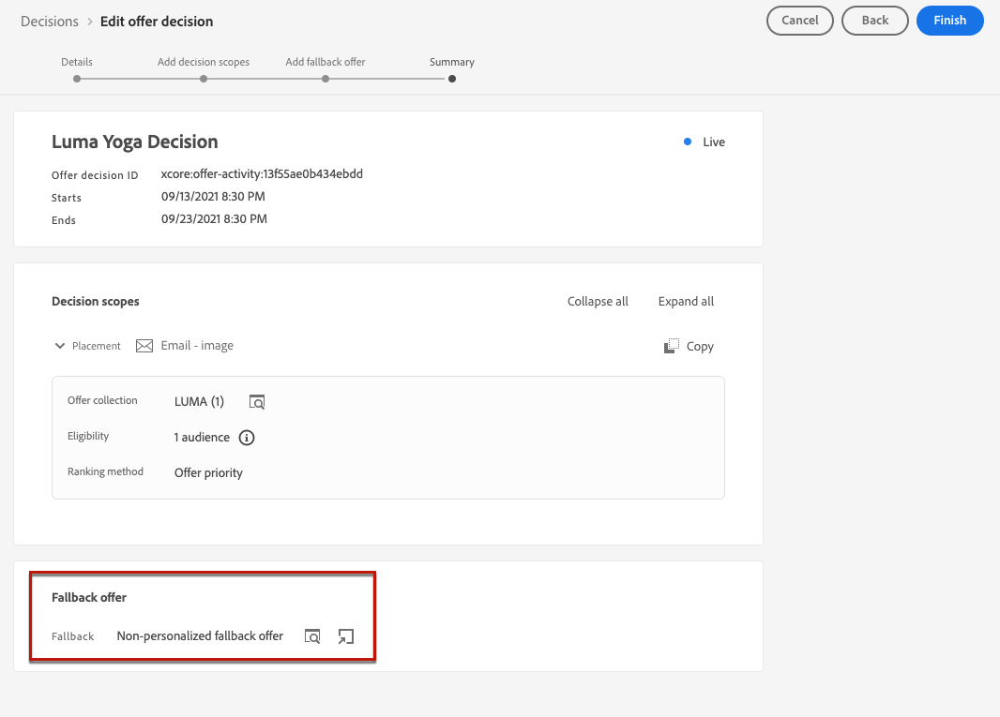

# Hantera avanmälan {#consent}

Att ge mottagarna möjlighet att avbryta prenumerationen på information från ett varumärke är ett juridiskt krav, liksom att se till att detta val respekteras. Om ni inte följer dessa regler medför detta juridiska risker för ert varumärke. Det hjälper er att undvika att skicka oombedda meddelanden till era mottagare, vilket kan få dem att märka era meddelanden som skräppost och skada ert rykte.

Läs mer om gällande lagstiftning i [Experience Platform-dokumentationen](https://experienceleague.adobe.com/docs/experience-platform/privacy/regulations/overview.html?lang=sv-SE#regulations){target="_blank"}.

## Hantera avbeställningar under resor och kampanjer {#opt-out-ajo}

När ni skickar meddelanden från resor eller kampanjer måste ni alltid se till att kunderna kan avbeställa dem från framtida kommunikation. När prenumerationen har avbrutits tas profilerna automatiskt bort från målgruppen för framtida marknadsföringsmeddelanden.

I **[!DNL Journey Optimizer]** finns sätt att hantera avanmälan i e-postmeddelanden och SMS-meddelanden, men push-meddelanden kräver ingen åtgärd från din sida, eftersom mottagarna kan avbeställa prenumerationen via sina enheter själva. När du till exempel hämtar eller använder programmet kan de välja att stoppa meddelanden. På samma sätt kan de ändra meddelandeinställningarna via det mobila operativsystemet.

>[!NOTE]
>
>Dessutom kan du använda Journey Optimizer **Suppression REST API** för att styra dina utgående meddelanden med hjälp av suppression och tillåtelselista. [Lär dig hur du arbetar med Suppression REST API](https://developer.adobe.com/journey-optimizer-apis/references/suppression/){target="_blank"}

Lär dig hur du hanterar avanmälan i Journey Optimizer e-post och SMS-meddelanden i följande avsnitt:

<table style="table-layout:fixed"><tr style="border: 0;">
<td>

<a href="../email/email-opt-out.md"><strong>Hantering av avanmälan via e-post</strong>

</td>
<td>

<a href="../sms/sms-opt-out.md"><strong>Hantering av SMS-avanmälan</strong></a>

</td>
</tr></table>

>[!NOTE]
>
>I [!DNL Journey Optimizer] hanteras samtycke av Experience Platform [Consent schema](https://experienceleague.adobe.com/docs/experience-platform/xdm/field-groups/profile/consents.html?lang=sv-SE){target="_blank"}. Som standard är värdet för medgivandefältet tomt och behandlas som samtycke för att ta emot dina meddelanden. Du kan ändra det här standardvärdet vid introduktion till ett av de möjliga värden som anges [här](https://experienceleague.adobe.com/docs/experience-platform/xdm/data-types/consents.html?lang=sv-SE#choice-values){target="_blank"}, eller använda [medgivandeprinciper](../action/consent.md) för att åsidosätta standardlogiken.

## Genomför personalisering {#opt-out-personalization}

Era kunder kan också välja bort att presenteras som personaliserat innehåll. När en profil har valt bort personalisering måste ni se till att deras data inte används för personalisering och ni måste ersätta allt personaliserat innehåll med en reservvariant.

### Beslutsförvaltning {#opt-out-decision-management}

När du utnyttjar erbjudanden implementeras inte personaliseringsinställningar automatiskt i [beslutsomfattningar](../offers/offer-activities/create-offer-activities.md#add-decision-scopes) som används från en [beslutande](../offers/api-reference/offer-delivery-api/decisioning-api.md) API-begäran eller en [edge-beslutande](../offers/api-reference/offer-delivery-api/edge-decisioning-api.md) API-begäran. I det här fallet måste du manuellt framtvinga godkännande av personalisering. Följ stegen nedan för att göra det.

>[!NOTE]
>
>Beslutsomfattningar som används i [!DNL Journey Optimizer] skapade kanaler uppfyller detta krav från den resa eller kampanj de tillhör.

1. Skapa en [Adobe Experience Platform-målgrupp](../audience/about-audiences.md) med [segmenteringstjänsten](https://experienceleague.adobe.com/docs/experience-platform/segmentation/ui/overview.html?lang=sv-SE){target="_blank"} och använd ett profilattribut som **[!UICONTROL Personalize Content = Yes (opt-in)]** för målanvändare som har samtyckt till personalisering.

   

1. När du skapar ett [beslut](../offers/offer-activities/create-offer-activities.md) ska du lägga till ett beslutsomfång och definiera ett berättigandevillkor baserat på den här målgruppen för varje samling av utvärderingskriterier som innehåller personaliserade erbjudanden.

   

1. Skapa ett [reserverbjudande](../offers/offer-library/creating-fallback-offers.md) som inte innehåller anpassat innehåll.

1. [Tilldela](../offers/offer-activities/create-offer-activities.md#add-fallback) det icke-personliga reserverbjudandet till beslutet.

   

1. [Granska och spara](../offers/offer-activities/create-offer-activities.md#review) beslutet.

Om en användare har:

* som har samtyckt till personalisering kommer beslutsomfånget att avgöra vilket som är det bästa erbjudandet för den profilen.

* inte samtycker till personalisering, kommer motsvarande profil inte att vara berättigad till något av de erbjudanden som finns i utvärderingskriterierna och kommer därför att få det icke-personaliserade reserverbjudandet.

>[!NOTE]
>
>Medgivande för att profildata används i [datamodellering](../offers/ranking/ai-models.md) stöds ännu inte i [!DNL Journey Optimizer].

### I personaliseringsredigeraren {#opt-out-expression-editor}

Anpassningsredigeraren [Personalisering](../personalization/personalization-build-expressions.md) utför inga kontroller eller kontroller av samtycke eftersom den inte deltar i meddelandeleveransen.

Men användningen av högerbaserade åtkomstkontrollsetiketter gör det möjligt att begränsa vilka fält som kan användas för personalisering. [Förhandsgranskning av meddelande](../content-management/preview.md) och [e-poståtergivningstjänsten](../content-management/rendering.md) maskerar de fält som identifieras med känslig information.

>[!NOTE]
>
>Läs mer om åtkomstkontroll på objektnivå (OLAC) i [det här avsnittet](../administration/object-based-access.md).

I [!DNL Journey Optimizer] kampanjer tillämpas principen för samtycke på följande sätt:

* Du kan inkludera definitioner av medgivandeprinciper när du skapar målgrupper för att försäkra dig om att målgruppen som valts för kampanjen redan har **filtrerat bort profiler som inte matchar medgivandekriterierna**.

* [!DNL Journey Optimizer] kommer att utföra en allmän godkännandekontroll på kanalnivå för att **kontrollera att profilerna har valt att ta emot marknadsföringskommunikation på motsvarande kanal i**.

  >[!NOTE]
  >
  >Kampanjobjektet [!DNL Journey Optimizer] utför för närvarande inga ytterligare efterlevnadskontroller av principen för samtycke.

Följ ett av alternativen nedan om du manuellt vill framtvinga godkännande av personalisering i kampanjer.

### Använda segmentregelverktyget

Du kan använda segmentregelbyggaren för att skapa en målgrupp som innehåller avanmälningsprofiler.

1. Skapa en [Adobe Experience Platform-målgrupp](../audience/about-audiences.md) med [segmenteringstjänsten](https://experienceleague.adobe.com/docs/experience-platform/segmentation/ui/overview.html?lang=sv-SE){target="_blank"}.

   

1. Välj ett profilattribut, till exempel **[!UICONTROL Personalize Content = No (opt-out)]**, om du vill exkludera användare som inte har godkänt personalisering.

   

1. Klicka på **[!UICONTROL Save]**.

Nu kan ni använda den här målgruppen för att filtrera bort profiler som inte har gett sitt medgivande till personalisering från era kampanjer.

### Använda en delad aktivitet i ett dispositionsarbetsflöde

Du kan också lägga till en kontroll för godkännande av personalisering till en målgrupp genom att lägga till en delad aktivitet i ett dispositionsarbetsflöde.

1. Skapa en målgrupp med alternativet **[!UICONTROL Compose Audience]**. [Läs mer om hur du skapar ett dispositionsarbetsflöde](../audience/get-started-audience-orchestration.md)

   

1. Lägg till din första målgrupp med den dedikerade knappen till höger.

1. Klicka på ikonen **+** och välj en **[!UICONTROL Split]**-aktivitet för att skapa en delad målgrupp.

   

1. I den högra rutan väljer du **[!UICONTROL Attribute split]** som delningstyp.

   

1. Klicka på pennikonen bredvid fältet **[!UICONTROL Attribute]** för att öppna fönstret **[!UICONTROL Select a profile attribute]**.

1. Sök efter personaliseringsmedgivandeattributet (`profile.consents.personalize.content.val`) och markera det.

   

1. **[!UICONTROL Path 1]** blir den icke-personliga målgruppen. Välj en relevant etikett.

1. Välj lämpligt värde i [listan](https://experienceleague.adobe.com/docs/experience-platform/xdm/data-types/consents.html?lang=sv-SE#choice-values){target="_blank"}.

   I det här fallet använder vi `n` för att ange att användare inte godkänner att deras data används för personalisering.

   

1. Du kan skapa en separat bana för andra alternativvärden. Du kan också välja att ta bort de återstående sökvägarna och aktivera **[!UICONTROL Other profiles]** om du vill ta med alla andra profiler som inte har något valvärde som är `n`.

1. När du är klar klickar du på **[!UICONTROL Save Audience]** för varje sökväg för att spara resultatet av arbetsflödet till en ny målgrupp. En målgrupp sparas i Adobe Experience Platform för varje bana.

1. Publicera kompositionsarbetsflödet när du är klar.

Nu kan ni använda den här målgruppen för att filtrera bort profiler som inte har gett sitt medgivande till personalisering från era kampanjer.

>[!NOTE]
>
>Om ni skapar en målgrupp som inte har gett sitt samtycke till personalisering och sedan väljer ut den här målgruppen i en kampanj, kommer personaliseringsverktygen fortfarande att vara tillgängliga. Det är upp till era marknadsföringsanvändare att förstå att om de arbetar med en målgrupp som inte bör ta emot personalisering, bör de inte använda personaliseringsverktyg.
