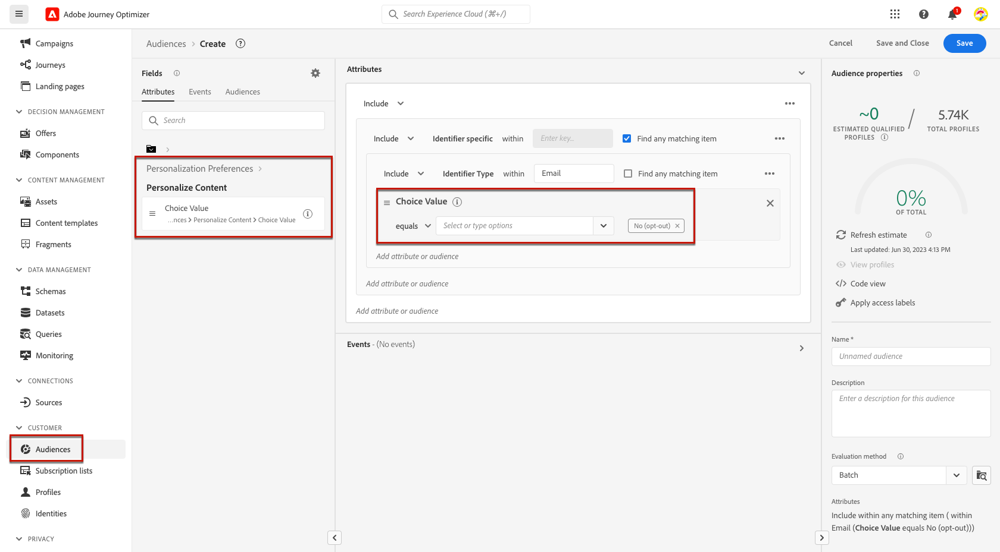
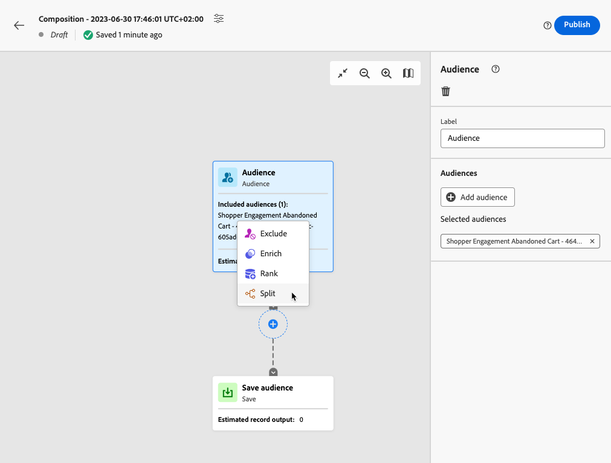

# Hantera avanmälan {#consent}

Att ge mottagarna möjlighet att avbryta prenumerationen på information från ett varumärke är ett juridiskt krav, liksom att se till att detta val respekteras. Om ni inte följer dessa regler medför detta juridiska risker för ert varumärke. Det hjälper er att undvika att skicka oombedda meddelanden till era mottagare, vilket kan få dem att märka era meddelanden som skräppost och skada ert rykte.

Läs mer om gällande lagstiftning i [Experience Platform dokumentation](https://experienceleague.adobe.com/docs/experience-platform/privacy/regulations/overview.html#regulations){target="_blank"}.

## Hantera avbeställningar under resor och kampanjer {#opt-out-ajo}

När ni skickar meddelanden från resor eller kampanjer måste ni alltid se till att kunderna kan avbeställa dem från framtida kommunikation. När prenumerationen har avbrutits tas profilerna automatiskt bort från målgruppen för framtida marknadsföringsmeddelanden.

while **[!DNL Journey Optimizer]** innehåller sätt att hantera avanmälan i e-postmeddelanden och SMS-meddelanden. Push-meddelanden kräver ingen åtgärd från din sida, eftersom mottagarna kan avbeställa prenumerationen via sina enheter. När du till exempel hämtar eller använder programmet kan de välja att stoppa meddelanden. På samma sätt kan de ändra meddelandeinställningarna via det mobila operativsystemet.

>[!NOTE]
>
>Dessutom kan man utnyttja Journey Optimizer **Suppression REST API** för att styra utgående meddelanden med hjälp av suppression och tillåtelselista. [Lär dig hur du arbetar med Suppression REST API](https://developer.adobe.com/journey-optimizer-apis/references/suppression/){target="_blank"}

Lär dig hur du hanterar avanmälan i Journey Optimizer e-post och SMS-meddelanden i följande avsnitt:

<table style="table-layout:fixed"><tr style="border: 0;">
<td>

<a href="../email/email-opt-out.md"><strong>Hantering av avanmälan via e-post</strong>

</td>
<td>

<a href="../sms/sms-opt-out.md"><strong>Hantering av SMS-avanmälan</strong></a>

</td>
</tr></table>

>[!NOTE]
>
>I [!DNL Journey Optimizer], samtycke hanteras av Experience Platform [Samtyckesschema](https://experienceleague.adobe.com/docs/experience-platform/xdm/field-groups/profile/consents.html){target="_blank"}. Som standard är värdet för medgivandefältet tomt och behandlas som samtycke för att ta emot dina meddelanden. Du kan ändra det här standardvärdet när du går vidare till något av de möjliga värdena som anges [här](https://experienceleague.adobe.com/docs/experience-platform/xdm/data-types/consents.html#choice-values){target="_blank"}.

## Genomför personalisering {#opt-out-personalization}

Era kunder kan också välja bort att presenteras som personaliserat innehåll. När en profil har valt bort personalisering måste ni se till att deras data inte används för personalisering och ni måste ersätta allt personaliserat innehåll med en reservvariant.

### Beslutsförvaltning {#opt-out-decision-management}

När du utnyttjar erbjudanden implementeras inte personaliseringsinställningar automatiskt i [beslutsomfattningar](../offers/offer-activities/create-offer-activities.md#add-decision-scopes) används från en [beslut](../offers/api-reference/offer-delivery-api/decisioning-api.md) API-begäran eller [kantavkänning](../offers/api-reference/offer-delivery-api/edge-decisioning-api.md) API-begäran. I det här fallet måste du manuellt framtvinga godkännande av personalisering. Följ stegen nedan för att göra det.

>[!NOTE]
>
>Beslutsomfattningar som används i [!DNL Journey Optimizer] skapade kanaler uppfyller detta krav från den resa eller kampanj de tillhör.

1. Skapa en [Adobe Experience Platform](../audience/access-audiences.md) med [Segmenteringstjänst](https://experienceleague.adobe.com/docs/experience-platform/segmentation/ui/overview.html){target="_blank"} och använda ett profilattribut som **[!UICONTROL Personalize Content = Yes (opt-in)]** för målanvändare som har samtyckt till personalisering.

   

1. När en [beslut](../offers/offer-activities/create-offer-activities.md), lägger till ett beslutsomfång och definierar ett villkor för behörighet baserat på den här målgruppen för varje samling av utvärderingskriterier som innehåller personaliserade erbjudanden.

   

1. Skapa en [grunderbjudande](../offers/offer-library/creating-fallback-offers.md) som inte innehåller personaliserat innehåll.

1. [Tilldela](../offers/offer-activities/create-offer-activities.md#add-fallback) det icke-personaliserade reserverbjudandet till beslutet.

   

1. [Granska och spara](../offers/offer-activities/create-offer-activities.md#review) beslutet.

Om en användare har:

* som har samtyckt till personalisering kommer beslutsomfånget att avgöra vilket som är det bästa erbjudandet för den profilen.

* inte samtycker till personalisering, kommer motsvarande profil inte att vara berättigad till något av de erbjudanden som finns i utvärderingskriterierna och kommer därför att få det icke-personaliserade reserverbjudandet.

>[!NOTE]
>
>Medgivande för att profildata används i [datamodellering](../offers/ranking/ai-models.md) stöds inte ännu [!DNL Journey Optimizer].

### I personaliseringsredigeraren {#opt-out-expression-editor}

The [personaliseringsredigerare](../personalization/personalization-build-expressions.md) inte utför någon kontroll eller verkställighet av samtycke eftersom den inte deltar i meddelandeleveransen.

Men användningen av högerbaserade åtkomstkontrollsetiketter gör det möjligt att begränsa vilka fält som kan användas för personalisering. The [förhandsgranska meddelande](../content-management/preview.md) och [e-poståtergivningstjänst](../content-management/rendering.md) maskerar de fält som identifieras med känslig information.

>[!NOTE]
>
>Läs mer om OLAC (Object level access control) i [det här avsnittet](../administration/object-based-access.md).

I [!DNL Journey Optimizer] kampanjer, tillämpas principen om samtycke på följande sätt:

* Du kan inkludera definitioner av samtyckespolicyer som en del av målgruppsskapandet för att säkerställa att den valda målgruppen för kampanjen redan har **filtrerade bort profiler som inte matchar medgivandekriterierna**.

* [!DNL Journey Optimizer] kommer att utföra en allmän godkännandekontroll på kanalnivå för att **se till att profilerna har valt** för att få marknadsföringsmaterial via motsvarande kanal.

  >[!NOTE]
  >
  >The [!DNL Journey Optimizer] själva kampanjobjektet utför för närvarande inte några ytterligare efterlevnadskontroller av principen för samtycke.

Följ ett av alternativen nedan om du manuellt vill framtvinga godkännande av personalisering i kampanjer.

### Använda segmentregelverktyget

Du kan använda segmentregelbyggaren för att skapa en målgrupp som innehåller avanmälningsprofiler.

1. Skapa en [Adobe Experience Platform](../audience/access-audiences.md) med [Segmenteringstjänst](https://experienceleague.adobe.com/docs/experience-platform/segmentation/ui/overview.html){target="_blank"}.

   

1. Välj ett profilattribut som **[!UICONTROL Personalize Content = No (opt-out)]** för att exkludera användare som inte har samtyckt till personalisering.

   

1. Klicka **[!UICONTROL Save]**.

Nu kan ni använda den här målgruppen för att filtrera bort profiler som inte har gett sitt medgivande till personalisering från era kampanjer.

### Använda en delad aktivitet i ett dispositionsarbetsflöde

Du kan också lägga till en kontroll för godkännande av personalisering till en målgrupp genom att lägga till en delad aktivitet i ett dispositionsarbetsflöde.

1. Skapa en målgrupp med **[!UICONTROL Compose Audience]** alternativ. [Läs mer om hur du skapar ett arbetsflöde för komposition](../audience/create-compositions.md)

   

1. Lägg till din första målgrupp med den dedikerade knappen till höger.

1. Klicka på **+** -ikonen och välj en **[!UICONTROL Split]** för att skapa en delad målgrupp. [Läs mer om Dela-aktiviteten](../audience/composition-canvas.md#split)

   

1. I den högra rutan väljer du **[!UICONTROL Attribute split]** som delningstyp.

   

1. Klicka på pennikonen bredvid **[!UICONTROL Attribute]** fältet som ska visas **[!UICONTROL Select a profile attribute]** -fönstret.

1. Sök efter attributet för personalisering (`profile.consents.personalize.content.val`) och markera den.

   

1. **[!UICONTROL Path 1]** kommer att vara den icke-personaliserade målgruppen. Välj en relevant etikett.

1. Välj ett lämpligt värde i det här [list](https://experienceleague.adobe.com/docs/experience-platform/xdm/data-types/consents.html#choice-values){target="_blank"}.

   I det här fallet använder vi `n` att ange att användare inte samtycker till att deras data används för personalisering.

   

1. Du kan skapa en separat bana för andra alternativvärden. Du kan också välja att ta bort de återstående banorna och aktivera **[!UICONTROL Other profiles]** om du vill ta med alla andra profiler som inte har något valvärde för `n`.

1. När du är klar klickar du **[!UICONTROL Save Audience]** för varje bana för att spara resultatet av arbetsflödet till en ny målgrupp. En målgrupp sparas i Adobe Experience Platform för varje bana.

1. Publicera kompositionsarbetsflödet när du är klar.

Nu kan ni använda den här målgruppen för att filtrera bort profiler som inte har gett sitt medgivande till personalisering från era kampanjer.

>[!NOTE]
>
>Om ni skapar en målgrupp som inte har gett sitt samtycke till personalisering och sedan väljer ut den här målgruppen i en kampanj, kommer personaliseringsverktygen fortfarande att vara tillgängliga. Det är upp till era marknadsföringsanvändare att förstå att om de arbetar med en målgrupp som inte bör ta emot personalisering, bör de inte använda personaliseringsverktyg.
