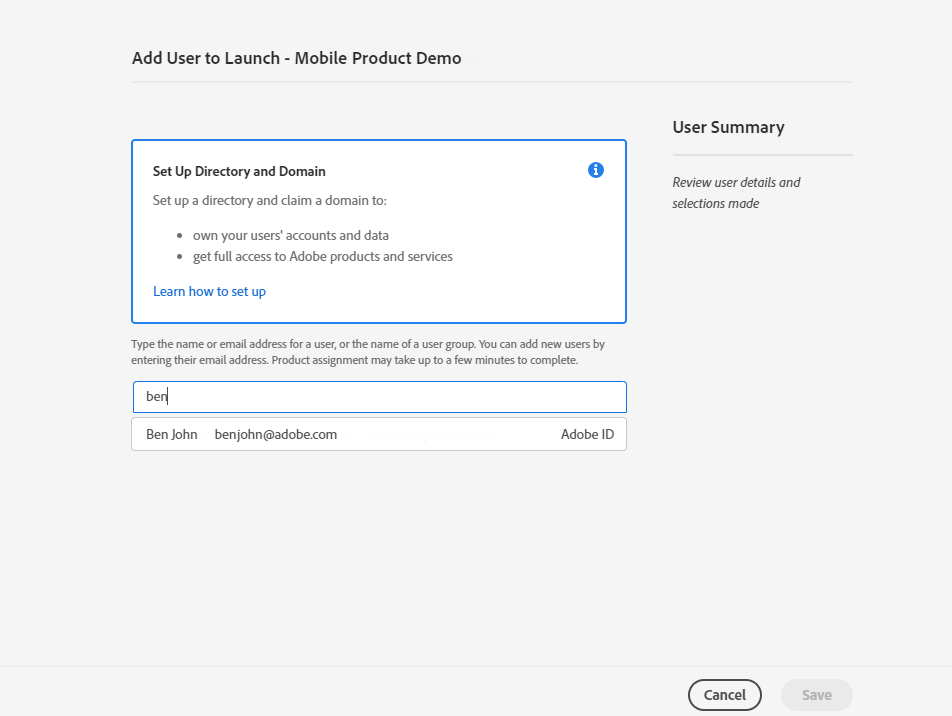
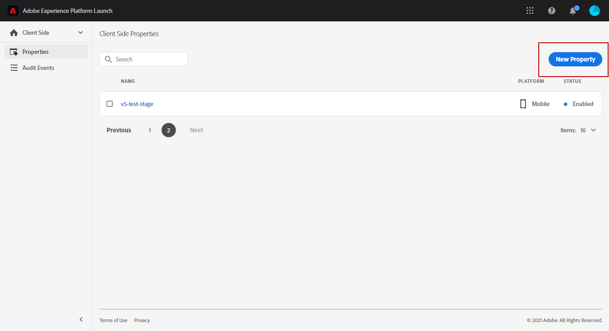
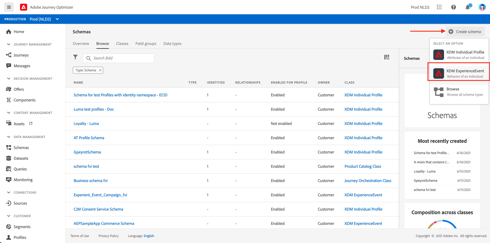
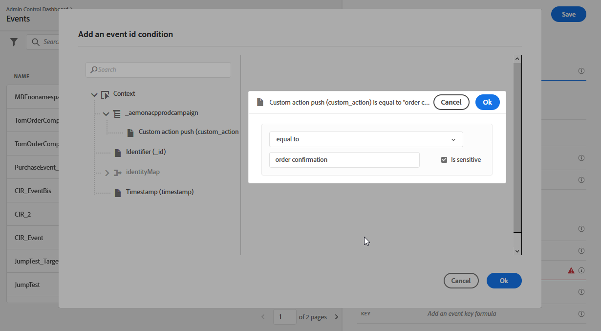
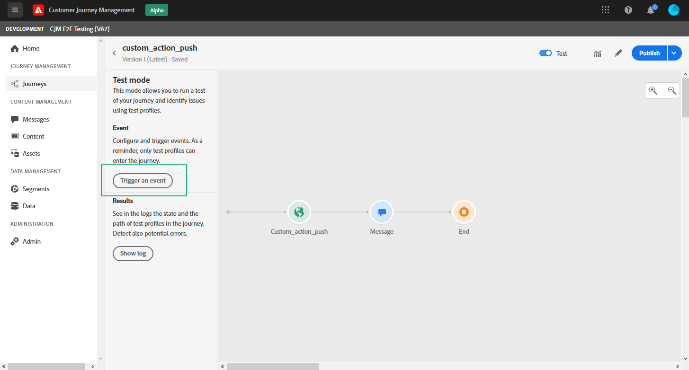

# Konfigurera push-meddelandekanal {#push-notification-configuration}


Innan du börjar skicka push-meddelanden med [!DNL Journey Optimizer] måste du definiera inställningar i både [!DNL Adobe Experience Platform] och [!DNL Adobe Experience Platform Launch].

## Adobe Experience Platform-inställningar {#platform-settings}

Så här konfigurerar du din mobilapp i [!DNL Adobe Experience Platform Launch]:

1. [Tilldela äggs- och företagsrättigheter](#push-rights)
1. [Lägg till ditt mobilprograms push-inloggningsuppgifter i Platform launch](#push-credentials-launch).
1. [Skapa Edge-](#edge-configuration) konfigurationer som ska användas av  **[!UICONTROL Edge]** tillägget för att skicka anpassade data från mobila enheter till  [!DNL Adobe Experience Platform].
1. [Ange en Platform launch-egenskap](#launch-property).
1. [Publicera egenskapen](#publish-property).
1. [Konfigurera ProfileDataSource](#configure-profiledatasource).

### Steg 1: Tilldela äggs- och företagsrättigheter {#push-rights}

Innan du skapar ett mobilprogram måste du se till att du har eller tilldelar rätt användarbehörigheter.

Mer information om användarhantering med [!DNL Adobe Experience Platform Launch] finns i [Platform launch documentation](https://experienceleague.adobe.com/docs/launch/using/admin/user-permissions.html#experience-cloud-permissions).

Så här tilldelar du egenskaps- och företagsrättigheter:

1. Gå till [!DNL Admin Console].

1. Välj **[!UICONTROL Adobe Experience Platform Launch]**-kortet på fliken **[!UICONTROL Products]**.

   

1. Välj en befintlig **[!UICONTROL Product Profile]** eller skapa en ny med knappen **[!UICONTROL New profile]**. Mer information om hur du skapar en ny **[!UICONTROL New profile]** finns i [Admin Console-dokumentationen](https://experienceleague.adobe.com/docs/experience-platform/access-control/ui/create-profile.html#ui).

1. Välj **[!UICONTROL Property rights]** på fliken **[!UICONTROL Permissions]**.

   

1. Klicka på **[!UICONTROL Add all]**. Följande rättigheter läggs till i din produktprofil:
   * **[!UICONTROL Approve]**
   * **[!UICONTROL Develop]**
   * **[!UICONTROL Manage Environments]**
   * **[!UICONTROL Manage Extensions]**
   * **[!UICONTROL Publish]**

   

1. Välj sedan **[!UICONTROL Company rights]** på den vänstra menyn.

   

1. Lägg till följande rättigheter:

   * **[!UICONTROL Manage App Configurations]**
   * **[!UICONTROL Manage Properties]**

   

1. Klicka på **[!UICONTROL Save]**.

Så här tilldelar du **[!UICONTROL Product profile]** till användare:

1. Välj **[!UICONTROL Adobe Experience Platform Launch]**-kortet på fliken **[!UICONTROL Products]**.[!DNL Admin Console]

1. Välj din tidigare konfigurerade **[!UICONTROL Product profile]**.

1. Klicka på **[!UICONTROL Add user]** på fliken **[!UICONTROL Users]**.

   

1. Skriv in användarens namn eller e-postadress och markera användaren. Klicka sedan på **[!UICONTROL Save]**.

   >[!NOTE]
   >
   >Om användaren inte redan har skapats i Admin Console läser du [dokumentationen till Lägg till användare](https://helpx.adobe.com/enterprise/admin-guide.html/enterprise/using/manage-users-individually.ug.html#add-users).

   


Du har nu rätt användarbehörighet för att skapa och konfigurera ett mobilprogram i [!DNL Adobe Experience Platform Launch].

### Steg 2: Lägg till push-autentiseringsuppgifter för mobilprogrammet i Platforma launchen {#push-credentials-launch}

När du har gett rätt användarbehörigheter måste du nu lägga till dina push-autentiseringsuppgifter för mobilprogrammet i [!DNL Adobe Experience Platform Launch].

Mer information och procedurer om hur du lägger till push-autentiseringsuppgifter för mobilprogram finns i [Adobe Experience Platform Mobile SDK-dokumentationen](https://aep-sdks.gitbook.io/docs/beta/adobe-journey-optimizer#configure-the-journey-optimizer-extension-in-launch).

<!--
Note that to add push credentials in [!DNL Adobe Experience Platform Launch], the owner of the mobile app should fetch them from APNs/FCM.
1. From [!DNL Adobe Experience Platform Launch], ensure that **[!UICONTROL Client Side]** is selected in the drop-down menu.

1. Select the **[!UICONTROL App Configurations]** tab in the left-hand panel and click **[!UICONTROL App Configuration]** to create a new configuration.

1. Enter a **[!UICONTROL Name]** for the configuration.

1. From the **[!UICONTROL Messaging Service Type]** drop-down menu, select the **[!UICONTROL Messaging service type]** to be used for these credentials. Here, we selected **[!UICONTROL Apple Push Notification Service]** since we are working with iOS.

1. Enter the mobile app **[!UICONTROL Bundle Id]** in the **[!UICONTROL App ID (iOS Bundle ID)]** field if you are using Apple push notification service or in the **[!UICONTROL App ID (Android package name)]** field if you are using Firebase Cloud Messaging.

    

1. Drag and drop the .p8 key file or the .json private key file to the **[!UICONTROL Push Credentials]** field.

1. Enter the **[!UICONTROL Key Id]** and **[!UICONTROL Team Id]** if you are using Apple push notification service.

1. Click **[!UICONTROL Save]** to create your app configuration.
-->

### Steg 3: Skapa Edge-konfiguration {#edge-configuration}

**[!UICONTROL Edge configuration]** används av  **[!UICONTROL Edge]** tillägget för att skicka anpassade data från den mobila enheten till  [!DNL Adobe Experience Platform].
Om du vill konfigurera [!DNL Adobe Experience Platform] måste du ange **[!UICONTROL Sandbox]**-namnet och **[!UICONTROL Event Dataset]**.

Mer information och procedurer om hur du skapar **[!UICONTROL Edge configuration]** finns i [Adobe Experience Platform Mobile SDK-dokumentationen](https://aep-sdks.gitbook.io/docs/getting-started/configure-datastreams).


<!--
1. From [!DNL Adobe Experience Platform Launch], select the **[!UICONTROL Edge Configurations]** tab and click **[!UICONTROL Edge Configurations]**.
    
1. Select **[!UICONTROL New Edge Configuration]** to add a new **[!UICONTROL Edge Configuration]**.
1. Enter a **[!UICONTROL Name]** and click **[!UICONTROL Save]**

1. Click the **[!UICONTROL Adobe Experience Platform]** toggle to enable it.

1. Fill in the **[!UICONTROL Sandbox]**, **[!UICONTROL Event dataset]** and **[!UICONTROL Profile Dataset]** fields. Then, click **[!UICONTROL Save]**.
    
    
-->

### Steg 4: Konfigurera en Platform launch-egenskap {#launch-property}

Genom att ställa in en [!DNL Adobe Experience Platform Launch]-egenskap kan mobilappsutvecklaren eller -marknadsföraren konfigurera SDK-attribut för mobila enheter, som timeout för session, målet för [!DNL Adobe Experience Platform]-sandlådan och **[!UICONTROL Adobe Experience Platform Datasets]** som ska användas för att skicka data till mobil-SDK.

Mer information och procedurer om hur du konfigurerar en **[!UICONTROL Platform Launch property]** finns i [Adobe Experience Platform Mobile SDK-dokumentationen](https://aep-sdks.gitbook.io/docs/getting-started/create-a-mobile-property#create-a-mobile-property).

För att de SDK:er som behövs för att push-meddelanden ska fungera behöver du följande SDK-tillägg för både Android och iOS:

* **[!UICONTROL Mobile Core]** (installeras automatiskt)
* **[!UICONTROL Profile]** (installeras automatiskt)
* **[!UICONTROL Adobe Experience Platform Edge]**
* **[!UICONTROL Adobe Experience Platform Assurance]**, valfritt men rekommenderas för felsökning av mobilimplementeringen.

Mer information om [!DNL Adobe Experience Platform Launch]-tillägg finns i [Platform launch documentation](https://experienceleague.adobe.com/docs/launch-learn/implementing-in-mobile-android-apps-with-launch/configure-launch/launch-add-extensions.html).

<!--

1. From [!DNL Adobe Experience Platform Launch], ensure that **[!UICONTROL Client Side]** is selected in the drop-down menu.

1. select the **[!UICONTROL Properties]** tab and click **[!UICONTROL New Property]**.

    

1. Enter a **[!UICONTROL Name]** for your new property.

1. Select **[!UICONTROL Mobile]** as **[!UICONTROL Platform]**.

    

1. Click **[!UICONTROL Save]** to create your new property.

To configure **[!UICONTROL Adobe Experience Platform Edge Extension]** to send custom data from mobile devices to [!DNL Adobe Experience Platform].

1. Select your previously created property and select the **[!UICONTROL Extensions]** tab to view the extensions for this property.

    

1. Click **[!UICONTROL Configure]** under the **[!UICONTROL Adobe Experience Platform Edge]** Network' extension.

1. From the **[!UICONTROL Edge Configuration]** drop-down list, select the **[!UICONTROL Edge Configuration]** created in the previous steps. For more information on **[!UICONTROL Edge Configuration]**, refer to this [section](#edge-configuration).

1. Click **[!UICONTROL Save]**.

To configure **[!UICONTROL Adobe Experience Platform Messaging]** extension to send push profile and push interactions to the correct datasets, follow the same steps as above. Use **[!UICONTROL Sandbox]**, **[!UICONTROL Event dataset]** and **[!UICONTROL Profile Dataset]** created in the [Adobe Experience Platform setup](#edge-configuration).
-->

### Steg 5: Publicera egenskapen {#publish-property}

Nu måste du publicera egenskapen för att integrera konfigurationen och använda den i mobilappen.

Om du vill publicera din egenskap, se stegen som beskrivs i [dokumentationen för Adobe Experience Platform Mobile SDK](https://aep-sdks.gitbook.io/docs/getting-started/create-a-mobile-property#publish-the-configuration)

### Steg 6: Konfigurera ProfileDataSource {#configure-profiledatasource}

Om du vill konfigurera `ProfileDataSource` använder du `ProfileDCInletURL` från [!DNL Adobe Experience Platform]-installationen och lägger till följande i mobilappen:

```
    MobileCore.updateConfiguration(
    mutableMapOf("messaging.dccs" to <ProfileDCSInletURL>)
```

<!--
## Test your mobile app with custom action {#mobile-app-test}

After configuring your mobile app in both Adobe Experience Platform and Adobe Launch, you can now test it before sending push notifications to your profiles. In this use case, we will create a journey to target our mobile app and set a custom action which will trigger the push notification.

You can use a test mobile app for this use case. For more on this, refer to this [page](https://wiki.corp.adobe.com/pages/viewpage.action?spaceKey=CJM&title=Details+of+setting+the+mobile+test+app) (internal use only).

For this journey to work, you need to create an XDM schema. For more information, refer to [XDM documentation](https://experienceleague.adobe.com/docs/experience-platform/xdm/schema/composition.html?lang=en#schemas-and-data-ingestion).

1. In the left menu, click **[!UICONTROL Data]** then **[!UICONTROL Schemas]** under **[!UICONTROL Data management]** to create your XDM schema.

    

1. Click **[!UICONTROL Create schema]** then select **[!UICONTROL XDM Experience event]**.

    

1. In the right pane, enter the name of your schema and description. Enable this schema for **[!UICONTROL Profile]**.

1. In the left pane, click **[!UICONTROL Add]** under **[!UICONTROL Mixins]** and select  **[!UICONTROL Create a new Mixin]**. For more information on how to create mixin, refer to [XDM System documentation](https://experienceleague.adobe.com/docs/experience-platform/xdm/api/create-mixin.html?lang=en#api).

    

1. Enter a **[!UICONTROL Display Name]** and a **[!UICONTROL Description]**. Click **[!UICONTROL Add mixin]** when done.

    

1. In the **[!UICONTROL Field properties]** window, add a **[!UICONTROL Field name]**, **[!UICONTROL Display name]** and select **[!UICONTROL String]** as **[!UICONTROL Type]**.

    

1. Check **[!UICONTROL Required]** and click **[!UICONTROL Apply]**.

1. Click **[!UICONTROL Save]**. Your schema is now created and can be used in an **[!UICONTROL Event schema]**.

You then need to set up an **[!UICONTROL Event schema]** where you will set the custom action which you will need to enter in your mobile app to trigger your push notification.

1. From the left menu of the home page, click the **[!UICONTROL Admin]** icon, then click **[!UICONTROL Manage]** from the **[!UICONTROL Events]** card to create your new **[!UICONTROL Event schema]**.

1. Click **[!UICONTROL Add]**, the event configuration pane opens on the right side of the screen.

    

1. Enter the name of your event. You can also add a description.

1. In the **[!UICONTROL Event ID type]** field, select **[!UICONTROL Rule Based]**.

1. In the **[!UICONTROL Parameters]**, select your previously created XDM event.

    

1. Click **[!UICONTROL Edit]** in the **[!UICONTROL Event ID condition]** field.

1. Drag and your previously added mixin to define the condition that will be used by the system to identify the events that will trigger your journey.

    

1. Type in the syntax that you will need to use to trigger your push notification in your test app, in this example **order confirmation**.

    

1. Select **[!UICONTROL ECID]** as your **[!UICONTROL Namespace]**.

1. Click **[!UICONTROL Ok]** then **[!UICONTROL Save]**.

Your **[!UICONTROL Event schema]** is now created and can now be used in a journey.

1. In the left menu from [!DNL Journey Optimizer] homepage, click **[!UICONTROL Journeys]**.

1. Click **[!UICONTROL Create]** to create a new journey.

    

1. Edit the journey's properties in the configuration pane displayed on the right side. Learn more in this [section](building-journeys/journey-gs.md#change-properties).

1. Start by drag and dropping the **[!UICONTROL Event schema]** created in the previous steps from the **[!UICONTROL Events]** drop-down.

    

1. From the **[!UICONTROL Actions]** drop-down, drag and drop a **[!UICONTROL Message]** activity to your journey.

1. Select a previously created message. For more information on how to create push notifications, refer to this [page](create-message.md).

1. Drag and drop an **[!UICONTROL End]** activity to your journey.

1. Activate **[!UICONTROL Test]** to your journey to start testing your push notifications and click **[!UICONTROL Trigger an event]**.

    

1. Enter your ECID in the **[!UICONTROL Key]** field then your event that will trigger the push notification in our case **order confirmation**.

    

1. Click **[!UICONTROL Send]**.

Your event will be triggered and you will receive your push notification to your mobile app.


-->

### Steg 7: Skapa en meddelandeförinställning {#message-preset}

När din mobilapp har konfigurerats i [!DNL Adobe Experience Platform Launch] måste du skapa en meddelandeförinställning för att kunna skicka push-meddelanden från **[!DNL Journey Optimizer]**.

Lär dig hur du skapar och konfigurerar en meddelandeförinställning i [det här avsnittet](configuration/message-presets.md).