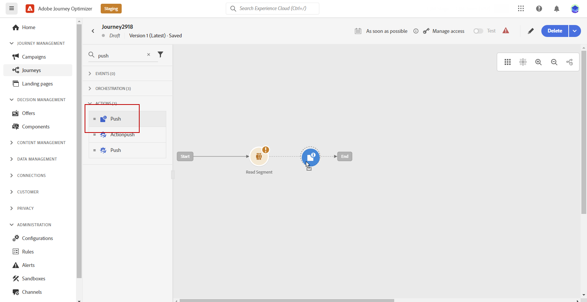
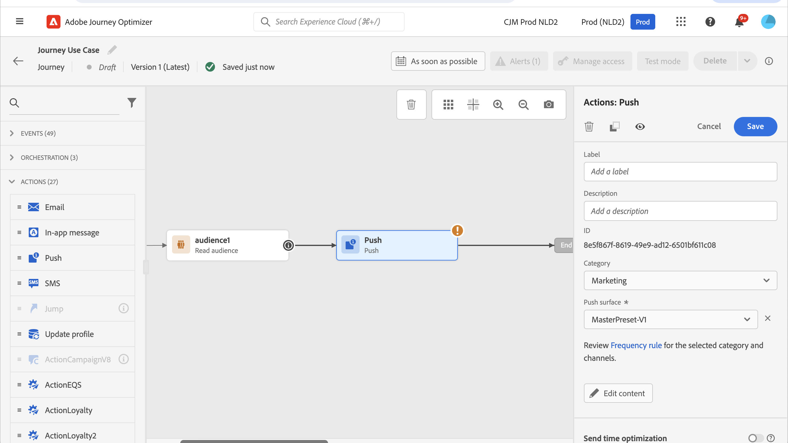

# Skapa ett push-meddelande {#create-push-notification}

>[!CONTEXTUALHELP]
>id="ajo_message_push"
>title="Skapa push-meddelanden"
>abstract="Lägg till ditt push-meddelande och börja personalisera det med personaliseringsredigeraren."

Du kan skapa push-meddelanden för mobila enheter (iOS och Android) och webbläsare. På den här sidan får du hjälp med att skapa ett push-meddelande för en resa eller kampanj.

## Skapa push-meddelanden i en resa eller kampanj {#create}

Följ stegen nedan för att skapa ett push-meddelande:

>[!BEGINTABS]

>[!TAB Lägg till en push i en resa]

1. Öppna resan och dra och släpp en push-aktivitet från funktionsmakroavsnittet på paletten.

   

1. Ange grundläggande information i meddelandet (etikett, beskrivning, kategori) och välj sedan den meddelandekonfiguration som ska användas.

   

   >[!NOTE]
   >
   >Om du skickar ett push-meddelande från en resa kan du utnyttja Adobe Journey Optimizer funktion för optimering av sändningstid för att förutsäga den bästa tidpunkten för att skicka meddelandet för att maximera engagemanget baserat på tidigare öppnings- och klickfrekvenser. [Lär dig hur du arbetar med optimering vid sändning](../building-journeys/send-time-optimization.md)

   Mer information om hur du konfigurerar en resa finns på [sidan](../building-journeys/journey-gs.md)

1. Klicka på knappen **[!UICONTROL Edit content]** på skärmen för konfiguration av resan för att konfigurera push-innehållet. [Designa ett push-meddelande](design-push.md)

1. När meddelandeinnehållet har definierats kan du använda testprofiler eller exempelindata som har överförts från en CSV-/JSON-fil, eller lägga till manuellt för att förhandsgranska innehållet.

1. När din push-funktion är klar slutför du konfigurationen av din [resa](../building-journeys/journey-gs.md) för att skicka den.

   Om du vill spåra mottagarnas beteende genom push-öppningar och/eller interaktioner kontrollerar du att de dedikerade alternativen i spårningsavsnittet är aktiverade i [e-postaktiviteten](../building-journeys/journeys-message.md).

>[!TAB Lägg till en push-knapp i en kampanj]

1. Öppna menyn **[!UICONTROL Campaigns]** och klicka sedan på **[!UICONTROL Create campaign]**.

1. Välj den typ av kampanj som du vill köra

   * **Schemalagd - marknadsföring**: Kör kampanjen direkt eller på ett angivet datum. Schemalagda kampanjer syftar till att skicka marknadsföringsmeddelanden. De konfigureras och körs från användargränssnittet.

   * **API-utlöst - Markering/transaktion**: Kör kampanjen med ett API-anrop. API-utlösta kampanjer syftar till att skicka antingen marknadsförings- eller transaktionsmeddelanden, dvs. meddelanden som skickas ut efter en åtgärd som utförs av en individ: lösenordsåterställning, kundvagn osv.

1. I avsnittet **[!UICONTROL Properties]** redigerar du din kampanjs **[!UICONTROL Title]** och **[!UICONTROL Description]**.

1. Klicka på knappen **[!UICONTROL Select audience]** för att definiera målgruppen i listan över tillgängliga Adobe Experience Platform-målgrupper. [Läs mer](../audience/about-audiences.md).

1. I fältet **[!UICONTROL Identity namespace]** väljer du det namnutrymme som ska användas för att identifiera personer från den valda målgruppen. [Läs mer](../event/about-creating.md#select-the-namespace).

1. I avsnittet **[!UICONTROL Actions]** väljer du **[!UICONTROL Push notification]** och väljer eller skapar en ny konfiguration.

   Läs mer om push-konfiguration för mobilen på [den här sidan](push-configuration.md) och för webben på [den här sidan](push-configuration-web.md).

   

1. Klicka på **[!UICONTROL Create experiment]** för att börja konfigurera ditt innehållsexperiment och skapa behandlingar för att mäta deras prestanda och identifiera det bästa alternativet för målgruppen. [Läs mer](../content-management/content-experiment.md)

1. Kampanjer är utformade för att köras ett visst datum eller med en återkommande frekvens. Lär dig hur du konfigurerar **[!UICONTROL Schedule]** för din kampanj i [det här avsnittet](../campaigns/create-campaign.md#schedule).

1. Välj **[!UICONTROL Action triggers]** för ditt push-meddelande på menyn **[!UICONTROL Frequency]**:

   * En gång
   * Dagligen
   * Vecka
   * Månatligen

1. Klicka på knappen **[!UICONTROL Edit content]** på konfigurationsskärmen för kampanjen för att konfigurera push-innehållet. [Designa ett push-meddelande](design-push.md)

1. När meddelandeinnehållet har definierats kan du använda testprofiler eller exempelindata som har överförts från en CSV-/JSON-fil, eller lägga till manuellt för att förhandsgranska innehållet.

1. Slutför konfigurationen av din [kampanj](../campaigns/create-campaign.md) för att skicka den när din push-funktion är klar.

   Om du vill spåra mottagarnas beteende genom push-öppningar och/eller interaktioner kontrollerar du att de dedikerade alternativen i spårningsavsnittet är aktiverade i [kampanjen](../campaigns/create-campaign.md).

>[!ENDTABS]

**Relaterade ämnen**

* [Konfigurera push-kanal](push-gs.md)
* [Lägg till ett meddelande i en resa](../building-journeys/journeys-message.md)

## Snabb leverans {#rapid-delivery}

>[!CONTEXTUALHELP]
>id="ajo_campaigns_rapid_delivery"
>title="Snabb leverans"
>abstract="I läget för snabb leverans kan du skicka meddelanden med hög hastighet via push-kanalen till en målgrupp på under 30 MB."

Snabb leverans är ett [!DNL Journey Optimizer]-tillägg som tillåter mycket snabba push-meddelanden som skickas i stora volymer via kampanjer.

Snabba leveranser används när fördröjningar i meddelandeleverans är affärskritiska när du vill skicka en snabb push-varning på mobiltelefoner, till exempel nyheter till användare som har installerat din nyhetskanalapp.

Mer information om prestanda när du använder läget Snabb leverans finns i [Adobe Journey Optimizer produktbeskrivning](https://helpx.adobe.com/se/legal/product-descriptions/adobe-journey-optimizer.html){target="_blank"}.

### Förhandskrav {#prerequisites}

Snabba leveransmeddelanden innehåller följande krav:

* Snabb leverans är endast tillgänglig för **[!UICONTROL Scheduled]** kampanjer och är inte tillgänglig för API-utlösta kampanjer,
* Ingen personalisering tillåts i push-meddelandet,
* Målgruppen måste innehålla färre än 30M profiler,
* Du kan köra upp till 5 kampanjer samtidigt i läget Snabb leverans.

### Aktivera läget Snabb leverans

1. Skapa en kampanj för push-meddelanden och aktivera alternativet **[!UICONTROL Rapid delivery]**.

   

1. Konfigurera meddelandeinnehållet och välj målgrupp. [Lär dig skapa en kampanj](#create)

   >[!IMPORTANT]
   >
   >Se till att meddelandeinnehållet inte innehåller någon personalisering och att målgruppen innehåller färre än 30 miljoner profiler.

1. Granska och aktivera kampanjen som vanligt. Observera att i testläge skickas inga meddelanden via läget Snabb leverans.