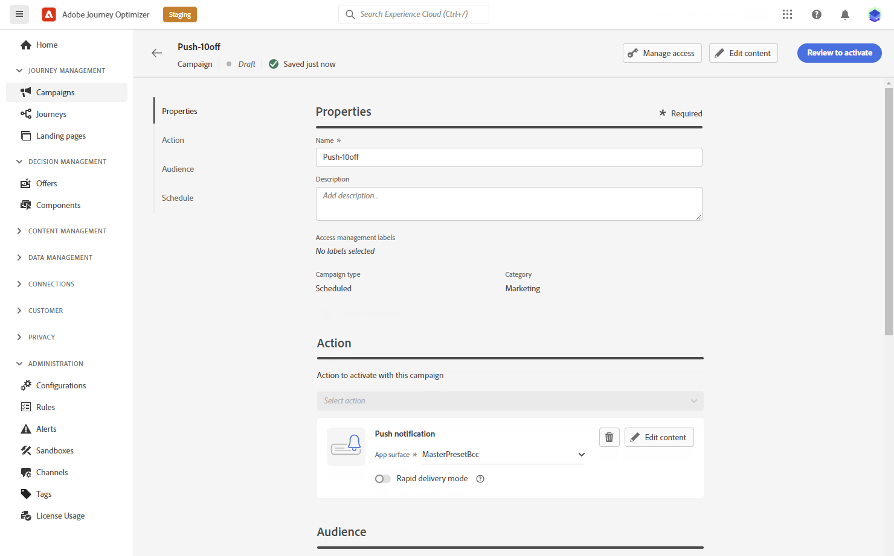

# Skapa ett push-meddelande {#create-push-notification}

>[!CONTEXTUALHELP]
>id="ajo_message_push"
>title="Skapa push-meddelanden"
>abstract="Lägg till ditt push-meddelande och börja personalisera det med uttrycksredigeraren."

## Skapa push-meddelanden i en resa eller kampanj {#create}

Så här skapar du ett push-meddelande:

>[!BEGINTABS]

>[!TAB Lägg till en push-funktion på en resa]

1. Öppna resan och dra och släpp en push-aktivitet från funktionsmakroavsnittet på paletten.

   

1. Ange grundläggande information i meddelandet (etikett, beskrivning, kategori) och välj sedan den meddelandeyta som ska användas. The **[!UICONTROL Surface]** som standard är fältet förifyllt med den sista yta som användaren använder för den kanalen.

   

   >[!NOTE]
   >
   >Om du skickar ett push-meddelande från en resa kan du utnyttja Adobe Journey Optimizer funktion för optimering av sändningstid för att förutsäga den bästa tidpunkten för att skicka meddelandet för att maximera engagemanget baserat på tidigare öppnings- och klickfrekvenser. [Lär dig hur du arbetar med optimering vid sändning](../building-journeys/journeys-message.md#send-time-optimization)

   Mer information om hur du konfigurerar en resa finns i [den här sidan](../building-journeys/journey-gs.md)

1. På skärmen för konfiguration av resan klickar du på **[!UICONTROL Edit content]** för att konfigurera push-innehållet. [Utforma ett push-meddelande](design-push.md)

1. När meddelandeinnehållet har definierats kan du använda testprofiler för att förhandsgranska och testa det.

1. Slutför konfigurationen av [resa](../building-journeys/journey-gs.md) för att skicka den.

   Om du vill spåra mottagarnas beteende genom push-öppningar och/eller interaktioner kontrollerar du att de dedikerade alternativen i spårningsavsnittet är aktiverade i [e-postaktivitet](../building-journeys/journeys-message.md).

>[!TAB Lägga till en push-knapp i en kampanj]

1. Skapa en ny schemalagd eller API-utlöst kampanj, välj **[!UICONTROL Push notification]** som din åtgärd och väljer **[!UICONTROL App surface]** att använda. [Läs mer om push-konfiguration](push-configuration.md).

   

1. Klicka på **[!UICONTROL Create]**.

1. Från **[!UICONTROL Properties]** redigerar du Campaigns **[!UICONTROL Title]** och **[!UICONTROL Description]**.

   

1. Klicka på **[!UICONTROL Select audience]** för att definiera målgruppen i listan över tillgängliga Adobe Experience Platform-segment. [Läs mer](../segment/about-segments.md).

1. I **[!UICONTROL Identity namespace]** väljer du det namnutrymme som ska användas för att identifiera individerna från det valda segmentet. [Läs mer](../event/about-creating.md#select-the-namespace).

   

1. Klicka **[!UICONTROL Create experiment]** för att börja konfigurera ert innehållsexperiment och skapa behandlingar för att mäta deras prestanda och identifiera det bästa alternativet för er målgrupp. [Läs mer](../campaigns/content-experiment.md)

1. Kampanjer är utformade för att köras ett visst datum eller med en återkommande frekvens. Lär dig hur du konfigurerar **[!UICONTROL Schedule]** av kampanjen i [det här avsnittet](../campaigns/create-campaign.md#schedule).

1. Från **[!UICONTROL Action triggers]** väljer du **[!UICONTROL Frequency]** av ditt push-meddelande:

   * En gång
   * Dagligen
   * Veckovis
   * Månadsvis

1. Klicka på knappen **[!UICONTROL Edit content]** för att konfigurera push-innehållet. [Utforma ett push-meddelande](design-push.md)

1. När meddelandeinnehållet har definierats kan du använda testprofiler för att förhandsgranska och testa det.

1. Slutför konfigurationen av [kampanj](../campaigns/create-campaign.md) för att skicka den.

   Om du vill spåra mottagarnas beteende genom push-öppningar och/eller interaktioner kontrollerar du att de dedikerade alternativen i spårningsavsnittet är aktiverade i [kampanj](../campaigns/create-campaign.md).

>[!ENDTABS]

**Relaterade ämnen**

* [Konfigurera push-kanal](push-gs.md)
* [Lägg till ett meddelande i en resa](../building-journeys/journeys-message.md)

## Snabb leverans {#rapid-delivery}

>[!CONTEXTUALHELP]
>id="ajo_campaigns_rapid_delivery"
>title="Snabb leverans"
>abstract="I läget för snabb leverans kan du skicka meddelanden med hög hastighet via push-kanalen till en målgrupp på under 30 MB."

Snabb leverans, som tidigare kallades Burst-läge under resor, är ett [!DNL Journey Optimizer] tillägg som gör det möjligt att skicka mycket snabba push-meddelanden i stora volymer via kampanjer.

Snabba leveranser används när fördröjningar i meddelandeleverans är affärskritiska när du vill skicka en snabb push-varning på mobiltelefoner, till exempel nyheter till användare som har installerat din nyhetskanalapp.

Mer information om prestanda när du använder läget Snabb leverans finns i [Adobe Journey Optimizer produktbeskrivning](https://helpx.adobe.com/legal/product-descriptions/adobe-journey-optimizer.html).

### Förutsättningar {#prerequisites}

Snabba leveransmeddelanden innehåller följande krav:

* Snabb leverans av **[!UICONTROL Scheduled]** endast kampanjer och inte för API-utlösta kampanjer,
* Ingen personalisering tillåts i push-meddelandet,
* Målgruppen måste innehålla färre än 30M profiler,
* Du kan köra upp till 5 kampanjer samtidigt i läget Snabb leverans.

### Aktivera läget Snabb leverans

1. Skapa en push-meddelandekampanj och aktivera **[!UICONTROL Rapid delivery]** alternativ.

1. Konfigurera meddelandeinnehållet och välj målgrupp. [Lär dig hur du skapar en kampanj](#create)

   >[!IMPORTANT]
   >
   >Se till att meddelandeinnehållet inte innehåller någon personalisering och att målgruppen innehåller färre än 30 miljoner profiler.

1. Granska och aktivera kampanjen som vanligt. Observera att i testläge skickas inga meddelanden via läget Snabb leverans.