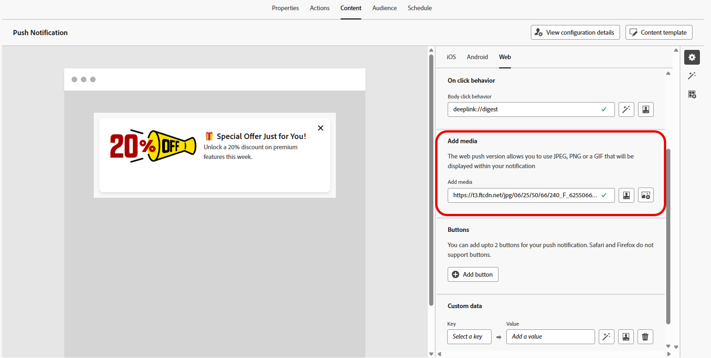

# Designa ett push-meddelande på webben {#design-push-notification}

>[!AVAILABILITY]
>
>För närvarande stöder inte push-meddelanden på webben i Journey Optimizer funktionerna **Tyst meddelande** och **Simulera innehåll**, men de kommer att vara tillgängliga vid ett senare tillfälle.

När du har skapat en kampanj eller resa för push-meddelanden på webben kan du fortsätta att utforma innehållet och strukturen efter dina behov. Observera att innan du skickar ett push-meddelande för webben måste du först konfigurera den här kanalen i din [kanalkonfiguration](push-configuration-web.md).

<!--
## Send a silent notification {#silent-notification}

A silent push notification (also called a background notification) is a hidden message sent to your web application without alerting the user.

To enable a silent notification, enable the **[!UICONTROL Silent Notification]** option. When this option is used, the notification is delivered directly to the application, and no alert, banner, or sound is shown to the user.

Use the **Custom Data** section to include additional information in the form of key-value pairs. 

-->

## Titel och brödtext {#push-title-body}

Klicka på fälten **[!UICONTROL Title]** och **[!UICONTROL Body]** för att skapa meddelandet. Använd personaliseringsredigeraren för att definiera innehåll, [anpassa data](../personalization/personalize.md) och lägga till [dynamiskt innehåll](../personalization/get-started-dynamic-content.md).

Klicka på **[!UICONTROL Edit text with the AI assistant]** om du enkelt vill generera ditt innehåll med hjälp av Journey Optimizer AI-assistenten.

## Beteende vid klickning {#on-click-behavior}

Använd fältet **[!UICONTROL Body click behavior]** för att definiera en djup länk som avgör vad som händer när en användare klickar på meddelandetexten. På så sätt kan du skicka användare direkt till en viss sida eller ett visst avsnitt i webbprogrammet.

## Lägg till media {#add-media-push}

Ange mediets URL i fältet **[!UICONTROL Add media]**. Du kan också inkludera personaliseringstoken i URL:en för att anpassa innehållet för varje användare.

Klicka på  om du snabbt vill generera media med Journey Optimizer AI Assistant.

## Lägg till knappar {#add-buttons-push}

Gör push-meddelanden på webben interaktiva genom att lägga till knappar i innehållet.

Observera att knappar bara visas när enheten är olåst. Om skärmen är låst visas bara **[!UICONTROL Title]** och **[!UICONTROL Message]**.

Använd alternativet **[!UICONTROL Add Button]** för att definiera varje knapps etikett och tillhörande åtgärd, enligt beskrivningen nedan:

* **[!UICONTROL Deeplink]**: Omdirigera användare till en viss vy, avsnitt eller flik i din app. Ange URL-adressen för överordnad länk i det associerade fältet.

* **[!UICONTROL Web URL]**: Omdirigera användare till en extern webbsida. Ange URL-adressen i det associerade fältet.

## Anpassade data {#custom-data}

I avsnittet **[!UICONTROL Custom Data]** kan du lägga till anpassade nyckelvärdepar i meddelandenyttolasten. Dessa värden kan användas av webbprogrammet för att aktivera specifika åtgärder eller för att anpassa användarupplevelsen. Mer information om hur du ställer in push-meddelanden i Adobe Experience Platform finns i [det här avsnittet](push-gs.md)

