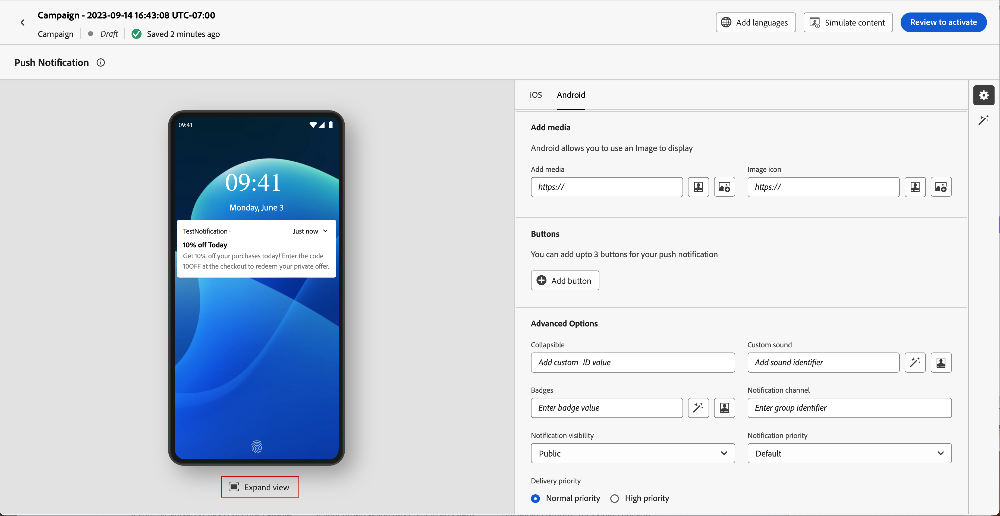

# Utforma ett push-meddelande {#design-push-notification}

## Titel och brödtext {#push-title-body}

>[!CONTEXTUALHELP]
>id="ajo-message-push-compose"
>title="Anpassa ditt push-meddelande."
>abstract="Skriv innehållet i fälten **Titel** och **Brödtext** för att skapa meddelandet. Om du vill ta med personaliseringstoken öppnar du dialogrutan för personalisering."

Klicka på fälten **[!UICONTROL Title]** och **[!UICONTROL Body]** för att skapa meddelandet. Använd personaliseringsredigeraren för att definiera innehåll, personalisera data och lägga till dynamiskt innehåll. Läs mer om [personalisering](../personalization/personalize.md) och [dynamiskt innehåll](../personalization/get-started-dynamic-content.md) i personaliseringsredigeraren.

Använd enhetens förhandsgranskningssektion för att se hur push-meddelanden visas på iOS- och Android-enheter.

Snabba upp skapandet av ditt innehåll med AI Assistant och generera övertygande push-meddelanden med [AI Assistant för textgenerering](../content-management/generative-text.md) eller skapa kompletta push-meddelanden med [AI Assistant för generering av fullständigt innehåll](../content-management/generative-full-content.md).

## Beteende vid klickning {#on-click-behavior}

>[!CONTEXTUALHELP]
>id="ajo-message-push-onclick"
>title="Om klickbeteende"
>abstract="Välj beteende när en mottagare klickar på texten i push-meddelandet."

Du kan välja beteende när en användare klickar på texten i push-meddelandet.

* Om du vill öppna appen väljer du alternativet **[!UICONTROL Open app]**. Programmet som är associerat med meddelandet definieras i [kanalkonfigurationen](../configuration/channel-surfaces.md) (d.v.s. meddelandeförinställningen).
* Om du vill dirigera om användaren till en viss del av innehållet i en app väljer du alternativet **[!UICONTROL Deeplink]**.  Det specifika innehållet kan vara en specifik vy, ett visst avsnitt på en sida eller en viss flik. När alternativet är markerat anger du länken i det tillhörande fältet.
* Om du vill dirigera om användaren till en extern URL använder du alternativet **[!UICONTROL Web URL]**. När alternativet är markerat anger du URL-adressen i det associerade fältet.

## Lägg till media {#add-media-push}

>[!CONTEXTUALHELP]
>id="ajo-message-push-media"
>title="Lägg till media i ditt push-meddelande"
>abstract="Du kan lägga till en bild, en video eller en GIF som visas i meddelandet."

I iOS-versionen av ditt push-meddelande kan du lägga till en bild, en video eller en GIF som visas i meddelandet.

I Android-versionen kan du bara lägga till en bildikon och en bild för utökade meddelanden.

Det finns två alternativ. Du kan:

* Använd knappen **[!UICONTROL Add media]** för att välja en resurs i **[!DNL Adobe Experience Manager Assets]**.

  Lär dig använda **[!DNL Adobe Experience Manager Assets]** på [den här sidan](../integrations/assets.md).

* Eller ange URL:en för mediet i fältet **[!UICONTROL Add media]**. I så fall kan du lägga till personalisering i URL:en.

När mediet har lagts till visas det till höger om meddelandetexten.

Observera att när du inkluderar mediebilagor i nyttolasten för push-meddelanden, som bilder i anpassade datafält som `adb_media`, måste ditt mobilprogram implementera en specifik hantering på klientsidan för bilderna som ska återges på enheter:

* **iOS**: Din app måste implementera ett [Notification Service-tillägg](https://developer.apple.com/documentation/usernotifications/modifying_content_in_newly_delivered_notifications){target="_blank"} för att kunna hämta och bearbeta medieinnehåll från nyttolasten. Dessutom måste alternativet **[!UICONTROL Add mutable-content flag]** aktiveras i avsnittet [Avancerade alternativ](#advanced-options-push).
* **Android**: Din app måste implementera det [automatiska arbetsflödet för visning och spårning](https://developer.adobe.com/client-sdks/edge/adobe-journey-optimizer/push-notification/android/automatic-display-and-tracking/){target="_blank"} för att kunna hantera bildbilagor från nyttolasten.

## Lägg till knappar {#add-buttons-push}

>[!CONTEXTUALHELP]
>id="ajo-message-push-buttons"
>title="Lägg till knappar så att användarna kan interagera med push-meddelanden."
>abstract="I det här avsnittet lägger du till call-to-action-knappar i meddelandet. Ange en meddelandekategoriidentifierare för Apple iOS. För Google Android kan du inkludera anpassad text och mål för varje knapp."

Skapa ett användbart meddelande genom att lägga till knappar i ditt push-innehåll.

Om enhetsskärmen är låst visas inte dessa knappar: bara **Rubrik** och **Meddelande** i meddelandet visas. Om enheten är olåst ser mottagarna knapparna.

I Android-versionen kan du lägga till upp till tre knappar.

I iOS-versionen anges en meddelandekategoriidentifierare. Meddelandekategorier måste vara förkonfigurerade i iOS-appen, som definierar vilka knappar som ska visas och vilka åtgärder som ska vidtas. Mer information finns i [Apple-dokumentationen](https://developer.apple.com/documentation/usernotifications/declaring_your_actionable_notification_types).

1. Använd **[!UICONTROL Add button]** för att definiera inställningar: etiketten och den associerade åtgärden. Möjliga åtgärder är desamma som för [klickbeteendet](#on-click-behavior).

1. Använd ikonen **[!UICONTROL Expand view]** under den centrala förhandsvisningsbilden för att förhandsgranska dina anpassade knappar.

   

## Skicka ett tyst meddelande {#silent-notification}

>[!CONTEXTUALHELP]
>id="ajo_message_push_silent_notification"
>title="Om tyst meddelande"
>abstract="Skicka meddelanden utan att störa användaren. Meddelanden visas inte i meddelandecentret eller meddelandefältet."

Ett tyst push-meddelande (eller bakgrundsmeddelande) är en dold instruktion som skickas till programmet. Den används till exempel för att meddela programmet om att nytt innehåll är tillgängligt eller för att initiera en nedladdning i bakgrunden.

Välj alternativet **[!UICONTROL Silent Notification]** om du vill meddela programmet tyst: i det här fallet överförs meddelandet direkt till programmet. Ingen varning visas på enhetsskärmen.

Använd avsnittet **[!UICONTROL Custom data]** för att lägga till nyckelvärdepar.

## Anpassade data {#custom-data}

>[!CONTEXTUALHELP]
>id="ajo-message-push-custom"
>title="Konfigurera anpassade data för push-meddelanden."
>abstract="Lägg till anpassade variabler i nyttolasten, beroende på din mobilprogramkonfiguration."

I avsnittet **[!UICONTROL Custom data]** kan du lägga till anpassade variabler i nyttolasten, beroende på din mobilprogramkonfiguration. Mer information om hur du ställer in push-meddelanden i Adobe Experience Platform finns i [det här avsnittet](push-gs.md)

## Avancerade alternativ {#advanced-options-push}

>[!CONTEXTUALHELP]
>id="ajo-message-push-advanced"
>title="Konfigurera avancerade alternativ för push-meddelanden."
>abstract="I det här avsnittet kan du förbättra personaliseringen av ditt push-meddelande."

Du kan konfigurera **[!UICONTROL Advanced options]** för ditt push-meddelande. Tillgängliga parametrar visas nedan:

| Parameter | Beskrivning |
|---------|---------|
| **[!UICONTROL Collapsible]** (iOS/Android) | Ett komprimerbart meddelande är ett meddelande som kan ersättas av ett nytt meddelande om det har blivit inaktuellt. Ett vanligt användningsfall för komprimerbara meddelanden är meddelanden som används för att instruera en mobilapp att synkronisera data från servern. Ett exempel är en sportapp som uppdaterar användare med den senaste poängen. Endast det senaste meddelandet är relevant. Å andra sidan, med icke-komprimeringsbart meddelande, är alla meddelanden viktiga för klientappen och måste levereras. |
| **[!UICONTROL Custom sound]** (iOS/Android) | Det ljud som ska spelas upp av mobilterminalen när meddelandet tas emot. Ljudet måste paketeras i appen. |
| **[!UICONTROL Badges]** (iOS/Android) | Ett märke används för att visa antalet nya olästa uppgifter direkt på programikonen.  Värdet för märket försvinner när användaren öppnar eller läser det nya innehållet från programmet. När ett meddelande tas emot på en enhet kan det uppdatera eller lägga till ett badge-värde för den relaterade appen. Om du till exempel lagrar antalet olästa artiklar för dina kunder kan du använda personalisering för att skicka det unika värdet för olästa artiklar för varje kund. Mer personalisering finns i [det här avsnittet](../personalization/personalize.md). |
| **[!UICONTROL Notification group]** (endast iOS) | Associera en meddelandegrupp med push-meddelandet. Från och med iOS 12 kan du med meddelandegrupper konsolidera meddelandetrådar och meddelandeämnen i kopplade ID:n. Ett varumärke kan t.ex. skicka marknadsföringsmeddelanden under ett grupp-ID samtidigt som det behåller fler typmeddelanden under ett eller flera olika ID:n. För att illustrera detta kan du ha groupID: 123&quot;check out the new spring collection of sweaters&quot; och groupID: 456&quot;your package was delivery&quot; notification groups. I det här exemplet paketeras alla leveransmeddelanden under grupp-ID: 456. |
| **[!UICONTROL Notification channel]** (endast Android) | Koppla en meddelandekanal till push-meddelandet. Från och med Android 8.0 (API-nivå 26) måste alla meddelanden tilldelas en kanal för att kunna visas. Mer information finns i [dokumentationen för Android-utvecklare](https://developer.android.com/guide/topics/ui/notifiers/notifications#ManageChannels). |
| **[!UICONTROL Add content-availability flag]** (endast iOS) | Skickar flaggan för tillgängligt innehåll i push-nyttolasten för att säkerställa att appen aktiveras så fort den får push-meddelandet, vilket innebär att appen kan komma åt nyttolastdata.  Detta fungerar även om appen körs i bakgrunden och utan att någon användarinteraktion behövs (t.ex. när användaren trycker på ett push-meddelande). Detta gäller dock inte om programmet inte körs. Mer information om detta hittar du i [Apples dokumentation för utvecklare](https://developer.apple.com/library/content/documentation/NetworkingInternet/Conceptual/RemoteNotificationsPG/CreatingtheNotificationPayload.html). |
| **[!UICONTROL Add mutable-content flag]** (endast iOS) | Skickar flaggan för ändringsbart innehåll i push-nyttolasten och tillåter att push-meddelandeinnehållet ändras med ett meddelandetjänsttillägg som tillhandahålls i iOS SDK. Mer information om detta hittar du i [Apples dokumentation för utvecklare](https://developer.apple.com/library/content/documentation/NetworkingInternet/Conceptual/RemoteNotificationsPG/ModifyingNotifications.html). Du kan sedan använda dina mobilappstillägg för att ytterligare ändra innehållet eller presentationen för inkommande push-meddelanden som skickas från [!DNL Journey Optimizer]. Användare kan till exempel utnyttja det här alternativet för att dekryptera data, ändra brödtexten eller titeltexten i ett meddelande, lägga till en trådidentifierare i ett meddelande osv. **Viktigt**: Den här flaggan måste aktiveras när mediebilagor (bilder, videor) via nyttolastfält (till exempel `adb_media`) inkluderas för återgivning på iOS-enheter. Din app måste också implementera ett meddelandetjänsttillägg för att kunna hämta och bearbeta medieinnehållet från nyttolasten. |
| **[!UICONTROL Add Push expiration]** (endast iOS) | Välj **Datum och tid** för din push-förfallotid. På iOS används meddelandets förfallodatum som en stoppåtgärd, vilket innebär att meddelanden som når Apple Push Notification Service (APNS) efter att förfallotiden inte levereras, vilket säkerställer att kunderna aldrig får inaktuella eller irrelevanta meddelanden. Mer information om detta hittar du i [Apples dokumentation för utvecklare](https://developer.apple.com/documentation/usernotifications/sending-notification-requests-to-apns). |
| **[!UICONTROL Notification visibility]** (endast Android) | Anger om push-meddelandet ska visas.  <b>Privat</b> visar meddelandet på alla låsskärmar, men döljer känslig eller privat information på säkra låsskärmar.  <b>Offentlig</b> visar meddelandet i sin helhet på alla låsskärmar.  <b>Hemlighet</b> visar inte någon del av meddelandet på en säker låsskärm.  Mer information finns i [dokumentationen för Android-utvecklare](https://developer.android.com/reference/android/app/Notification). |
| **[!UICONTROL Notification priority]** (endast Android) | Definierar push-meddelandets prioritet från Låg till Max. Detta avgör hur påträngande push-meddelandet blir när det levereras. Mer information finns i [Android utvecklardokumentation](https://developer.android.com/guide/topics/ui/notifiers/notifications#importance) |
| **[!UICONTROL Delivery priority]** (endast Android) | Ställer in hög eller normal prioritet för dina push-meddelanden. Mer information om meddelandeprioritet finns i [Googles dokumentation för utvecklare](https://firebase.google.com/docs/cloud-messaging/concept-options#setting-the-priority-of-a-message). |
| **[!UICONTROL Time to live]** (endast Android) | Ange antalet sekunder som meddelandet ska förfalla. I Android behandlas förfallodatum som ett leveransfönster: i Firebase Cloud Messaging (FCM) konverteras förfallotiden till ett TTL-värde (time-to-live) som börjar när meddelandet tas emot, vilket innebär att olevererade kampanjer kan skickas senare än förväntat eller till och med utanför den önskade tidsramen. Mer information finns i [dokumentationen för Android-utvecklare](https://firebase.google.com/docs/cloud-messaging/concept-options#ttl). |
