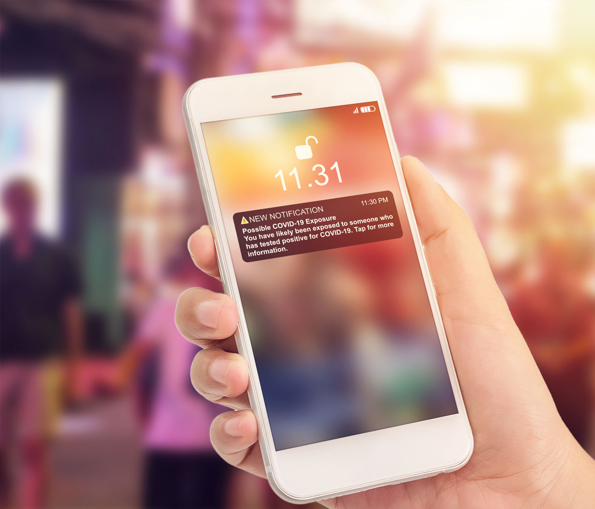

# Kom igång med push-meddelanden {#gs-push-notification}

>[!IMPORTANT]
>
>Om det är första gången du skapar ett push-meddelande kontrollerar du att push-kanalen har konfigurerats. [Läs mer](push-gs.md).

Push-meddelanden hjälper dig att nå mobilappsanvändare och webbbesökare när som helst, särskilt när de inte aktivt använder din app eller surfar på din webbplats. Push-meddelanden kan hjälpa dig att få en mängd olika användningsfall, som att tillhandahålla uppdateringar om tjänsten, be en användare att vidta åtgärder, varna användaren för ett nytt avtal osv. Enhetsplattformar kräver deltagande innan slutanvändarna kan ta emot eller visa dina meddelanden. Användaranmälan kan tas emot så snart appen startats för första gången efter installationen, eller i en efterföljande session eller arbetsflöde efter behov.

[!DNL Journey Optimizer] har stöd för push-meddelanden och hjälper dig att skicka mycket relevanta meddelanden med branschledande dataöverföringshastigheter. Push-meddelanden kan omfatta personalisering och resebaserade sammanhang för att utnyttja de datainsikter ert varumärke har med Adobe Experience Cloud.

Push-meddelanden kan skapas:

* I en **resa**: När du har lagt till en push-aktivitet i din resa och definierat grundläggande inställningar använder du den högra panelen i **[!UICONTROL Actions: Push]** för att skapa innehållet för push-meddelanden. [Lär dig skapa en resa](../building-journeys/journey-gs.md)

* I en **kampanj**: När du har skapat en kampanj väljer du Push-meddelande som åtgärd och definierar grundläggande inställningar. Lär dig skapa [en åtgärdskampanj](../campaigns/campaign-action.md#action-campaign-action) | [en API-utlöst kampanj](../campaigns/api-triggered-campaigns.md) | [en orkestrerad kampanj](../orchestrated/create-orchestrated-campaign.md#create)

Använd de dedikerade flikarna för att definiera inställningar för push-meddelanden för plattformarna **iOS**, **Android** och **Web**.

>[!NOTE]
>
>I **[!DNL Journey Optimizer]** finns sätt att hantera avanmälan i e-postmeddelanden och SMS-meddelanden, men push-meddelanden kräver ingen åtgärd från din sida, eftersom mottagarna kan avbeställa prenumerationen via sina enheter själva. När du till exempel hämtar eller använder programmet kan de välja att stoppa meddelanden. På samma sätt kan de ändra meddelandeinställningarna via det mobila operativsystemet eller webbläsarinställningarna.

<table style="table-layout:fixed"><tr style="border: 0;">
<td>

<a href="create-push.md"><strong>Skapa ett push-meddelande</strong>

</td>
<td>

<a href="design-push.md"><strong>Utforma ditt push-meddelande</strong></a>

</td>
<td>

<a href="send-push.md"><strong>Skicka ditt push-meddelande</strong></a>

</td>
<td>

<a href="push-gs.md"><strong>Konfigurera push-meddelanden</strong></a>

</td>
</tr></table>
