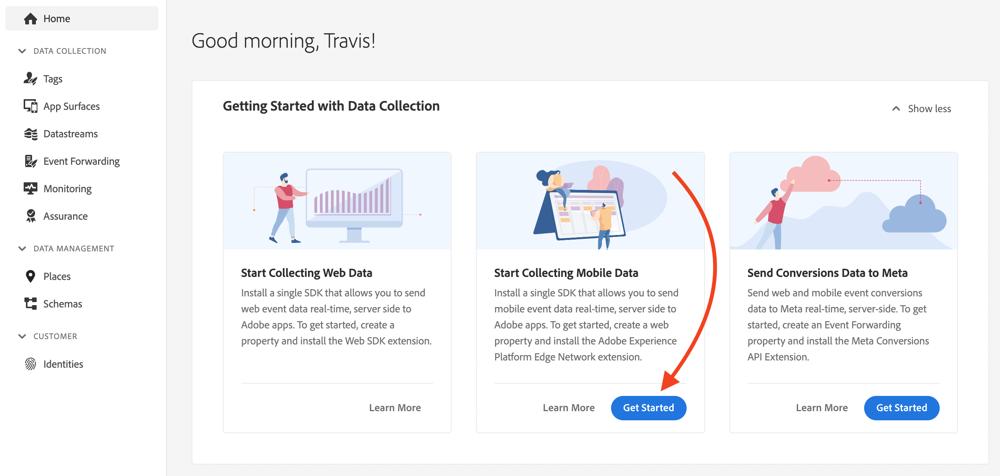

# Arbetsflöde för snabb start av mobil introduktion {#mobile-wf}

Det nya **snabbstartsarbetsflödet för mobil introduktion** är en ny produktfunktion som snabbt konfigurerar Adobe Experience Platform Mobile SDK, börjar samla in och validera mobilhändelsedata och skickar push-meddelanden med [!DNL Journey Optimizer].

Den här funktionen är tillgänglig via startsidan för **[!DNL Adobe Experience Platform Data Collection]** för alla kunder som en offentlig Beta.

## Kom igång{#gs-mobile-wf}

Det nya arbetsflödet automatiserar konfigurationen av datainsamling genom att minska det totala antalet klick och påskynda mobilkonfigurationen för Journey Optimizer. Det här snabbstartsarbetsflödet tar dig igenom fyra enkla steg för att [konfigurera](#gs-mobile-wf), [implementera](#implement-mobile-wf), [validate](#valid-mobile-wf) och [granska](#review-mobile-wf) din mobilkonfiguration.

Bläddra till **[!DNL Data Collection]** från lösningsväljaren om du vill få tillgång till det nya arbetsflödet för snabbstart av introduktion för mobila enheter. Välj sedan **[!DNL Start Collecting Mobile Data]**-kortet på startsidan.

Nedan följer några ytterligare funktioner:

* Smidigt arbetsflöde i fyra steg och användargränssnitt.
* Levererar en grundläggande konfiguration för att börja samla in mobilhändelsedata via [Adobe Experience Platform Mobile SDK](https://developer.adobe.com/client-sdks/documentation/){target="_blank"} på några minuter.
* Möjlighet att testa och validera en grundläggande mobil push-händelse med [Adobe Experience Platform Assurance](https://experienceleague.adobe.com/docs/experience-platform/assurance/home.html){target="_blank"}.
* Auto skapar och konfigurerar alla nödvändiga datainsamlingar och Journey Optimizer-resurser.
* I produktvägledning och verktygstips.
* Ger en naturlig övergång för mer avancerad implementering vid behov.

## Konfigurera {#setup-mobile-wf}

I det första steget i det här arbetsflödet skapas och konfigureras automatiskt alla nödvändiga datainsamlingar och Journey Optimizer-resurser, till exempel Mobile Properties (Mobila egenskaper), Mobile Extensions (Mobila tillägg), Journey Optimizer Extension (-tillägg), Rules (Regler), Data Elements (Dataelement) osv.

När du har godkänt Beta villkor anger du namnet på din mobilapp och klickar på **[!DNL Next]**.

Ange information för iOS- och Android-plattformar, inklusive ditt program-ID och autentiseringsnycklar eller nyckelfil.

## Implementera{#implement-mobile-wf}

I nästa steg får du stegvisa anvisningar om hur du installerar koden i din mobilapp.

## Validera{#valid-mobile-wf}

Granska och kontrollera implementeringen för att validera den. Du kan skicka ett push-testmeddelande.

## Granska {#review-mobile-wf}

Automatiserad installation är klar. Nu kan du gå till taggens mobila egenskap och konfigurera regler eller dataelement och börja skicka push-meddelanden med Adobe Journey Optimizer.

**Relaterade ämnen**

* [Kom igång med push-meddelanden](../../rp_landing_pages/push-landing-page.md)
* [Dataflöde och komponenter för push-meddelanden](push-gs.md)
* [Konfigurera push-kanalen](push-configuration.md)
* [Rapport om push-meddelanden](../reports/journey-global-report-cja-push.md#track-link-url-push)
* [Skapa ett push-meddelande](create-push.md)
