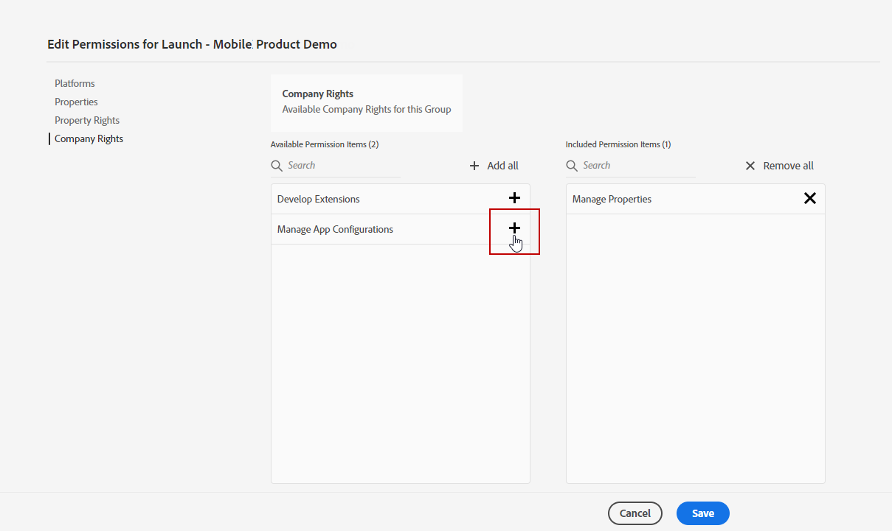

# Konfigurera kanal för push-meddelanden på webben {#push-notification-configuration}

Med [!DNL Journey Optimizer] kan du skapa dina resor och skicka meddelanden till riktade målgrupper. Innan du börjar skicka push-meddelanden för webben med [!DNL Journey Optimizer] måste du se till att konfigurationer och integreringar finns på plats i Adobe Experience Platform. Om du vill veta mer om dataflödet för push-meddelanden i [!DNL Adobe Journey Optimizer] kan du läsa [den här sidan](push-gs.md).

>[!AVAILABILITY]
>
>Det nya **snabbstartsarbetsflödet** för mobil introduktion är nu tillgängligt. Använd den här nya produktfunktionen för att snabbt konfigurera Mobile SDK för att börja samla in och validera mobilhändelsedata och skicka push-meddelanden till mobiler. Den här funktionen är tillgänglig via startsidan för datainsamling som en betaversion. [Läs mer](mobile-onboarding-wf.md)
>

## Före start {#start-push}

### Konfigurera behörigheter {#setup-permissions}

Innan du skapar ett mobilprogram måste du kontrollera att du har eller tilldelar rätt användarbehörigheter för taggar i Adobe Experience Platform. Läs mer i [Tagg-dokumentationen](https://experienceleague.adobe.com/docs/experience-platform/tags/admin/user-permissions.html?lang=sv-SE){target="_blank"}.

>[!CAUTION]
>
>Push-konfigurationen måste utföras av en expertanvändare. Beroende på din implementeringsmodell och vilka profiler som används i den här implementeringen kan du behöva tilldela en enskild produktprofil den fullständiga behörighetsuppsättningen eller dela behörigheter mellan apputvecklaren och **Adobe Journey Optimizer** -administratören. Läs mer om **taggar**-behörigheter i [den här dokumentationen](https://experienceleague.adobe.com/docs/experience-platform/tags/admin/user-permissions.html?lang=sv-SE){target="_blank"}.

<!--ou need to your have access to perform following roles :

* Manage Datastreams
* Manage Client-side Properties
* Manage App Configurations
-->

Följ stegen nedan för att tilldela **Egenskap** och **Företag** behörigheter:

1. Åtkomst till **[!DNL Admin Console]**.

1. Välj **[!UICONTROL Products]**-kortet på fliken **[!UICONTROL Adobe Experience Platform Data Collection]**.

   

1. Välj en befintlig **[!UICONTROL Product Profile]** eller skapa en ny med knappen **[!UICONTROL New profile]**. Lär dig hur du skapar en ny **[!UICONTROL New profile]** i [Admin Console-dokumentationen](https://experienceleague.adobe.com/docs/experience-platform/access-control/ui/create-profile.html?lang=sv-SE#ui){target="_blank"}.

1. På fliken **[!UICONTROL Permissions]** väljer du **[!UICONTROL Property rights]**.

   

1. Klicka på **[!UICONTROL Add all]**. Detta lägger till följande rättigheter i din produktprofil:
   * **[!UICONTROL Approve]**
   * **[!UICONTROL Develop]**
   * **[!UICONTROL Manage Environments]**
   * **[!UICONTROL Manage Extensions]**
   * **[!UICONTROL Publish]**

   Dessa behörigheter krävs för att installera och publicera Adobe Journey Optimizer-tillägget och publicera appegenskapen i Adobe Experience Platform Mobile SDK.

1. Välj sedan **[!UICONTROL Company rights]** på den vänstra menyn.

   

1. Lägg till följande rättigheter:

   * **[!UICONTROL Manage App Configurations]**
   * **[!UICONTROL Manage Properties]**

   Dessa behörigheter krävs för att mobilappsutvecklaren ska kunna ställa in push-autentiseringsuppgifter i **Adobe Experience Platform Data Collection** och definiera kanalkonfigurationer för push-meddelanden (t.ex. meddelandeförinställningar) i **Adobe Journey Optimizer**.

   

1. Klicka på **[!UICONTROL Save]**.

Följ stegen nedan för att tilldela **[!UICONTROL Product profile]** till användare:

1. Åtkomst till **[!DNL Admin Console]**.

1. Välj **[!UICONTROL Products]**-kortet på fliken **[!UICONTROL Adobe Experience Platform Data Collection]**.

1. Välj din tidigare konfigurerade **[!UICONTROL Product profile]**.

1. Klicka på **[!UICONTROL Add user]** på fliken **[!UICONTROL Users]**.

   

1. Skriv in användarens namn eller e-postadress och markera användaren. Klicka sedan på **[!UICONTROL Save]**.

   >[!NOTE]
   >
   >Om användaren inte redan har skapats i Admin Console läser du [dokumentationen till Lägg till användare](https://helpx.adobe.com/se/enterprise/admin-guide.html/enterprise/using/manage-users-individually.ug.html#add-users).

   

### Kontrollera datauppsättningarna {#push-datasets}

Följande scheman och datauppsättningar är tillgängliga med push-meddelandekanalen:

| Schema  Datamängd | Grupp med fält | Åtgärd |
| -------------------------------------------------------------------------------------- | --------------------------------------------------------------------------------------------------------------------------------------------------------------------------------------- | -------------------------------------------------------- |
| CJM push-profilschema  CJM push-profildatauppsättning | Information om push-meddelanden Adobe CJM ExperienceEvent - Information om meddelandeprofil Adobe CJM ExperienceEvent - Information om meddelandekörning Programinformation Miljöinformation | Registrera push-token |
| CJM Push Tracking Experience Event Schema CJM Push Tracking Experience Event Dataset | Spårning av push-meddelanden | Spåra interaktioner och ange data för rapportgränssnittet |

>[!NOTE]
>
>När push-spårningshändelser infogas i händelsedatauppsättningen CJM Push Tracking Experience kan vissa fel inträffa, även om data delvis har importerats korrekt. Detta kan inträffa om vissa fält i din mappning inte finns i inkommande händelser: systemet loggar varningar men förhindrar inte att giltiga delar av data matas in. Dessa varningar visas i batchstatus som&quot;misslyckades&quot; men avspeglar en partiell slutförd import.
>
>Om du vill visa en fullständig lista över fält och attribut för varje schema kan du läsa [Journey Optimizer schemaordlista](https://experienceleague.adobe.com/tools/ajo-schemas/schema-dictionary.html?lang=sv-SE){target="_blank"}.

### Konfigurera egenskapen pushNotification {#push-property}

Om du vill aktivera **webb-push-meddelanden** måste du först kontrollera att egenskapen [pushNotifications](https://experienceleague.adobe.com/sv/docs/experience-platform/collection/js/commands/configure/pushnotifications) är korrekt konfigurerad i Web SDK. Den här egenskapen styr hur push-meddelanden hanteras av webbprogrammet.

Dessutom måste du generera VAPID-nycklar, som krävs för att konfigurera [dina push-autentiseringsuppgifter för appen](#push-credentials-launch) i Journey Optimizer.

## Steg 1: Lägg till dina push-autentiseringsuppgifter för appar i Journey Optimizer {#push-credentials-launch}

När du har gett rätt användarbehörigheter måste du nu lägga till dina push-autentiseringsuppgifter för mobilprogrammet i Journey Optimizer.

Registrering av push-autentiseringsuppgifter krävs för mobilappen för att godkänna att Adobe skickar push-meddelanden åt dig. Se stegen nedan:

1. Gå till **[!UICONTROL Channels]** > **[!UICONTROL Push settings]** > **[!UICONTROL Push credentials]**-menyn.

1. Klicka på **[!UICONTROL Create push credential]**.

1. Välj **[!UICONTROL Platform]** i listrutan **[!UICONTROL Web]**.

   

1. Ange **[!UICONTROL App ID]**.

1. Ange din **[!UICONTROL VAPID public key]** och **[!UICONTROL private key]**.

1. Klicka på **[!UICONTROL Submit]** om du vill skapa appkonfigurationen.

## Steg 2: Skapa en kanalkonfiguration för push{#message-preset}

När du har skapat dina push-autentiseringsuppgifter måste du skapa en konfiguration för att kunna skicka push-meddelanden från **[!DNL Journey Optimizer]**.

1. Gå till menyn **[!UICONTROL Channels]** > **[!UICONTROL General settings]** > **[!UICONTROL Channel configurations]** och klicka sedan på **[!UICONTROL Create channel configuration]**.

   

1. Ange ett namn och en beskrivning (valfritt) för konfigurationen.

   >[!NOTE]
   >
   > Namn måste börja med en bokstav (A-Z). Det får bara innehålla alfanumeriska tecken. Du kan också använda understreck `_`, punkt `.` och bindestreck `-`.

1. Om du vill tilldela anpassade eller grundläggande dataanvändningsetiketter till konfigurationen kan du välja **[!UICONTROL Manage access]**. [Läs mer om OLAC (Object Level Access Control)](../administration/object-based-access.md).

1. Välj **Push**-kanal.

   

1. Välj **[!UICONTROL Marketing action]** om du vill associera medgivandeprinciper till meddelanden som använder den här konfigurationen. Alla policyer för samtycke som är kopplade till marknadsföringsåtgärden utnyttjas för att ta hänsyn till kundernas preferenser. [Läs mer](../action/consent.md#surface-marketing-actions)

1. Välj din **[!UICONTROL Platform]**: Android, iOS och/eller webb.

1. Välj samma **[!UICONTROL App id]** som för de [push-autentiseringsuppgifter](#push-credentials-launch) som konfigurerats ovan.

1. Spara ändringarna.

Du kan nu välja din konfiguration när du skapar push-meddelanden.

## Steg 3: Konfigurera egenskapen sendPushSubscription {#sendPushSubscription-property}

När du har konfigurerat push-autentiseringsuppgifterna och kanalen måste du implementera [kommandot sendPushSubscription](https://experienceleague.adobe.com/sv/docs/experience-platform/collection/js/commands/sendpushsubscription) i webbprogrammet. Det här kommandot registrerar push-prenumerationer för användare med Adobe Experience Platform, vilket gör att systemet kan spåra vilka användare som har valt att ta emot push-meddelanden och behålla sin prenumerationsstatus. Registreringen är nödvändig för att Journey Optimizer ska kunna skicka riktade push-meddelanden till dina användare.

## Steg 4: Testa mobilappen med en händelse {#mobile-app-test}

När du har slutfört web push-konfigurationen i både Adobe Experience Platform och [!DNL Adobe Experience Platform Data Collection] kan du testa implementeringen innan du skickar web push-meddelanden till dina profiler. Testningen säkerställer att prenumerationerna registreras på rätt sätt och att meddelanden skickas korrekt till användarnas webbläsare.

Detaljerade instruktioner om hur du skapar en testresa med händelser för att validera din push-konfiguration för webben finns i [dokumentationen för push-meddelanden för mobilappar](push-configuration.md), som innehåller ett omfattande testarbetsflöde som kan användas både i mobila och webbaserade push-kanaler.
