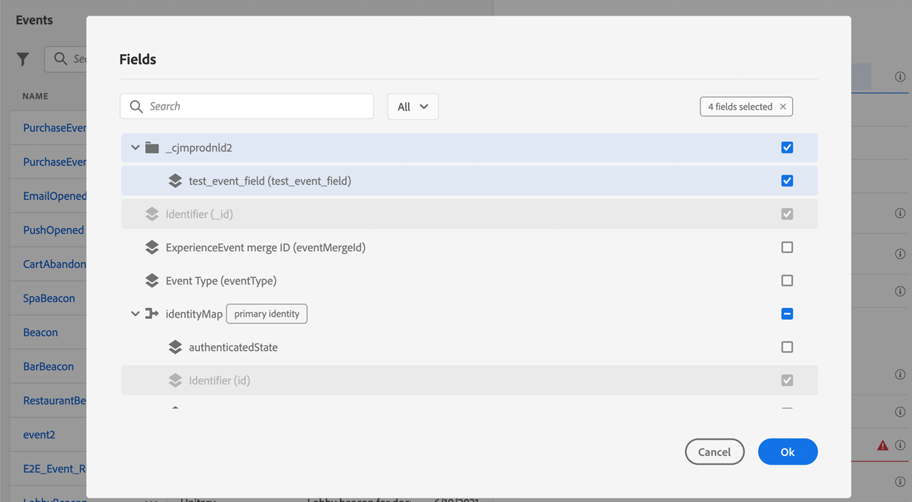
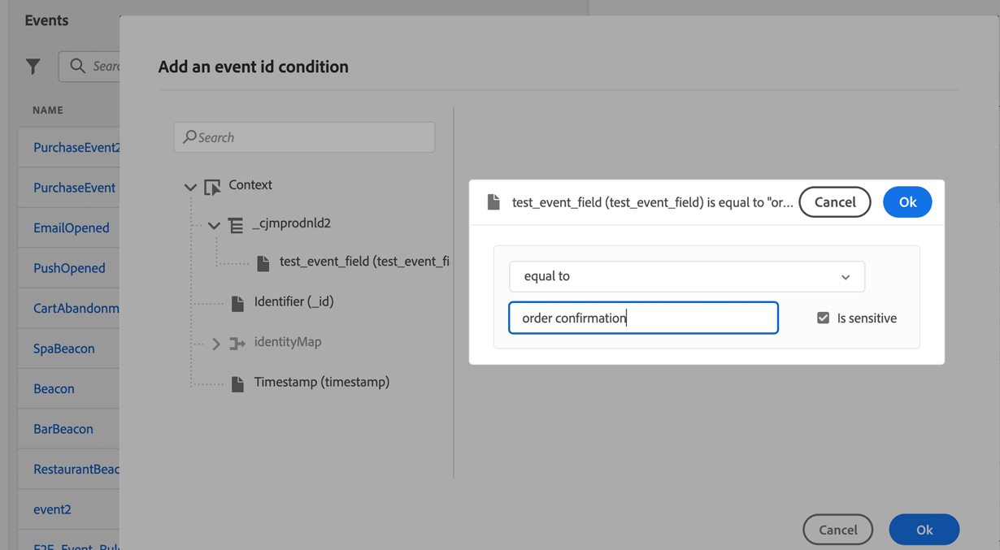

# Konfigurera kanal för push-meddelanden {#push-notification-configuration}

Med [!DNL Journey Optimizer] kan du skapa dina resor och skicka meddelanden till riktade målgrupper. Innan du börjar skicka push-meddelanden med [!DNL Journey Optimizer] måste du se till att det finns konfigurationer och integreringar på mobilappen och för taggar i Adobe Experience Platform. Om du vill veta mer om dataflödet för push-meddelanden i [!DNL Adobe Journey Optimizer] kan du läsa [den här sidan](push-gs.md).

>[!AVAILABILITY]
>
>Det nya **snabbstartsarbetsflödet** för mobil introduktion är nu tillgängligt. Använd den här nya produktfunktionen för att snabbt konfigurera Mobile SDK för att börja samla in och validera mobilhändelsedata och skicka push-meddelanden till mobiler. Den här funktionen är tillgänglig via startsidan för datainsamling som en betaversion. [Läs mer](mobile-onboarding-wf.md)
>

## Före start {#start-push}

### Konfigurera behörigheter {#setup-permissions}

Innan du skapar ett mobilprogram måste du kontrollera att du har eller tilldelar rätt användarbehörigheter för taggar i Adobe Experience Platform. Läs mer i [Tagg-dokumentationen](https://experienceleague.adobe.com/docs/experience-platform/tags/admin/user-permissions.html?lang=sv-SE){target="_blank"}.

>[!CAUTION]
>
>Push-konfigurationen måste utföras av en expertanvändare. Beroende på din implementeringsmodell och vilka profiler som används i den här implementeringen kan du behöva tilldela en enskild produktprofil den fullständiga behörighetsuppsättningen eller dela behörigheter mellan apputvecklaren och **Adobe Journey Optimizer** -administratören. Läs mer om **taggar**-behörigheter i [den här dokumentationen](https://experienceleague.adobe.com/docs/experience-platform/tags/admin/user-permissions.html?lang=sv-SE){target="_blank"}.

<!--ou need to your have access to perform following roles :

* Manage Datastreams
* Manage Client-side Properties
* Manage App Configurations
-->

Följ stegen nedan för att tilldela **Egenskap** och **Företag** behörigheter:

1. Åtkomst till **[!DNL Admin Console]**.

1. Välj **[!UICONTROL Products]**-kortet på fliken **[!UICONTROL Adobe Experience Platform Data Collection]**.

   

1. Välj en befintlig **[!UICONTROL Product Profile]** eller skapa en ny med knappen **[!UICONTROL New profile]**. Lär dig hur du skapar en ny **[!UICONTROL New profile]** i [Admin Console-dokumentationen](https://experienceleague.adobe.com/docs/experience-platform/access-control/ui/create-profile.html?lang=sv-SE#ui){target="_blank"}.

1. På fliken **[!UICONTROL Permissions]** väljer du **[!UICONTROL Property rights]**.

   

1. Klicka på **[!UICONTROL Add all]**. Detta lägger till följande rättigheter i din produktprofil:
   * **[!UICONTROL Approve]**
   * **[!UICONTROL Develop]**
   * **[!UICONTROL Manage Environments]**
   * **[!UICONTROL Manage Extensions]**
   * **[!UICONTROL Publish]**

   Dessa behörigheter krävs för att installera och publicera Adobe Journey Optimizer-tillägget och publicera appegenskapen i Adobe Experience Platform Mobile SDK.

1. Välj sedan **[!UICONTROL Company rights]** på den vänstra menyn.

   

1. Lägg till följande rättigheter:

   * **[!UICONTROL Manage App Configurations]**
   * **[!UICONTROL Manage Properties]**

   Dessa behörigheter krävs för att mobilappsutvecklaren ska kunna ställa in push-autentiseringsuppgifter i **Adobe Experience Platform Data Collection** och definiera kanalkonfigurationer för push-meddelanden (t.ex. meddelandeförinställningar) i **Adobe Journey Optimizer**.

   

1. Klicka på **[!UICONTROL Save]**.

Följ stegen nedan för att tilldela **[!UICONTROL Product profile]** till användare:

1. Åtkomst till **[!DNL Admin Console]**.

1. Välj **[!UICONTROL Products]**-kortet på fliken **[!UICONTROL Adobe Experience Platform Data Collection]**.

1. Välj din tidigare konfigurerade **[!UICONTROL Product profile]**.

1. Klicka på **[!UICONTROL Add user]** på fliken **[!UICONTROL Users]**.

   

1. Skriv in användarens namn eller e-postadress och markera användaren. Klicka sedan på **[!UICONTROL Save]**.

   >[!NOTE]
   >
   >Om användaren inte redan har skapats i Admin Console läser du [dokumentationen till Lägg till användare](https://helpx.adobe.com/se/enterprise/admin-guide.html/enterprise/using/manage-users-individually.ug.html#add-users).

   


### Kontrollera datauppsättningarna {#push-datasets}

Följande scheman och datauppsättningar är tillgängliga med push-meddelandekanalen:

| Schema <br>Datamängd | Grupp med fält | Åtgärd |
| -------------------------------------------------------------------------------------- | --------------------------------------------------------------------------------------------------------------------------------------------------------------------------------------- | -------------------------------------------------------- |
| CJM push-profilschema <br>CJM push-profildatauppsättning | Information om push-meddelanden<br>Adobe CJM ExperienceEvent - Information om meddelandeprofil<br>Adobe CJM ExperienceEvent - Information om meddelandekörning<br>Programinformation<br>Miljöinformation | Registrera push-token |
| CJM Push Tracking Experience Event Schema<br>CJM Push Tracking Experience Event Dataset | Spårning av push-meddelanden | Spåra interaktioner och ange data för rapportgränssnittet |


>[!NOTE]
>
>När push-spårningshändelser infogas i händelsedatauppsättningen CJM Push Tracking Experience kan vissa fel inträffa, även om data delvis har importerats korrekt. Detta kan inträffa om vissa fält i din mappning inte finns i inkommande händelser: systemet loggar varningar men förhindrar inte att giltiga delar av data matas in. Dessa varningar visas i batchstatus som&quot;misslyckades&quot; men avspeglar en partiell slutförd import.
>
>Om du vill visa en fullständig lista över fält och attribut för varje schema kan du läsa [Journey Optimizer schemaordlista](https://experienceleague.adobe.com/tools/ajo-schemas/schema-dictionary.html?lang=sv-SE){target="_blank"}.


### Konfigurera din app {#configure-app}

Den tekniska konfigurationen innefattar nära samarbete mellan apputvecklaren och företagsadministratören. Innan du börjar skicka push-meddelanden med [!DNL Journey Optimizer] måste du skapa push-autentiseringsuppgifter, en push-kanalskonfiguration i Adobe Journey Optimizer och integrera din mobilapp med Adobe Experience Platform Mobile SDK:er.

Följ implementeringsstegen som beskrivs i länkarna nedan:

* För **Apple iOS**: Lär dig hur du registrerar din app med APN:er i [Apple-dokumentationen](https://developer.apple.com/documentation/usernotifications/registering_your_app_with_apns){target="_blank"}
* För **Google Android**: Lär dig hur du konfigurerar en Firebase Cloud Messaging-klientapp på Android i [Google Documentation](https://firebase.google.com/docs/cloud-messaging/android/client){target="_blank"}

### Integrera mobilappen med Adobe Experience Platform SDK {#integrate-mobile-app}

Adobe Experience Platform Mobile SDK erbjuder API:er för integrering på klientsidan för mobiler via Android och iOS-kompatibla SDK:er. Följ [dokumentationen för Adobe Experience Platform Mobile SDK](https://developer.adobe.com/client-sdks/documentation/getting-started/){target="_blank"} om du vill konfigurera Adobe Experience Platform Mobile SDK:er i din app.

I slutet av detta bör du även ha skapat och konfigurerat en mobil egenskap i [!DNL Adobe Experience Platform Data Collection]. Du skapar vanligtvis en mobil egenskap för varje mobilprogram som du vill hantera. Lär dig hur du skapar och konfigurerar en mobil egenskap i [dokumentationen för Adobe Experience Platform Mobile SDK](https://developer.adobe.com/client-sdks/documentation/getting-started/create-a-mobile-property/){target="_blank"}.

<!--To enable **Web push notifications**, ensure that the [pushNotifications property](https://experienceleague.adobe.com/sv/docs/experience-platform/web-sdk/commands/configure/pushnotifications) is properly configured within the Web SDK. Then, use [the sendPushSubscription command](https://experienceleague.adobe.com/sv/docs/experience-platform/web-sdk/commands/sendpushsubscription) to register push subscriptions with Adobe Experience Platform.
-->

## Steg 1: Lägg till dina push-autentiseringsuppgifter för appar i Journey Optimizer {#push-credentials-launch}

När du har gett rätt användarbehörigheter måste du nu lägga till dina push-autentiseringsuppgifter för mobilprogrammet i Journey Optimizer.

Registrering av push-autentiseringsuppgifter krävs för mobilappen för att godkänna att Adobe skickar push-meddelanden åt dig. Se stegen nedan:

1. Gå till **[!UICONTROL Channels]** > **[!UICONTROL Push settings]** > **[!UICONTROL Push credentials]**-menyn.

1. Klicka på **[!UICONTROL Create push credential]**.

1. Välj Operativsystemet i listrutan **[!UICONTROL Platform]**:

   * **För iOS**

     

      1. Ange mobilappen **[!UICONTROL App ID]**.

      1. Aktivera alternativet **[!UICONTROL Apply to all sandboxes]** om du vill att de här push-autentiseringsuppgifterna ska vara tillgängliga i alla sandlådor. Om en specifik sandlåda har egna autentiseringsuppgifter för samma Platform- och App ID-par har dessa sandlådespecifika autentiseringsuppgifter företräde.

      1. Växlade på knappen **[!UICONTROL Manually enter push Credentials]** för att lägga till dina autentiseringsuppgifter.

      1. Dra och släpp .p8-filen Apple Push Notification Authentication Key. Den här nyckeln kan hämtas från sidan **Certifikat**, **Identifierare** och **Profiler**.

         >[!NOTE]
         >
         > Endast .p8-tangenter för Apple Push Notification stöds. Använd ett annat Apple Developer-konto om du har nått gränsen för .p8-nyckeln.
         >Mer information om Apple nyckelgränser finns i [Apple Developer Documentation](https://developer.apple.com/documentation/usernotifications/registering_your_app_with_apns).


      1. Ange **nyckel-ID**. Detta är en 10-teckensträng som tilldelas när en p8-autentiseringsnyckel skapas. Den finns på fliken **Tangenter** på sidan **Certifikat**, **Identifierare** och **Profiler** .

      1. Ange **Team-ID**. Detta är ett strängvärde som finns under fliken Medlemskap.

   * **För Android**

     

      1. Ange **[!UICONTROL App ID]**, vanligtvis är paketnamnet program-ID i din `build.gradle`-fil.

      1. Aktivera alternativet **[!UICONTROL Apply to all sandboxes]** om du vill att de här push-autentiseringsuppgifterna ska vara tillgängliga i alla sandlådor. Om en specifik sandlåda har egna autentiseringsuppgifter för samma Platform- och App ID-par har dessa sandlådespecifika autentiseringsuppgifter företräde.

      1. Växlade på knappen **[!UICONTROL Manually enter push credentials]** för att lägga till dina autentiseringsuppgifter.

      1. Dra och släpp FCM-push-inloggningsuppgifterna. Mer information om hur du hämtar push-autentiseringsuppgifter finns i [Google-dokumentationen](https://firebase.google.com/docs/admin/setup#initialize-sdk){target="_blank"}.

<!--
    * **For Web**

        

        1. Provide the **[!UICONTROL App ID]**.

        1. Enter your **[!UICONTROL VAPID public key]** and **[!UICONTROL private key]**.
-->

1. Klicka på **[!UICONTROL Submit]** om du vill skapa appkonfigurationen.

<!--
## Step 2: Set up a mobile property in Adobe Experience Platform Launch {#launch-property}

Setting up a mobile property allows the mobile app developer or marketer to configure the mobile SDKs attributes such as Session Timeouts, the [!DNL Adobe Experience Platform] sandbox to be targeted and the **[!UICONTROL Adobe Experience Platform Datasets]** to be used for mobile SDK to send data to.

For further details and procedures on how to set up a **[!UICONTROL Platform Launch property]**, refer to the steps detailed in [Adobe Experience Platform Mobile SDK documentation](https://aep-sdks.gitbook.io/docs/getting-started/create-a-mobile-property#create-a-mobile-property).


To get the SDKs needed for push notification to work you will need the following SDK extensions, for both Android and iOS:

* **[!UICONTROL Mobile Core]** (installed automatically)
* **[!UICONTROL Profile]** (installed automatically)
* **[!UICONTROL Adobe Experience Platform Edge]**
* **[!UICONTROL Adobe Experience Platform Assurance]**, optional but recommended to debug the mobile implementation.

Learn more about [!DNL Adobe Experience Platform Launch] extensions in [Adobe Experience Platform Launch documentation](https://experienceleague.adobe.com/docs/launch-learn/implementing-in-mobile-android-apps-with-launch/configure-launch/launch-add-extensions.html?lang=sv-SE).
-->

## Steg 2: Skapa en kanalkonfiguration för push{#message-preset}

När du har skapat dina push-autentiseringsuppgifter måste du skapa en konfiguration för att kunna skicka push-meddelanden från **[!DNL Journey Optimizer]**.

1. Gå till menyn **[!UICONTROL Channels]** > **[!UICONTROL General settings]** > **[!UICONTROL Channel configurations]** och klicka sedan på **[!UICONTROL Create channel configuration]**.

   

1. Ange ett namn och en beskrivning (valfritt) för konfigurationen.

   >[!NOTE]
   >
   > Namn måste börja med en bokstav (A-Z). Det får bara innehålla alfanumeriska tecken. Du kan också använda understreck `_`, punkt `.` och bindestreck `-`.


1. Om du vill tilldela anpassade eller grundläggande dataanvändningsetiketter till konfigurationen kan du välja **[!UICONTROL Manage access]**. [Läs mer om OLAC (Object Level Access Control)](../administration/object-based-access.md).

1. Välj **Push**-kanal.

   

1. Välj **[!UICONTROL Marketing action]** om du vill associera medgivandeprinciper till meddelanden som använder den här konfigurationen. Alla policyer för samtycke som är kopplade till marknadsföringsåtgärden utnyttjas för att ta hänsyn till kundernas preferenser. [Läs mer](../action/consent.md#surface-marketing-actions)

1. Välj din **[!UICONTROL Platform]**: Android och/eller iOS <!--and/or Web-->.

1. Välj samma **[!UICONTROL App id]** som för de [push-autentiseringsuppgifter](#push-credentials-launch) som konfigurerats ovan.

1. Spara ändringarna.

Du kan nu välja din konfiguration när du skapar push-meddelanden.

## Steg 3: Konfigurera Adobe Journey Optimizer Extension i din mobila egenskap {#configure-journey-optimizer-extension}

**Adobe Journey Optimizer-tillägget** för Adobe Experience Platform Mobile SDK:er hanterar push-meddelanden för dina mobilappar och hjälper dig att samla in push-tokens för användare och hantera interaktionsmätning med Adobe Experience Platform-tjänster.

Lär dig hur du konfigurerar Journey Optimizer-tillägg i [dokumentationen för Adobe Experience Platform Mobile SDK](https://developer.adobe.com/client-sdks/documentation/adobe-journey-optimizer/){target="_blank"}.


<!-- 
**[!UICONTROL Edge configuration]** is used by **[!UICONTROL Edge]** extension to send custom data from mobile device to [!DNL Adobe Experience Platform]. 
To configure [!DNL Adobe Experience Platform], you must provide the **[!UICONTROL Sandbox]** name and **[!UICONTROL Event Dataset]**.

1. From [!DNL Adobe Experience Platform Launch], select the **[!UICONTROL Edge Configurations]** tab and click **[!UICONTROL Edge Configurations]**.
    
1. Select **[!UICONTROL New Edge Configuration]** to add a new **[!UICONTROL Edge Configuration]**.
1. Enter a **[!UICONTROL Name]** and click **[!UICONTROL Save]**

1. Click the **[!UICONTROL Adobe Experience Platform]** toggle to enable it.

1. Fill in the **[!UICONTROL Sandbox]**, **[!UICONTROL Event dataset]** and **[!UICONTROL Profile Dataset]** fields. Then, click **[!UICONTROL Save]**.
    
    


1. From [!DNL Adobe Experience Platform Launch], ensure that **[!UICONTROL Client Side]** is selected in the drop-down menu.

1. select the **[!UICONTROL Properties]** tab and click **[!UICONTROL New Property]**.

    

1. Enter a **[!UICONTROL Name]** for your new property.

1. Select **[!UICONTROL Mobile]** as **[!UICONTROL Platform]**.

    

1. Click **[!UICONTROL Save]** to create your new property.

To configure **[!UICONTROL Adobe Experience Platform Edge Extension]** to send custom data from mobile devices to [!DNL Adobe Experience Platform].

1. Select your previously created property and select the **[!UICONTROL Extensions]** tab to view the extensions for this property.

    

1. Click **[!UICONTROL Configure]** under the **[!UICONTROL Adobe Experience Platform Edge]** Network' extension.

1. From the **[!UICONTROL Edge Configuration]** drop-down list, select the **[!UICONTROL Edge Configuration]** created in the previous steps. For more information on **[!UICONTROL Edge Configuration]**, refer to this [section](#edge-configuration).

1. Click **[!UICONTROL Save]**.

To configure **[!UICONTROL Adobe Experience Platform Messaging]** extension to send push profile and push interactions to the correct datasets, follow the same steps as above. Use **[!UICONTROL Sandbox]**, **[!UICONTROL Event dataset]** and **[!UICONTROL Profile Dataset]** created in the [Adobe Experience Platform setup](#edge-configuration).
-->

<!--
## Step 4: Publish the Property {#publish-property}

You now need to publish the property to integrate your configuration and to use it in the mobile app. 

To publish your property, refer to the steps detailed in [Adobe Experience Platform Mobile SDK documentation](https://aep-sdks.gitbook.io/docs/getting-started/create-a-mobile-property#publish-the-configuration)

## Step 5: Configure the ProfileDataSource {#configure-profiledatasource}

To configure the `ProfileDataSource`, use the `ProfileDCInletURL` from [!DNL Adobe Experience Platform] setup and add the following in the mobile app:

```
    MobileCore.updateConfiguration(
    mutableMapOf("messaging.dccs" to <ProfileDCSInletURL>)
```

-->

## Steg 4: Testa mobilappen med en händelse {#mobile-app-test}

När du har konfigurerat din mobilapp i både Adobe Experience Platform och i [!DNL Adobe Experience Platform Data Collection] kan du testa den nu innan du skickar push-meddelanden till dina profiler. I det här fallet skapar vi en resa för att rikta in oss på vår mobilapp och ställa in en händelse som utlöser push-meddelandet.

<!--
You can use a test mobile app for this use case. For more on this, refer to this [page](https://wiki.corp.adobe.com/pages/viewpage.action?spaceKey=CJM&title=Details+of+setting+the+mobile+test+app) (internal use only).
-->

För att den här resan ska fungera måste du skapa ett XDM-schema. Mer information finns i [XDM-dokumentationen](https://experienceleague.adobe.com/docs/experience-platform/xdm/schema/composition.html?lang=sv-SE#schemas-and-data-ingestion){target="_blank"}.

1. Klicka på **[!UICONTROL Schemas]** i menyavsnittet DATAHANTERING.
   
1. Klicka på **[!UICONTROL Create schema]** i det övre högra hörnet, markera **[!UICONTROL Experience Event]** och klicka på **Nästa**.
   
1. Ange ett namn och en beskrivning för ditt schema och klicka på **Slutför**.
   
1. Klicka på **Lägg till** till vänster i avsnittet **Fältgrupper** och välj **[!UICONTROL Create a new field group]**.

1. Ange en **[!UICONTROL Display Name]** och en **[!UICONTROL Description]**. Klicka på **[!UICONTROL Add field groups]** när du är klar. Mer information om hur du skapar fältgrupper finns i [XDM-systemdokumentationen](https://experienceleague.adobe.com/docs/experience-platform/xdm/tutorials/create-schema-ui.html?lang=sv-SE){target="_blank"}.


   

1. Markera schemat till vänster. Aktivera schemat för **[!UICONTROL Profile]** i den högra rutan.

   


1. Markera fältgruppen till vänster och klicka sedan på ikonen + för att skapa ett nytt fält. I **[!UICONTROL Field groups properties]**, till höger, skriver du en **[!UICONTROL Field name]**, **[!UICONTROL Display name]** och väljer **[!UICONTROL String]** som **[!UICONTROL Type]**.

   

1. Markera **[!UICONTROL Required]** och klicka på **[!UICONTROL Apply]**.

1. Klicka på **[!UICONTROL Save]**. Ditt schema har nu skapats och kan användas i en händelse.

Sedan måste du konfigurera en händelse.

1. Välj **[!UICONTROL Configurations]** under ADMINISTRATION på den vänstra menyn på startsidan. Klicka på **[!UICONTROL Manage]** i avsnittet **[!UICONTROL Events]** för att skapa din nya händelse.

1. Klicka på **[!UICONTROL Create Event]**, så öppnas händelsekonfigurationsfönstret till höger på skärmen.

   

1. Ange namnet på händelsen. Du kan också lägga till en beskrivning.

1. Markera **[!UICONTROL Event ID type]** i fältet **[!UICONTROL Rule Based]**.

1. I **[!UICONTROL Parameters]** väljer du det schema du skapat tidigare.

   

1. Kontrollera att fältet som skapades i schemafältgruppen är markerat i listan med fält.

   

1. Klicka på **[!UICONTROL Edit]** i fältet **[!UICONTROL Event ID condition]**. Dra och släpp det fält som lagts till tidigare för att definiera vilket villkor som ska användas av systemet för att identifiera vilka händelser som utlöser din resa.

   

1. Skriv in den syntax som du måste använda för att utlösa ditt push-meddelande i testappen, i det här exemplet **orderbekräftelse**.

   

1. Välj **[!UICONTROL ECID]** som **[!UICONTROL Namespace]**.

1. Klicka **[!UICONTROL Ok]** och sen **[!UICONTROL Save]**.

Din aktivitet har skapats och kan nu användas på en resa.

1. Klicka på **[!UICONTROL Journeys]** på den vänstra menyn.

1. Klicka på **[!UICONTROL Create Journey]** för att skapa en ny resa.

1. Redigera resans egenskaper i konfigurationsrutan som visas till höger. Läs mer i det här [avsnittet](../building-journeys/journey-properties.md).

1. Börja med att dra och släppa händelsen som skapades i föregående steg från listrutan **[!UICONTROL Events]**.

   

1. Dra och släpp en **[!UICONTROL Actions]**-aktivitet från listrutan **[!UICONTROL Push]** till din resa.

1. Konfigurera push-meddelandet. Mer information om hur du skapar push-meddelanden finns på [sidan](create-push.md).

1. Klicka på växlingsknappen **[!UICONTROL Test]** för att börja testa dina push-meddelanden och klicka på **[!UICONTROL Trigger an event]**.

   

1. Ange ditt ECID i fältet **[!UICONTROL Key]** och skriv sedan in **orderbekräftelse** i det andra fältet.

   

1. Klicka på **[!UICONTROL Send]**.

Din händelse kommer att utlösas och du kommer att få ditt push-meddelande till din mobilapp.

