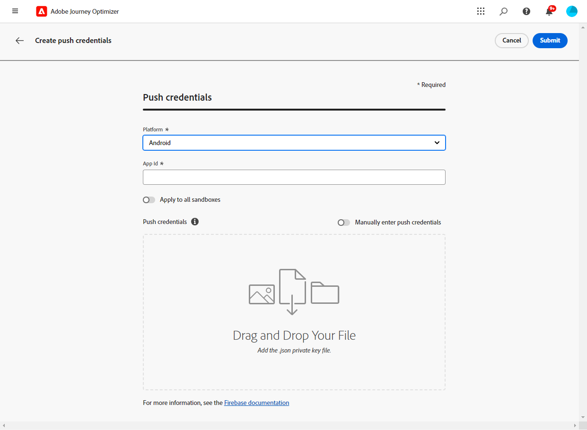
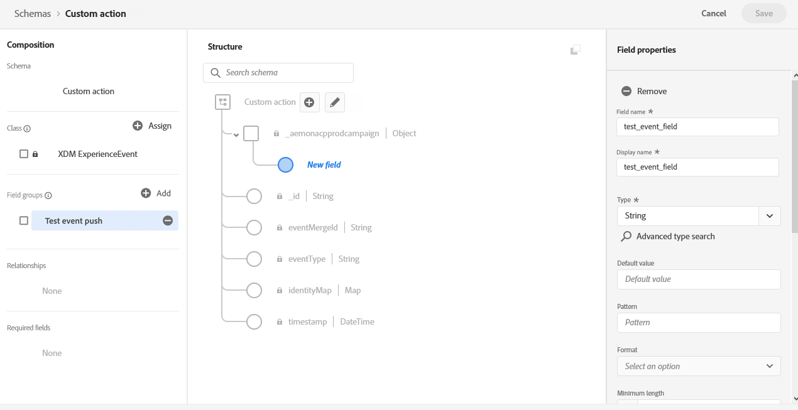
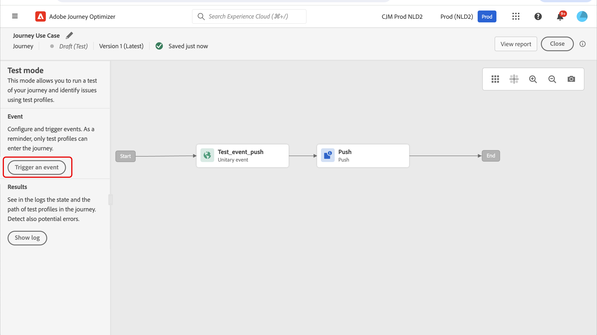
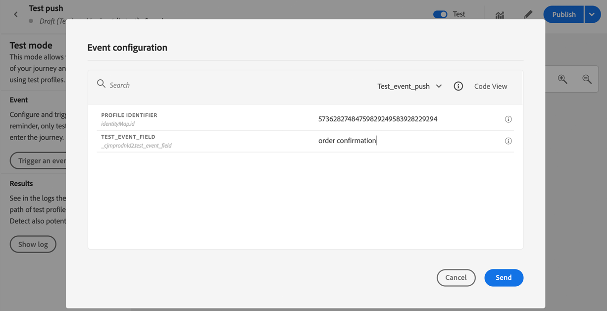

# Konfigurera kanal för push-meddelanden {#push-notification-configuration}

[!DNL Journey Optimizer] kan ni skapa resor och skicka meddelanden till riktade målgrupper. Innan du börjar skicka push-meddelanden med [!DNL Journey Optimizer]måste ni se till att det finns konfigurationer och integreringar på mobilappen och för taggar i Adobe Experience Platform. För att förstå dataflödet för push-meddelanden i [!DNL Adobe Journey Optimizer] se [den här sidan](push-gs.md).

>[!AVAILABILITY]
>
>Den nya **snabbstartsarbetsflöde för mobil introduktion** är nu tillgängligt. Använd den här nya produktfunktionen för att snabbt konfigurera Mobile SDK för att börja samla in och validera mobilhändelsedata och skicka push-meddelanden till mobiler. Den här funktionen är tillgänglig via startsidan för datainsamling som en betaversion. [Läs mer](mobile-onboarding-wf.md)
>


## Före start {#before-starting}

<!--
### Check provisioning

Your Adobe Experience Platform account must be provisioned to contain following schemas and datasets for push notification data flow to function correctly:

| Schema <br>Dataset                                                                       | Group of fields                                                                                                                                                                         | Operation                                                |
| -------------------------------------------------------------------------------------- | --------------------------------------------------------------------------------------------------------------------------------------------------------------------------------------- | -------------------------------------------------------- |
| CJM Push Profile Schema <br>CJM Push Profile Dataset                                     | Push Notification Details<br>Adobe CJM ExperienceEvent - Message Profile Details<br>Adobe CJM ExperienceEvent - Message Execution Details<br>Application Details<br>Environment Details | Register Push Token                                      |
| CJM Push Tracking Experience Event Schema<br>CJM Push Tracking Experience Event Dataset | Push Notification Tracking                                                                                                                                                              | Track interactions and provide data for the reporting UI |
-->

### Konfigurera behörigheter {#setup-permissions}

Innan du skapar ett mobilprogram måste du kontrollera att du har eller tilldelar rätt användarbehörigheter för taggar i Adobe Experience Platform. Läs mer i [Dokumentation för taggar](https://experienceleague.adobe.com/docs/experience-platform/tags/admin/user-permissions.html){target="_blank"}.

>[!CAUTION]
>
>Push-konfigurationen måste utföras av en expertanvändare. Beroende på din implementeringsmodell och vilka profiler som används i den här implementeringen kan du behöva tilldela en enskild produktprofil den fullständiga behörighetsuppsättningen eller dela behörigheter mellan apputvecklaren och **Adobe Journey Optimizer** administratör. Läs mer om **Taggar** behörigheter i [den här dokumentationen](https://experienceleague.adobe.com/docs/experience-platform/tags/admin/user-permissions.html){target="_blank"}.

<!--ou need to your have access to perform following roles :

* Manage Datastreams
* Manage Client-side Properties
* Manage App Configurations
-->

Tilldela **Egenskap** och **Företag** gör du så här:

1. Öppna **[!DNL Admin Console]**.

1. Från **[!UICONTROL Products]** väljer du **[!UICONTROL Adobe Experience Platform Data Collection]** kort.

   

1. Välj en befintlig **[!UICONTROL Product Profile]** eller skapa en ny med **[!UICONTROL New profile]** -knappen. Lär dig hur du skapar en ny **[!UICONTROL New profile]** i [Dokumentation till Admin Console](https://experienceleague.adobe.com/docs/experience-platform/access-control/ui/create-profile.html#ui){target="_blank"}.

1. På fliken **[!UICONTROL Permissions]** väljer du **[!UICONTROL Property rights]**.

   

1. Klicka på **[!UICONTROL Add all]**. Detta lägger till följande rättigheter i din produktprofil:
   * **[!UICONTROL Approve]**
   * **[!UICONTROL Develop]**
   * **[!UICONTROL Manage Environments]**
   * **[!UICONTROL Manage Extensions]**
   * **[!UICONTROL Publish]**

   Dessa behörigheter krävs för att installera och publicera Adobe Journey Optimizer-tillägget och publicera appegenskapen i Adobe Experience Platform Mobile SDK.

1. Välj sedan **[!UICONTROL Company rights]** i den vänstra menyn.

   

1. Lägg till följande rättigheter:

   * **[!UICONTROL Manage App Configurations]**
   * **[!UICONTROL Manage Properties]**

   Dessa behörigheter krävs för att mobilappsutvecklaren ska kunna ställa in push-autentiseringsuppgifter i **Adobe Experience Platform Data Collection** och definiera kanalytor för push-meddelanden (t.ex. meddelandeförinställningar) i **Adobe Journey Optimizer**.

   

1. Klicka på **[!UICONTROL Save]**.

Om du vill tilldela **[!UICONTROL Product profile]** för användarna, följ stegen nedan:

1. Öppna **[!DNL Admin Console]**.

1. Från **[!UICONTROL Products]** väljer du **[!UICONTROL Adobe Experience Platform Data Collection]** kort.

1. Välj din tidigare konfigurerade **[!UICONTROL Product profile]**.

1. Klicka på **[!UICONTROL Add user]** på fliken **[!UICONTROL Users]**.

   

1. Skriv in användarens namn eller e-postadress och markera användaren. Klicka sedan på **[!UICONTROL Save]**.

   >[!NOTE]
   >
   >Om användaren inte redan har skapats i Admin Console går du till [Lägga till användardokumentation](https://helpx.adobe.com/enterprise/admin-guide.html/enterprise/using/manage-users-individually.ug.html#add-users).

   

### Konfigurera din app {#configure-app}

Den tekniska konfigurationen innefattar nära samarbete mellan apputvecklaren och företagsadministratören. Innan du skickar push-meddelanden med [!DNL Journey Optimizer]måste du definiera inställningar i [!DNL Adobe Experience Platform Data Collection] och integrera mobilappen med Adobe Experience Platform Mobile SDK:er.

Följ implementeringsstegen som beskrivs i länkarna nedan:

* För **Apple iOS**: Lär dig hur du registrerar din app med APN:er i [Apple Documentation](https://developer.apple.com/documentation/usernotifications/registering_your_app_with_apns){target="_blank"}
* För **Google Android**: Lär dig hur du konfigurerar en Firebase Cloud Messaging-klientapp på Android i [Google Documentation](https://firebase.google.com/docs/cloud-messaging/android/client){target="_blank"}

### Integrera mobilappen med Adobe Experience Platform SDK {#integrate-mobile-app}

Adobe Experience Platform Mobile SDK innehåller API:er för integrering på klientsidan för mobiler via Android och iOS-kompatibla SDK:er. Följ [Dokumentation för Adobe Experience Platform Mobile SDK](https://developer.adobe.com/client-sdks/documentation/getting-started/){target="_blank"} om du vill konfigurera med Adobe Experience Platform Mobile SDK i appen.

När allt är klart bör du också ha skapat och konfigurerat en mobil egenskap i [!DNL Adobe Experience Platform Data Collection]. Du skapar vanligtvis en mobil egenskap för varje mobilprogram som du vill hantera. Lär dig hur du skapar och konfigurerar en mobil egenskap i [Dokumentation för Adobe Experience Platform Mobile SDK](https://developer.adobe.com/client-sdks/documentation/getting-started/create-a-mobile-property/){target="_blank"}.


## Steg 1: Lägg till push-autentiseringsuppgifter för appen i Adobe Experience Platform Data Collection {#push-credentials-launch}

När du har gett rätt användarbehörigheter måste du nu lägga till dina push-inloggningsuppgifter för mobilprogrammet i [!DNL Adobe Experience Platform Data Collection].

Registrering av push-autentiseringsuppgifter krävs för mobilappen för att godkänna att Adobe skickar push-meddelanden åt dig. Se stegen nedan:

1. Från [!DNL Adobe Experience Platform Data Collection]väljer du **[!UICONTROL App Surfaces]** i den vänstra panelen.

1. Klicka **[!UICONTROL Create App Surface]** för att skapa en ny konfiguration.

   

1. Ange en **[!UICONTROL Name]** för konfigurationen.

1. Från **[!UICONTROL Mobile Application Configuration]** väljer du operativsystem:

   * **För iOS**

     

      1. Ange mobilappen **Paket-ID** i **[!UICONTROL App ID (iOS Bundle ID)]** fält. Program-ID:t finns i **Allmänt** fliken för det primära målet i **XCode**.

      1. Aktiverad **[!UICONTROL Push Credentials]** för att lägga till dina inloggningsuppgifter.

      1. Dra och släpp .p8-filen Apple Push Notification Authentication Key. Den här nyckeln kan hämtas från **Certifikat**, **Identifierare** och **Profiler** sida.

      1. Ange **Nyckel-ID**. Detta är en 10-teckensträng som tilldelas när en p8-autentiseringsnyckel skapas. Den finns under **Tangenter** tabba in **Certifikat**, **Identifierare** och **Profiler** sida.

      1. Ange **Team-ID**. Detta är ett strängvärde som finns under fliken Medlemskap.

   * **För Android**

     

      1. Ange **[!UICONTROL App ID (Android package name)]**: vanligtvis är paketnamnet program-id:t i din `build.gradle` -fil.

      1. Aktiverad **[!UICONTROL Push Credentials]** för att lägga till dina inloggningsuppgifter.

      1. Dra och släpp FCM-push-inloggningsuppgifterna. Mer information om hur du hämtar push-autentiseringsuppgifter finns i [Google Documentation](https://firebase.google.com/docs/admin/setup#initialize-sdk){target="_blank"}.


1. Klicka **[!UICONTROL Save]** för att skapa din appkonfiguration.

<!--
## Step 2: Set up a mobile property in Adobe Experience Platform Launch {#launch-property}

Setting up a mobile property allows the mobile app developer or marketer to configure the mobile SDKs attributes such as Session Timeouts, the [!DNL Adobe Experience Platform] sandbox to be targeted and the **[!UICONTROL Adobe Experience Platform Datasets]** to be used for mobile SDK to send data to.

For further details and procedures on how to set up a **[!UICONTROL Platform Launch property]**, refer to the steps detailed in [Adobe Experience Platform Mobile SDK documentation](https://aep-sdks.gitbook.io/docs/getting-started/create-a-mobile-property#create-a-mobile-property).


To get the SDKs needed for push notification to work you will need the following SDK extensions, for both Android and iOS:

* **[!UICONTROL Mobile Core]** (installed automatically)
* **[!UICONTROL Profile]** (installed automatically)
* **[!UICONTROL Adobe Experience Platform Edge]**
* **[!UICONTROL Adobe Experience Platform Assurance]**, optional but recommended to debug the mobile implementation.

Learn more about [!DNL Adobe Experience Platform Launch] extensions in [Adobe Experience Platform Launch documentation](https://experienceleague.adobe.com/docs/launch-learn/implementing-in-mobile-android-apps-with-launch/configure-launch/launch-add-extensions.html).
-->

## Steg 2: Konfigurera Adobe Journey Optimizer Extension i din mobila egenskap {#configure-journey-optimizer-extension}

The **Adobe Journey Optimizer-tillägg** för Adobe Experience Platform Mobile SDK:er driver push-meddelanden för dina mobilappar och hjälper dig att samla in push-tokens och hantera interaktionsmätning med Adobe Experience Platform tjänster.

Lär dig hur du konfigurerar Journey Optimizer-tillägg i [Dokumentation för Adobe Experience Platform Mobile SDK](https://developer.adobe.com/client-sdks/documentation/adobe-journey-optimizer/){target="_blank"}.


<!-- 
**[!UICONTROL Edge configuration]** is used by **[!UICONTROL Edge]** extension to send custom data from mobile device to [!DNL Adobe Experience Platform]. 
To configure [!DNL Adobe Experience Platform], you must provide the **[!UICONTROL Sandbox]** name and **[!UICONTROL Event Dataset]**.

1. From [!DNL Adobe Experience Platform Launch], select the **[!UICONTROL Edge Configurations]** tab and click **[!UICONTROL Edge Configurations]**.
    
1. Select **[!UICONTROL New Edge Configuration]** to add a new **[!UICONTROL Edge Configuration]**.
1. Enter a **[!UICONTROL Name]** and click **[!UICONTROL Save]**

1. Click the **[!UICONTROL Adobe Experience Platform]** toggle to enable it.

1. Fill in the **[!UICONTROL Sandbox]**, **[!UICONTROL Event dataset]** and **[!UICONTROL Profile Dataset]** fields. Then, click **[!UICONTROL Save]**.
    
    


1. From [!DNL Adobe Experience Platform Launch], ensure that **[!UICONTROL Client Side]** is selected in the drop-down menu.

1. select the **[!UICONTROL Properties]** tab and click **[!UICONTROL New Property]**.

    

1. Enter a **[!UICONTROL Name]** for your new property.

1. Select **[!UICONTROL Mobile]** as **[!UICONTROL Platform]**.

    

1. Click **[!UICONTROL Save]** to create your new property.

To configure **[!UICONTROL Adobe Experience Platform Edge Extension]** to send custom data from mobile devices to [!DNL Adobe Experience Platform].

1. Select your previously created property and select the **[!UICONTROL Extensions]** tab to view the extensions for this property.

    

1. Click **[!UICONTROL Configure]** under the **[!UICONTROL Adobe Experience Platform Edge]** Network' extension.

1. From the **[!UICONTROL Edge Configuration]** drop-down list, select the **[!UICONTROL Edge Configuration]** created in the previous steps. For more information on **[!UICONTROL Edge Configuration]**, refer to this [section](#edge-configuration).

1. Click **[!UICONTROL Save]**.

To configure **[!UICONTROL Adobe Experience Platform Messaging]** extension to send push profile and push interactions to the correct datasets, follow the same steps as above. Use **[!UICONTROL Sandbox]**, **[!UICONTROL Event dataset]** and **[!UICONTROL Profile Dataset]** created in the [Adobe Experience Platform setup](#edge-configuration).
-->

<!--
## Step 4: Publish the Property {#publish-property}

You now need to publish the property to integrate your configuration and to use it in the mobile app. 

To publish your property, refer to the steps detailed in [Adobe Experience Platform Mobile SDK documentation](https://aep-sdks.gitbook.io/docs/getting-started/create-a-mobile-property#publish-the-configuration)

## Step 5: Configure the ProfileDataSource {#configure-profiledatasource}

To configure the `ProfileDataSource`, use the `ProfileDCInletURL` from [!DNL Adobe Experience Platform] setup and add the following in the mobile app:

```
    MobileCore.updateConfiguration(
    mutableMapOf("messaging.dccs" to <ProfileDCSInletURL>)
```

-->

## Steg 3: Testa mobilappen med en händelse {#mobile-app-test}

När du har konfigurerat din mobilapp i både Adobe Experience Platform och i [!DNL Adobe Experience Platform Data Collection]kan du testa den innan du skickar push-meddelanden till dina profiler. I det här fallet skapar vi en resa för att rikta in oss på vår mobilapp och ställa in en händelse som utlöser push-meddelandet.

<!--
You can use a test mobile app for this use case. For more on this, refer to this [page](https://wiki.corp.adobe.com/pages/viewpage.action?spaceKey=CJM&title=Details+of+setting+the+mobile+test+app) (internal use only).
-->

För att den här resan ska fungera måste du skapa ett XDM-schema. Mer information finns i [XDM-dokumentation](https://experienceleague.adobe.com/docs/experience-platform/xdm/schema/composition.html#schemas-and-data-ingestion){target="_blank"}.

1. Klicka på **[!UICONTROL Schemas]**.
   
1. Klicka **[!UICONTROL Create schema]**, längst upp till höger, välj **[!UICONTROL Experience Event]** och klicka **Nästa**.
   
1. Ange ett namn och en beskrivning för ditt schema och klicka på **Slutför**.
   
1. I **Fältgrupper** till vänster klickar du på **Lägg till** och markera **[!UICONTROL Create a new field group]**.

1. Ange en **[!UICONTROL Display Name]** och **[!UICONTROL Description]**. Klicka på **[!UICONTROL Add field groups]** när du är klar. Mer information om hur du skapar fältgrupper finns i [XDM-systemdokumentation](https://experienceleague.adobe.com/docs/experience-platform/xdm/tutorials/create-schema-ui.html){target="_blank"}.


   

1. Markera schemat till vänster. Aktivera det här schemat för **[!UICONTROL Profile]**.

   


1. Markera fältgruppen till vänster och klicka sedan på ikonen + för att skapa ett nytt fält. I **[!UICONTROL Field groups properties]**, på höger sida, skriver du **[!UICONTROL Field name]**, **[!UICONTROL Display name]** och markera **[!UICONTROL String]** as **[!UICONTROL Type]**.

   

1. Kontrollera **[!UICONTROL Required]** och klicka **[!UICONTROL Apply]**.

1. Klicka på **[!UICONTROL Save]**. Ditt schema har nu skapats och kan användas i en händelse.

Sedan måste du konfigurera en händelse.

1. Välj under ADMINISTRATION på den vänstra menyn på startsidan **[!UICONTROL Configurations]**. Klicka **[!UICONTROL Manage]** i **[!UICONTROL Events]** för att skapa din nya aktivitet.

1. Klicka **[!UICONTROL Create Event]**&#x200B;öppnas händelsekonfigurationsfönstret till höger på skärmen.

   

1. Ange namnet på händelsen. Du kan också lägga till en beskrivning.

1. Markera **[!UICONTROL Event ID type]** i fältet **[!UICONTROL Rule Based]**.

1. I **[!UICONTROL Parameters]** väljer du det schema du skapat tidigare.

   

1. Kontrollera att fältet som skapades i schemafältgruppen är markerat i listan med fält.

   

1. Klicka **[!UICONTROL Edit]** i **[!UICONTROL Event ID condition]** fält. Dra och släpp det fält som lagts till tidigare för att definiera vilket villkor som ska användas av systemet för att identifiera vilka händelser som utlöser din resa.

   

1. Skriv in den syntax som du behöver använda för att utlösa push-meddelanden i testappen, i det här exemplet **orderbekräftelse**.

   

1. Välj **[!UICONTROL ECID]** som **[!UICONTROL Namespace]**.

1. Klicka **[!UICONTROL Ok]** och sen **[!UICONTROL Save]**.

Din aktivitet har skapats och kan nu användas på en resa.

1. Klicka på **[!UICONTROL Journeys]**.

1. Klicka **[!UICONTROL Create Journey]** för att skapa en ny resa.

1. Redigera resans egenskaper i konfigurationsrutan som visas till höger. Läs mer om detta [section](../building-journeys/journey-properties.md).

1. Börja med att dra och släppa händelsen som skapades i föregående steg från **[!UICONTROL Events]** nedrullningsbar meny.

   

1. Från **[!UICONTROL Actions]** nedrullningsbar meny, dra och släppa **[!UICONTROL Push]** till er resa.

1. Konfigurera push-meddelandet. Mer information om hur du skapar push-meddelanden finns i [page](create-push.md).

1. Klicka på **[!UICONTROL Test]** växla för att börja testa dina push-meddelanden och klicka **[!UICONTROL Trigger an event]**.

   

1. Ange ditt ECID i **[!UICONTROL Key]** fält och skriv sedan in **orderbekräftelse** i det andra fältet.

   

1. Klicka på **[!UICONTROL Send]**.

Din händelse kommer att utlösas och du kommer att få ditt push-meddelande till din mobilapp.

## Steg 4: Skapa en kanalyta för push{#message-preset}

När mobilappen har konfigurerats i [!DNL Adobe Experience Platform Data Collection]måste du skapa en yta för att kunna skicka push-meddelanden från **[!DNL Journey Optimizer]**.

Lär dig hur du skapar och konfigurerar en kanalyta i [det här avsnittet](../configuration/channel-surfaces.md).

Nu kan du skicka push-meddelanden med Journey Optimizer.

* Lär dig hur du skapar ett push-meddelande i [den här sidan](create-push.md).
* Lär dig hur du lägger till ett meddelande till en resa i [det här avsnittet](../building-journeys/journeys-message.md).
