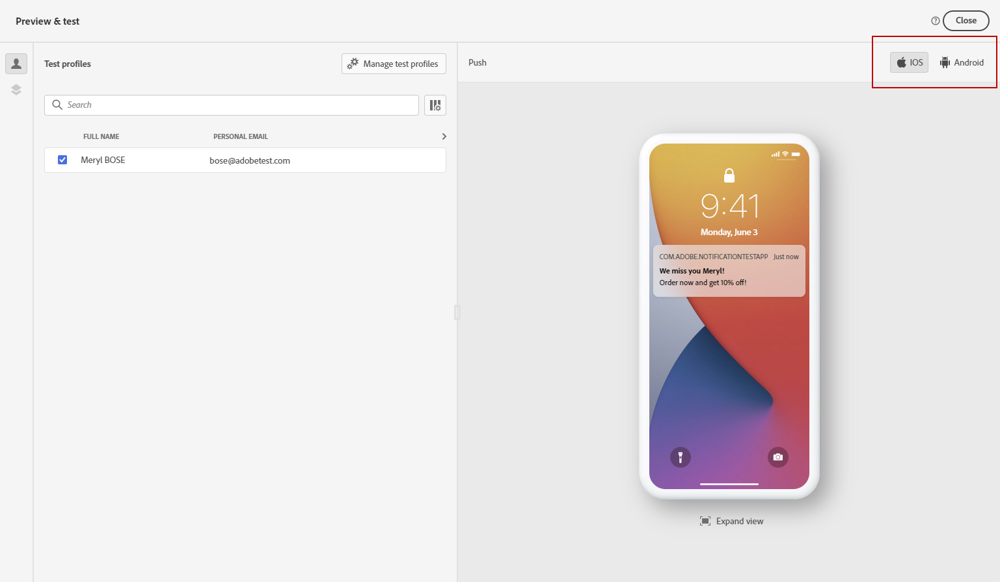
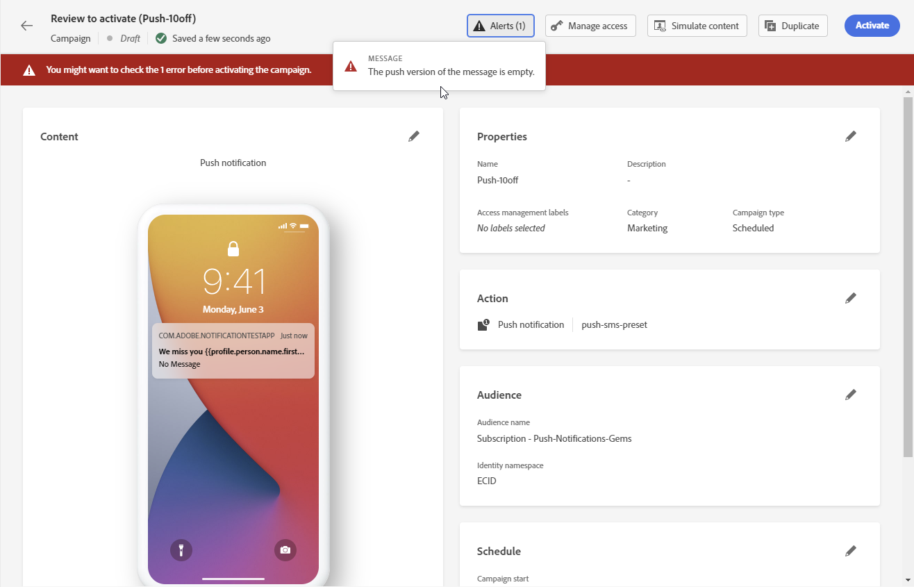

# Förhandsgranska och testa ditt push-meddelande {#send-push}

## Förhandsgranska ditt push-meddelande {#preview-push}

När meddelandeinnehållet har definierats kan du använda testprofiler för att förhandsgranska och testa det. Om du har infogat anpassat innehåll kan du kontrollera hur det här innehållet visas i meddelandet med hjälp av testprofildata.

1. Klicka på **[!UICONTROL Simulate content]**.

1. Klicka **[!UICONTROL Manage test profiles]** för att lägga till en testprofil.

1. Hitta din testprofil med **[!UICONTROL Identity namespace]** och **[!UICONTROL Identity value]** fält. Klicka sedan på **[!UICONTROL Add profile]**.

   

1. När du har valt din testprofil kan du stänga **[!UICONTROL Add test profile]** -fönstret.

1. Från **Förhandsgranska och testa** testprofildata läggs till i meddelandeinnehållet.

   Välj den typ av enhet som du vill förhandsgranska innehåll på: **[!UICONTROL iOS]** eller **[!UICONTROL Android]**.

   

## Validera ditt push-meddelande {#push-validate}

Du måste kontrollera varningar i den övre delen av redigeraren. Vissa av dem är enkla varningar, men andra kan hindra dig från att skicka meddelandet. Två typer av varningar kan inträffa: varningar och fel.

* **Varningar** hänvisa till rekommendationer och bästa praxis.

* **Fel** hindra dig från att testa eller aktivera resan så länge som de inte är lösta, till exempel:

   * **[!UICONTROL The push version of the message is empty]**: det här felet visas när meddelandetexten eller titeln för push-meddelanden saknas. Lär dig definiera innehåll för push-meddelanden i [det här avsnittet](create-push.md).

   * **[!UICONTROL Surface doesn't exist]**: du kan inte använda meddelandet om den yta som du har markerat tas bort efter att meddelandet har skapats. Om det här felet inträffar väljer du en annan yta i meddelandet **[!UICONTROL Properties]**. Läs mer om kanalytor i [det här avsnittet](../configuration/channel-surfaces.md).

   * **[!UICONTROL Push iOS/Android payload has exceeded limit of 4KB]**: storleken på push-meddelanden får inte överskrida 4 kB. Om du vill iaktta den här gränsen försöker du minska användningen av bilder eller känslolägesikoner. Lär dig hur du hanterar ditt push-meddelandeinnehåll i [det här avsnittet](../push/create-push.md).

  

>[!NOTE]
>
> För bättre leverans bör du alltid använda telefonnumren i de format som stöds av leverantören. Twilio och Sinch har till exempel bara stöd för telefonnummer i E.164-format.

## Skicka push-meddelanden{#push-send}

När ditt push-meddelande är klart slutför du konfigurationen av [resa](../building-journeys/journey-gs.md) eller [kampanj](../campaigns/create-campaign.md) för att skicka den.

**Relaterade ämnen**

* [Konfigurera push-kanal](push-configuration.md)
* [Rapport om push-meddelanden](../reports/journey-global-report.md#push-global)
* [Skapa ett push-meddelande](create-push.md)
* [Lägg till ett meddelande i en resa](../building-journeys/journeys-message.md)
* [Lägg till ett meddelande i en kampanj](../campaigns/create-campaign.md)

