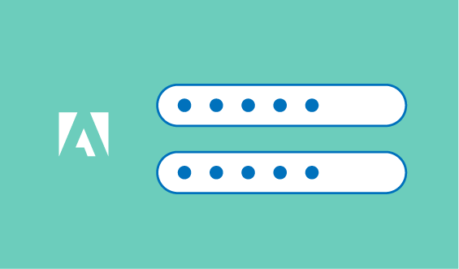

# Snabbstart {#cjm-quick-start}

Med [!DNL Adobe Journey Optimizer]kan ni importera befintligt meddelandeinnehåll eller utforma nytt innehåll, anpassa meddelanden med kundprofildata, skapa händelser för att utlösa meddelanden, definiera segment och förfina målgrupper, skicka flerkanalsmeddelanden, skapa och lägga till erbjudanden och få tillgång till en komplett uppsättning rapporterings- och övervakningsverktyg för att mäta effekten av era meddelanden och kundresor.

Beroende på din organisation kan du definiera flera typer av användare och ge dem åtkomst till vissa funktioner beroende på deras behörigheter.

Börja bara med [!DNL Journey Optimizer]? Erfaren användare med specifika frågor? Administratör för din företagsinstans? Ta din egen väg för att nå dina mål snabbare!

Välj din profil om du vill lära dig och upptäcka styrkan i Adobe Journey Optimizer med stegvis vägledning.

<table>
<tr>
  <td valign="bottom">
    
    

    <a href="path/administrator.md">Jag är administratör</a>
     
Förbered din miljö, ge åtkomst, konfigurera inställningar
    

    

     
  </td>
  <td valign="bottom">
    
    

    <a href="path/data-engineer.md">Jag är datatekniker</a>
     
Importera profiler, bygg målgrupper, skapa scheman och datauppsättningar
    

    

     
  </td>
  <td valign="bottom">
      
    
<a href="path/marketer.md">Jag är marknadsförare</a>
     
Designa meddelanden, lägg till erbjudanden, resurser och bygg kundresor
    

    

     
  </td>
    <!--td valign="bottom">
    
    

    <a href="path/developer.md">I am a Developer</a>
     
Integrate your mobile apps, use Journey Optimizer APIs
    

    

     
  </td-->
</tr>
</table>

