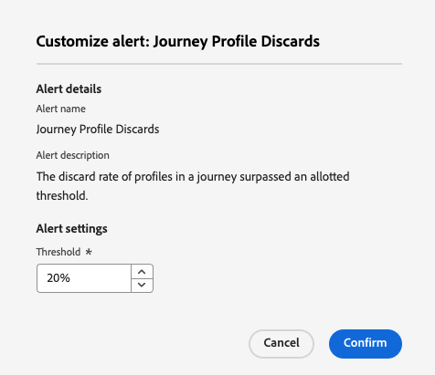

# Åtkomst och prenumeration på systemvarningar {#alerts}

## Översikt

Aviseringar är automatiska meddelanden som hjälper dig att övervaka och felsöka problem i Adobe Journey Optimizer. De ger realtidsmedvetenhet om potentiella problem i era resor, kampanjer och kanalkonfigurationer, så att ni kan vidta korrigerande åtgärder innan kundupplevelserna påverkas.

Adobe Journey Optimizer erbjuder två typer av varningar:

* **Verifieringsvarningar på arbetsytan**: När du skapar resor och kampanjer använder du knappen **Varningar** på arbetsytan för att identifiera och åtgärda konfigurationsfel före publicering. Lär dig hur du [felsöker dina resor](../building-journeys/troubleshooting.md) och granskar dina kampanjer: [Åtgärdskampanjer](../campaigns/review-activate-campaign.md) | [API-utlösta kampanjer](../campaigns/review-activate-api-triggered-campaign.md) | [Samordnade kampanjer](../orchestrated/start-monitor-campaigns.md).

* **Systemövervakningsmeddelanden** (som beskrivs på den här sidan): Ta emot proaktiva meddelanden när tröskelvärden för användning överskrids eller när problem upptäcks i direktresor och kanalkonfigurationer. Systemvarningar övervakar mätvärden som felfrekvens, ignorerade profiler och problem med e-postleverans.

**Viktiga fördelar med systemvarningar:**

* Proaktiv problemidentifiering före kundpåverkan
* Automatisk övervakning av reseprestanda och hälsa
* Tidig varning om e-postleveransproblem
* Minskad tid för att identifiera och lösa operativa problem

Systemvarningar är tillgängliga på menyn **[!UICONTROL Alerts]** under **[!UICONTROL Administration]**. Adobe Experience Platform tillhandahåller flera fördefinierade varningsregler som du kan aktivera, inklusive [!DNL Adobe Journey Optimizer]-specifika aviseringar för resor och kanalkonfigurationer.

## Förhandskrav

Innan du arbetar med varningar:

* **Behörigheter**: Du behöver särskilda behörigheter för att visa och hantera aviseringar. Se [nödvändiga behörigheter i Adobe Experience Platform](https://experienceleague.adobe.com/docs/experience-platform/observability/alerts/overview.html?lang=sv-SE#permissions){target="_blank"}.

* **Sandlådemedvetenhet**: Varningsprenumerationer är sandlådespecifika. När du prenumererar på aviseringar gäller de bara den aktuella sandlådan. När en sandlåda återställs återställs även alla aviseringsprenumerationer.

* **Meddelandeinställningar**: Konfigurera hur du tar emot aviseringar (e-post och/eller i programmet) i dina [Adobe Experience Cloud-inställningar](../start/user-interface.md#in-product-uc).

>[!NOTE]
>
>Journey Optimizer-specifika aviseringar gäller endast för **live**-resor. Varningar utlöses inte för resor i testläge. Mer information om varningsramverket finns i [Adobe Experience Platform-varningsdokumentationen](https://experienceleague.adobe.com/docs/experience-platform/observability/alerts/overview.html?lang=sv-SE){target="_blank"}.

## Tillgängliga aviseringar i Journey Optimizer {#available-alerts}

Journey Optimizer tillhandahåller förkonfigurerade varningsregler som övervakar specifika aspekter av dina resor och kanalkonfigurationer. Du behöver inte skapa de här aviseringarna - de är färdiga och kan aktiveras via prenumeration.

**Så här kommer du åt varningslistan:**

Navigera till **[!UICONTROL Administration]** > **[!UICONTROL Alerts]** på den vänstra menyn. Fliken **Bläddra** visar alla förkonfigurerade aviseringar som är tillgängliga för Journey Optimizer.

{width=50%}

### Aviseringskategorier

Journey Optimizer erbjuder två typer av systemvarningar:

>[!BEGINTABS]

>[!TAB Resensaviseringar]

Övervaka körning och prestanda för resan:

* [Det gick inte att läsa målgrupputlösaren](#alert-read-audiences) - Varnar när en läsmålgruppsaktivitet inte kan bearbeta profiler
* [Felfrekvens för anpassad åtgärd överskreds](#alert-custom-action-error-rate) - Upptäcker höga felfrekvenser i API-anrop för anpassad åtgärd (ersätter den tidigare felvarningen för anpassad åtgärd på resan)
* [Profilens ignoreringsfrekvens har överskridits](#alert-discard-rate) - Identifierar när profiler ignoreras med en onormal hastighet
* [Profilfelsfrekvensen har överskridits](#alert-profile-error-rate) - flaggor när profiler stöter på fel under körningen
* [Resan har publicerats](#alert-journey-published) - Informationsavisering när en resa har publicerats
* [Resan har slutförts](#alert-journey-finished) - Informationsindikator när en resa har slutförts
* [Anpassad åtgärdshämtning utlöst](#alert-custom-action-capping) - Meddelar när API-anropsgränsen har nåtts

>[!TAB Varningar om kanalkonfiguration]

Upptäck problem med e-postleveransinställningar:

* [DNS-post för AJO-domän saknas](#alert-dns-record-missing) - Identifierar saknade eller felkonfigurerade DNS-poster
* [AJO-kanalkonfigurationsfel](#alert-channel-config-failure) - Identifierar e-postkonfigurationsproblem (SPF-, DKIM-, MX-poster)
  <!--* the [AJO domain certificates renewal unsuccessful](#alert-certificates-renewal) alert-->

>[!ENDTABS]

>[!NOTE]
>
>Information om varningar från andra Adobe Experience Platform-tjänster (datainmatning, identitetsupplösning, segmentering med mera) finns i [standarddokumentationen för varningsregler](https://experienceleague.adobe.com/docs/experience-platform/observability/alerts/rules.html?lang=sv-SE){target="_blank"}.

## Prenumerera på aviseringar {#subscribe-alerts}

Varningsprenumerationer avgör vilka användare som får meddelanden när specifika villkor uppfylls (t.ex. att felprocentströskeln överskrids eller konfigurationsproblem upptäcks). Endast prenumererade användare får varningsmeddelanden för de valda aviseringarna.

### Prenumerationsmetoder

Du kan prenumerera på aviseringar på två sätt:

* **[Global prenumeration](#global-subscription)**: Gäller alla resor och kampanjer i den aktuella sandlådan. Använd den här metoden när du vill övervaka all reseaktivitet i hela organisationen.
* **[Resespecifik prenumeration](#unitary-subscription)**: Gäller endast för enskilda resor. Använd den här metoden när du vill övervaka vissa högprioriterade resor utan att få meddelanden om alla resor.

### Hur varningsmeddelanden fungerar

**Varningslivscykel:**

1. **Utlösande**: Varningen utlöses när dess specifika villkor är uppfyllt (felfrekvensen överskrider t.ex. 20 %)
2. **Meddelande**: Alla prenumererade användare får meddelanden via sina konfigurerade kanaler
3. **Övervakning**: Varningen fortsätter att övervaka villkoret med regelbundna intervall
4. **Lösning**: När villkoret är löst får prenumeranterna ett meddelande om att villkoret är löst

**Meddelandeleverans:**

* **Leveranskanaler**: Aviseringar skickas via e-post och/eller meddelanden i appen i meddelandecentret för Journey Optimizer (klockikon i det övre högra hörnet). Konfigurera dina önskade leveranskanaler i dina [Adobe Experience Cloud-inställningar](../start/user-interface.md#in-product-uc).

* **Varningstyper**: Journey Optimizer tillhandahåller både engångsaviseringar (informativa händelser som&quot;publicerad resa&quot;) och upprepade varningar (övervakningströsklar). Upprepade varningar fortsätter att utvärdera och meddela tills villkoret är löst.

* **Automatisk upplösning**: För att förhindra att meddelandetrötthet ändrar värden, löses varningar automatiskt efter 1 timme även om villkoret kvarstår. Detta förhindrar kontinuerliga meddelanden när mätvärden håller pekaren över tröskelvärden.

**Alternativ prenumerationsmetod:**

För avancerade integreringar kan du prenumerera via I/O Events för att skicka aviseringar till externa system. Se [Adobe Experience Platform-dokumentationen](https://experienceleague.adobe.com/docs/experience-platform/observability/alerts/subscribe.html?lang=sv-SE){target="_blank"}.

### Global prenumeration {#global-subscription}

Med globala prenumerationer kan ni få aviseringar för alla resor och kampanjer i den aktuella sandlådan.

**Så här prenumererar du på en avisering:**

1. Navigera till **[!UICONTROL Administration]** > **[!UICONTROL Alerts]** på den vänstra menyn.

1. Leta reda på aviseringen som du vill övervaka på fliken **[!UICONTROL Browse]**.

1. Klicka på **[!UICONTROL Subscribe]** om du vill ha en varning.

   {width=80%}

**Så här avslutar du prenumerationen:**

Klicka på **[!UICONTROL Unsubscribe]** bredvid aviseringen.

>[!IMPORTANT]
>
>Aviseringsprenumerationer är sandlådespecifika. Du måste prenumerera på varningar separat i varje sandlåda där du vill få meddelanden.

**Alternativ prenumerationsmetod:**

Du kan också prenumerera via [I/O-händelsemeddelanden](https://experienceleague.adobe.com/docs/experience-platform/observability/alerts/subscribe.html?lang=sv-SE){target="_blank"} som tillåter integrering med externa system. Evenemangsprenumerationsnamn för Journey Optimizer-aviseringar visas i varje [varningsbeskrivning nedan](#journey-alerts).

### Resespecifik prenumeration {#unitary-subscription}

Med resespecifika abonnemang kan ni övervaka enskilda högprioriterade resor utan att få meddelanden om alla resor i organisationen.

**Så här prenumererar du på aviseringar för en viss resa:**

1. Gå till reseinventeringen.

1. Klicka på menyn **⋯** (fler åtgärder) för den resa du vill övervaka.

1. Välj **[!UICONTROL Subscribe to alerts]**.

   {width=75%}

1. Markera de aviseringar som du vill aktivera bland de tillgängliga alternativen:
   * [Frekvensen för ignorerade profiler har överskridits](#alert-discard-rate)
   * [Felfrekvens för anpassad åtgärd överskreds](#alert-custom-action-error-rate)
   * [Profilfelsfrekvensen har överskridits](#alert-profile-error-rate)
   * [Journey Published](#alert-journey-published)
   * [Resan avslutad](#alert-journey-finished)
   * [Anpassad åtgärd som aktiveras](#alert-custom-action-capping)

1. Klicka på **[!UICONTROL Save]** för att bekräfta dina prenumerationer.

**Så här avslutar du prenumerationen:**

Öppna samma dialogruta, avmarkera aviseringarna och klicka på **[!UICONTROL Save]**.

>[!NOTE]
>
>Varningen [Read Audience Trigger Unsuccess](#alert-read-audiences) är bara tillgänglig via global prenumeration, inte per resa.

<!--To enable email alerting, refer to [Adobe Experience Platform documentation](https://experienceleague.adobe.com/docs/experience-platform/observability/alerts/ui.html?lang=sv-SE#enable-email-alerts){target="_blank"}.-->

## Resevarningar {#journey-alerts}

Alla resemeddelanden som är tillgängliga i användargränssnittet listas nedan.

>[!CAUTION]
>
>Adobe Journey Optimizer-specifika aviseringar gäller endast för **live**-resor. Varningar utlöses inte för resor i testläge.

### Det gick inte att läsa målutlösaren {#alert-read-audiences}

Den här varningen varnar dig om en **Läs målgrupp**-aktivitet inte har bearbetat någon profil 10 minuter efter den schemalagda körningen. Felet kan bero på tekniska problem eller på att målgruppen är tom. Om det här felet orsakas av tekniska problem ska du vara medveten om att försök fortfarande kan göras, beroende på typ av problem (t.ex. om det inte går att skapa exportjobbet kommer vi att försöka igen var 10:e minut med maximalt 1 timme).

Varningar för **Läs målgruppsaktiviteter** gäller endast återkommande resor. **Läs målgruppsaktiviteter** i liveresor som har ett schema för att köra **En gång** eller **Så snart som möjligt** ignoreras.

Varningar på **Läs målgrupp** löses när en profil kommer in i noden **Läs målgrupp** eller efter en timme.

Prenumerationsnamnet för I/O-händelsen som motsvarar aviseringen **Read Audience Trigger Unsuccess** är **Fördröjningar, fel och fel för läsningspubliken på resan**.

Om du vill felsöka **Läs publikaviseringar** kontrollerar du antalet målgrupper i Experience Platform-gränssnittet.

### Frekvensen för ignorerade profiler har överskridits {#alert-discard-rate}

Den här varningen varnar dig om förhållandet mellan profilen och de angivna profilerna har överskridits under de senaste 5 minuterna. Standardtröskelvärdet är 20 % men du kan [definiera ett anpassat tröskelvärde](#custom-threshold).

Klicka på namnet på varningen för att kontrollera varningsinformationen och konfigurationen.

Det finns flera orsaker till att en profil kan ignoreras, vilket informerar felsökningsmetoden. Några vanliga orsaker är:

* Profilen ignoreras vid inträde eftersom den redan bor i den unitära resan. För att lösa detta måste du se till att profilen har tillräckligt med tid för att avsluta resan innan nästa händelse kommer för den profilen.
* Identitet har inte angetts för profilen, eller så används inte namnutrymmet som används av läsarresan i den profilen. För att lösa detta måste namnutrymmet i resan matcha det identitetsnamnutrymme som används av profilerna.
* Händelsens genomströmningshastighet har överskridits. För att lösa detta måste du se till att händelser som kommer in i systemet inte överskrider dessa gränser.

### Felfrekvens för anpassad åtgärd överskreds {#alert-custom-action-error-rate}

Den här varningen varnar dig om förhållandet mellan anpassade åtgärdsfel och slutförda HTTP-anrop under de senaste 5 minuterna har överskridit tröskelvärdet. Standardtröskelvärdet är 20 % men du kan [definiera ett anpassat tröskelvärde](#custom-threshold).

>[!NOTE]
>
>Den här varningen ersätter den tidigare varningen **Fel vid anpassad åtgärd för resa**.

Klicka på namnet på varningen för att kontrollera varningsinformationen och konfigurationen.

Fel med anpassade åtgärder kan inträffa av flera olika anledningar. Om du vill felsöka felen kan du:

* Kontrollera din anpassade åtgärd med [testläge](../building-journeys/testing-the-journey.md) på en annan resa.
* Kontrollera din [reserapport](../reports/journey-live-report.md) för att se felorsaker till åtgärden.
* Kontrollera kundens resaHändelser för att hitta mer information om &quot;errorReason&quot;.
* Kontrollera att den anpassade åtgärden är korrekt konfigurerad och verifiera att autentiseringen fortfarande är giltig. Gör till exempel en manuell kontroll med Postman.
* Kontrollera att slutpunkten är nåbar och att den anpassade åtgärden kan nå den via den anpassade åtgärdsanslutningskontrollen.
* Verifiera autentiseringsuppgifterna, kontrollera Internetanslutningen osv.

### Profilfelsfrekvensen har överskridits {#alert-profile-error-rate}

Den här varningen varnar dig om förhållandet mellan felprofiler och angivna profiler under de senaste 5 minuterna har överskridit tröskelvärdet. Standardtröskelvärdet är 20 % men du kan [definiera ett anpassat tröskelvärde](#custom-threshold).

Klicka på namnet på varningen för att kontrollera varningsinformationen och konfigurationen.

Om du vill felsöka profilfel kan du fråga data i steghändelser för att förstå var och varför profilen misslyckades under resan.

### Journey Published {#alert-journey-published}

Den här varningen meddelar dig när en resa har publicerats av en person på arbetsytan.

Det här är en informativ varning som hjälper dig att hålla reda på händelser i din organisations livscykel. Det finns inga lösningsvillkor eftersom detta är ett engångsmeddelande.

### Resan avslutad {#alert-journey-finished}

Den här varningen meddelar dig när en resa är klar. Definitionen av&quot;färdig&quot; varierar beroende på resans typ. [Läs mer om när resor anses vara slutförda](../building-journeys/end-journey.md#journey-finished-definition).

Det här är en informativ varning som hjälper dig att hålla reda på slutförandet av en resa. Det finns inga lösningsvillkor eftersom detta är ett engångsmeddelande.

### Anpassad åtgärd som aktiveras {#alert-custom-action-capping}

Den här varningen varnar dig när capping har utlösts för en anpassad åtgärd. Takning används för att begränsa antalet anrop som skickas till en extern slutpunkt för att förhindra överbelastning av slutpunkten.

Klicka på namnet på varningen för att kontrollera varningsinformationen och konfigurationen.

När capping aktiveras innebär det att det maximala antalet API-anrop har uppnåtts inom den definierade tidsperioden och att ytterligare anrop stryps eller köas. Läs mer om att sätta stopp för anpassade åtgärder på [den här sidan](../action/about-custom-action-configuration.md#custom-action-enhancements-best-practices).

Den här varningen löses när appningen inte längre är aktiv eller när inga profiler når den anpassade åtgärden under utvärderingsperioden.

Så här felsöker du problem med appning:

* Granska takkonfigurationen för din anpassade åtgärd för att se till att gränserna är lämpliga för ditt användningsfall.
* Kontrollera om antalet API-anrop är större än förväntat och överväg att justera inställningarna för kundresan.
* Övervaka den externa slutpunkten för att säkerställa att den kan hantera den förväntade inläsningen.

## Konfigurationsaviseringar {#configuration-alerts}

Varningar för kanalkonfigurationsövervakning som finns i användargränssnittet visas nedan.

### DNS-post för AJO-domän saknas {#alert-dns-record-missing}

Den här varningen meddelar dig när viktiga DNS-poster (NS eller CNAME) som krävs för korrekt leveranskonfiguration saknas eller är felkonfigurerade. Utan dessa register kan e-postleveransen bli komprometterad.

>[!NOTE]
>
>* NS-poster är viktiga för fullständig delegering till underdomäner till Adobe. [Läs mer](../configuration/about-subdomain-delegation.md#full-subdomain-delegation)
>
>* CNAME-poster har stöd för konfiguration av CNAME-underdomäner. [Läs mer](../configuration/about-subdomain-delegation.md#cname-subdomain-setup)

Aviseringen **om att DNS-posten för AJO-domänen saknas** aktiveras när systemet upptäcker att NS- eller CNAME-posterna saknas eller inte matchar konfigurationsstandarderna.

1. Klicka på aviseringen som ska dirigeras till den påverkade [underdomänen](../configuration/delegate-subdomain.md) i gränssnittet [!DNL Journey Optimizer].

   <!--For guidance on editing delegated subdomains, see [this section](../configuration/delegate-subdomain.md).-->

1. Åtgärda DNS-konfigurationen genom att ange posterna korrekt och [skicka underdomänen](../configuration/delegate-subdomain.md#submit-subdomain)-delegeringen igen.

   >[!NOTE]
   >
   >Kontrollera att alla poster har skapats korrekt på din domänvärdslösning innan du fortsätter.

1. Om du är osäker på vilka värden som är korrekta kan du skapa en ny underdomän i [!DNL Journey Optimizer] med samma namn som den påverkade underdomänen. [Lär dig hur du konfigurerar en ny underdomän](../configuration/delegate-subdomain.md#set-up-subdomain)

Om ändringarna inte löser problemet kommer samma varning att utlösas igen nästa dag.

<!--The I/O event subscription name corresponding to this alert is xx. > Do we need to mention this?-->

### Konfigurationsfel för AJO-kanaler {#alert-channel-config-failure}

>[!IMPORTANT]
>
>Den här varningen gäller endast för **e-post**-kanalkonfigurationer som använder delegeringstypen [anpassad underdomän](../configuration/delegate-custom-subdomain.md). <!--Other channel types (such as SMS, push, or in-app) are not covered by this alert.-->

Den här varningen utlöses om systemgranskningen upptäcker e-postkanalens konfigurationsproblem. Dessa problem kan vara felkonfigurerade kanalinställningar, ogiltig DNS-konfiguration, problem med utelämningslista, IP-inkonsekvenser eller andra fel som kan påverka e-postleveransen.

Om du får en sådan varning visas lösningsstegen nedan:

1. Klicka på aviseringen om du vill dirigeras till den påverkade [e-postkanalskonfigurationen](../email/get-started-email-config.md) i [!DNL Journey Optimizer]-gränssnittet.

   Mer information om hur du redigerar kanalkonfigurationer finns i [det här avsnittet](../configuration/channel-surfaces.md#edit-channel-surface).

1. Granska konfigurationsinformationen och felmeddelandena. Vanliga orsaker till misslyckanden är:

   * SPF-valideringen misslyckades
   * DKIM-valideringen misslyckades
   * MX-postvalideringen misslyckades
   * Ogiltiga DNS-poster

   >[!NOTE]
   >
   >Möjliga orsaker till konfigurationsfel visas i [det här avsnittet](../configuration/channel-surfaces.md).

1. Lös problemet:

   * Uppdatera kanalkonfigurationen efter behov.
   * Du kan behöva åtgärda specifika DNS-problem som nämns i aviseringen.

   >[!NOTE]
   >
   >Eftersom en enda domän kan associeras med flera kanalkonfigurationer kan DNS-problem för en kanalkonfiguration automatiskt åtgärda relaterade problem i flera konfigurationer.

Om ändringen inte löser problemet kommer samma varning att utlösas igen nästa dag.

När du åtgärdar e-postkonfigurationsproblem bör du tänka på de bästa metoderna som anges nedan:

* Agera snabbt - Åtgärda konfigurationsfel så snart de upptäcks för att undvika avbrott i e-postleveransen.
* Kontrollera alla konfigurationer - Om varningen indikerar flera påverkade e-postkonfigurationer granskar och åtgärdar du var och en av dem.

<!--### AJO domain certificates renewal unsuccessful {#alert-certificates-renewal}

This alert warns you if a domain certificate (CDN, tracking URL) renewal failed for a specific Journey Optimizer subdomain.-->

## Hantera aviseringar {#manage-alerts}

### Redigera en varning

Du kan kontrollera information om en varning genom att klicka på raden. Namn, status och meddelandekanaler visas i den vänstra panelen.
Använd knappen **[!UICONTROL More actions]** för att redigera researney-aviseringar. Du kan sedan definiera en [anpassad tröskel](#custom-threshold) för dessa aviseringar.

{width=60%}

### Definiera ett anpassat tröskelvärde {#custom-threshold}

Du kan ange tröskelvärden för [reseaviseringar](#journey-alerts). Tröskelvärdesvarningarna över standardvärdet är 20 %.

Så här ändrar du tröskelvärdet:

1. Bläddra till skärmen **Varningar**
1. Klicka på knappen **[!UICONTROL More actions]** för aviseringen för att uppdatera
1. Ange det nya tröskelvärdet och bekräfta. Det nya tröskelvärdet gäller för **alla** resor

{width=60%}

>[!CAUTION]
>
>Tröskelvärdena är globala för alla resor och kan inte ändras individuellt per resa.

### Inaktivera en varning

Som standard är alla aviseringar aktiverade. Om du vill inaktivera en avisering väljer du alternativet **[!UICONTROL Disable alert]**: alla prenumeranter på den här aviseringen kommer inte längre att få relaterade meddelanden.

### Varningsstatus

Möjliga varningsstatusvärden visas nedan:

* **[!UICONTROL Enabled]** - Varningen är aktiverad och övervakar utlösarvillkoret.
* **[!UICONTROL Disabled]** - Varningen är inaktiverad och övervakar för närvarande inte utlösarvillkoret. Du kommer inte att få några meddelanden om den här aviseringen.
* **[!UICONTROL Triggered]** - Varningens utlösarvillkor uppfylls.

### Visa och uppdatera prenumeranter {#manage-subscribers}

Välj **[!UICONTROL Manage alert subscribers]** om du vill visa listan över användare som prenumererar på aviseringen.

{width=80%}

Om du vill lägga till fler prenumeranter anger du deras e-postadresser avgränsade med kommatecken och väljer **[!UICONTROL Update]**.

Om du vill ta bort prenumeranter tar du bort deras e-postadress från de aktuella prenumeranterna och väljer **[!UICONTROL Update]**.

## Relaterade ämnen {#additional-resources-alerts}

**Resor och kampanjhantering:**

* [Felsöka resor](../building-journeys/troubleshooting.md) - Identifiera och lös vanliga reseproblem och fel
* [Testa och publicera resor](../building-journeys/publishing-the-journey.md) - Verifiera resekonfigurationen före publicering
* [Granska och aktivera åtgärdskampanjer](../campaigns/review-activate-campaign.md) - validering före publicering för schemalagda och engångskampanjer
* [Granska och aktivera API-utlösta kampanjer](../campaigns/review-activate-api-triggered-campaign.md) - validering för API-utlösta kampanjer
* [Övervaka samordnade kampanjer](../orchestrated/start-monitor-campaigns.md) - Spåra och hantera samordnade kampanjkörningar

**Varningsramverk:**

* [Adobe Experience Platform Alerts Overview](https://experienceleague.adobe.com/docs/experience-platform/observability/alerts/overview.html?lang=sv-SE){target="_blank"} - Understanding the alert framework
* [Hantera aviseringar i användargränssnittet](https://experienceleague.adobe.com/docs/experience-platform/observability/alerts/ui.html?lang=sv-SE){target="_blank"} - Visa, prenumerera och hantera aviseringar
* [Prenumerera på aviseringar via I/O-händelser](https://experienceleague.adobe.com/docs/experience-platform/observability/alerts/subscribe.html?lang=sv-SE){target="_blank"} - Avancerade integreringsalternativ
* [Standardvarningsregler](https://experienceleague.adobe.com/docs/experience-platform/observability/alerts/rules.html?lang=sv-SE){target="_blank"} - Fullständig lista över tillgängliga plattformsaviseringar
