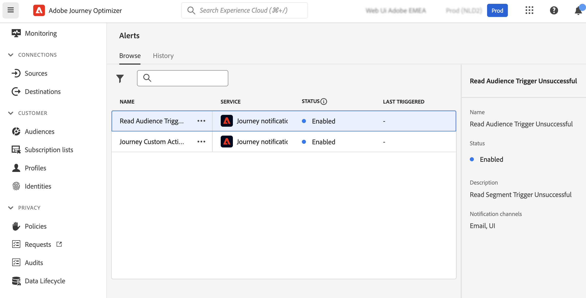

# Kom igång med aviseringar {#alerts}

## Varningsfunktioner {#alerting-capabilities}

Du kan få åtkomst till systemvarningar via användargränssnittet eller få ett e-postmeddelande när ett fel inträffar. Från **Varningar** kan du visa de tillgängliga varningarna och prenumerera på dem. När en viss uppsättning villkor för dina åtgärder har nåtts (t.ex. ett eventuellt problem när systemet överskrider ett tröskelvärde), skickas varningsmeddelanden till alla användare i organisationen som prenumererar på dem.

<!--These messages can repeat over a pre-defined time interval until the alert has been resolved.-->

Läs mer om varningar i Adobe Experience Platform i [Adobe Experience Platform-dokumentation](https://experienceleague.adobe.com/docs/experience-platform/observability/alerts/overview.html){target="_blank"}.

I den vänstra menyn, under **Administration**, klicka **Varningar**. Det finns två förkonfigurerade varningar för Journey Optimizer: [Fel i anpassad åtgärd för resa](#alert-custom-actions) larm och [Utlösaren för lässegment misslyckades](#alert-read-audiences) varning. Dessa varningar beskrivs nedan.

Du kan prenumerera på varje avisering separat från användargränssnittet genom att välja **Prenumerera** från **Varningar** kontrollpanel. Använd samma metod för att avsluta prenumerationen.

Du kan även prenumerera på aviseringar via [I/O-händelsemeddelanden](https://experienceleague.adobe.com/docs/experience-platform/observability/alerts/subscribe.html){target="_blank"}. Varningsregler är ordnade i olika prenumerationspaket. Evenemangsprenumerationer som motsvarar specifika Journey Optimizer-varningar beskrivs nedan.

Om ett oväntat beteende inträffar skickas ett varningsmeddelande till prenumeranterna. Varningar skickas med e-post, eller direkt i Journey Optimizer meddelandecenter, i det övre högra hörnet av användargränssnittet, baserat på användarinställningarna.

När en varning har lösts får prenumeranterna ett meddelande om att den har lösts.

>[!CAUTION]
>
>Adobe Journey Optimizer-specifika varningar gäller endast för **live** resor. Varningar utlöses inte för resor i testläge.

## Fel i anpassad åtgärd för resa {#alert-custom-actions}

Den här varningen varnar dig om en anpassad åtgärd misslyckas. Vi anser att det finns ett fel där det har förekommit mer än 1 procent av felen i en specifik anpassad åtgärd under de senaste fem minuterna. Detta utvärderas var 30:e sekund.

Varningar om anpassade åtgärder löses när, under de senaste fem minuterna:

* det inte har förekommit något fel i den anpassade åtgärden (eller fel under tröskelvärdet 1 %),

* eller så har ingen profil nått den anpassade åtgärden.

I/O-händelsens prenumerationsnamn som motsvarar aviseringen om anpassade åtgärder är **Fel i anpassad åtgärd för resa**.

## Utlösaren för lässegment misslyckades {#alert-read-audiences}

Den här varningen varnar dig om en **Läs målgrupp** aktiviteten har inte bearbetat någon profil 10 minuter efter schemalagd körningstid. Felet kan bero på tekniska problem eller på att målgruppen är tom.

Varningar på **Läs målgrupp** Denna verksamhet gäller endast återkommande resor. **Läs målgrupp** aktiviteter i direktresor som har en tidsplan för att köras **En gång** eller **Så snart som möjligt** ignoreras.

Varningar på **Läs målgrupp** löses när en profil anges i **Läs målgrupp** nod.

I/O-händelsens prenumerationsnamn som motsvarar **Utlösaren för lässegment misslyckades** varning **Lässegmentsfördröjningar, fel och fel på resan**.
