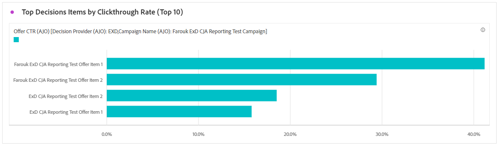
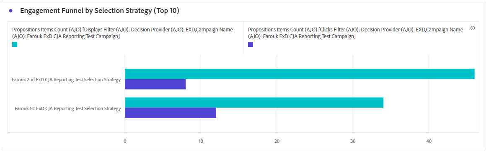

# Kodbaserad kampanjrapport {#campaign-global-report-cja-code}

## Visa och klicka {#impressions-code}

Diagrammen **[!UICONTROL Display & Click]** innehåller en detaljerad analys av hur era profiler interagerar med era kodbaserade upplevelser och ger värdefulla insikter om hur profilerna interagerar med ert innehåll.

+++ Läs mer om Impression &amp; Click-statistik

* **[!UICONTROL Unique Clicks]**: Antal profiler som klickat på ett innehåll i dina upplevelser.

* **[!UICONTROL Clicks]**: Antal gånger som ett innehåll klickades på i dina upplevelser.

* **[!UICONTROL Displays]**: Antal gånger som upplevelsen öppnades.

* **[!UICONTROL Unique displays]**: Antal gånger som upplevelsen öppnades, tas inte hänsyn till flera interaktioner för en profil.

+++

## Spårningsdata {#track-data-code}

Tabellen **[!UICONTROL Tracking data]** innehåller en detaljerad överblicksbild av profilaktiviteten som är kopplad till dina kodbaserade upplevelser och ger viktiga insikter om engagemang och effektivitet för upplevelser.

+++ Läs mer om att spåra datamått

* **[!UICONTROL People]**: Antal användarprofiler som kvalificerar sig som målprofiler för dina upplevelser.

* **[!UICONTROL Click through rate (CTR)]**: Procentandel användare som interagerade med dina upplevelser.

* **[!UICONTROL Clicks]**: Antal gånger som du klickat på ett innehåll i dina upplevelser.

* **[!UICONTROL Unique Clicks]**: Antal profiler som klickat på ett innehåll i dina upplevelser.

* **[!UICONTROL Displays]**: Antal gånger som din upplevelse öppnats.

* **[!UICONTROL Unique displays]**: Det antal gånger som din upplevelse öppnades beaktas inte flera interaktioner för en profil.

+++

## Spårade länketiketter {#track-link-code}

Tabellen **[!UICONTROL Tracked link labels]** innehåller en omfattande översikt över länketiketterna i dina kodbaserade upplevelser, som framhäver de som genererar den högsta besökstrafiken. Med den här funktionen kan du identifiera och prioritera de mest populära länkarna.

+++ Läs mer om mätvärden för spårade länketiketter

* **[!UICONTROL Unique Clicks]**: Antal profiler som klickade på ett innehåll i dina kodbaserade upplevelser.

* **[!UICONTROL Clicks]**: Antal gånger som ett innehåll klickades på i dina kodbaserade upplevelser.

* **[!UICONTROL Displays]**: Antal gånger som upplevelsen öppnades.

* **[!UICONTROL Unique displays]**: Antal gånger som upplevelsen öppnades, tas inte hänsyn till flera interaktioner för en profil.

+++

## KPI för beslutsfattande {#decisioning-kpis}

**KPI:er för beslutsfattande** ger viktiga insikter i besökarnas engagemang i era upplevelser, inklusive mått som:

* **[!UICONTROL Total items]**: Totalt antal enskilda objekt som ingick i en personlig upplevelse eller beslutsprocess under en angiven period.

* **[!UICONTROL Total displays]**:

* **[!UICONTROL Total clicks]**: Totalt antal gånger som användare klickat på objekt, länkar, produkter eller andra interaktiva element under en angiven tidsperiod.

* **[!UICONTROL Fallback rate]**: procentandel instanser där inga urvalsstrategier kvalificerades, vilket resulterar i att ett allmänt eller mindre specifikt alternativ visas.

## Engagement tratt {#engagement-funnel}

Tabellen **[!UICONTROL Engagement Funnel]** övervakar prestandan för personliga upplevelser genom att utvärdera hur effektivt varje steg i tratten driver användarinteraktioner.

* **[!UICONTROL Displays]**: Det totala antalet gånger som personliga upplevelser visades eller presenterades för användare via olika kontaktpunkter.

* **[!UICONTROL Clicks]**: Totalt antal gånger som användarna klickat på anpassade upplevelser som visats för dem.

## De viktigaste beslutsobjekten efter genomklickningsfrekvens {#top-decision}

Tabellen **[!UICONTROL Top decision items by CTR]** visar prestanda för enskilda objekt baserat på deras genomklickningsfrekvens. Med den här mätningen kan du bedöma vilka objekt som är mest effektiva när det gäller att engagera användare och skapa interaktioner.

* **[!UICONTROL Click-through Rate (CTR)]**: procentandel användare som klickar på en länk, annons eller rekommendation jämfört med hur många gånger den visades.

## Engagemangstrå efter urvalsstrategi {#engagement-funnel-selection}

Tabellen **[!UICONTROL Engagement Funnel by Selection Strategy]** hjälper dig att övervaka och analysera hur effektivt olika urvalsstrategier engagerar användare med personaliserade upplevelser.

* **[!UICONTROL Displays]**: Totalt antal gånger personaliserade upplevelser har visats eller presenterats för användare över olika kontaktytor.

* **[!UICONTROL Clicks]**: Totalt antal gånger användare klickat på personaliserade upplevelser som visades för dem.

## Prestanda för beslutsobjekt {#decision-items-performance}

Tabellen **[!UICONTROL Decision Items Performance]** utvärderar hur väl varje objekt fungerar för att engagera användare och få fram önskade åtgärder, till exempel köp, klick eller andra svar.

* **[!UICONTROL Displays]**: Totalt antal gånger personaliserade upplevelser har visats eller presenterats för användare över olika kontaktytor.

* **[!UICONTROL Clicks]**: Totalt antal gånger användare klickat på personaliserade upplevelser som visades för dem.

## Rankningsstrategi {#ranking-strategy}

>[!NOTE]
>
>Tabellen **[!UICONTROL Ranking Strategy]** blir bara tillgänglig när en AI-modell har integrerats i kampanjen. [Läs mer](../experience-decisioning/ranking.md)

Tabellen **[!UICONTROL Ranking Strategy]** innehåller information om prestanda för AI-drivna rankningsmodeller i personliga upplevelser där två trafiktyper jämförs:

* **Modelldriven**: Användarna får innehåll som rangordnas efter AI-modellen, optimerat för relevans och engagemang.

* **Avbrott**: Användarna ser en generisk version av innehållet som fungerar som en kontrollgrupp för att mäta AI-modellens effektivitet.

Viktiga mätvärden som visas är:

* **[!UICONTROL Displays]**: Totalt antal gånger personaliserade upplevelser har visats eller presenterats för användare över olika kontaktytor.

* **[!UICONTROL Clicks]**: Totalt antal gånger användare klickat på personaliserade upplevelser som visades för dem.

* **[!UICONTROL Conversion rate]**: procentandel av visningar som resulterade i användaråtgärder (t.ex. klickningar), vilket anger modellens resultat när det gäller att engagera användare.

## Konverteringsgrad för Holdout och Modellstyrd trafik {#conversion-rate}

>[!NOTE]
>
>Diagrammet **[!UICONTROL Conversion rate for Holdout and Model Driven traffic]** blir bara tillgängligt när en AI-modell har integrerats i kampanjen. [Läs mer](../experience-decisioning/ranking.md)

Diagrammet **[!UICONTROL Conversion rate for Holdout and Model Driven traffic]** visar konverteringsgraden över tid för två typer av trafik:

* **Modellstyrd**: användare får innehåll som rangordnats av AI-modellen, optimerat för relevans och engagemang.

* **Holdout**: användare ser en allmän version av innehållet, som fungerar som en kontrollgrupp för att mäta AI-modellens effektivitet.
