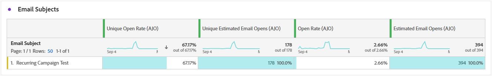

# Rapport om e-postkampanj {#campaign-global-report-cja-email}

>[!BEGINSHADEBOX]

Eftersom Apple har infört nya funktioner för integritetsskydd för sin egen e-postapp, bland annat skydd av personuppgifter, kan avsändare inte längre använda spårningspixlar för att samla in data om profiler som har aktiverat Apple skydd av personuppgifter. Därför kan Adobe Journey Optimizer förmåga att spåra e-postöppningar med hjälp av spårningspixlar påverkas. [Läs mer](https://experienceleaguecommunities.adobe.com/t5/adobe-campaign-classic-blogs/the-impact-of-apple-ios-privacy-changes-on-email-marketing-and/ba-p/699780) om hur sekretessändringar för Apple iOS påverkar e-postmarknadsföringen.

Vi rekommenderar att ni fokuserar på klick och konverteringsvärden i stället för öppna frekvenser för mer korrekta insikter.

>[!ENDSHADEBOX]

## Levererat kontra klicktrend {#delivered-click}

Diagrammet **[!UICONTROL Delivered vs Click trend]** innehåller en detaljerad analys av hur dina profiler interagerar med dina e-postmeddelanden, och ger värdefulla insikter om hur profiler interagerar med ditt innehåll.

+++ Läs mer om Levererat jämfört med Click-trendstatistik

* **[!UICONTROL Delivered]**: Antal e-postmeddelanden som har skickats, i relation till det totala antalet skickade e-postmeddelanden.

* **[!UICONTROL Clicks]**: Antal gånger som ett innehåll klickades på i dina e-postmeddelanden.

+++

## Leveransstatus {#delivery-status}

Diagrammet **[!UICONTROL Delivery status]** ger en heltäckande bild av data relaterade till skickade e-postmeddelanden i kampanjen, och ger insikter i viktiga mått som levererade och studsade. Detta möjliggör en detaljerad analys av e-postsändningsprocessen och ger värdefull information om effektiviteten och resultatet för era kampanjer.

+++ Läs mer om leveransstatusvärden

* **[!UICONTROL Delivered]**: Antal e-postmeddelanden som har skickats, i relation till det totala antalet skickade e-postmeddelanden.

* **[!UICONTROL Bounces for outbound channels]**:Totalt antal fel som har ackumulerats under sändningsprocessen och automatisk returbearbetning i relation till det totala antalet skickade meddelanden.

* **[!UICONTROL Outbound errors]**: Totalt antal fel som uppstod under en sändningsprocess och som förhindrar att den skickas till profiler.

* **[!UICONTROL Outbound exclusions]**: Antal profiler som har undantagits av Adobe Journey Optimizer.

+++

## Skicka statistik {#sending-statistics-email}

Tabellen **[!UICONTROL Sending Statistics]** innehåller en omfattande sammanfattning av viktiga data om e-postmeddelanden i dina kampanjer. Den innehåller viktiga mätvärden som interaktionen med e-postmeddelanden och antalet e-postmeddelanden som levererats, vilket ger värdefulla insikter om effektiviteten och räckvidden för era e-postmeddelanden och kampanjer.

+++ Läs mer om Skicka statistik-statistik

* **[!UICONTROL People]**: Antal användarprofiler som kvalificerar sig som målprofiler för dina meddelanden.

* **[!UICONTROL Targeted]**: Totalt antal e-postmeddelanden som bearbetats under sändningsprocessen.

* **[!UICONTROL Sends]**: Totalt antal skickade meddelanden för din e-post.

* **[!UICONTROL Delivered]**: Antal e-postmeddelanden som har skickats, i relation till det totala antalet skickade meddelanden.

* **[!UICONTROL Bounces for outbound channels]**: Totalt antal fel som har ackumulerats under sändningsprocessen och automatisk returbearbetning i relation till totalt antal skickade meddelanden.

* **[!UICONTROL Outbound Errors]**: Totalt antal fel som uppstod under sändningsprocessen och som förhindrar att den skickas till profiler.

* **[!UICONTROL Outbound Exclusions]**: Antal profiler som har undantagits av Adobe Journey Optimizer.

+++

## Spårningsstatistik {#tracking-statistics-email}

Tabellen **[!UICONTROL Email - Tracking statistics]** innehåller ett detaljerat konto för profilaktivitet som är relaterad till e-postmeddelanden som ingår i kampanjen. Detta inkluderar mätvärden för öppningar, klick och andra relevanta interaktionsindikatorer, som ger en heltäckande bild av hur profiler interagerar med ert e-postinnehåll.

+++ Läs mer om statistik för spårning

* **[!UICONTROL Click through rate (CTR)]**: Procentandel användare som interagerade med e-postmeddelandet.

* **[!UICONTROL Click through open rate (CTOR)]**: Antal gånger som e-postmeddelandet öppnades.

* **[!UICONTROL Clicks]**: Antal gånger som ett innehåll klickades på i dina e-postmeddelanden.

* **[!UICONTROL Unique Clicks]**: Antal profiler som klickat på ett innehåll i ett e-postmeddelande.

* **[!UICONTROL Email Opens]**: Antal gånger som dina e-postmeddelanden öppnats i en kampanj.

* **[!UICONTROL Unique Email Opens]**: Procentandel öppnade e-postmeddelanden.

* **[!UICONTROL Spam complaints]**: Antal gånger ett meddelande har deklarerats som skräppost eller skräppost.

* **[!UICONTROL Unsubscribes]**: Antal klick på länken för att avbryta prenumerationen.

+++

## E-postdomäner {#email-domains}

Tabellen **[!UICONTROL Email Domains]** innehåller en detaljerad beskrivning av e-postmeddelanden kategoriserade efter domän, vilket ger omfattande insikter om prestandamätningarna för dina e-postkampanjer. Denna omfattande analys gör att ni kan förstå beteendet hos olika domäner som svar på ert e-postinnehåll.

+++ Läs mer om mätvärden för e-postdomäner

* **[!UICONTROL Sends]**: Totalt antal skickade meddelanden för din e-post.

* **[!UICONTROL Delivered]**: Antal e-postmeddelanden som har skickats, i relation till det totala antalet skickade e-postmeddelanden.

* **[!UICONTROL Email Opens]**: Antal gånger som dina e-postmeddelanden öppnats i en kampanj.

* **[!UICONTROL Clicks]**: Antal gånger som ett innehåll klickades på i dina e-postmeddelanden.

* **[!UICONTROL Bounces for outbound channels]**: Totalt antal fel som har ackumulerats under sändningsprocessen och automatisk returbearbetning i relation till totalt antal skickade e-postmeddelanden.

* **[!UICONTROL Outbound Errors]**: Totalt antal fel som uppstod under sändningsprocessen och som förhindrar att den skickas till profiler.
+++

## Spårade länketiketter {#track-link-label}

Tabellen **[!UICONTROL Tracked link labels]** innehåller en omfattande översikt över länketiketterna i dina e-postmeddelanden, som visar vilka som genererar störst besökstrafik. Med den här funktionen kan du identifiera och prioritera de mest populära länkarna.

+++ Läs mer om mätvärden för spårade länketiketter

* **[!UICONTROL Unique Clicks]**: Antal profiler som klickat på ett innehåll i ett e-postmeddelande.

* **[!UICONTROL Clicks]**: Antal gånger som ett innehåll klickades på i dina e-postmeddelanden.

+++

## URL för spårad länk {#track-link-url}

Tabellen **[!UICONTROL Tracked link URLs]** innehåller en omfattande översikt över de URL:er i ditt e-postmeddelande som lockar den högsta besökstrafiken. På så sätt kan ni identifiera och prioritera de mest populära länkarna och öka er förståelse för hur proffsen interagerar med specifikt innehåll i era e-postmeddelanden.

+++ Läs mer om URL:er för spårade länkar

* **[!UICONTROL Unique Clicks]**: Antal profiler som klickat på ett innehåll i ett e-postmeddelande.

* **[!UICONTROL Clicks]**: Antal gånger som ett innehåll klickades på i dina e-postmeddelanden.

* **[!UICONTROL Displays]**: Antal gånger som e-postmeddelandet öppnades.

* **[!UICONTROL Unique displays]**: Det antal gånger som e-postmeddelandet öppnades tas ingen hänsyn till flera interaktioner för en profil.

+++

## E-postämnen {#email-subjects}

Tabellen **[!UICONTROL Email subjects]** innehåller en grundlig översikt över e-postämnen som har fått den högsta besökstrafiken. Den här resursen ger värdefulla insikter om målgruppsengagemangets dynamik.

+++ Läs mer om ämnesstatistik för e-post

* **[!UICONTROL People]**: Antal användarprofiler som kvalificerar sig som målprofiler för dina e-postmeddelanden.

+++

## Undantagna orsaker {#excluded-reasons}

Tabellen **[!UICONTROL Excluded reasons]** ger en heltäckande bild av de olika faktorer som har lett till att användarprofiler har exkluderats från målgruppen, vilket leder till att meddelandet inte tas emot.

Se [den här sidan](exclusion-list.md) för en utförlig lista över orsaker till undantag.

## Brytningsorsaker {#bounce-reasons-email}

Tabellen **[!UICONTROL Bounce Reasons]** kompilerar tillgängliga data som är relaterade till studsade meddelanden och ger detaljerade insikter om de specifika orsakerna bakom e-poststudsar.

Mer information om studsar finns på sidan [Suppressionslista](../reports/suppression-list.md).

## Felorsaker {#error-reasons-email}

Tabellen **[!UICONTROL Error Reasons]** ger synlighet för de specifika fel som uppstod under sändningsprocessen, vilket ger värdefull information om felens art och förekomst.
