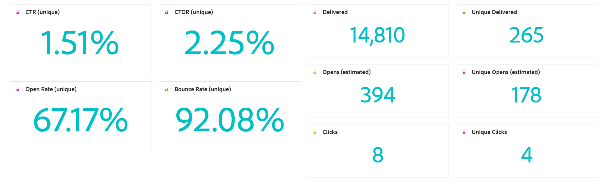

# Rapport om e-postkampanj {#campaign-global-report-cja-email}

>[!INFO]
>
>Eftersom Apple har infört nya funktioner för integritetsskydd för sin egen e-postapp, bland annat skydd av personuppgifter, kan avsändare inte längre använda spårningspixlar för att samla in data om profiler som har aktiverat Apple skydd av personuppgifter. Därför kan Adobe Journey Optimizer förmåga att spåra e-postöppningar med hjälp av spårningspixlar påverkas.
> [Läs mer](https://experienceleaguecommunities.adobe.com/t5/adobe-campaign-classic-blogs/the-impact-of-apple-ios-privacy-changes-on-email-marketing-and/ba-p/699780) om hur Apple iOS sekretessändringar påverkar e-postmarknadsföringen.
> 
> Vi rekommenderar att ni fokuserar på klick och konverteringsvärden i stället för öppna frekvenser för mer korrekta insikter.

>[!BEGINSHADEBOX]

Du kommer åt rapporten för e-postkampanjen genom att klicka på knappen **[!UICONTROL Reports]** i kampanjen och sedan välja **[!UICONTROL View all time report]**. [Läs mer](report-gs-cja.md)

>[!ENDSHADEBOX]

## KPI för e-post

**[!UICONTROL Email]** KPI:er (Key Performance Indicators) tillhandahåller en fokuserad instrumentpanel med unika och aggregerade mått som återspeglar prestanda och engagemangsnivåer för era e-postkampanjer.

+++ Läs mer om KPI:er för e-post

* **[!UICONTROL Unique Click-through rate]**: Procentandel unika profiler som klickade på minst en länk i e-postmeddelandet i förhållande till antalet unika levererade e-postmeddelanden.

* **[!UICONTROL Click through open rate (CTOR)]**: Procentandel profiler som interagerade med meddelandet.

* **[!UICONTROL Unique Open rate]**: Procentandel unika profiler som öppnade e-postmeddelandet minst en gång i förhållande till antalet unika levererade e-postmeddelanden.

* **[!UICONTROL Unique Bounce rate]**: Procentandel unika profiler vars e-post studsade minst en gång, baserat på det totala antalet unika sändningar.

* **[!UICONTROL Delivered]**: Antal e-postmeddelanden som har skickats, i relation till det totala antalet skickade meddelanden.

* **[!UICONTROL Unique delivered]**: Antal unika profiler som har tagit emot minst ett meddelande.

* **[!UICONTROL Estimated Opens]**: Uppskattning av det totala antalet e-postöppningar som öppnar konton för både direktöppning med profiler och automatiska öppningar som utlöses av e-postservrar. Det här måttet justerar öppningar som utlöses av e-postservrar för sekretess- eller säkerhetsskanning genom att tillämpa en öppen frekvens som beräknas från mottagare som manuellt öppnade e-postmeddelandet till dem vars e-post bara öppnades av e-postservrar.

* **[!UICONTROL Unique Estimated Opens]**: Uppskattning av antalet unika e-postmottagare som troligen öppnade e-postmeddelandet. Detta mätresultat syftar till att ge ett mer korrekt antal enskilda interaktioner som utlöses av e-postservrar för sekretess- eller säkerhetsgenomsökning genom att tillämpa en unik öppen frekvens som beräknas utifrån unika profiler som manuellt öppnade e-postmeddelandet till dem vars e-post bara öppnades av e-postservrar.

* **[!UICONTROL Clicks]**: Totalt antal gånger som någon av länkarna i meddelandet klickades, inklusive flera klick med samma profil.

* **[!UICONTROL Unique clicks]**: Antal unika profiler som klickade på ett innehåll i meddelandet.

+++

## Unik klickning på funnel

Diagrammet **[!UICONTROL Click funnel]** innehåller en detaljerad analys av hur profiler interagerar med ditt e-postinnehåll och ger värdefulla insikter om varje interaktionsfas, från leverans till klickning, vilket hjälper dig att förstå hur effektivt dina meddelanden ökar användarengagemanget.

+++ Läs mer om Click funnel-statistik

* **[!UICONTROL Unique Targeted]**: Antal unika profiler som kvalificerats för målgruppen innan undantag, inaktiveringar eller medgivandeborttagningar tillämpades.

* **[!UICONTROL Unique Sends]**: Antal unika profiler för vilka minst ett e-postmeddelande försökte skickas.

* **[!UICONTROL Unique delivered]**: Antal unika profiler som har tagit emot minst ett meddelande.

* **[!UICONTROL Unique estimated opens]**: Uppskattning av antalet unika e-postmottagare som troligen öppnade e-postmeddelandet. Detta mätresultat syftar till att ge ett mer korrekt antal enskilda interaktioner som utlöses av e-postservrar för sekretess- eller säkerhetsgenomsökning genom att tillämpa en unik öppen frekvens som beräknas utifrån unika profiler som manuellt öppnade e-postmeddelandet till dem vars e-post bara öppnades av e-postservrar.

* **[!UICONTROL Unique clicks]**: Antal unika profiler som klickade på ett innehåll i meddelandet.

+++

## Unik leveransstatus

Diagrammet **[!UICONTROL Delivery status]** ger en heltäckande bild av data relaterade till skickade e-postmeddelanden i kampanjen, och ger insikter i viktiga mått som levererade och studsade. Detta möjliggör en detaljerad analys av e-postsändningsprocessen och ger värdefull information om effektiviteten och resultatet för era kampanjer.

+++ Läs mer om leveransstatusvärden

* **[!UICONTROL Unique send errors]**: Antal unika profiler som upplevde minst ett sändningsfel under den utgående processen.

* **[!UICONTROL Unique delivered]**: Antal unika profiler som har tagit emot minst ett meddelande.

* **[!UICONTROL Unique send exclusions]**: Antal unika profiler som undantagits från att ta emot meddelanden på grund av fördefinierade regler eller målgruppskriterier.

* **[!UICONTROL Unique bounces]**: Antal unika profiler för vilka minst ett meddelande studsade under sändningsprocessen.

+++

## Levererat kontra klicktrend {#delivered-click}

Diagrammet **[!UICONTROL Delivered vs Click trend]** innehåller en detaljerad analys av hur dina profiler interagerar med dina e-postmeddelanden, och ger värdefulla insikter om hur profiler interagerar med ditt innehåll. I diagrammet används två axlar för att visa levererade e-postmeddelanden och klick sida vid sida, vilket gör det enklare att upptäcka ovanliga mönster eller förändringar i engagemanget jämfört med hur många e-postmeddelanden som skickades.

+++ Läs mer om Levererade jämfört med klicktrendstatistik

* **[!UICONTROL Delivered]**: Antal e-postmeddelanden som har skickats, i relation till det totala antalet skickade e-postmeddelanden.

* **[!UICONTROL Clicks]**: Antal gånger som ett innehåll klickades på i dina e-postmeddelanden.

+++

## Unik överföringsstatistik {#unique-sending-statistics-email}

Tabellen **[!UICONTROL Unique Sending Statistics]** ger en detaljerad översikt över unika e-postresultatmått i era kampanjer. Fokus ligger på enskilda profiler, t.ex. sådana som är unika, riktade, levererade till, studsade eller uteslutna, vilket ger djupare insikter i hur era e-postmeddelanden når ut till och engagerar er målgrupp.

+++ Läs mer om statistik för unika sändningar

* **[!UICONTROL Unique Targeted]**: Antal unika profiler som kvalificerats för målgruppen innan undantag, inaktiveringar eller medgivandeborttagningar tillämpades.

* **[!UICONTROL Unique Sends]**: Antal unika profiler för vilka minst ett e-postmeddelande försökte skickas.

* **[!UICONTROL Unique Delivered]**: Antal unika profiler som har tagit emot minst ett e-postmeddelande.

* **[!UICONTROL Unique Bounces]**: Antal unika profiler för vilka minst ett e-postmeddelande resulterade i ett studs.

* **[!UICONTROL Unique Bounce Rate]**: Procentandel unika profiler vars e-post studsade minst en gång, baserat på det totala antalet unika sändningar.

* **[!UICONTROL Unique Send Errors]**: Antal unika profiler som påträffade minst ett sändningsfel under den utgående processen.

* **[!UICONTROL Unique Send Exclusions]**: Antal unika profiler som undantagits från att ta emot meddelanden på grund av regler för behörighet, målgruppssegmentering eller profilstatus.

+++

## Unik spårningsstatistik {#unique-tracking-statistics-email}

Tabellen **[!UICONTROL Unique Tracking statistics]** ger en fokuserad vy över interaktion på profilnivå med e-postmeddelanden i kampanjen. Det visar unika mätvärden som ger värdefulla insikter om hur enskilda profiler interagerar med ert e-postinnehåll i olika viktiga skeden av engagemanget.

+++ Läs mer om statistik för spårning

* **[!UICONTROL Unique Click through rate (CTR)]**: Procentandel unika profiler som klickade på minst en länk i e-postmeddelandet i förhållande till antalet unika levererade e-postmeddelanden.

* **[!UICONTROL Unique Click through open rate (CTOR)]**: Procentandel unika profiler som klickade på en länk efter att e-postmeddelandet öppnats, baserat på unika öppningar.

* **[!UICONTROL Unique Open Rate]**: Procentandel unika profiler som öppnade e-postmeddelandet minst en gång i förhållande till antalet unika levererade e-postmeddelanden.

* **[!UICONTROL Unique Clicks]**: Antal unika profiler som klickade på minst en del av innehållet i e-postmeddelandet.

* **[!UICONTROL Unique Estimated Email Opens]**: Uppskattning av antalet unika e-postmottagare som troligen öppnade e-postmeddelandet. Detta mätresultat syftar till att ge ett mer korrekt antal enskilda interaktioner som utlöses av e-postservrar för sekretess- eller säkerhetsgenomsökning genom att tillämpa en unik öppen frekvens som beräknas utifrån unika profiler som manuellt öppnade e-postmeddelandet till dem vars e-post bara öppnades av e-postservrar.

* **[!UICONTROL Unique Email Unsubscribes]**: Antal unika profiler som klickade på länken för att avbryta prenumerationen i dina e-postmeddelanden eller på den associerade landningssidan.

+++

## Skicka statistik {#sending-statistics-email}

Tabellen **[!UICONTROL Sending Statistics]** innehåller en omfattande sammanfattning av viktiga data om e-postmeddelanden i dina kampanjer. Den innehåller viktiga mätvärden som interaktionen med e-postmeddelanden och antalet e-postmeddelanden som levererats, vilket ger värdefulla insikter om effektiviteten och räckvidden för era e-postmeddelanden och kampanjer.

+++ Läs mer om att skicka statistik

* **[!UICONTROL Targeted]**: Antal profiler som kvalificerats för målgruppen innan undantag, inaktiveringar eller medgivandeborttagningar tillämpades. På resor där återinträde är aktiverat kan en profil användas flera gånger.

* **[!UICONTROL Sends]**: Totalt antal skickade meddelanden för din e-post.

* **[!UICONTROL Delivered]**: Totalt antal e-postmeddelanden som har skickats, i relation till totalt antal skickade meddelanden.

* **[!UICONTROL Bounces]**: Totalt antal fel som har ackumulerats under sändningsprocessen och automatisk returbearbetning i relation till totalt antal skickade meddelanden.

* **[!UICONTROL Bounce rate]**: Procentandel e-postmeddelanden som resulterade i ett studs, i förhållande till det totala antalet skickade e-postmeddelanden.

* **[!UICONTROL Send Errors]**: Totalt antal fel som uppstod under sändningsprocessen och som förhindrar att den skickas till profiler.

* **[!UICONTROL Send Exclusions]**: Totalt antal profiler som har undantagits av Adobe Journey Optimizer.

+++

## Spårningsstatistik {#tracking-statistics-email}

Tabellen **[!UICONTROL Email - Tracking statistics]** innehåller ett detaljerat konto för profilaktivitet som är relaterad till e-postmeddelanden som ingår i kampanjen. Detta inkluderar mätvärden för öppningar, klick och andra relevanta interaktionsindikatorer, som ger en heltäckande bild av hur profiler interagerar med ert e-postinnehåll.

+++ Läs mer om statistik för spårning

* **[!UICONTROL Click through rate (CTR)]**: Procentandel användare som interagerade med e-postmeddelandet.

* **[!UICONTROL Click through open rate (CTOR)]**: Antal gånger som e-postmeddelandet öppnades.

* **[!UICONTROL Estimated Email Opens]**: Uppskattning av det totala antalet e-postöppningar som öppnar konton för både direktöppning med profiler och automatiska öppningar som utlöses av e-postservrar. Det här måttet justerar öppningar som utlöses av e-postservrar för sekretess- eller säkerhetsskanning genom att tillämpa en öppen frekvens som beräknas från mottagare som manuellt öppnade e-postmeddelandet till dem vars e-post bara öppnades av e-postservrar.

* **[!UICONTROL Clicks]**: Antal gånger som ett innehåll klickades på i dina e-postmeddelanden.

* **[!UICONTROL Spam complaints]**: Antal gånger ett meddelande har deklarerats som skräppost eller skräppost.

* **[!UICONTROL Unsubscribes]**: Antal klick på länken för att avbryta prenumerationen eller på den associerade landningssidan.

+++

## E-postdomäner {#email-domains}

Tabellen **[!UICONTROL Email Domains]** innehåller en detaljerad beskrivning av e-postmeddelanden kategoriserade efter domän, vilket ger omfattande insikter om prestandamätningarna för dina e-postkampanjer. Denna omfattande analys gör att ni kan förstå beteendet hos olika domäner som svar på ert e-postinnehåll.

+++ Läs mer om mätvärden för e-postdomäner

* **[!UICONTROL Unique Delivered]**: Antal unika profiler som har tagit emot minst ett e-postmeddelande.

* **[!UICONTROL Estimated Email Opens]**: Uppskattning av det totala antalet e-postöppningar som öppnar konton för både direktöppning med profiler och automatiska öppningar som utlöses av e-postservrar. Det här måttet justerar öppningar som utlöses av e-postservrar för sekretess- eller säkerhetsskanning genom att tillämpa en öppen frekvens som beräknas från mottagare som manuellt öppnade e-postmeddelandet till dem vars e-post bara öppnades av e-postservrar.

* **[!UICONTROL Unique Clicks]**: Antal unika profiler som klickade på minst en del av innehållet i e-postmeddelandet.

* **[!UICONTROL Unique Bounces]**: Antal unika profiler för vilka minst ett e-postmeddelande resulterade i ett studs.

* **[!UICONTROL Unique Send Errors]**: Antal unika profiler som påträffade minst ett sändningsfel under den utgående processen.

* **[!UICONTROL Unique Send Exclusions]**: Antal unika profiler som undantagits från att ta emot meddelanden på grund av regler för behörighet, målgruppssegmentering eller profilstatus.

+++

## Spårade länketiketter {#track-link-label}

Tabellen **[!UICONTROL Tracked link labels]** innehåller en omfattande översikt över länketiketterna i dina e-postmeddelanden, som visar vilka som genererar störst besökstrafik. Med den här funktionen kan du identifiera och prioritera de mest populära länkarna.

+++ Läs mer om mätvärden för spårade länketiketter

* **[!UICONTROL Unique Clicks]**: Antal profiler som klickat på ett innehåll i ett e-postmeddelande.

* **[!UICONTROL Clicks]**: Antal gånger som ett innehåll klickades på i dina e-postmeddelanden.

+++

## URL för spårad länk {#track-link-url}

Tabellen **[!UICONTROL Tracked link URLs]** innehåller en omfattande översikt över de URL:er i ditt e-postmeddelande som lockar den högsta besökstrafiken. På så sätt kan ni identifiera och prioritera de mest populära länkarna och öka er förståelse för hur proffsen interagerar med specifikt innehåll i era e-postmeddelanden.

+++ Läs mer om URL-mått för spårad länk

* **[!UICONTROL Unique Clicks]**: Antal profiler som klickat på ett innehåll i ett e-postmeddelande.

* **[!UICONTROL Clicks]**: Antal gånger som ett innehåll klickades på i dina e-postmeddelanden.

+++

## E-postämnen {#email-subjects}

Tabellen **[!UICONTROL Email subjects]** innehåller en grundlig översikt över e-postämnen som har fått den högsta besökstrafiken. Den här resursen ger värdefulla insikter om målgruppsengagemangets dynamik.

+++ Läs mer om ämnesstatistik för e-post

* **[!UICONTROL Unique Open Rate]**: Procentandel unika profiler som öppnade e-postmeddelandet minst en gång i förhållande till antalet unika levererade e-postmeddelanden.

* **[!UICONTROL Unique Estimated Email Opens]**: Uppskattning av antalet unika e-postmottagare som troligen öppnade e-postmeddelandet. Detta mätresultat syftar till att ge ett mer korrekt antal enskilda interaktioner som utlöses av e-postservrar för sekretess- eller säkerhetsgenomsökning genom att tillämpa en unik öppen frekvens som beräknas utifrån unika profiler som manuellt öppnade e-postmeddelandet till dem vars e-post bara öppnades av e-postservrar.

* **[!UICONTROL Open Rate]**: Procentandel e-post som öppnas i förhållande till det totala antalet e-postmeddelanden som levereras, inklusive flera öppningar med samma profil.

* **[!UICONTROL Estimated Email Opens]**: Uppskattning av det totala antalet e-postöppningar som öppnar konton för både direktöppning med profiler och automatiska öppningar som utlöses av e-postservrar. Det här måttet justerar öppningar som utlöses av e-postservrar för sekretess- eller säkerhetsskanning genom att tillämpa en öppen frekvens som beräknas från mottagare som manuellt öppnade e-postmeddelandet till dem vars e-post bara öppnades av e-postservrar.

+++

## Undantagna orsaker {#excluded-reasons}

Tabellen **[!UICONTROL Excluded reasons]** ger en heltäckande bild av de olika faktorer som har lett till att användarprofiler har exkluderats från målgruppen, vilket leder till att meddelandet inte tas emot.

Se [den här sidan](exclusion-list.md) för en utförlig lista över orsaker till undantag.

## Brytningsorsaker {#bounce-reasons-email}

Tabellen **[!UICONTROL Bounce Reasons]** kompilerar tillgängliga data som är relaterade till studsade meddelanden och ger detaljerade insikter om de specifika orsakerna bakom e-poststudsar.

Mer information om studsar finns på sidan [Suppressionslista](../reports/suppression-list.md).

## Felorsaker {#error-reasons-email}

Tabellen **[!UICONTROL Error Reasons]** ger synlighet för de specifika fel som uppstod under sändningsprocessen, vilket ger värdefull information om felens art och förekomst.
